# 2.1 강화학습 개요

**학습 목표**

- 지도학습 · 비지도학습과 구별되는 강화학습의 문제 설정 — 보상을 기준으로 최적의 행동을
  찾는 최적 제어(optimal control) 문제 — 을 설명할 수 있다.
- Agent · Environment(Model) · Policy · Reward · Value function 등 강화학습의 구성요소를
  말할 수 있다.
- 탐색과 활용의 trade-off, 보상의 지연, 적절한 보상 설계 등 강화학습 고유의 어려움을 열거할 수 있다.
- 동적 계획법에서 DQN · DDPG · PPO · SAC 에 이르는 주요 알고리즘의 발전 순서와 특징을 개관할 수 있다.
- 가치 기반 / 정책 기반 / Actor-Critic / 모델 기반, on-policy / off-policy 라는 분류 축 위에
  알고리즘을 자리매김할 수 있다.
- 강화학습 문제를 MDP 로 해석하고, 그 해법(DP · MC · TD · FA · DQN · Policy Gradient)이
  2장과 3장에서 어떤 순서로 이어지는지 조망할 수 있다.

**이 절의 구성**

- 2.1.1 연구와 투자의 흐름 속 강화학습
- 2.1.2 기계학습의 세 갈래와 강화학습
- 2.1.3 강화학습의 구성요소와 적용 분야
- 2.1.4 강화학습의 어려움
- 2.1.5 주요 알고리즘의 발전
- 2.1.6 강화학습의 분류
- 2.1.7 수학적 해석 — MDP 와 그 해법들
- 2.1.8 강화학습 적용 사례
- 2.1.9 정리

---

## 2.1.1 연구와 투자의 흐름 속 강화학습
<!-- 슬라이드 102 -->

강화학습은 딥러닝 연구 공동체 안에서 오랫동안 가장 큰 주제 가운데 하나였다. 대표적인 학회인
ICLR(International Conference on Learning Representations)의 제출 논문 키워드 통계를 보면
강화학습(reinforcement learning)은 수년간 1 · 2위를 지켰다. 아래 두 그림은 2023년과 2024년의
상위 50개 키워드다. 2023년에는 reinforcement learning 이 1위였고, 2024년에는 large language
model 에 이어 2위로 물러났지만 diffusion model, graph neural network, deep learning 을 여전히
앞선다.

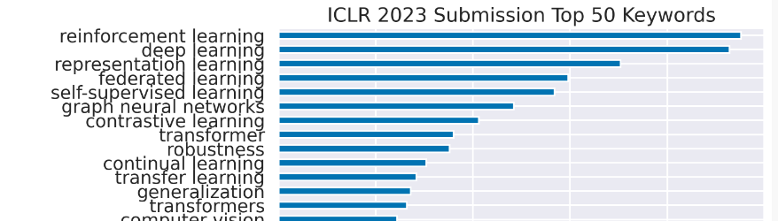

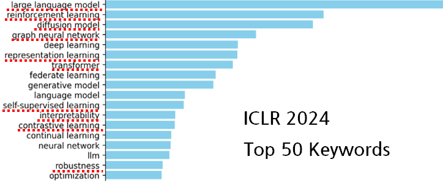

투자 쪽 흐름도 같은 방향이다. 스탠퍼드의 AI Index Report(aiindex.stanford.edu)에 따르면
AI 분야 민간 투자 전체는 줄었는데도 생성 AI 에 대한 자금은 급증해, 2023년에는 2022년 대비
거의 10배(USD 25.2B, 약 252억 달러)에 이르렀다. 이렇게 투자된 자원은 관련 AI 연구의 속도에
큰 힘이 될 것이며, 그 연구의 중심 주제 가운데 하나가 강화학습이다.

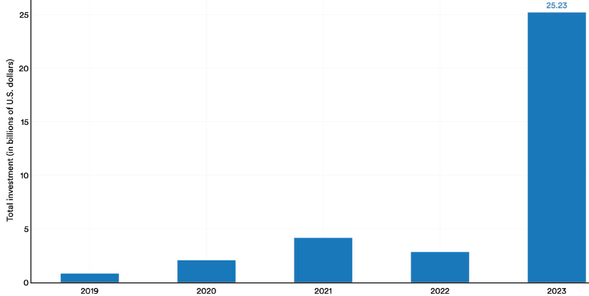

(키워드 통계 출처: https://fedebotu.github.io/ICLR2023-OpenReviewData/statistics.html)

---

## 2.1.2 기계학습의 세 갈래와 강화학습
<!-- 슬라이드 103 -->

기계학습은 문제를 푸는 방식에 따라 세 갈래로 나뉜다. 강화학습이 무엇인지는 나머지 두 갈래와
대비하면 가장 잘 보인다.

**지도학습(Supervised Learning, SL) — 예측(Prediction).** 과거의 데이터(상태)와 그때의
출력(결과)으로 학습한 뒤, 새로운 데이터(상태)에서 출력을 추론한다. KNN(K-Nearest Neighbor),
DT(Decision Tree), SVM(Support Vector Machine) 같은 고전 알고리즘과 ANN(Artificial Neural
Network), DNN(Deep Neural Network)이 여기에 속한다.

**비지도학습(Unsupervised Learning, UL) — 특징 찾기(Featuring).** 데이터의 패턴을 찾아
유사한 특징끼리 묶거나(Clustering) 연관 규칙(Association)을 찾아낸다. K-Means Clustering,
Hierarchical Clustering, Hidden Markov Model 이 대표적이고, Self-supervised learning
(Contrastive Learning)과 LLM 의 초기 학습(사전학습)도 이 범주로 본다.

**강화학습(Reinforcement Learning, RL) — 최적화(Optimization).** Agent 가 환경과 소통하며
경험(시행착오)을 통해 최적의 행동(action)을 찾는다. 경험을 통해 얻은 보상(reward)을 기준으로
최고의 보상을 얻을 수 있는 action 을 학습하며, 그 과정에서 +보상(Reward)과 −보상(Punishment)을
함께 사용한다. 본질적으로는 최적의 action 을 찾는 **최적 제어(Optimal Control) 문제**다.
지도학습과 달리 레이블이 붙은 input / output 쌍이 필요하지 않으며, 수학적 모델을 세울 수 없는
대규모 MDP(Markov Decision Process)가 그 대상이다. 다만 역설적으로, 환경에 대한 수학적
모델링이 절실한 분야이기도 하다 — 환경을 얼마나 잘 정의하느냐가 학습의 성패를 좌우한다.

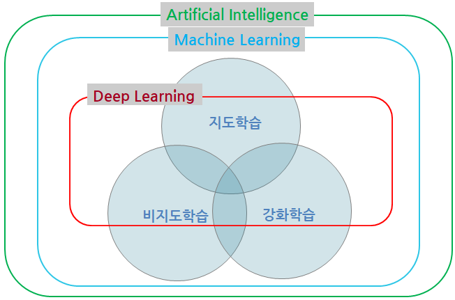

세 갈래는 서로 배타적이지 않다. 위 그림처럼 Deep Learning 은 지도 · 비지도 · 강화학습 세 영역에
모두 걸쳐 있고, 강화학습 알고리즘의 일부에 신경망을 넣은 것이 3장의 심층강화학습이다.

---

## 2.1.3 강화학습의 구성요소와 적용 분야
<!-- 슬라이드 104~105 -->

### 구성요소

강화학습 문제는 **Agent** 와 **Environment(Model)** 두 주체로 이루어진다. Agent 는 환경의
상태(state)를 관측하고 행동(action)을 내보내며, 환경은 그 행동에 따라 다음 상태와 보상(reward)을
돌려준다. 이 순환 위에 세 가지 개념이 더 얹힌다.

- **Policy(정책)** : Agent 의 행동 정책. 어떤 상태에서 어떤 행동을 할지 정한다.
- **Value(가치)** : 상태, 또는 상태-행동 쌍에서 앞으로 받을 reward 의 기댓값.
- **Model(모델)** : 환경의 state 와 reward 를 정의(또는 표현)하는 것.

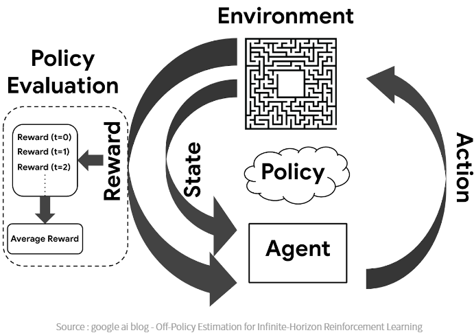

### 어디에 쓰는가

강화학습이 잘 맞는 자리는 지도학습과 비지도학습의 경계, 즉 **정의된 레이블이 부족한 어딘가**다.
정답 레이블을 일일이 만들 수는 없지만 환경을 정의해 보상으로 레이블을 대체할 수 있는 분야가
그렇다. 미로를 달리는 Micro-mouse 프로그래밍을 예로 들면 네 접근의 차이가 분명해진다.

- **하드 코딩** : 많은 노력이 필요하고 미로가 바뀌면 취약하다.
- **지도학습** : 모든 경우에 대해 미리 정의된 정답 레이블이 필요하다.
- **비지도학습** : feedback 이 없어 학습이 불가능하다.
- **강화학습** : 보상을 통해 학습한다. 음식(치즈)을 수집하면 긍정적 보상, 전기 충격을 받으면
  부정적 보상을 준다. Agent 는 보상을 관찰하고 자신이 취한 행동과 관련시켜 행동을 향상시키며,
  결국 더 많은 음식을 수집하고 더 적게 충격 받는 방법을 학습한다.

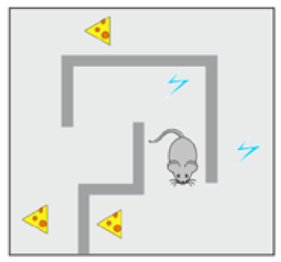

다만 일반성과 유연성을 갖는 모델(환경)을 설계하는 일은 쉽지 않다. 환경이 복잡하거나 예측하기
어려운 경우가 많기 때문이다.

### 응용 분야

강화학습은 특히 **환경의 수학적 모델이 없는 문제**에서 힘을 발휘한다. 최적 솔루션의 존재 여부와
특성을 파악하고 근사 계산을 하는 데 쓰이며, Full Self-Driving 이나 HFRL(Human Feedback RL)이
그런 예다. 경제학과 게임 이론에서는 제한된 합리성 아래에서 평형이 어떻게 발생하는지 설명하는 데
사용된다. 게임 이론, 제어 이론, 시뮬레이션 기반 최적화, 다중 에이전트 시스템, 군집 지능, 통계 등
여러 분야와 맞닿아 있으며, 구체적으로는 불완전한 관찰 데이터만 제공되는 환경에서 Agent 의
action 을 학습하는 문제(FSD)와 일련의 action 으로 큰 누적 보상을 얻는 방법을 학습하는 문제
(바둑 등)를 다룬다.

강화학습의 사례로 흔히 드는 것들은 다음과 같다.

- 뇌의 도파민 시스템
- 학교, 훈련
- 금융거래, 주식거래 시스템
- 체스, 바둑 등
- 컴퓨터 게임
- 웹 탐색: 정보 검색, CAPTCHA 처리 등
- NN architecture 검색

---

## 2.1.4 강화학습의 어려움
<!-- 슬라이드 106 -->

강화학습이 매력적인 만큼 고유한 어려움도 있다. 네 가지를 짚어 둔다.

**Agent 의 행동이 데이터를 만든다.** RL 의 결과는 Agent 행동의 결과다. 따라서 Agent 가
비효율적인 작업을 수행하기로 결정한 경우, 관찰만으로는 개선이 불가능하다. Agent 가 지속적인
실수를 한다면 더 큰 보상을 받을 방법이 없다고 스스로 판단해 버릴 수 있다. 이런 일은 환경이
Non-IID(Independent and Identically Distributed 가 아닌) 경우에 생길 수 있는데, RL 은 기본적으로
IID 데이터 — 추세가 없고 표본이 동일한 확률 분포를 갖는 데이터 — 를 관찰한다고 가정하기 때문이다.

**탐색과 활용의 trade-off (exploration / exploitation dilemma).** 경험한 데이터를 활용하는
것과 적극적으로 환경을 탐색하는 것 사이에서 균형을 잡아야 한다. 너무 많이 탐색하면 이전에
배운 보상(경험)을 심각하게 감소시킬 수 있고, 너무 적게 탐색하면 크게 향상될 수 있는 기회를
잃는다. 정답이 존재하지 않는 trade-off 문제다.

**보상의 지연.** Agent 의 행동 뒤에 보상이 심각하게 지연되는 경우가 있다. 체스에서는 게임
중간의 한 번의 움직임이 균형을 바꿀 수 있는데, 그 가치는 게임이 끝나야 드러난다. 학습은
이러한 인과관계의 발견을 포함해야 하지만, 시간의 흐름이 행동의 가치를 식별하기 어렵게 만든다.

**적절한 보상.** 환경의 변화에 따라 보상의 가치가 변한다. 어려운 환경과 쉬운 환경에서 보상은
달라져야 하는데, 어려운 결정에 어떻게 보상을 더 줄 수 있을까 하는 문제는 쉽게 답이 나오지 않는다.

---

## 2.1.5 주요 알고리즘의 발전
<!-- 슬라이드 107~110 -->

강화학습 알고리즘은 1950년대의 동적 계획법에서 출발해, 표본으로 가치를 추정하는 방법, 신경망과의
결합, 연속 행동 공간과 분산 학습, 모델 기반 학습으로 확장되어 왔다. 이 교재의 2~4장은 대체로
이 순서를 따른다.

### 고전 — 표 기반 알고리즘에서 정책 경사까지

- **Dynamic Programming, 1950년대** — Richard Bellman 이 소개한 방법으로, 강화학습의 기초를
  다진 이론이다. 최적 정책을 찾기 위해 상태 가치 함수와 정책을 반복적으로 업데이트한다. (→ 2.3)
- **Monte Carlo Methods, 1960~1970년대** — 샘플링을 통해 에이전트가 전체 에피소드를 경험하고,
  그 결과로 상태 가치나 Q 값을 학습한다. 에피소드가 끝난 후 보상 값을 기반으로 정책을 업데이트한다. (→ 2.4)
- **Q-Learning, 1989년** — Chris Watkins 가 개발한 강화학습의 대표적인 가치 기반 방법. 상태-행동
  쌍의 Q 값을 학습하여 최적의 행동을 선택하며, off-policy 학습이다. (→ 2.7)
- **SARSA(State-Action-Reward-State-Action), 1996년** — Q-러닝과 유사하지만 on-policy 학습이다.
  현재 정책에 따라 다음 행동을 선택하고, 그 선택한 행동에 기반하여 Q 값을 업데이트한다. (→ 2.6)
- **Policy Gradient Methods(정책 경사 방법), 2000년대 초반** — 정책을 직접 학습하는 방법론으로,
  정책의 기울기를 통해 최적 정책을 학습한다. 초기의 정책 경사 방법으로는 REINFORCE 알고리즘이
  대표적이다. (→ 3.5)
- **DQN(Deep Q-Network), 2013년** — Deep Learning 을 강화학습에 적용한 첫 사례 중 하나로 DeepMind
  연구진이 개발했다. Deep Learning 을 활용해 Q-러닝의 한계를 극복했고, 복잡한 상태 공간에서
  안정적인 학습이 가능해졌다. (→ 3.4)

### 심층강화학습의 확장 — 연속 행동, 병렬 학습, 안정화

- **DDPG(Deep Deterministic Policy Gradient), 2015년** — 연속적 행동 공간에서도 적용 가능한
  알고리즘으로, Actor-Critic 구조와 DQN 을 결합하여 안정적이다. 주로 연속적인 행동 제어 문제에
  사용된다. (→ 3.6)
- **A2C / A3C(Asynchronous Advantage Actor-Critic), 2016년** — DeepMind 가 제안한 알고리즘으로,
  여러 에이전트의 비동기 병렬 학습으로 학습 속도를 크게 향상시켰다. Advantage 함수를 사용해
  Actor-Critic 기반 학습의 효율성을 개선했다. (→ 3.5, 4.4)
- **PPO(Proximal Policy Optimization), 2017년** — OpenAI 가 개발한 알고리즘으로, 정책 업데이트의
  폭을 제한하여 학습의 안정성을 높인 정책 기반 방법이다. TRPO(Trust Region Policy Optimization)보다
  계산 효율성이 높아 널리 사용된다. (→ 4.5)
- **TD3(Twin Delayed Deep Deterministic Policy Gradient), 2018년** — DDPG 의 단점을 보완한
  알고리즘으로, Q 함수의 과대평가 문제를 해결했다. 안정적인 학습과 더불어 탐색의 다양성을 높일 수
  있으며, 연속적 행동 공간에서의 제어 문제에 강점이 있다. 적용 분야: 로봇 제어, 연속 행동 제어 문제. (→ 4.3)
- **SAC(Soft Actor-Critic), 2018년** — 탐색 효율성을 높이기 위해 제안된 알고리즘으로, 확률적
  정책을 통해 다양한 행동을 시도할 수 있다. 안정적이면서도 높은 성능을 보여 현재 많은 실전 문제에
  적용되고 있다. (→ 4.6)

### 분산 학습, 모델 기반 학습, 메타 학습

- **IMPALA(Importance Weighted Actor-Learner Architecture), 2018년** — 여러 에이전트가 분산
  환경에서 효율적으로 학습할 수 있도록 설계되었다. 중요도 가중치를 통해 정책 업데이트의 효율성을
  유지하면서도 대규모 학습을 수행할 수 있고, 병렬화와 분산 학습이 가능해 대규모 데이터 및 복잡한
  환경에서 빠르게 학습한다. 적용 분야: 게임 AI, 대규모 강화학습 환경.
- **MuZero, 2019년 — Model based RL(환경을 학습)** — 환경의 모델을 명시적으로 알 필요 없이,
  게임 규칙을 모르는 상황에서도 학습할 수 있도록 설계되었다. 알파고 · 알파제로에서 발전하여
  환경의 전이 모델을 학습한다. 복잡한 전략 게임에서 높은 성능을 보여 주며, 환경에 대한 사전 지식이
  없더라도 높은 수준의 성능을 발휘한다. 적용 분야: 게임 AI, 전략적 의사결정 문제.
- **Meta-RL(Meta Reinforcement Learning), 2019년~** — 다양한 환경에서 학습한 지식을 새로운
  환경에 빠르게 적용할 수 있도록 하는 기법이다. MAML(Model-Agnostic Meta-Learning) 방식과 결합하여
  강화학습의 전이(transfer learning)를 가능하게 한다. Agnostic(불가지론)이 '인식의 한계'를
  강조했다면, MAML 은 '모형의 한계를 두지 않는 개방성'을 추구하는, 방법론적 유연성의 메타러닝
  전략이다. 학습한 지식을 다양한 문제에 적용할 수 있어 일반화 성능이 높고 학습 시간을 크게 줄일
  수 있다. 적용 분야: 새로운 환경이나 문제에 빠르게 적응해야 하는 응용 분야(예: 로봇 공학).

### 최근 — 잠재 공간, 분산 경험 재사용, 세계 모델

- **SPR(Stochastic Latent Residuals, 2021년)** — 이미지와 같은 고차원 데이터 학습의 효율성을
  높이기 위해 상태를 잠재 공간에 압축하여 처리한다. 복잡한 시각적 상태 공간에서 강화학습을
  효율적으로 수행한다. 적용 분야: 시각적 강화학습, 이미지 기반 로봇 제어.
- **LASER(Latent Space Exploration, 2021년)** — 잠재 공간을 탐색할 수 있도록 설계되어, 잠재
  공간을 학습하여 새로운 행동과 상태를 생성하고 탐색한다. 탐색 성능이 강화되어 학습 효율이 높고
  새로운 환경에 적응이 쉽다. 적용 분야: 복잡한 환경에서의 탐색 문제, 일반화가 중요한 강화학습 환경.
- **MPO(Maximum a Posteriori Policy Optimization, 2021년)** — 고전적인 정책 최적화 방법에
  Bayesian 접근 방식을 도입하여 정책 최적화를 신뢰 구간 안에서 수행한다. 안정성이 높고 샘플 효율이
  뛰어나며 복잡한 환경에서도 일관된 성능을 유지한다. 적용 분야: 연속 제어 문제, 안정적 학습이
  필요한 환경.
- **R2D2(Recurrent Experience Replay in Distributed Reinforcement Learning, 2021년)** — 분산
  강화학습에서 에이전트가 경험을 재사용하는 방식을 개선했다. RNN 을 활용해 시계열 및 장기 의존성을
  다루는 문제에 적합하며 분산 환경에서 효율적인 학습이 가능하다. 적용 분야: 시계열 의존성이 강한
  문제, 실시간 시스템 제어.
- **DreamerV3(2023년)** — 모델 기반 강화학습에서 복잡한 환경 모델의 정확도를 높여, 시뮬레이션을
  통해 안정성과 효율성을 극대화한다. 주요 사용처: 대규모 시뮬레이션, 샘플 효율이 중요한 강화학습 문제.

---

## 2.1.6 강화학습의 분류
<!-- 슬라이드 111~114 -->

같은 알고리즘들을 이번에는 몇 개의 축으로 갈라 본다. 이 분류 축은 이후 모든 절에서 "이 알고리즘은
어디에 속하는가"를 말할 때 반복해서 쓰인다.

### 강화학습과 심층강화학습

심층강화학습(Deep RL)은 강화학습 알고리즘의 **일부에 Deep Learning 을 적용**한 것이다. 문제 설정
(MDP)과 알고리즘의 갈래 — Model-Based / Model-Free, Value-Based / Policy-Based, Actor-Critic — 는
그대로이고, 가치 함수나 정책을 표 대신 신경망으로 표현한다는 점만 다르다. 그런데 이 한 가지
변화가 기존 강화학습의 해결 능력을 극적으로 향상시켰다.

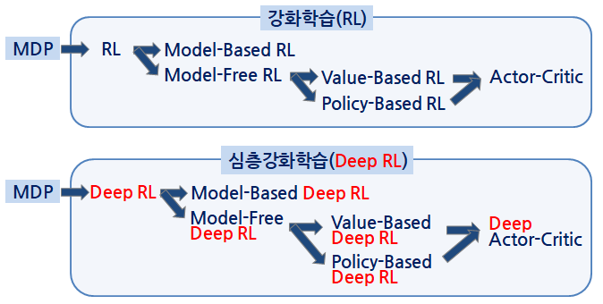

### Agent 의 학습 대상 — 가치 / 정책 / 모델

Agent 가 무엇을 학습하느냐에 따라 네 가지로 나눈다.

- **Value based** : 상태(또는 상태-행동)의 reward function, 즉 상태 가치 함수와 상태-행동 가치
  함수를 학습하고, 가치가 높은 행동을 선택한다.
- **Policy based** : Agent 의 action function 인 정책 함수를 직접 학습하여 행동을 선택한다.
- **Actor-Critic** : 가치 함수와 정책 함수를 동시에 학습한다. 가치 함수(Critic)는 정책을 평가하고,
  정책 함수(Actor)는 가치 함수의 feedback 으로 행동을 선택한다.
- **Model based** : 환경에 대한 표현(환경 모델)이 학습 대상이다. Agent 가 환경의 상태와 보상을
  예측하는 환경 모델을 학습하고, 학습된 환경 모델로 실제 환경을 대체해 Agent 를 빠르게 학습시킨다.
  문제점은 모델 정확도의 영향이 크다는 것과, 모델이 너무 복잡하면 학습이 어렵다는 것이다.

여기서 한 가지 주의할 점이 있다. **"확률적"이라는 말은 환경이 확률적이라는 뜻과 정책(행동)이
확률적이라는 뜻이 다르다.** 환경이 결정적이어도 정책은 확률적일 수 있고, 그 반대도 가능하다.

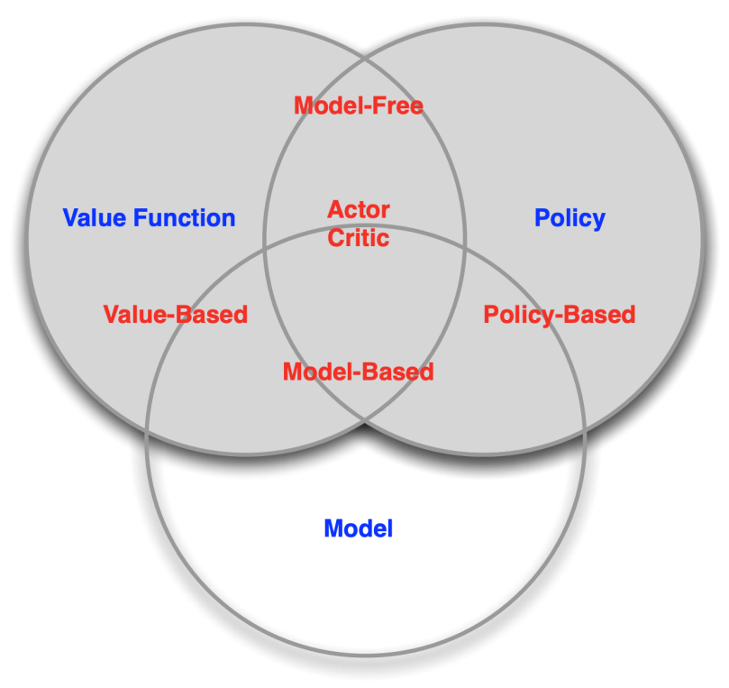

### Model based RL 을 더 들여다보기

Model based RL 은 다시 두 경우로 나뉜다.

**Given the Model — 환경 모델(정보)이 주어진 경우.** 환경 정보가 있으면 미래를 계획(Planning)할
수 있고, 모델을 해석하여 정책을 개선할 수 있다. 이산 공간에서는 Beam search 나 Monte-Carlo Tree
search 를, 연속 공간에서는 Optimal control 을 쓴다.

**Learning the Model — 환경 모델을 학습하는 경우.** Deep Learning(+ RL)으로 환경에 대한 순방향
모델을 신경망 지도학습으로 만든다(이산이면 Classification, 연속이면 Regression). 학습된 환경
모델을 사용하여 동작을 얻고, 에이전트는 환경 모델 안에서 반복적으로 동작한다. 선택된 동작은
Cross Entropy 또는 Monte-Carlo 로 최적화한다. (참고: https://data-newbie.tistory.com/601)

환경과 interaction 자체가 힘든 경우에는 어떻게 할까. 두 가지 우회로가 있다.

- **Imitation RL(모방학습)** : 전문가의 행동을 모방하고 행동을 복제한다. 오차가 누적되고, 전문가
  데이터에 없는 결측 구간에서 문제가 생긴다.
- **IRL(Inverse RL, 역강화학습)** : Agent(전문가)의 (최적) 정책과 행동 이력을 통해 그 행동을
  설명하는 보상 함수를 지도학습으로 학습한다. RL 은 보상으로부터 행동 정책을 학습하는데, IRL 은
  거꾸로 선험적 지식을 사용하여 해결 방법을 결정한다. 강화학습의 한계를 극복하려는 노력의 하나다.
  ("A survey of inverse reinforcement learning", 2022)

### On-policy 와 Off-policy

마지막 축은 **학습에 쓰는 경험을 누가 만들었는가**다.

- **On-policy** : 현 policy 의 경험으로 policy 를 개선한다.
- **Off-policy** : 이전 또는 다른 policy 의 경험을 포함하여 policy 를 개선한다.

아래 표는 대표 알고리즘을 이 축과 행동 · 상태 공간의 종류, 학습하는 양(operator)으로 정리한 것이다.
2장에서 다루는 Monte Carlo · Q-learning · SARSA 는 이산 공간용이고, 3장 이후의 DQN · DDPG · A3C ·
PPO · TD3 · SAC 는 연속 상태 공간을 다룬다.

| Algorithm | Description | Policy | Action Space | State Space | Operator |
|---|---|---|---|---|---|
| Monte Carlo | Every visit to Monte Carlo | Either | Discrete | Discrete | Sample-means |
| Q-learning | State-action-reward-state | Off-policy | Discrete | Discrete | Q-value |
| SARSA | State-action-reward-state-action | On-policy | Discrete | Discrete | Q-value |
| Q-learning - Lambda | State-action-reward-state with eligibility traces | Off-policy | Discrete | Discrete | Q-value |
| SARSA - Lambda | State-action-reward-state-action with eligibility traces | On-policy | Discrete | Discrete | Q-value |
| DQN | Deep Q Network | Off-policy | Discrete | Continuous | Q-value |
| DDPG | Deep Deterministic Policy Gradient | Off-policy | Continuous | Continuous | Q-value |
| A3C | Asynchronous Advantage Actor-Critic Algorithm | On-policy | Continuous | Continuous | Advantage |
| NAF | Q-Learning with Normalized Advantage Functions | Off-policy | Continuous | Continuous | Advantage |
| TRPO | Trust Region Policy Optimization | On-policy | Continuous | Continuous | Advantage |
| PPO | Proximal Policy Optimization | On-policy | Continuous | Continuous | Advantage |
| TD3 | Twin Delayed Deep Deterministic Policy Gradient | Off-policy | Continuous | Continuous | Q-value |
| SAC | Soft Actor-Critic | Off-policy | Continuous | Continuous | Advantage |

---

## 2.1.7 수학적 해석 — MDP 와 그 해법들
<!-- 슬라이드 115 -->

강화학습 문제는 **마르코프 결정 과정(MDP: Markov Decision Process)** 으로 수학적으로 해석한다.
한 문장으로 요약하면 "**State 의 가치를 평가하여 Action 을 결정하자**"다. MDP 를 해결(학습)하기
위한 해법들이 이 교재의 나머지 절이다.

- **DP(Dynamic Programming)** : Bellman equation 을 정의하고 순환 반복을 통해 최적해를 찾는다.
  환경이 완전히 정의되어 있어야 하고, 상태가 많으면 효율이 떨어진다. (→ 2.3)
- **MC(Monte Carlo Methods)** : 상태를 랜덤하게 방문하여 value 를 근사하고 최적해를 찾는다.
  환경이 복잡하여 완전히 정의할 수 없는 경우에 적용할 수 있지만, 에피소드가 종료되어야
  update 할 수 있어 실시간성이 떨어진다. (→ 2.4)
- **TD(Temporal Difference)** : 에피소드 중에 state value 와 action value 를 즉시 update 한다. (→ 2.5~2.7)
- **FA(Function Approximation)** : 상태가 많거나 연속적인 경우 table 로 정의할 수 없으므로
  함수로 정의한다. (→ 3.1)
- **DQN(Deep Q-Network)** : FA 로서 DNN 을 사용한 것. TD 방식의 Q-learning 을 DNN 으로 확장했다.
  Value-based method 이며 Non-Linear FA, Experience replay, Target Network, Double DQN 등의
  요소가 따라온다. (→ 3.3, 3.4, 4.2)
- **Policy Gradient Methods** : Value-based 방식은 action-value $q$ 를 구한 뒤 policy 를 결정하는데,
  이 방식은 action-value 없이 직접 policy 를 찾는다. Deterministic action 은 $q$ 의 변화에 민감한데
  Stochastic action 으로 바꾸면 안정성이 향상된다. Monte Carlo Policy Gradient(REINFORCE)와
  Actor-Critic Method — A2C(Advantage Actor-Critic), A3C(Asynchronous Advantage Actor-Critic) 등 —
  가 여기에 속한다. (→ 3.5, 3.6, 4.3~4.6)

---

## 2.1.8 강화학습 적용 사례
<!-- 슬라이드 116~121 -->

### AlphaGo 와 데이터센터 냉방

가장 유명한 사례는 **AlphaGo** 다. 아래 학습 곡선은 AlphaZero 가 학습 step 이 늘어남에 따라
AlphaGo Lee(2016년 이세돌과 대국한 버전)와 AlphaGo Zero 의 수준을 차례로 넘어서는 모습을 보인다.

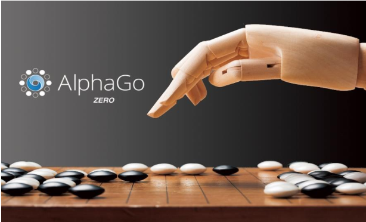

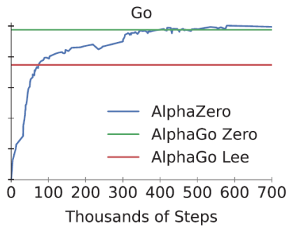

또 하나의 대표 사례는 **Google 데이터센터의 냉방 비용 40% 감축**이다. 기계학습 제어를 켰을 때
전력 효율 지표(PUE)가 뚜렷하게 낮아지고, 제어를 끄면 다시 높아지는 것이 아래 그래프에서 확인된다.

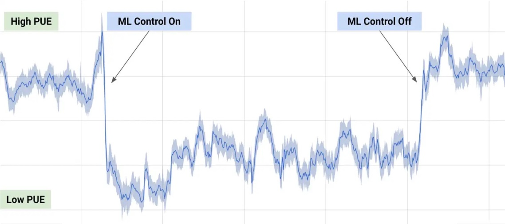

### 로봇 의족과 전투 비행

**Robotic Knee** — "Our computer reinforcement learning algorithm learns to cooperate with the human
body"(2019). 강화학습 알고리즘이 사용자의 몸과 협력하도록 로봇 무릎 의족의 제어를 학습한 사례다.

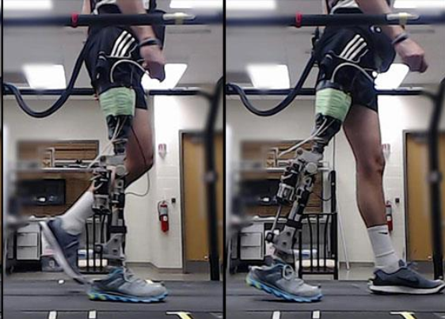

**전투 비행** — 2020년에는 가상 공중전(AlphaDogfight Trials)이 시행되었고, 2024년에는 2000 feet
상공, 1200 mile 속도의 실제 공중전 시험까지 이어졌다.

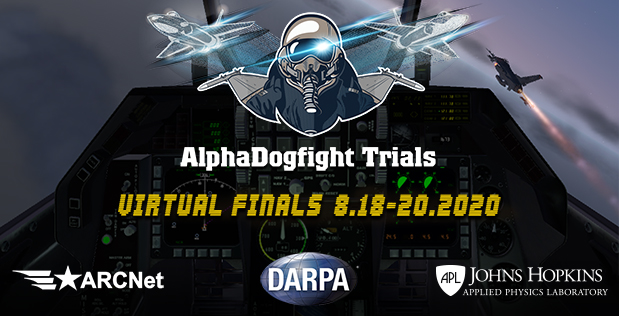

### 반도체 설계 — Chip Placement 와 AlphaChip

**Fast Chip Design** — "Chip Placement with Deep Reinforcement Learning"(2020, Google). 칩 캔버스
위에 매크로(macro)를 하나씩 놓는 것을 RL Agent 의 행동으로 두고, 마지막에 표준 셀을 force-directed
방법으로 배치한 뒤 배선 길이(HPWL)와 혼잡도(Congestion)로 보상을 계산한다.

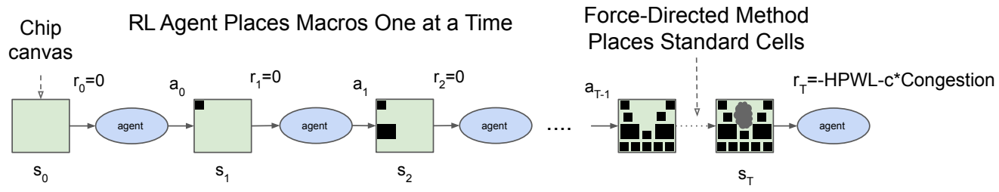

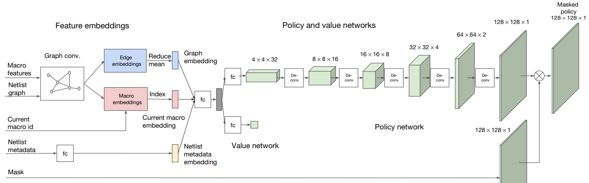

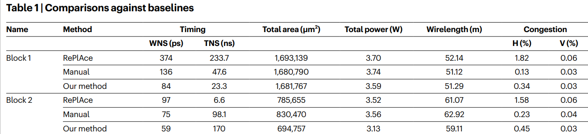

이 연구를 기반으로 **AlphaChip** 시스템이 개발되어 Google TPU, MediaTek Dimensity 5G 등의
layout 설계에 쓰였다. 관련 자료는 다음과 같다.

- "How AlphaChip transformed computer chip design", 2024.09, DeepMind 발표 자료 —
  https://deepmind.google/discover/blog/how-alphachip-transformed-computer-chip-design/
- https://github.com/google-research/circuit_training — 지속적으로 일부 update 진행 중.
  "AlphaChip: An open-source framework for generating chip floorplans with distributed deep
  reinforcement learning."
- 관련 뉴스 종합 — https://news.hada.io/topic?id=16981
- 반론도 있다. "The False Dawn: Reëvaluating Google's Reinforcement Learning for Chip Macro
  Placement"(2024.04)는 원 논문의 신뢰성을 의심하는 논문이다.

**PrefixRL** — "PrefixRL: Optimization of Parallel Prefix Circuits using Deep Reinforcement
Learning"(2022, NVIDIA). Hopper GPU 아키텍처에 쓰인 prefix adder 최적화다. 다만 계산 비용이
높아, 64비트 실험은 32,000 GPU 시간 이상이 소요되었다.
(https://developer.nvidia.com/blog/designing-arithmetic-circuits-with-deep-reinforcement-learning/)

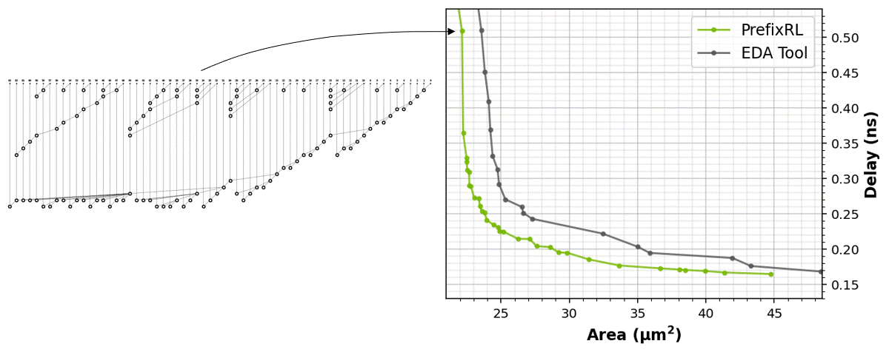

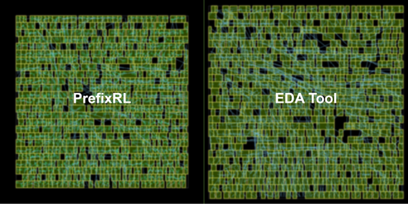

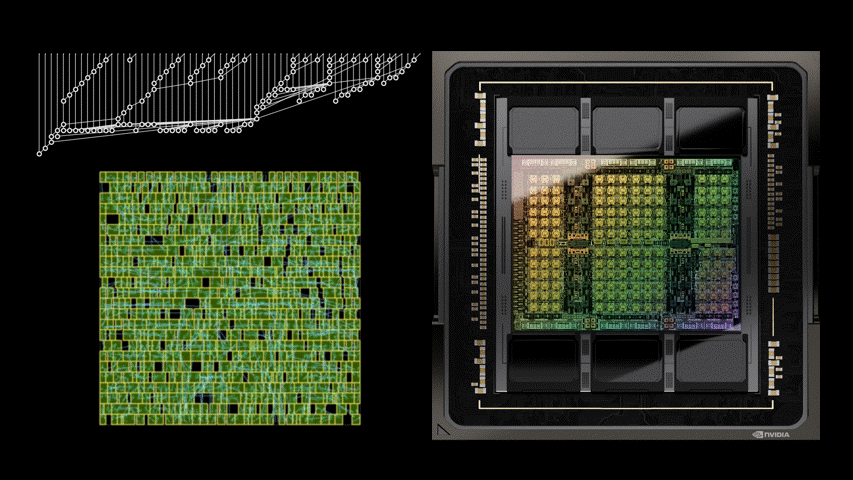

### 핵융합 플라즈마 제어

**"Magnetic control of tokamak plasmas through deep reinforcement learning"**(2022, DeepMind).
Tokamak(핵융합 장치)에서 다양한 플라즈마 형상을 실시간으로 제어하는 데 심층강화학습을 적용했다.

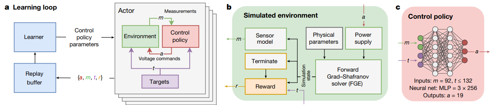

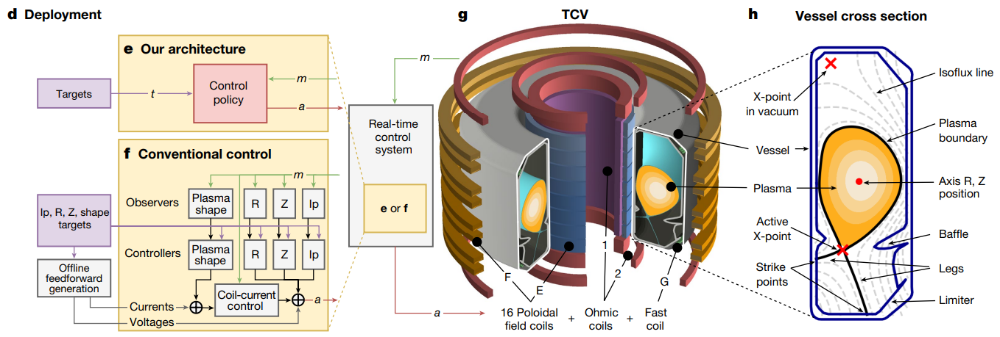

---

## 2.1.9 정리
<!-- 슬라이드 122 : 숨김 MEMO 슬라이드, 내용 없음 -->

- 강화학습은 레이블 대신 **보상**을 기준으로 최적의 행동을 찾는 **최적 제어** 문제다. 지도학습
  (예측), 비지도학습(특징 찾기)과 나란히 놓이는 기계학습의 세 번째 갈래다.
- 문제는 **Agent 와 Environment(Model)** 의 상호작용으로 정의되고, 그 위에 **Policy · Reward ·
  Value** 가 얹힌다. 레이블은 부족하지만 환경을 정의할 수 있는 분야가 강화학습의 자리다.
- 고유한 어려움: Agent 의 행동이 데이터를 만든다는 점(Non-IID), 탐색과 활용의 trade-off,
  보상의 지연, 적절한 보상 설계.
- 알고리즘은 DP → MC → Q-Learning / SARSA → Policy Gradient → DQN → DDPG · A3C · PPO · TD3 ·
  SAC → IMPALA · MuZero · Meta-RL · DreamerV3 로 발전해 왔다.
- 분류 축: 가치 기반 / 정책 기반 / Actor-Critic / 모델 기반, Model-free / Model-based,
  on-policy / off-policy, 이산 / 연속 공간.
- 수학적으로는 **MDP** 이고, 해법은 DP · MC · TD · FA · DQN · Policy Gradient 순으로 이 교재의
  2장과 3장이 따라간다.
