# 2.2 Markov Decision Process 와 Bellman Equation

**학습 목표**

- 마르코프 특성(Markov property)을 식으로 쓰고, 그것이 계획(planning)의 전제 조건이 되는
  이유를 설명할 수 있다.
- 마르코프 과정(MP) → 마르코프 보상 과정(MRP) → 마르코프 결정 과정(MDP)으로 구성 요소가
  $\langle S, P \rangle$ → $\langle S, P, R, \gamma \rangle$ → $\langle S, A, P, R, \gamma \rangle$ 로
  늘어나는 과정을 구분할 수 있다.
- 정책 함수 $\pi(a|s)$, 리턴 $G_t$, 상태가치 함수 $V_\pi(s)$, 행동가치 함수 $Q_\pi(s,a)$ 를 정의할 수 있다.
- 벨만 기댓값 방정식(BEE)을 유도하고, $V$ 와 $Q$ 를 서로의 식으로 표현할 수 있다.
- 최적 가치 함수와 최적 정책의 관계를 말하고, 벨만 최적 방정식(BOE)이 왜 반복적 수치해법으로
  풀려야 하는지 설명할 수 있다.
- OpenAI Gym API 로 $\langle S, A, P, R, \gamma \rangle$ 가 드러나는 Gridworld 환경을 직접 만들어
  상태천이행렬과 보상함수를 들여다볼 수 있다.

**이 절의 구성**

- 2.2.1 강화학습 환경을 MDP 로 표현하기 — 마르코프 특성과 마르코프 과정
- 2.2.2 마르코프 보상 과정(MRP) — 할인율, 리턴, 상태가치
- 2.2.3 마르코프 결정 과정(MDP) — 정책, 상태가치 함수, 행동가치 함수
- 2.2.4 벨만 기댓값 방정식(Bellman Expectation Equation)
- 2.2.5 최적 가치 함수와 벨만 최적 방정식(Bellman Optimality Equation)
- 2.2.6 정리 — MDP 문제에서 BEE · BOE, 그리고 해법으로
- 2.2.7 실습 2.2.1 — MDP 환경(GridworldEnv) 구축

---

## 2.2.1 강화학습 환경을 MDP 로 표현하기 — 마르코프 특성과 마르코프 과정
<!-- 슬라이드 124~125 -->

강화학습의 환경(Agent & Environment)은 수학적으로 **MDP(Markov Decision Process)** 로
표현한다. MDP 를 이해하려면 그보다 단순한 두 과정 — MP(Markov Process, 마르코프 과정. Markov
Chain 이라고도 한다)와 MRP(Markov Reward Process, 마르코프 보상 과정) — 에서 시작해, 각 단계에서
무엇이 추가되고 무엇이 달라지는지를 따라가는 것이 좋다.

### 마르코프 특성(Markov property)

어떤 상태 $S_t$ 가 '마르코프' 하다는 것은 다음이 성립한다는 뜻이다.

$$
P(S_{t+1} \mid S_t) = P(S_{t+1} \mid S_t, S_{t-1}, \ldots, S_0)
$$

현재 상태 $S_t$ 를 알면, 모든 과거를 아는 것과 동일한 수준에서 다음 상태를 추론할 수 있다.
즉 **미래의 상태는 현재의 상태만으로 결정**된다. 이것이 계획(planning)에 중요한 전제 조건이 된다
— 과거의 이력을 전부 들고 다닐 필요 없이 현재 상태만 보고 결정을 내릴 수 있기 때문이다.

### 마르코프 과정(Markov Process) — $\langle S, P \rangle$

마르코프 과정은 각 상태와 상태천이(확률)행렬로 표현되는 환경이며, 상태는 '마르코프' 하다.
MP 는 두 요소로 구성된다.

- **S** : 유한한 상태의 집합. $S = \{s_0, s_1, s_2, \ldots, s_n, T\}$
- **P** : 상태천이확률(Transition Probabilities). 다음 상태로 천이할 확률
  $P(s' \mid s) = P(S_{t+1} = s' \mid S_t = s)$. 여기서 $S_t = s$ 는 $t$ 시점의 상태가 특정 상태
  $s$ 라는 뜻이고, $S_{t+1} = s'$ 는 다음 상태(next state)가 $s'$ 라는 뜻이다. $P_{ss'}$ 로 줄여 쓴다.

상태천이확률은 **상태천이행렬**로 표시한다. $P_{ij}$ 는 $S_i$ 에서 $S_j$ 로 갈 확률이며, 각 행의
합은 1 이다.

$$
P_{ij} = \begin{bmatrix} P_{11} & \cdots & P_{1n} \\ \vdots & \ddots & \vdots \\ P_{n1} & \cdots & P_{nn} \end{bmatrix}
$$

아래 그림의 예에서 상태집합은 $S = \{A, B, C, D, E, F, T\}$ 이고, 화살표 위의 숫자가 천이확률이다.

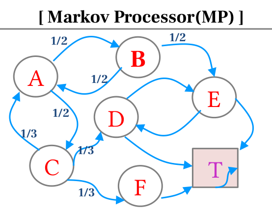

이 도식을 상태천이행렬로 옮기면 다음과 같다(빈칸은 0). 예컨대 A 행은 B 와 C 로 각각 1/2 의
확률로 천이하므로 합이 1 이 된다.

| | A | B | C | D | E | F | T |
|---|---|---|---|---|---|---|---|
| **A** | | 1/2 | 1/2 | | | | |
| **B** | 1/2 | | | | 1/2 | | |
| **C** | 1/3 | | | 1/3 | | 1/3 | |
| **D** | | | | | 1/2 | | 1/2 |
| **E** | | | | 1/2 | | | 1/2 |
| **F** | | | | | | | 1 |
| **T** | | | | | | | 1 |

**에피소드(Episode)** 는 가능한 과정 경로다. 에피소드는 최종 상태(Terminal) **T 를 만날 때까지**
확률적 경로를 따라간다. 위 MP 에서 가능한 에피소드의 예는 다음과 같다.

- A → B → E → T
- A → C → F → T
- A → B → A → B → A → C → D → T
- …

---

## 2.2.2 마르코프 보상 과정(MRP) — 할인율, 리턴, 상태가치
<!-- 슬라이드 126 -->

마르코프 보상 과정(Markov Reward Process)은 MP 에 **보상**과 **할인율**을 더한 것이다.
MRP 는 $\langle S, P, R, \gamma \rangle$ 로 구성된다.

- **P** : $P_{ss'} = P[S_{t+1} = s' \mid S_t = s]$. 2차원(상태 × 상태)이다.
- **R** : Reward, 보상함수. 확률적일 수 있다.
- **$\gamma$** : Discount Factor, 할인율(감가). $\gamma \in [0, 1]$.

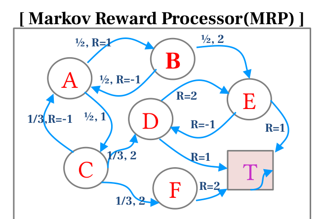

### 할인율(Discount Factor) $\gamma$

할인율은 **가까운 미래의 보상과 먼 미래의 보상 사이의 가치를 구분**한다. 나중에 받을 보상에
적용하는 할인율이다.

### 리턴(Return) $G_t$

리턴은 감가된 보상의 합, 즉 에피소드에서 얻은 보상에 할인율을 적용해 T 까지 더한 값이다.

$$
G_t = R_{t+1} + \gamma R_{t+2} + \gamma^2 R_{t+3} + \cdots = \sum_{\tau=1}^{\infty} \gamma^{\tau-1} R_{t+\tau}
$$

위 MRP 에서 A 로 시작하는 에피소드별 return 값을 $\gamma = 1$ 로 계산하면 다음과 같다.

- A → B → E → T : $G = 1 + 2 + 1 = 4$
- A → C → F → T : $G = 1 + 2 + 2 = 5$
- A → B → A → B → A → C → D → T : $G = 1 - 1 + 1 - 1 + 1 + 2 + 1 = 4$

### 상태가치(State-Value) 와 상태가치 함수

**상태가치** $V$ 는 그 상태에서 다음 상태천이로 얻을 수 있는 $G_t$ 의 기댓값이다. 다음 천이로
얻을 수 있는 기댓값이 크면 그 상태의 가치가 높다. 이를 함수로 쓴 것이 **상태가치 함수
(State-Value Function)** 다.

$$
V(s) = E[\, G_t \mid S_t = s \,]
$$

시점 $t$ 에서 상태 $s$ 에 대한 $G_t$ 의 기댓값이다.

> **핵심 메시지**
> MRP 에서 상태가치는 **결정론적**이다. 정책이 없고 천이확률과 보상만 있으므로, 상태마다 값이 하나로
> 정해지고 state-value table 로 완벽하게 표현할 수 있다.

아래는 격자 세계(gridworld)에서 그런 state-value table 의 예다. 특정 칸에서 다른 칸으로
점프하는 천이에 +10, +5 의 보상이 있을 때, 각 칸의 상태가치를 계산해 표로 적은 것이다.

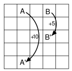

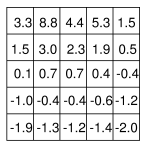

---

## 2.2.3 마르코프 결정 과정(MDP) — 정책, 상태가치 함수, 행동가치 함수
<!-- 슬라이드 127~128 -->

마르코프 결정 과정(Markov Decision Process)은 MRP 에 **행동**을 더한 것이다.
MDP 는 $\langle S, A, P, R, \gamma \rangle$ 로 구성된다.

- **A** : 유한한 행동의 집합. 정책 $\pi$ 로 규정된다.
- **P** : 상태천이확률 $P^a_{ss'} = P[S_{t+1} = s' \mid S_t = s, A_t = a]$. 행동이 조건에
  들어오므로 3차원(행동 × 상태 × 상태)이다.
- **R** : Reward, 보상함수.
- **$\gamma$** : Discount Factor, 할인율(감가). $\gamma \in [0, 1]$.

환경에 action(Agent)이 추가되었으므로 **미래의 상태와 보상을 선택할 수 있게** 된다. 그 결과
MRP 와 달리 **MDP 에서 상태가치는 action 에 따라 변한다.**

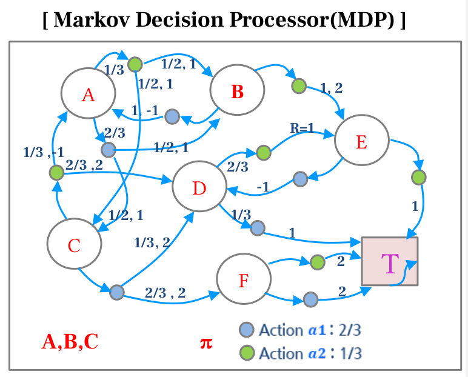

### 정책 함수(Policy function) $\pi$

$$
\pi(a \mid s) = P(A_t = a \mid S_t = s)
$$

현 상태에서 수행할 행동의 확률이다. Agent 는 action 을 수행하고, 천이확률에 따라 다음 상태로
이동하며 reward 를 받는다. Agent 는 $S_t$(현재 상태)를 기준으로 $A_t$(현재의 행동)를 결정하며,
그 결정은 정책 함수 $\pi(\cdot)$ 에 따른다. 마르코프 특성에 의하여 $S_t$ 를 아는 것은 과거의 모든
역사를 아는 것과 동일하므로, **현재 상태만으로 행동을 결정할 수 있다.**

위 도식에서 A · B · C 상태의 정책은 $\pi = (2/3, 1/3)$, 즉 $a_1$ 을 2/3, $a_2$ 를 1/3 의 확률로
선택한다. 도식에 딸린 정책 표와 행동별 천이확률 표를 옮기면 다음과 같다.

정책 함수 $\pi$ (행: 상태, 열: 행동):

| | $a_1$ | $a_2$ |
|---|---|---|
| **A** | 2/3 | 1/3 |
| **B** | 2/3 | 1/3 |
| **C** | 2/3 | 1/3 |
| **D** | 1/3 | 2/3 |
| **E** | 1/2 | 1/2 |
| **F** | 1/3 | 2/3 |
| **T** | 1/2 | 1/2 |

### 상태가치 함수와 행동가치 함수

**상태가치 함수(State-value function)** $V_\pi$ 는 정책 $\pi$ 에서 상태 $s$ 의 $G_t$ 기댓값이다.

$$
V_\pi(s) = E_\pi[\, G_t \mid S_t = s \,]
$$

**행동가치 함수(Action-value function)** $Q_\pi$ 는 정책 $\pi$ 에서 상태 $s$ 에서 행동 $a$ 를
취했을 때의 $G_t$ 기댓값이다.

$$
Q_\pi(s, a) = E_\pi[\, G_t \mid S_t = s, A_t = a \,]
$$

MRP 의 $V(s)$ 와 달리 아래첨자 $\pi$ 가 붙었다. 같은 환경이라도 **정책이 다르면 가치가 다르다**는
뜻이다.

### 예시 — $V_\pi$, $Q_\pi$ 계산

행동이 좌(left, $a_1$)·우(right, $a_2$) 두 개이고, 정책 함수가
$\pi = \left(\tfrac{2}{3}, \tfrac{1}{3}\right)$ ($a_1$ / $a_2$ 선택 확률)인 경우를 보자.
각 action 은 자기만의 천이확률 $P^a_{ss'}$ 를 갖는다.

$a_1$ = left 의 천이확률:

| | A | B | C | D | E | F | T |
|---|---|---|---|---|---|---|---|
| **A** | | 2/3 | 1/3 | | | | |
| **B** | 1 | | | | | | |
| **C** | | | | 1/3 | | 2/3 | |
| **D** | | | | | | | 1 |
| **E** | | | | 1 | | | |
| **F** | | | | | | | 1 |
| **T** | | | | | | | 1 |

$a_2$ = right 의 천이확률:

| | A | B | C | D | E | F | T |
|---|---|---|---|---|---|---|---|
| **A** | | 1/3 | 2/3 | | | | |
| **B** | | | | | 1 | | |
| **C** | 1/3 | | | 2/3 | | | |
| **D** | | | | | 1 | | |
| **E** | | | | | | | 1 |
| **F** | | | | | | | 1 |
| **T** | | | | | | | 1 |

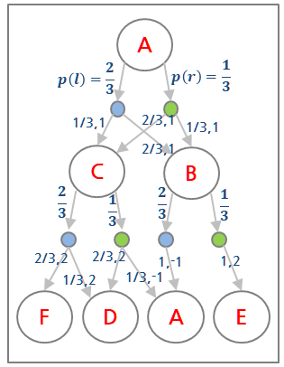

이때 상태 A 의 가치는 다음과 같다(A 에서 B 나 C 로 가는 보상은 모두 1 이다).

$$
V_\pi(A) = \tfrac{2}{3}\Big( \tfrac{2}{3}\{1 + \gamma v_\pi(B)\} + \tfrac{1}{3}\{1 + \gamma v_\pi(C)\} \Big)
+ \tfrac{1}{3}\Big( \tfrac{1}{3}\{1 + \gamma v_\pi(B)\} + \tfrac{2}{3}\{1 + \gamma v_\pi(C)\} \Big)
$$

바깥 괄호 앞의 2/3, 1/3 은 정책(행동 선택 확률)이고, 안쪽의 2/3, 1/3 은 그 행동에서의 천이확률이다.
우변에 $v_\pi(B)$, $v_\pi(C)$ 가 다시 들어 있으므로 이 식은 **재귀식(순환식)** 이다. 이렇게 다른
상태의 가치 추정값을 빌려 현재 상태의 가치를 갱신하는 것을 **bootstrap value** 라 하며, 해석적으로
푸는 대신 **수치해석으로 계산**한다. 동적 계획법(DP)에서는 top-down 으로 계산을 반복하여
$V_\pi(A)$ 의 근사값을 찾는다. 같은 방식으로 행동가치 $Q_\pi(s, a_n)$ 도 계산할 수 있다.

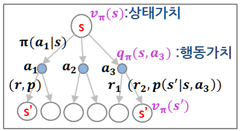

---

## 2.2.4 벨만 기댓값 방정식(Bellman Expectation Equation)
<!-- 슬라이드 129~131 -->

**Bellman Equation** 은 현재 state/action 과 다음 state/action 의 **순환식**으로 가치를 표현하는
것이다. Bellman Expectation Equation(BEE)과 Bellman Optimality Equation(BOE)이 있다. 먼저 BEE 다.

### 가치 함수를 순환식으로 표현하기

$V(s) = E[G_t \mid S_t = s]$ 에 $G_t = R_{t+1} + \gamma R_{t+2} + \gamma^2 R_{t+3} + \cdots$ 을
대입하면 다음 순서로 정리된다.

$$
\begin{aligned}
V(s) &= E[\, R_{t+1} + \gamma R_{t+2} + \gamma^2 R_{t+3} + \cdots \mid S_t = s \,] \\
     &= E[\, R_{t+1} + \gamma (R_{t+2} + \gamma R_{t+3} + \cdots) \mid S_t = s \,] \\
     &= E[\, R_{t+1} + \gamma G_{t+1} \mid S_t = s \,] \\
     &= E[\, R_{t+1} \mid S_t = s \,] + E[\, \gamma G_{t+1} \mid S_t = s \,] \\
     &= E[\, R_{t+1} \mid S_t = s \,] + \gamma E[\, G_{t+1} \mid S_t = s \,] \qquad (\gamma E[\cdot] = E[\gamma \cdot]) \\
     &= E[\, R_{t+1} \mid S_t = s \,] + \gamma E[\, V(S_{t+1}) \mid S_t = s \,] \qquad (\because E[A] = E[E[A]]) \\
     &= E[\, R_{t+1} + \gamma V(S_{t+1}) \mid S_t = s \,]
\end{aligned}
$$

현재의 가치 $V(s)$ 는 다음 상태의 가치 $V(S_{t+1})$ 를 통해 **재귀적으로** 얻을 수 있다. 이제
순환식을 푸는 방법을 적용하면 된다.

### 정책 $\pi$ 에서 상태가치 함수의 BEE

$$
V_\pi(s) = E_\pi[\, G_t \mid S_t = s \,] = E_\pi[\, R_{t+1} + \gamma V_\pi(S_{t+1}) \mid S_t = s \,]
$$

기댓값을 명시적으로 풀어 쓰면 — 행동에 대해 $\pi(a|s)$ 로, 다음 상태에 대해 $P^a_{ss'}$ 로 가중합한다 —

$$
\begin{aligned}
V_\pi(s) &= \sum_{a \in A} \pi(a \mid s) \Big( R_s^a + \gamma \sum_{s' \in S} P^a_{ss'} V_\pi(s') \Big) \\
         &= \sum_{a \in A} \pi(a \mid s) R_s^a + \gamma \sum_{s' \in S} \sum_{a \in A} \pi(a \mid s) P^a_{ss'} V_\pi(s') \\
         &= R_s^\pi + \gamma \sum_{s' \in S} P^\pi_{ss'} V_\pi(s')
\end{aligned}
$$

여기서 $R_s^\pi = \sum_{a} \pi(a|s) R_s^a$, $P^\pi_{ss'} = \sum_{a} \pi(a|s) P^a_{ss'}$ 로,
행동에 대한 기댓값을 정책으로 미리 평균한 보상과 천이확률이다. 첫 항은 **즉시 보상(immediate
reward)**, 둘째 항은 **미래 보상(future reward)** 이다.

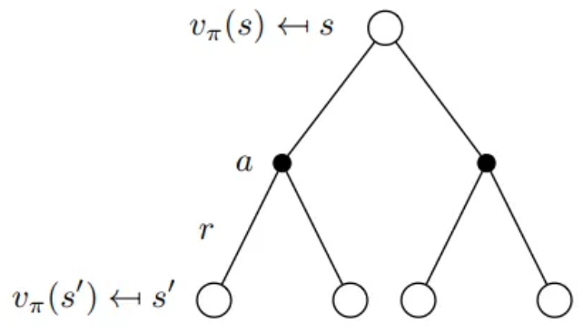

### 정책 $\pi$ 에서 행동가치 함수의 BEE

$$
Q_\pi(s, a) = E_\pi[\, G_t \mid S_t = s, A_t = a \,] = E_\pi[\, R_{t+1} + \gamma Q_\pi(S_{t+1}, A_{t+1}) \mid S_t = s, A_t = a \,]
$$

같은 방식으로 명시적으로 쓰면 ($s'$: 다음 상태, $a'$: 다음 행동)

$$
\begin{aligned}
Q_\pi(s, a) &= R_s^a + \gamma \sum_{s' \in S} P^a_{ss'} \sum_{a' \in A} \pi(a' \mid s') Q_\pi(s', a') \\
            &= R_s^a + \gamma \sum_{s' \in S} P^a_{ss'} V_\pi(s')
\end{aligned}
$$

마지막 줄은 $V_\pi(s) = \sum_{a} \pi(a|s) Q_\pi(s, a)$ 이기 때문이다.

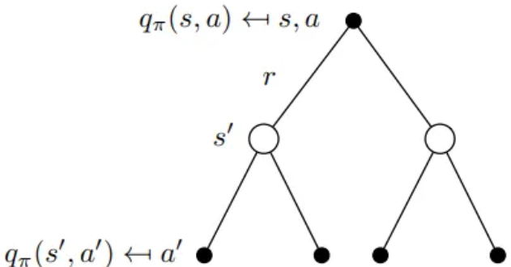

보상 $R(s,a)$ 는 $R(s,a)$ 또는 $R(s,a,s')$ 로 표현할 수 있다. MDP 이론에서는 수식을 단순화하여
$R(s,a)$ 를 쓰고, 정확한 모델링을 위해서는 $R(s,a,s')$ 를 쓴다.

### $V$ 와 $Q$ 의 관계 — 서로를 서로의 식으로

**상태가치 함수 $V_\pi$ 이해하기 — $V$ 를 $Q$ 로 표현.**

$$
V_\pi(s) = \sum_{a \in A} \pi(a \mid s)\, Q_\pi(s, a) \qquad \text{— (1)}
$$

상태 $s$ 의 가치는 행동가치 함수를 행동 $a$ 의 발생 확률 $\pi$ 를 가중치로 합한 것(기댓값)이다.

**행동가치 함수 $Q_\pi$ 이해하기 — $Q$ 를 $V$ 로 표현.**

$$
Q_\pi(s, a) = R_s^a + \gamma \sum_{s' \in S} P^a_{ss'} V_\pi(s') \qquad \text{— (2)}
$$

상태 $s$ 에서 행동 $a$ 의 가치는, 행동 $a$ 로 얻는 보상 $R_s^a$ 에 새로운 상태 $s'$ 의 가치
$V_\pi(s')$ 를 천이확률 $P^a_{ss'}$ 로 가중 합산한 뒤 감가를 적용한 것을 더한 값이다.

**$V(s)$ 를 $V(s')$ 로 표현.** (1)에 (2)를 대입하면

$$
\begin{aligned}
V_\pi(s) &= \sum_{a \in A} \pi(a \mid s) \Big( R_s^a + \gamma \sum_{s' \in S} P^a_{ss'} V_\pi(s') \Big) \\
         &= \sum_{a \in A} \pi(a \mid s) R_s^a + \gamma \sum_{a \in A} \sum_{s' \in S} \pi(a \mid s) P^a_{ss'} V_\pi(s') \\
         &= R_s^\pi + \gamma \sum_{s' \in S} P^\pi_{ss'} V_\pi(s')
\end{aligned}
$$

이고, 거꾸로 (2)에 (1)을 대입하면

$$
Q_\pi(s, a) = R_s^a + \gamma \sum_{s' \in S} P^a_{ss'} \sum_{a' \in A} \pi(a' \mid s')\, Q_\pi(s', a')
$$

가 된다. 각 항은 순서대로 **보상의 기댓값**, **$V(s')$ 의 기댓값**(또는 **$Q(s',a')$ 의 기댓값**)이다.

---

## 2.2.5 최적 가치 함수와 벨만 최적 방정식(Bellman Optimality Equation)
<!-- 슬라이드 132~135 -->

### 최대의 상태가치를 얻는다는 것의 의미

앞에서 $V_\pi(s) = R_s^\pi + \gamma \sum_{s'} P^\pi_{ss'} V_\pi(s')$ 이고,
$R_s^\pi = \sum_a \pi(a|s) R_s^a$, $P^\pi_{ss'} = \sum_a \pi(a|s) P^a_{ss'}$ 였다. 즉 **상태가치는
정책 함수 $\pi$ 에 따라 결정된다.** 그러므로 최대의 상태가치 함수, 즉 $V_\pi(s)$ 가 최대 보상을
얻는다는 것은 **좋은 $\pi$ 를 얻는 것**과 같다. 좋은 $\pi$, 최적의 $\pi$ 를 얻으려면 어떻게 해야
할까. **최적 정책을 얻기 위해 최적 가치 함수를 정의하고, 그것을 찾는다.**

예를 들어 2.2.3 의 예시에서, 주어진 $\pi$ 아래 상태 A 의 최대 가치는 왼쪽(left)을 선택한
항과 오른쪽(right)을 선택한 항 가운데 **큰 값을 고르는 것**이다.

$$
v^{*}(A) = \max_a \left\{ \begin{matrix}
\tfrac{2}{3}\big( \tfrac{1}{3}\{1 + \gamma v_\pi(C)\} + \tfrac{2}{3}\{1 + \gamma v_\pi(B)\} \big) & \text{(left 선택)} \\
\tfrac{1}{3}\big( \tfrac{1}{3}\{1 + \gamma v_\pi(B)\} + \tfrac{2}{3}\{1 + \gamma v_\pi(C)\} \big) & \text{(right 선택)}
\end{matrix} \right\}
$$

> **핵심 메시지**
> 최적 가치 함수(를 만드는 $\pi$)를 찾는 것 = **MDP 의 해를 찾는 것** = 상태별로 최적의 action 을
> 찾는 것.

### 최적 상태가치 함수(Optimal State-Value Function)

$$
V^{*}(s) = \max_\pi V_\pi(s) = V_{\pi^{*}}(s) = \max_{a \in A} Q_\pi(s, a)
= \max_{a \in A} \Big( R_s^a + \gamma \sum_{s'} P^a_{ss'} V^{*}(s') \Big)
$$

첫 등호는 **정책들 중에서**, 모든 상태 $s$ 에 대해 가장 높은 가치를 만드는 $\pi$ 를 적용하여 얻은
$V$ 라는 뜻이고, 셋째 등호는 그 $\pi$ 를 적용한 $Q(s,a)$ 중에서 가장 큰 값을 얻는 **행동 $a$ 를
선택한** 행동가치 함수 값이라는 뜻이다.

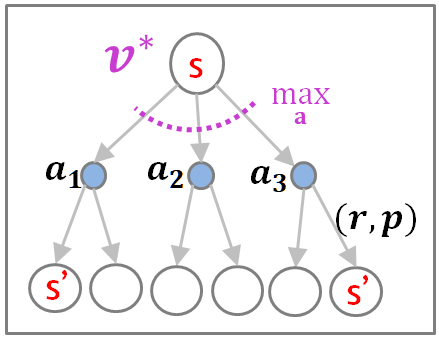

### 최적 행동가치 함수(Optimal Action-Value Function)

$$
Q^{*}(s, a) = \max_\pi Q_\pi(s, a) = Q_{\pi^{*}}(s, a)
= R_s^a + \gamma \sum_{s'} P^a_{ss'} \max_{a'} Q^{*}(s', a')
$$

모든 $Q(s,a)$ 에 대해 가장 높은 가치를 만드는 정책 $\pi$ 를 적용하여 얻은 $Q$ 다. 최적 가치 함수
(또는 그것을 만드는 $\pi$)를 찾았을 때 **MDP 를 '풀었다'** 라고 한다. 다시 말해 $\max_a$, $\max_{a'}$
를 이루는 $a$, $a'$ 를 선택하는 정책 $\pi$ 를 찾는 것이다.

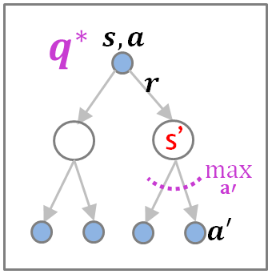

### 최적 정책 정리(Optimal policy theorem)

- 최적 정책 $\pi^{*}$ 가 존재하며 $\pi^{*} \geq \pi$ 이다. 여기서
  $\pi^{*} \geq \pi \iff V_{\pi^{*}}(s) \geq V_\pi(s),\ \forall s \in S$.
- 최적 정책 $\pi^{*}$ 는 최적 상태가치 함수를 만든다. $V^{*}(s) = V_{\pi^{*}}(s)$
- 최적 정책 $\pi^{*}$ 는 최적 행동가치 함수를 만든다. $Q^{*}(s,a) = Q_{\pi^{*}}(s,a)$

따라서 **최적 정책을 찾으면 최적 가치 함수를 찾을 수 있다.**

**최적 정책 찾기(확률 할당)의 예.** 만약 agent 가 최적 행동가치 함수
$Q^{*}(s,a) = \max_\pi Q_\pi(s,a)$ 를 찾았다면, 그때 최적 정책은 (여러 방법 중 하나로) 다음처럼
선택할 수 있다.

$$
\pi^{*}(a \mid s) = \begin{cases} 1, & \text{if } a = \arg\max_{a \in A} Q^{*}(s, a) \\ 0, & \text{otherwise} \end{cases}
$$

즉 최적 정책 $\pi^{*}(a|s)$ 에서 $a$ 는 최적 행동가치 함수 $Q^{*}(s,a)$ 중 가장 큰 값을 얻는
action 이다. $\arg\max$ 는 가장 큰 $Q^{*}$ 를 만드는 $a$ 를 찾고, 그 경우에만 $\pi^{*}$ 는 확률 1 을
가진다. 이제 $\pi^{*}(a|s)$ 는 상태 $s$ 에서 **하나의 action 만 수행하는 정책**이다.

### 최적 정책이 적용된 최적 가치 함수와 벨만 최적 방정식

앞의 예에서 이어서, 최적 정책 $\pi^{*}(a|s)$ 에서 $a$ 는 최적 행동가치 함수 $Q^{*}(s,a)$ 중 가장 큰
값을 만드는 **하나의** action 이다. 따라서 확률이 1 인 action 하나만 남고 $\sum$ 이 사라진다.

$$
\sum_{a \in A} \pi^{*}(a \mid s) \max_\pi Q_\pi(s,a) = \pi^{*}(a \mid s) \max_\pi Q_\pi(s,a) = \max_a Q^{*}(s,a)
$$

그러므로 최적 정책이 적용된 가치 함수는

- 최적 상태가치 함수 $V^{*}(s) = \sum_{a \in A} \pi^{*}(a|s) \max_\pi Q_\pi(s,a) = \max_a Q^{*}(s,a)$
- 최적 행동가치 함수 $Q^{*}(s,a) = \max_a Q^{*}(s,a)$

가 된다. 하나의 $a$ 만 남으므로 **최적 행동가치 값 = 최적 상태가치 값**이다.

**벨만 최적 방정식(Bellman Optimality Equation, BOE).** 최적 상태가치 함수와 최적 행동가치 함수를
벨만 방정식 형태로 표현하면 다음과 같다.

$$
V^{*}(s) = \max_a \big( R + \gamma E[\, V^{*}(s') \,] \big) \qquad (R \text{ 은 } a \text{ 로 얻을 보상})
$$

$$
Q^{*}(s,a) = R + \gamma E[\, \max_{a'} Q^{*}(s', a') \,] \qquad (R \text{ 은 } a \text{ 로 얻은 보상. 행동 } a \text{ 는 결정되었음})
$$

> **핵심 메시지**
> BOE 는 $\max$ 가 들어 있어 **선형 방정식이 아니므로 일반해를 구할 수 없다.** 반복적인 수치해석
> 기법 — DP, MC, TD, Q-Learning, SARSA, … — 으로 구해야 한다. 2장의 나머지 절이 바로 그 방법들이다.

---

## 2.2.6 정리 — MDP 문제에서 BEE · BOE, 그리고 해법으로
<!-- 슬라이드 136 -->

이 절의 흐름은 **MDP 문제 → BEE, BOE → 해법(DP, MC, TD, SARSA, Q-Learning, …)** 이다.
핵심 정의를 한 자리에 모으면 다음과 같다.

**MDP $\langle S, A, P, R, \gamma \rangle$** — $S$: 상태의 집합, $A$: 행동의 집합(정책 $\pi$),
$P$: 상태천이확률($P^a_{ss'}$), $R$: 보상함수(값), $\gamma$: Discount Factor 할인율/감가.

**정책 함수(Policy function)** $\pi(a|s) = P(A_t = a \mid S_t = s)$ — 현 상태에서 수행할 행동의
확률(또는 확률 분포).

**상태가치 함수(State-value function)** $V_\pi(s) = E_\pi[G_t \mid S_t = s]$ — 상태 $s$ 에서 정책
$\pi$ 를 적용했을 때 리턴 $G_t$ 의 기댓값.

**행동가치 함수(Action-value function)** $Q_\pi(s,a) = E_\pi[G_t \mid S_t = s, A_t = a]$ — 상태 $s$,
정책 $\pi$ 에서 행동 $a$ 를 취했을 때 리턴 $G_t$ 의 기댓값.

**벨만 기댓값 방정식(BEE)**

- 상태가치 함수 : $V_\pi(s) = E_\pi[G_t \mid S_t = s] = E_\pi[R_{t+1} + \gamma V_\pi(S_{t+1}) \mid S_t = s]$
- 행동가치 함수 : $Q_\pi(s,a) = E_\pi[G_t \mid S_t = s, A_t = a] = E_\pi[R_{t+1} + \gamma Q_\pi(S_{t+1}, A_{t+1}) \mid S_t = s, A_t = a]$

**벨만 최적 방정식(BOE)**

- 최적 상태가치 함수 : $V^{*}(s) = \max_a \big( R_s^a + \gamma E[V^{*}(s')] \big)$ ($R_s^a$ 는 $a$ 로
  얻을 보상). value iteration 에서 사용된다.
- 최적 행동가치 함수 : $Q^{*}(s,a) = R_s^a + \gamma E[\max_{a'} Q^{*}(s',a')]$ ($R_s^a$ 는 $a$ 로 얻은
  보상. 행동 $a$ 는 결정되었음).
- 선형 방정식이 아니므로 일반해를 구할 수 없다 → DP, MC, TD, Q-Learning, SARSA, ….

---

## 2.2.7 실습 2.2.1 — MDP 환경(GridworldEnv) 구축
<!-- 슬라이드 137~144 -->
<!-- 슬라이드 144 : 숨김 MEMO 슬라이드, 내용 없음 -->

> 노트북: `code/2.2.1.MDP.ipynb`
> [](https://colab.research.google.com/github/AI-BoostCamp/ReinforcementLearning/blob/main/code/2.2.1.MDP.ipynb)

**목적** : Markov Decision Process 환경을 직접 만들어 본다.

**실습 개요**

- Tuple $\langle S, A, P, R, \gamma \rangle$ 로 정의되는 GridworldEnv 만들기
  - 상태공간 $S$, 행동공간 $A$ 들여다보기
  - 상태천이행렬 $P$, 보상함수 $R$ 들여다보기
  - 정책 $\pi$ 와 Episode
- OpenAI Gym API 를 사용한 GridworldEnv Class 만들기 — Gym Env 의 구성요소 확인

Gym(https://www.gymlibrary.dev)은 강화학습 환경의 표준 API 다. 아래 그림의 FrozenLake 처럼
Gym 이 제공하는 환경도 결국은 상태·행동·천이확률·보상으로 정의된 MDP 이고, 이 실습에서는 그
API 를 따르는 환경을 우리 손으로 만든다. 상태천이행렬은 (행동, 상태, 다음 상태)의 3차원 배열,
즉 rank-3 텐서이고 보상함수는 (상태, 행동)의 rank-2 텐서다.


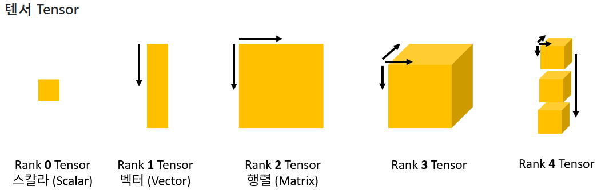

### DiscreteEnv 만들기

먼저 Gym 의 `Env` 를 상속해 **이산 상태·행동 공간을 가진 환경의 공통 뼈대** `DiscreteEnv` 를
만든다. 이 클래스가 들고 있는 것이 곧 MDP 의 구성요소다.

- `P` : 천이 정보. `P[s][a] == [(probability, nextstate, reward, done), ...]` 형태의 중첩 dict.
  상태천이확률 $P^a_{ss'}$ 와 보상 $R$ 이 한 튜플 안에 들어 있다.
- `isd` : 초기 상태 분포(initial state distribution).
- `nS`, `nA` : 상태 수와 행동 수. 이것으로 `observation_space`, `action_space` 를
  `spaces.Discrete` 로 만든다.

`step(a)` 는 현재 상태 `self.s` 에서 행동 `a` 의 천이 목록 `P[s][a]` 를 꺼내, 확률에 따라 다음
상태를 **표본추출**한 뒤 `(다음 상태, 보상, 종료 여부, 정보)` 를 돌려준다. `categorical_sample()`
은 누적확률(cumsum)과 난수를 비교해 첫 번째로 넘는 index 를 고르는 범주형 표본추출 함수다.

```python
from gym import Env, spaces
from gym.utils import seeding

def categorical_sample(prob_n, np_random):
    """ Sample from categorical distribution
        Each row specifies class probabilities """
    prob_n = np.asarray(prob_n)  # prob_n = self.isd
    csprob_n = np.cumsum(prob_n)
    return (csprob_n > np_random.rand()).argmax() # 첫번째 True의 index return

class DiscreteEnv(Env):
    def __init__(self, nS, nA, P, isd):
        self.P = P    # transitions(dict of dicts of lists)
        # P[s][a] == [(probability, nextstate, reward, done), ...]
        self.isd = isd # initial state distribution(list or array)
        self.lastaction=None # for rendering
        self.nS = nS  # number of states
        self.nA = nA  # number of actions
        self.action_space = spaces.Discrete(self.nA)
        self.observation_space = spaces.Discrete(self.nS)

        self.seed()
        self.reset()

    def seed(self, seed=None):
        self.np_random, seed = seeding.np_random(seed)
        return [seed]

    def reset(self):
        self.s = categorical_sample(self.isd, self.np_random)
        self.lastaction=None
        return self.s

    def step(self, a):   # a확률에서 sampling하여 a결정,적용후(s',r,done,p)return
        transitions = self.P[self.s][a] #P[s][a]= [(p,s',r,done), ...], s'에 대한 확률 list
        ns_idx = categorical_sample([t[0] for t in transitions], self.np_random) # sampling, s'결정
        p, ns, r, d= transitions[ns_idx]        # (P[s][a])[s']:(p,s',r,done)
        self.s = ns
        self.lastaction=a
        return (ns, r, d, {"prob" : p})
```

### GridworldEnv Class 만들기 — 변수 초기화와 모든 환경 초기화

`GridworldEnv` 는 `DiscreteEnv` 를 상속해 **4×4 격자 세계**를 만든다. 행동은 네 방향이다.

```python
# action space
UP = 0
RIGHT = 1
DOWN = 2
LEFT = 3
```

생성자에서 하는 일은 딱 하나 — **모든 상태 $s$ 와 행동 $a$ 에 대해 천이 튜플 `(p, s', r, done)` 을
채우는 것**이다. 격자를 `np.nditer` 로 순회하며 상태 index `s` 와 좌표 `(y, x)` 를 얻고, 다음 규칙을
적용한다.

- 왼쪽 위(`s == 0`)와 오른쪽 아래(`s == nS-1`)가 **Terminal** 이다. Terminal 이면 어떤 행동을 해도
  제자리에 머물고 보상은 0, `done=True`.
- 그 밖의 상태에서는 매 이동마다 보상 **−1**. 벽에 막히면(`y == 0` 에서 UP 등) 제자리에 머문다.
- **action 에 대한 이동 확률을 '1' 로 설정**했다. 직관적 이해를 위해 단순화한 것이다 — 즉 이
  Gridworld 의 상태천이는 결정론적(deterministic)이다.

채운 `P` 로부터 numpy 배열 두 개를 함께 만든다. `P_tensor` 는 상태천이행렬 $(a, s, s')$ =
`(4, 16, 16)`, `R_tensor` 는 보상 $(s, a)$ = `(16, 4)` 다. 초기 상태 분포 `isd` 는 상태별로
1/16 씩 균등하게 두고, 마지막에 상위 클래스의 `__init__` 을 호출해 `P` 를 넘긴다.

```python
metadata = {'render.modes': ['human', 'ansi']}
class GridworldEnv(DiscreteEnv):
    def __init__(self, shape=[4, 4]): # GrideWorld 초기화: 모든 table생성
        self.shape = shape
        nS = np.prod(shape)     # #states:16 = 4*4, np.prod(): product of elements
        nA = 4                  # #actions
        MAX_Y = shape[0]        # 4
        MAX_X = shape[1]        # 4

        P = {}     #{s:{a:[(p,s',r,T)}}
        grid = np.arange(nS).reshape(shape) # (4,4)
        it = np.nditer(grid, flags=['multi_index']) # state->iterator
        while not it.finished:  ## state_index loop
            s = it.iterindex        # state idx(s)
            y, x = it.multi_index   # state idx(y,x)

            ## P[s][a]=P[s]{a:[(prob, next_state, reward, is_done),...]}=P{s:{a:[(),...]}}
            P[s] = {a: [] for a in range(nA)}  #{s:{a:[]},...}

            def is_done(s): return s == 0 or s == (nS - 1) #Terminal?

            reward = 0.0 if is_done(s) else -1.0           #T면 0,아니면 -1

            if is_done(s): # terminal state면 상태 유지
                P[s][UP] = [(1.0, s, reward, True)]
                P[s][RIGHT] = [(1.0, s, reward, True)]
                P[s][DOWN] = [(1.0, s, reward, True)]
                P[s][LEFT] = [(1.0, s, reward, True)]
            else:          # action별 상태값[(p,s',r,T?)] setting
                ns_up = s if y == 0 else s - MAX_X               # action별로
                ns_right = s if x == (MAX_X - 1) else s + 1      # s'
                ns_down = s if y == (MAX_Y - 1) else s + MAX_X   # 결정 후
                ns_left = s if x == 0 else s - 1                 # action별
                P[s][UP] = [(1.0, ns_up, reward, is_done(ns_up))]# state값 set
                P[s][RIGHT] = [(1.0, ns_right, reward, is_done(ns_right))]
                P[s][DOWN] = [(1.0, ns_down, reward, is_done(ns_down))]
                P[s][LEFT] = [(1.0, ns_left, reward, is_done(ns_left))]
            it.iternext()
        self.P = P   # P{s:{a:[(p,s',r,T?)]}} 현재 class에서 관리하는 table
        self.P_tensor = np.zeros(shape=(nA, nS, nS)) # 상태천이행렬(4,16,16)<-0
        self.R_tensor = np.zeros(shape=(nS, nA))     # 보상(16,4)<-0
        ## P_t/R_t <- P
        for s in self.P.keys():        # P[s] loop
            for a in self.P[s].keys(): # P[s][a] loop
                p_sa, s_prime, r, done = self.P[s][a][0] # <-(p,s',r,T?)
                self.P_tensor[a, s, s_prime] = p_sa      # P_t[a,s,s']<-p
                self.R_tensor[s, a] = r                  # R_t[s,a]<- r
        isd = np.ones(nS) / nS # 상태별 초기 확률을 1/16로 설정
        #상위 class methode사용가능하도록 init 호출
        super(GridworldEnv, self).__init__(nS, nA, P, isd) # P:상위 class에 정보전달
```

### 기본 method — observe 와 render

`observe()` 는 현재 상태의 복사본을 돌려주고, `render()` 는 격자를 문자로 그린다. 현재 위치는
`x`, Terminal 은 `T`, 나머지는 `o` 다.

```python
    def observe(self):
        return dc(self.s) #deepcopy

    def render(self, mode='human', close=False):
        """ ==========
            T  o  o  o
            o  x  o  o
            o  o  o  o
            o  o  o  T
            =========="""
        if close: return

        outfile = sys.stdout # io.StringIO()
        grid = np.arange(self.nS).reshape(self.shape)
        it = np.nditer(grid, flags=['multi_index'])

        outfile.write('==' * self.shape[1] + '==\n')

        while not it.finished:
            s = it.iterindex
            y, x = it.multi_index

            if self.s == s:
                output = " x " # current state
            elif s == 0 or s == self.nS - 1:
                output = " T "
            else:
                output = " o "

            if x == 0:
                output = output.lstrip() # removes the specified leading characters
            if x == self.shape[1] - 1:
                output = output.rstrip() # removes the specified trailing characters

            outfile.write(output)

            if x == self.shape[1] - 1:
                outfile.write("\n")
            it.iternext()

        outfile.write('==' * self.shape[1] + '==\n')
```

### 4×4 GridworldEnv 생성 — 상태공간 $S$ 와 행동공간 $A$

```python
num_y, num_x = 4, 4

env = GridworldEnv(shape=[num_y, num_x])
observation_space = env.observation_space
action_space = env.action_space

p(env,'env')
p(observation_space,'observation_space')
p(action_space,'action_space')
```

`p()` 는 실습 공용 라이브러리 `lib/variable_print.py` 의 도우미로, 변수의 shape · type · 값을
한 번에 찍어 준다. 출력을 보면 Observation space $S$ 는 4×4 = **16**, Action space $A$ 는
↑→↓← 의 **4** 다.

```text
[env]:
Shape:[4, 4]
Type: <class '__main__.GridworldEnv'>
Values: <GridworldEnv instance>
[observation_space]:
Shape:()
Type: <class 'gym.spaces.discrete.Discrete'>
Values: Discrete(16)
[action_space]:
Shape:()
Type: <class 'gym.spaces.discrete.Discrete'>
Values: Discrete(4)
```

### 상태천이행렬 $P$ — rank-3 텐서

$P : (a, s, s')$, `shape(P) = (4, 16, 16)`. 환경에서 두 가지 형태로 읽어 올 수 있다. `env.P[]` 는
내부에서 관리하는 `(p, s', r, done)` 튜플 테이블이고, `env.P_tensor` 는 순수한 천이확률 배열이다.

```python
## P table : (p,sn,r,d)정보 저장, 내부에서 관리하는 테이블
env.P[1] #{s:{a:[(p,sn,r,done)]} } 1번 위치에 대한 정보 들
```

```python
## Transition matrix
Pt = env.P_tensor #(a,s,s')
p(Pt,'P_tensor')
```

```text
Shape:(4, 16, 16)
Type: <class 'numpy.ndarray'>
```

`up` 을 선택했을 때 $s \to s'$ 로 전이하는 확률은 첫 축을 0(UP)으로 고정한 16×16 행렬이다.
$s_0$ 는 Terminal 이므로 $s_0$ 에서 $s_0$ 로 갈 확률이 1 이고, 첫 행의 상태들($s_1, s_2, s_3$)은
위로 갈 수 없어 제자리에 머무는 확률이 1, 둘째 행부터는 한 줄 위($s - 4$)로 가는 확률이 1 이다.

```python
## up을 선택했을때 s->s' 전이 확률
action_up_prob = Pt[0, :, :]
print(action_up_prob)       # (s, s')
```

```text
[[1. 0. 0. 0. 0. 0. 0. 0. 0. 0. 0. 0. 0. 0. 0. 0.]
 [0. 1. 0. 0. 0. 0. 0. 0. 0. 0. 0. 0. 0. 0. 0. 0.]
 [0. 0. 1. 0. 0. 0. 0. 0. 0. 0. 0. 0. 0. 0. 0. 0.]
 [0. 0. 0. 1. 0. 0. 0. 0. 0. 0. 0. 0. 0. 0. 0. 0.]
 [1. 0. 0. 0. 0. 0. 0. 0. 0. 0. 0. 0. 0. 0. 0. 0.]
 [0. 1. 0. 0. 0. 0. 0. 0. 0. 0. 0. 0. 0. 0. 0. 0.]
 ...
```

거꾸로 상태 $s_0$ 를 고정하고 모든 action 을 보면, Terminal 이므로 어느 행동이든 제자리다.

```python
action_up_prob = Pt[:, 0, :] # S0,모든action,T이므로 제자리
print(action_up_prob)
```

### 보상함수 $R$ — rank-2 텐서

$R : (s, a) = (16, 4)$. 매 이동마다 −1 의 보상이고, Terminal(첫 행과 마지막 행)에서는 0 이다.

```python
## R tensor
Rt = env.R_tensor #(s,a)
p(Rt,"R")         # Teminal에서 0
```

```text
[[ 0.  0.  0.  0.]
 [-1. -1. -1. -1.]
 [-1. -1. -1. -1.]
 ...
 [-1. -1. -1. -1.]
 [ 0.  0.  0.  0.]]
```

### 정책 $\pi$ 와 Episode 실행

MDP 의 에피소드는 다음과 같이 (상태, 행동, 보상, 다음 상태) 튜플의 열이다.

$$
\langle (s_0, a_0, r_0, s_1), \ldots, (s_t, a_t, r_t, s_{t+1}), \ldots, (s_{T-1}, a_{T-1}, r_{T-1}, s_T) \rangle
$$

일반적으로 구현의 편의를 위해 Terminal 상태를 확인하는 **Done** 정보를 튜플에 포함해서 관리한다.
시뮬레이션을 위해 정책은 $\pi = 0.25$, 즉 네 action 을 각각 0.25 의 확률로 고르는 random policy
로 고정한다.

```python
s_t0 = env.reset()                          # Gridworld 를 초기화 상태
print(f"State: env.s:{env.s}, s_t0:{s_t0}") # env.s: 현재 상태와 동일
```

직관성을 위해 action index 를 이름으로 바꿔 표시한다.

```python
action_mapper = { 0: 'UP',
                  1: 'RIGHT',
                  2: 'DOWN',
                  3: 'LEFT' }
```

한 에피소드를 돌리면서 매 step 마다 현재 환경을 rendering 하고, action 을 실행한 뒤의 상태를
표시한다.

```python
env.reset()
step_counter = 0

while True: # 정책 4 방향 임의로 선택(pi=0.25)
    print("At t = {}".format(step_counter))
    env.render()                             # current env
    cur_state = env.s                         # current state
    action = np.random.randint(low=0, high=4) # action select(pi=0.25)

    next_state, reward, done, info = env.step(action) #action!

    print(f"\nstate : {cur_state}")
    print(f"aciton : {action_mapper[action]}")
    print(f"reward : {reward}")
    print(f"next state : {next_state}")
#    print(f"info : {info}") # {'prob': 1.0}
    step_counter += 1
    if done: break
```

```text
At t = 0
==========
T  x  o  o
o  o  o  o
o  o  o  o
o  o  o  T
==========
state : 1
aciton : DOWN
reward : -1.0
next state : 5

At t = 1
==========
T  o  o  o
o  x  o  o
o  o  o  o
o  o  o  T
==========
state : 5
aciton : RIGHT
reward : -1.0
next state : 6
…
```

### Episode 길이

상태천이행렬은 deterministic 이다. 하지만 정책 함수 $\pi$ 가 stochastic 하므로 **에피소드는 실행할
때마다 달라진다.** 항상 상태 6 에서 시작해 10 번 실행하면 에피소드 길이가 크게 흔들리는 것을 볼 수 있다.

```python
def run_episode(env, s0):
    _ = env.reset() # Gridworld 를 초기화합니다.
    env.s = s0
    step_counter = 0
    while True:
        action = np.random.randint(low=0, high=4) # random policy
        next_state, reward, done, info = env.step(action)
        step_counter += 1
        if done: break
    return step_counter

## 10번의 episode 실행
n_episodes = 10
for i in range(n_episodes):
    len_ep = run_episode(env, s0=6)     # 항상 6번에서 시작
    print(f"Episode {i}'s Length: {len_ep}")
```

```text
Episode 0's Length: 8
Episode 1's Length: 3
Episode 2's Length: 5
Episode 3's Length: 14
Episode 4's Length: 8
Episode 5's Length: 4
Episode 6's Length: 37
Episode 7's Length: 9
Episode 8's Length: 16
Episode 9's Length: 32
```

이 GridworldEnv 는 다음 절부터 정책 반복 · 가치 반복(2.3), Monte-Carlo(2.4), TD(2.5), SARSA(2.6),
Q-Learning(2.7)의 실험대가 된다. $P$ 와 $R$ 을 다 알고 있으므로 2.3 의 동적 계획법은 이 텐서를
그대로 쓰고, 2.4 이후의 model-free 방법들은 이 텐서를 **모르는 척** 하고 `env.step()` 의 경험만으로
가치를 추정한다.
