# 2.3 동적 계획법(Dynamic Programming)

**학습 목표**

- 동적 계획법(DP)이 순환식으로 정의된 문제를 Memorization · Bottom-up 으로 푸는 기법임을
  피보나치 수열 예제로 설명하고, MDP 의 벨만 방정식이 왜 DP 로 풀리는지 말할 수 있다.
- **정책 반복(Policy Iteration)** = 정책 평가(prediction) + 정책 개선(control) 의 반복 구조를
  설명하고, 정책 평가를 Bellman expectation backup operator $T^\pi(V) = R^\pi + \gamma P^\pi V$
  의 반복 적용으로 구현할 수 있다.
- **가치 반복(Value Iteration)** 이 벨만 최적 방정식을 직접 반복하여 명시적 정책 개선 없이
  greedy policy improvement 를 수행하는 이유를 설명할 수 있다.
- Synchronous DP 와 Asynchronous DP(In-place · Prioritized sweeping · Partial sweeping · Real-time)
  의 차이를 설명하고 Gridworld 위에서 구현할 수 있다.
- 상태천이 텐서 $P(a, s, s')$ 와 보상 텐서 $R(s, a)$ 를 numpy 로 다루어(`einsum`, `dot`, `max`)
  가치 함수 갱신을 벡터 연산으로 쓸 수 있다.

**이 절의 구성**

- 2.3.1 동적 계획법이란 — 피보나치 수열로 보는 DP
- 2.3.2 정책 반복(Policy Iteration) — 정책 평가와 정책 개선
- 2.3.3 실습 2.3.1 — 정책 반복: synchronous DP
- 2.3.4 가치 반복(Value Iteration) — 벨만 최적 방정식을 직접 풀기
- 2.3.5 실습 2.3.2 — 가치 반복
- 2.3.6 Synchronous DP 와 Asynchronous DP
- 2.3.7 실습 2.3.3 — Asynchronous DP
- 2.3.8 정리

---

## 2.3.1 동적 계획법이란 — 피보나치 수열로 보는 DP
<!-- 슬라이드 146~147 -->

**동적 계획법(Dynamic Programming, DP)** 은 큰 문제 안에 작은 문제들이 반복적으로 중첩되는 형태의
문제 — 재귀식, 순환식으로 정의되는 문제 — 를 효율적으로 해결하기 위한 기법이다. 1950년대
Richard Bellman 이 고안했다. 주어진 문제를 순환식(recurrence equation)으로 정의하고 DP 로
해결하며, 구현 방식으로 **Memorization 방법**과 **Bottom-up 방법**이 있다.

### MDP 에 DP 적용하기

MDP 에서 벨만 기대 방정식과 벨만 최적 방정식은 순환식이다. 따라서 DP 를 사용하여 문제를 해결할
수 있다. 단, DP 를 적용하려면 **MDP 가 완전 정의되어 있어야** 한다 — 상태천이확률과 보상 같은 환경
정보를 사전에 알고 있어야 한다는 뜻이다. 또 상태가 많은 경우 시간이 많이 소요된다. 이 두 제약이
2.4 이후의 model-free 방법과 3장의 함수 근사로 이어지는 동기가 된다.

### DP 사례 — 피보나치 수열

피보나치 수열 1, 1, 2, 3, 5, 8, 13, 21, 34, … 는 처음 두 항 1, 1 을 고정하고
$f(n) = f(n-1) + f(n-2)$ ($n \geq 3$) 로 정의된다. 이 순환식을 그대로 펼치면

$$
f(n) = f(n-1) + f(n-2) = \big(f(n-2) + f(n-3)\big) + \big(f(n-3) + f(n-4)\big) = \cdots
$$

처럼 **같은 항($f(n-3)$ 등)이 반복해서 계산**된다. 반복되는 연산을 줄이는 두 방법이 DP 의 두 얼굴이다.

- **Memorization** : 한 번 계산한 값을 Table 에 저장해서 재사용한다.
- **Bottom-up** : 작은 단위부터 계산해서 위로 올라온다.

### 실습 — 동적 계획법 사례: 피보나치 수열

이 예제는 별도의 노트북 없이 세 가지 구현을 비교한다. 먼저 **단순 반복(Recursive Call)** 이다.
$f(35)$ 를 구하는 데 5초 넘게 걸린다 — 같은 부분 문제를 지수적으로 다시 풀기 때문이다.

```python
%%time
def fibonaccii_A(n): # 단순 반복
    if n==1 or n==2:
        return 1
    return fibonaccii_A(n-2) + fibonaccii_A(n-1)
fibonaccii_A(35)
```

```text
Wall time: 5.25 s
9227465
```

**Memorization 방법**은 계산한 값을 dict `mt` 에 저장하고, 다시 필요하면 table 에서 찾는다.
$f(1000)$ 을 1 ms 에 구한다.

```python
%%time
mt = {}
def fibonaccii_M(n): # Memorization 방법, table에 저장
    if n==1 or n==2: return 1
    elif n in mt:    # table search
        return mt[n]
    else:
        mt[n] = fibonaccii_M(n-2) + fibonaccii_M(n-1)
        return mt[n]
fibonaccii_M(1000)
```

```text
Wall time: 1 ms
43466557686937456435688527675040625802564660517371780402481...
```

**Bottom-up 방법**은 재귀 호출 없이 아래(작은 $n$)부터 위로 채워 올라간다. 역시 1 ms 다.

```python
%%time
m={}
def fibonaccii_B(n): # Bottom-up 방법, 아래부터 위로 계산
    m[1] = m[2]= 1
    for i in range(3, n+1):
        m[i] = m[i-2] + m[i-1]
    return m[n]
fibonaccii_B(1000)
```

```text
Wall time: 1 ms
43466557686937456435688527675040625802564660517371780402481...
```

강화학습의 DP 도 같은 구조다. 상태가치 $V(s)$ 를 구하는 순환식(벨만 방정식)에서 다른 상태의 값
$V(s')$ 을 table 에 저장해 두고 반복해서 갱신한다.

---

## 2.3.2 정책 반복(Policy Iteration) — 정책 평가와 정책 개선
<!-- 슬라이드 148~149 -->

DP 로 벨만 최적 방정식을 푸는 접근법은 두 가지다. **정책 반복(Policy iteration)** 과
**가치 반복(Value iteration)**. 먼저 정책 반복이다.

정책 반복은 좋은 정책을 찾기 위해 **정책 평가와 정책 발전(개선)을 반복**하는 방법이다.

- **정책 평가(Policy Evaluation)** : 상태가치 $V(s)$ 를 계산하여 정책의 가치를 평가한다.
  $V(s)$ 계산하기 — **prediction** 문제.
- **정책 개선(Policy Improvement)** : 행동가치 $Q(s,a)$ 를 계산하여 정책을 선택(수정)한다.
  정책 선택하기 — **control** 문제.

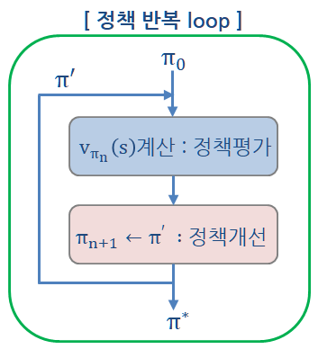

### 정책 평가(Policy Evaluation) — $V_\pi$ 구하기

주어진 정책 $\pi(a|s)$ 하에서 상태가치 $V_\pi(s)$ 를 계산한다. $0 < \gamma < 1$ 이거나 반드시
Terminal 에 도달한다면 해가 존재한다. 알고리즘은 다음과 같다.

1. $V_0^\pi(s) \leftarrow 0$
2. Repeat:
   $V_{t+1}^\pi(s) \leftarrow \sum_{a \in A} \pi(a|s) \Big( R_s^a + \gamma \sum_{s' \in S} P^a_{ss'} V_t^\pi(s') \Big)$
3. Until $\max_s |V_{t+1}^\pi(s) - V_t^\pi(s)| \leq \epsilon$

즉 $t+1$ 시점의 상태가치를 **$t$ 시점의 상태가치와 보상만으로** 계산한다(주어진 정책 하에서).
이를 반복하면 참값 $V_n^\pi(s)$ 으로 수렴한다. 벨만 기댓값 방정식(BEE)의 해를 구하기 위해 동적
계획법을 적용한 것이다.

### 정책 개선(Policy Improvement)

주어진 정책 $\pi$ 와 앞에서 계산된 상태가치 $V^\pi(s)$ 에서 개선된 정책 $\pi'$ 를 얻는다.
Control 문제다.

1. 행동가치 함수를 구한다 (정책 평가로 계산된 $V^\pi$ 를 사용).
   $$Q^\pi(s,a) = R_s^a + \gamma \sum_{s' \in S} P^a_{ss'} V^\pi(s')$$
2. 최적 행동을 선택하여 정책의 확률분포를 변경한다 → 정책 개선.
   $$\pi'(a|s) = \begin{cases} 1, & \text{if } a = \arg\max_{a \in A} Q^\pi(s,a) \\ 0, & \text{otherwise} \end{cases}$$

max 값을 취하므로 **greedy policy improvement** 라 부른다.

### 정책 반복

정책 반복은 정책 평가 / 정책 발전을 반복하여 벨만 최적 방정식을 푼다. 정책 개선 효과가 미미할 때
까지, 즉 $(\pi_{k+1} - \pi_k) < \epsilon$ 이 될 때까지 반복한다. 이 정책 반복 과정에 동적
계획법을 적용한다.

---

## 2.3.3 실습 2.3.1 — 정책 반복: synchronous DP
<!-- 슬라이드 150~156 -->

> 노트북: `code/2.3.1.DP_Policy_Iteration.ipynb`
> [](https://colab.research.google.com/github/AI-BoostCamp/ReinforcementLearning/blob/main/code/2.3.1.DP_Policy_Iteration.ipynb)

**목적** : 정책 반복 알고리즘을 동적 계획법으로 구현해 본다.

**실습 개요** : 정책 평가 / 정책 발전을 반복하여 벨만 최적 방정식을 풀자. 전체 골격은 다음과 같다 —
정책 평가로 $v$ 를 얻고, 그것으로 정책을 개선하고, 정책의 변화(gap)가 작아지면 멈춘다.

```python
def policy_iteration(self, policy=None):
    ...
    steps = 0
    converged = False
    while True:
        v_old = self.policy_evaluation(pi_old)
        pi_improved = self.policy_improvement(pi_old, v_old)
        ...
        # check convergence
        policy_gap = np.linalg.norm(pi_improved - pi_old)

        if policy_gap <= 1e-5 : break
        else: pi_old = pi_improved
    return
```

### DP Env. 만들기

2.2 절의 `GridworldEnv` 를 이번에는 5×5 로 만든다(`lib/gridworld.py`).

```python
nx = 5
ny = 5
env = GridworldEnv([ny, nx])
```

DP 를 수행할 객체 `TensorDP` 를 만든다. 동적 계획법에서는 원래 Agent 개념을 사용하지 않지만,
코드 구조를 뒤의 절들과 맞추기 위해 "agent" 라는 이름으로 부른다. 생성 인수는 $\gamma = 1$,
$\epsilon = 10^{-5}$(수렴 판정 오차)이다. 환경 정보는 `set_env()` 로 넣는다 — 상태천이 텐서
$P(a, s, s')$ = `(4, 25, 25)` 와 보상 텐서 $R(s, a)$ = `(25, 4)` 를 환경에서 그대로 받아 오고,
정책을 주지 않으면 모든 행동을 $1/|A|$ 로 고르는 random policy 로 초기화한다.

```python
class TensorDP:
    @classmethod
    def add_method(cls, fun):
      setattr(cls, fun.__name__, fun)
      return fun

    def __init__(self, gamma=1.0, error_tol=1e-5):
        self.gamma = gamma
        self.error_tol = error_tol
        # Following attributes will be set after call "set_env()"
        self.env = None  # environment
        self.policy = None  # policy
        self.ns = None  # Num. states
        self.na = None  # Num. actions
        self.P = None  # Transition tensor
        self.R = None  # Reward tensor

    def set_env(self, env, policy=None):
        self.env = env
        if policy is None: self.policy = np.ones([env.nS, env.nA]) / env.nA
        self.ns = env.nS
        self.na = env.nA
        self.P = env.P_tensor  # Rank 3 tensor (a,s,s'):(4,25,25)
        self.R = env.R_tensor  # Rank 2 tensor (s,a):(25,4)
        print(f"Environment : #state = {env.nS} , #actions = {env.nA} ")

    def reset_policy(self):
        self.policy = np.ones([self.ns, self.na]) / self.na

    def set_policy(self, policy):
        self.policy = policy
```

`add_method` 는 클래스가 정의된 뒤에도 `@TensorDP.add_method` 데코레이터로 메서드를 하나씩
덧붙일 수 있게 하는 장치다. 아래에서 정책 평가 · 정책 개선 · 정책 반복을 그렇게 하나씩 붙여 간다.

```python
dp_agent = TensorDP()
dp_agent.set_env(env)
```

### 정책평가 함수 만들기

정책 평가는 $T^\pi$ 가 수렴할 때까지 반복하여, 현재 정책 함수 $\pi$ 에 대한 가치 함수 $V^\pi$ 를
찾는 것이다. 여기서 **Bellman expectation backup operator** 를

$$
T^\pi(V) \triangleq R^\pi + \gamma P^\pi V
$$

로 정의한다. 앞 절의 정책 평가 갱신식을 정리하면 이 operator 가 나온다.

$$
\begin{aligned}
V_{t+1}^\pi(s) &= \sum_{a \in A} \pi(a|s) R_s^a + \sum_{a \in A} \pi(a|s)\, \gamma \sum_{s' \in S} P^a_{ss'} V_t^\pi(s') \\
               &= R^\pi + \gamma P^\pi V
\end{aligned}
$$

두 재료를 numpy 로 만든다. **$R^\pi = \sum_a \pi(a|s) R_s^a$** 는 상태 $s$ 에서 (정책이 고르는)
행동들로 얻을 수 있는 보상의 기댓값이다. 정책 `(s,a)` 와 보상 `(s,a)` 를 원소별로 곱해 행동 축으로
합치면 `(s,)` 벡터가 된다.

```python
    def get_r_pi(self, policy): #r_pi(s,)<-sum(pilicy(s,a)*R(s,a)))
        r_pi = (policy * self.R).sum(axis=-1) #(s,)
        return r_pi
```

```python
policy = dp_agent.policy         # (s,a):(25,4)
R = dp_agent.env.R_tensor        # (s,a):(25,4)
r_pi = dp_agent.get_r_pi(policy) # (s,):(25,)
```

```text
[policy] Shape(25, 4)
[R] Shape(25, 4)
[r_pi] Shape(25,)
```

**$P^\pi = P^\pi_{ss'} = \sum_a \pi(a|s) P^a_{ss'}$** 는 $s$ 에서 $s'$ 로 갈 확률의 기댓값이다.
정책 `(s,a)` 와 천이 텐서 `(a,s,s')` 를 행동 축으로 축약해야 하는데, 이런 차원 간 텐서 연산은
`np.einsum()` — Einstein summation convention(아인슈타인 간략화 규칙) — 으로 한 줄에 쓸 수 있다.
`"na,anm->nm"` 은 첨자 `n`=상태 $s$, `a`=행동, `m`=다음 상태 $s'$ 로 읽는다. 양쪽에 있는 `a` 가
합쳐져 사라지고 `(s, s')` 행렬이 남는다. (참고: https://ajcr.net/Basic-guide-to-einsum/)

```python
    def get_p_pi(self, policy): # (s,s')<-(s,a)*(a,s,s')
        p_pi = np.einsum("na,anm->nm", policy, self.P) #(s,s')
        return p_pi
```

```python
policy = dp_agent.policy         # (s,a):(25,4)
P = dp_agent.env.P_tensor        # (a,s,s'):(4,25,25)
p_pi = dp_agent.get_p_pi(policy) # (s,s'):(25,25)
```

```text
[policy] Shape(25, 4)
[P] Shape(4, 25, 25)
[p_pi] Shape(25, 25)
```

이제 정책 평가는 $V_{t+1}^\pi \leftarrow R^\pi + \gamma P^\pi V_t^\pi$ 를
$|V_{t+1}^\pi - V_t^\pi| \leq \epsilon$ 까지 반복하는 것이다. `np.matmul(p_pi, v_old)` 가
$\sum_{s'} P^\pi_{ss'} V(s')$ 을 모든 $s$ 에 대해 한 번에 계산한다.

```python
@TensorDP.add_method
def policy_evaluation(self, policy, v_init=None):
    r_pi = self.get_r_pi(policy)  #(s,)
    p_pi = self.get_p_pi(policy)  #(s,s')

    if v_init is None: v_old = np.zeros(self.ns)
    else:              v_old = v_init
    while True:
        # perform bellman expectation back
        # v(s,) <- r_pi(s,) + 1. * p_pi(s,s')*v(s,)
        v_new = r_pi + self.gamma * np.matmul(p_pi, v_old)

        # check convergence
        bellman_error = np.linalg.norm(v_new - v_old)#vector or matrix norm
        if bellman_error <= self.error_tol: break
        else: v_old = v_new
    return v_new
```

random policy 를 평가하면 $V^\pi$ 는 두 Terminal(왼쪽 위 · 오른쪽 아래)에서 0 이고, Terminal 에서
멀어질수록 음수가 커진다(매 이동마다 −1 의 보상이 쌓이므로).

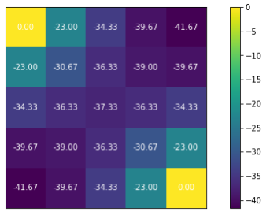

### 정책 개선

정책 개선은 두 단계다. (1) $Q^\pi(s,a) = R_s^a + \gamma \sum_{s'} P^a_{ss'} V^\pi(s')$ 를 계산하고,
(2) $\pi'(a|s)$ 를 $\arg\max_a Q^\pi(s,a)$ 인 $a$ 에 대해서만 1, 나머지는 0 으로 둔다.

코드에서 `self.P.dot(v_pi)` 는 `(a,s,s')` 텐서와 `(s,)` 벡터를 곱해 `(a,s)` — 즉 행동별 ·
상태별 $\sum_{s'} P^a_{ss'} V(s')$ — 를 만든다. 여기에 `r_pi` 를 더해 `q_pi` 를 얻고,
`q_pi.argmax(axis=0)` 로 상태마다 최선의 행동 index 를 찾아 그 자리에만 1 을 채운다.

```python
@TensorDP.add_method
def policy_improvement(self, policy, v_pi=None):
    if policy is None: policy = self.policy
    if v_pi is None: v_pi = self.policy_evaluation(policy)

    # (1) Compute Q_pi(s,a) from V_pi(s,)
    r_pi = self.get_r_pi(policy)   #(s,)
    #q_pi(a,s)<-r_pi(s,) + P:(a,s,s') o v_pi:(s,)
    q_pi = r_pi + self.gamma * self.P.dot(v_pi)
    # (2) Greedy improvement
    policy_improved = np.zeros_like(policy) #(s,a)<- 0
    policy_improved[np.arange(q_pi.shape[1]), q_pi.argmax(axis=0)] = 1
    return policy_improved #(s,a)
```

개선된 정책은 `set_policy()` 로 명시적으로 갱신한다.

```python
policy = dp_agent.policy # (s,a):(25,4)
new_policy = dp_agent.policy_improvement(policy)
dp_agent.set_policy(new_policy)
```

### 정책 반복 — policy_iteration()

정책 평가와 정책 개선을 번갈아 호출하고, 매 단계의 $v$ 와 $\pi$ 를 `info` 에 기록한다.
정책의 변화량 `policy_gap` 이 `error_tol` 이하가 되면 수렴으로 보고 그 step 을 기록한다.

```python
@TensorDP.add_method
def policy_iteration(self, policy=None):
    if policy is None: pi_old = self.policy
    else:              pi_old = policy

    info = dict()
    info['v'] = list()
    info['pi'] = list()
    info['converge'] = None

    steps = 0
    converged = False
    while True:
        v_old = self.policy_evaluation(pi_old)
        pi_improved = self.policy_improvement(pi_old, v_old)
        steps += 1

        info['v'].append(v_old)
        info['pi'].append(pi_old)

        # check convergence
        policy_gap = np.linalg.norm(pi_improved - pi_old)
        print(f"iter[{steps:02d}] policy gap : {policy_gap:.7f}")
        if policy_gap <= self.error_tol:
            if not converged:  # record the first moment step
                info['converge'] = steps
            break
        else:
            pi_old = pi_improved
    return info
```

### 정책 반복 실행과 결과 시각화

```python
dp_agent.reset_policy()
info_pi = dp_agent.policy_iteration()
```

```text
iter[01] policy gap : 4.33013
iter[02] policy gap : 2.44949
iter[03] policy gap : 0.00000
```

세 번의 반복으로 수렴했다. `info` 에는 step 마다의 $V$(3, 25) 와 $\pi$(3, 25, 4) 가 들어 있다.

```python
print(info_pi.keys())      # dict_keys(['v', 'pi', 'converge'])
p(info_pi["v"],"V")        # V[]:(steps,s)(3,25)
p(info_pi["pi"],"PI")      # PI[]:(steps,s,a)(3,25,4)
p(info_pi["converge"],"Converge") # steps=3
```

```python
steps = info_pi['converge']
fig, ax = plt.subplots(nrows=steps, ncols=2, figsize=(steps * 5, 5 * 2))
for i in range(steps):
    visualize_value_function(ax[i][0],info_pi['v'][i], nx, ny)
    visualize_policy(ax[i][1], info_pi['pi'][i], nx, ny)
```

`visualize_value_function` 과 `visualize_policy`(`lib/grid_visualization.py`)는 각각 상태가치를
heatmap 으로, 정책을 상태마다 확률이 가장 큰 행동의 화살표로 그린다. 첫 반복의 정책은 random
(네 방향 모두 0.25)이라 화살표가 전부 같은 방향(첫 번째 행동 ↑)으로 그려지고, 마지막 반복에서는
두 Terminal 로 향하는 최적 정책이 나온다. 그때의 상태가치는 Terminal 까지의 거리(−1 씩)와 정확히
일치한다.

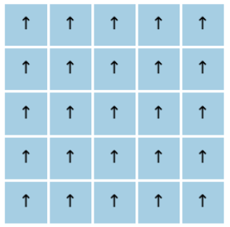

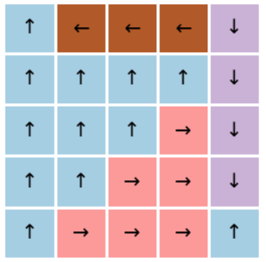

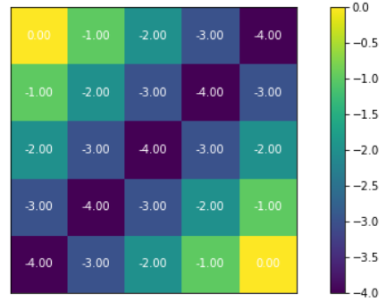

---

## 2.3.4 가치 반복(Value Iteration) — 벨만 최적 방정식을 직접 풀기
<!-- 슬라이드 157~158 -->

두 번째 접근법인 **가치 반복(Value Iteration)** 은 벨만 최적가치 함수를 구하며 **동시에 정책을
발전**시킨다. 벨만 최적 방정식 $V^{*}(s) = \max_a (R + \gamma E[V^{*}(s')])$ 를 사용하여

$$
V_{t+1}(s) \leftarrow \max_a \big( R_s^a + \gamma E[V_t(s')] \big)
$$

를 계산하는데, $\max_a$ 를 취하므로 정책도

$$
\pi_{t+1}(a|s) = \begin{cases} 1, & a = \arg\max_{a \in A} Q_t(s, a) \\ 0, & \text{otherwise} \end{cases}
$$

가 자동으로 적용된다. 즉 **명시적인 정책 개선 없이 greedy policy improvement 가 수행**된다.

### 가치 반복 알고리즘

최적 가치 함수는

$$
V^{*}(s) = \max_\pi V_\pi(s) = V_{\pi^{*}}(s) = \max_{a \in A} Q_{\pi^{*}}(s,a)
= \max_{a \in A} \sum_{s', r} P(s'|s,a)\,[\, r + \gamma V^{*}(s') \,]
$$

이고 ($P(s'|s,a) = P^a_{ss'}$), 최적 정책 함수 $\pi^{*} \approx \pi$ 는 $V^{*}(s)$ 에서 바로 얻는다.

$$
\pi(s) = \arg\max_a \sum_{s', r} P(s'|s,a)\,[\, r + \gamma V^{*}(s') \,]
$$

이 정책은 deterministic 한 index 값을 가진다(예: `[0, 0, 1, 0]`). 알고리즘은 다음과 같다.

1. $V_0^\pi(s) \leftarrow 0$
2. Repeat — 모든 상태 $s$ 에:
   $V_{t+1}(s) \leftarrow \max_{a \in A} \sum_{s', r} P(s'|s,a)\,[\, r + \gamma V_t(s') \,]$
3. Until $\theta > |V_{t+1}(s) - V_t(s)|$

갱신식을 텐서 형태로 정리하면 다음과 같다.

$$
\begin{aligned}
V_{t+1}(s) &\leftarrow \max_{a \in A} \sum_{s', r} P(s'|s,a)\,[\, r + \gamma V_t(s') \,] \\
           &= \max_{a \in A} \Big( R_s^a + \gamma \sum_{s' \in S} P^a_{ss'} V_t(s') \Big) \\
           &= \max_{a \in A} \big( R_s^a + \gamma P^a_{ss'} V_t(s') \big)
\end{aligned}
$$

마지막 줄은 $a$ 가 하나로 결정되므로 $\sum_{s'} P^a_{ss'}$ 를 행렬-벡터 곱 $P^a_{ss'} V_t(s')$ 로
쓴 것이다.

### 왜 수렴하는가 — $T^\pi$ 는 $\gamma$-수축 사상

$T^\pi(V) \triangleq R^\pi + \gamma P^\pi V$ 로 Bellman expectation backup operator 를 정의하면,
이 operator 는 **$\gamma$-수축 사상(contraction mapping)** 이다. $T^\pi(u)$ 와 $T^\pi(v)$ 사이의
거리는 $u, v$ 사이의 거리보다 최소 $\gamma$ 배 가깝다. 따라서 $T^\pi(v)$ 를 반복 적용하면 $v$ 는
유일한 고정점 $v^{*}$ 로 수렴한다 — **Banach fixed-point theorem** 이다. 결론적으로 임의의 $V$ 에
$T^\pi(\cdot)$ 를 반복 적용하면 $V^{*}$ 에 수렴한다.

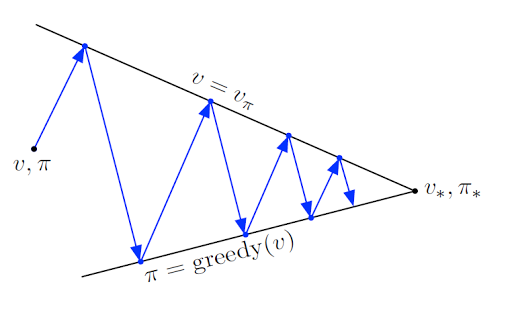

### 최적 정책 $\pi^{*}$ 도 구하자

- **$V$ update** : $V_{t+1} \leftarrow T^\pi(V_t)$
- **$\pi$ update** : policy improvement 와 동일하다. 행동가치 함수 $Q^\pi = R^a + \gamma P^a V_{t+1}$
  을 구하고, $\pi'(a|s) = 1$ if $a = \arg\max_{a \in A} Q^\pi$, otherwise 0 으로 정책을 수정한다
  (max 값을 취하는 greedy policy improvement).

---

## 2.3.5 실습 2.3.2 — 가치 반복
<!-- 슬라이드 159~161 -->

> 노트북: `code/2.3.2.DP_Value_Iteration.ipynb`
> [](https://colab.research.google.com/github/AI-BoostCamp/ReinforcementLearning/blob/main/code/2.3.2.DP_Value_Iteration.ipynb)

**목적** : 가치 반복 알고리즘을 동적 계획법으로 구현해 본다.

**실습 개요** — 가치 반복 알고리즘으로 벨만 최적 방정식을 풀자.

- $V$ update : $V_{t+1} = T^\pi(V_t) = \max_{a \in A}(R_s^a + \gamma P^a_{ss'} V_t(s'))$.
  $\pi$ update 없이 계산 가능하다.
- $\pi$ update : $Q^\pi = R^a + \gamma P^a V_{t+1}$ 을 구하고, 정책을
  $\pi'(a|s) = 1$ if $a = \arg\max_{a \in A} Q^\pi$, otherwise 0 으로 수정한다.

### V update

`TensorDP` 는 앞 실습과 같고, `value_iteration()` 이 새로 들어간다. 핵심은 한 줄이다 —
`(self.R.T + self.gamma * self.P.dot(v_old)).max(axis=0)`. `R.T` 는 `(a,s)`, `P.dot(v_old)` 도
`(a,s)` 이므로 둘을 더하면 행동별 · 상태별 $Q$ 가 되고, 행동 축(`axis=0`)으로 max 를 취하면
`(s,)` 의 새 $V$ 가 된다. Bellman optimality backup operator 를 그대로 옮긴 것이다.

```python
    def value_iteration(self, v_init=None, compute_pi=False):
        if v_init is not None:
            v_old = v_init
        else:
            v_old = np.zeros(self.ns)

        info = dict()
        info['v'] = list()
        info['pi'] = list()
        info['converge'] = None

        steps = 0
        converged = False

        while True:
            # Bellman optimality backup
            #(s,)     <- ((a,s) + gamma * (a,s,s') o (s,)):(a,s).max(0)
            v_improved = (self.R.T + self.gamma * self.P.dot(v_old)).max(axis=0)
            info['v'].append(v_improved)

            if compute_pi:
                # compute policy from v
                # 1) Compute v -> q
                # (a,s) <- (a,s)+ gamma * (a,s,s') o ((s,))
                q_pi = (self.R.T + self.gamma * self.P.dot(v_improved))

                # 2) Construct greedy policy
                pi = np.zeros_like(self.policy)
                pi[np.arange(q_pi.shape[1]), q_pi.argmax(axis=0)] = 1
                info['pi'].append(pi)

            steps += 1

            # check convergence
            policy_gap = np.linalg.norm(v_improved - v_old)
            if policy_gap <= self.error_tol:
                if not converged:  # record the first moment of within error tolerance.
                    info['converge'] = steps
                break
            else:
                v_old = v_improved
        return info
```

### V 식 shape 확인, update 과정 확인

중간 결과의 shape 를 하나씩 찍어 보면 연산의 뜻이 분명해진다.

```python
v_old = np.zeros(dp_agent.ns)
 #(s,)     <- ((a,s) + gamma * (a,s,s') o (s,)).max(ax=0)
v_improved = (dp_agent.R.T + dp_agent.gamma * dp_agent.P.dot(v_old)).max(axis=0)

ps(dp_agent.R.T,'dp_agent.R.T') #(a,s)<-(s,a)
ps(dp_agent.P.dot(v_old),'P.dot') #(a,s)<-(a,s,s')o(s,)
ps(dp_agent.R.T + dp_agent.gamma * dp_agent.P.dot(v_old),'R+') #(a,s)
ps((dp_agent.R.T + dp_agent.gamma * dp_agent.P.dot(v_old)).max(0),'max(0)') #(s,)
```

```text
[dp_agent.R.T] Shape(4, 25)
[P.dot] Shape(4, 25)
[] Shape(4, 25)
[max(0)] Shape(25,)
```

여기서 한 가지 짚어 둘 것이 있다. $V_{old}$ 와 $V_{improved}$ 두 벡터가 각각 **상태 수만큼**
존재한다. 상태가 많아지면 이것이 memory 문제가 된다 — 2.3.6 의 In-place DP 가 이 문제를 다룬다.

V update 만 다섯 번 반복하며 $V(s)$ 의 변화를 추적한다. 정책은 갱신하지 않으므로 화살표 그림은
계속 초기 정책(↑) 그대로다.

```python
steps = 5
fig, ax = plt.subplots(nrows=steps,ncols=2, figsize=(steps*5*0.3, 5*3))
v_old = np.zeros(dp_agent.ns)
for i in range(steps):
  v_improved = (dp_agent.R.T + dp_agent.gamma * dp_agent.P.dot(v_old)).max(axis=0)
  policy_gap = np.linalg.norm(v_improved - v_old)
  print(policy_gap)
  v_old = v_improved
  visualize_value_function(ax[i][0],v_improved, nx, ny)
  visualize_policy(ax[i][1], dp_agent.policy, nx, ny)
```

```text
4.795831523312719
4.358898943540674
3.605551275463989
2.23606797749979
0.0
```


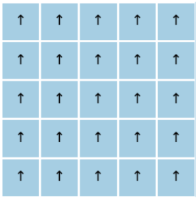

### Policy $\pi$ update 과정 시각화

$V$ 를 갱신한 뒤 $Q^\pi = R^a + \gamma P^a V_{t+1}$ 을 구하고, 상태마다 $\arg\max_a$ 자리에 1 을
넣어 정책을 만든다.

```python
v_old = np.zeros(dp_agent.ns)
### V update
#(s,) <- ((a,s) + gamma * (a,s,s') o (s,)).max(0)
v_improved = (dp_agent.R.T + dp_agent.gamma * dp_agent.P.dot(v_old)).max(axis=0)
### pi update
q_pi = (dp_agent.R.T + dp_agent.gamma * dp_agent.P.dot(v_improved)) #(a,s)
pi = np.zeros_like(dp_agent.policy) #(s,a)<- 0
pi[np.arange(q_pi.shape[1]), q_pi.argmax(axis=0)] = 1 #(s, argmax_a)<-1
ps(pi) #(s,a)
```

이것을 매 반복마다 수행하며 시각화하면, 가치가 자리를 잡는 것과 동시에 정책 화살표가 Terminal 을
향해 정렬되는 과정이 보인다.

```python
for i in range(steps):
  ### v update
  v_improved = (dp_agent.R.T + dp_agent.gamma * dp_agent.P.dot(v_old)).max(axis=0)
  v_old = v_improved
  ### pi update
  # (a,s) <- (a,s)+ gamma * (a,s,s') o ((s,))
  q_pi = (dp_agent.R.T + dp_agent.gamma * dp_agent.P.dot(v_improved))
  pi = np.zeros_like(dp_agent.policy) #(s,a)<- 0
  pi[np.arange(q_pi.shape[1]), q_pi.argmax(axis=0)] = 1 #(s, argmax_a)=1
  dp_agent.policy = pi
  ### visualize
  visualize_value_function(ax[i][0],v_improved, nx, ny)
  visualize_policy(ax[i][1], dp_agent.policy, nx, ny)
```

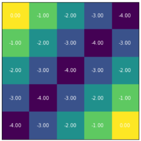

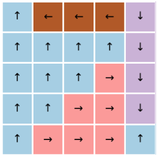

정책 반복이 "평가를 끝까지 수렴시킨 뒤 개선" 을 세 번 반복한 것과 달리, 가치 반복은 한 번의 backup
마다 greedy 정책이 따라오므로 평가와 개선의 경계가 사라진다. 결과(최적 가치 · 최적 정책)는 같다.

---

## 2.3.6 Synchronous DP 와 Asynchronous DP
<!-- 슬라이드 162 -->

가치 반복을 **어떤 순서로 update 하는가**에 따라 구현 방법론이 갈린다.

**Synchronous DP** 는 모든 가치 table 이 한 시점에 update 된다(full-sweeping). $V_t$ 전체로부터
$V_{t+1}$ 전체를 계산하므로 두 개의 table 을 관리해야 하고, state 가 커지면 — 바둑은
$|S| = 3^{19 \times 19}$ 다 — update 시간이 폭증한다.

**Asynchronous DP** 는 큰 문제에서 빠르게 수렴할 수 있는 접근이며 Deep RL 의 기반이 된다.

1. **In-place DP** : random 한 순서로, 하나의 table 만 갱신한다. 적은 memory, 빠른 수렴, 구현의 용이성.
2. **Prioritized sweeping** : 변화 $|V_t(s) - V_{t+1}(s)|$ 가 큰 $s$ 부터 update 한다. 수렴 속도 향상.
3. **Partial sweeping DP** : 전체 state 의 일부만 random 하게 update 한다(vs. full sweeping).
4. **Real-time DP** : agent 가 겪은 상황(state update)과 관련된 정보만 update 한다.

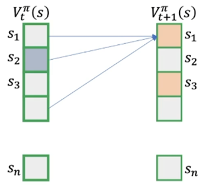

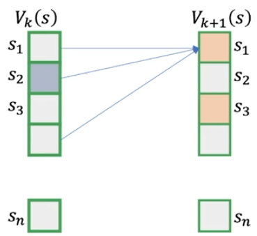

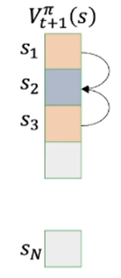

---

## 2.3.7 실습 2.3.3 — Asynchronous DP
<!-- 슬라이드 163~168 -->

> 노트북: `code/2.3.3.AsynchronousDP.ipynb`
> [](https://colab.research.google.com/github/AI-BoostCamp/ReinforcementLearning/blob/main/code/2.3.3.AsynchronousDP.ipynb)

**목적** : 비동기적 동적 계획법을 구현해 본다.

**실습 개요** — GridworldEnv 상에서 다음을 수행한다.

- In-place value iteration : 하나의 value function 으로 VI 수행
- Prioritized sweeping value iteration
- Partial sweeping value iteration

`AsyncDP` 클래스는 `TensorDP` 와 같은 뼈대에, $V$ 로부터 $Q$ 를 만드는 `compute_q_from_v()` 와
$V$ 로부터 greedy 정책을 만드는 `construct_policy_from_v()` 를 갖는다. 수렴 판정 오차는
$10^{-8}$ 로 더 엄격하게 두었다.

```python
class AsyncDP:
    @classmethod
    def add_method(cls, fun):
        setattr(cls, fun.__name__, fun)
        return fun

    def __init__(self, gamma=1.0, error_tol=1e-8):
        self.gamma = gamma
        self.error_tol = error_tol
        # Following attributes will be set after call "set_env()"
        self.env = None  # environment
        self.policy = None  # policy
        self.ns = None  # Num. states
        self.na = None  # Num. actions
        self.P = None  # Transition tensor
        self.R = None  # Reward tensor

    def set_env(self, env, policy=None):
        self.env = env
        if policy is None:
            self.policy = np.ones([env.nS, env.nA]) / env.nA
        self.ns = env.nS
        self.na = env.nA
        self.P = env.P_tensor  # Rank 3 tensor, (a,s,s')
        self.R = env.R_tensor  # Rank 2 tensor, (a,s)
        print("Asynchronous DP initialized")
        print("Environment spec:  Num. state = {} | Num. actions = {} ".format(env.nS, env.nA))

    def compute_q_from_v(self, value): # (a,s) <- (a,s)+ gamma * (a,s,s') o ((s,))
        q_pi = self.R.T + self.gamma * self.P.dot(value)
        return q_pi #(a,s)

    def construct_policy_from_v(self, value):
        qs = self.compute_q_from_v(value)  # (a,s)
        # construct greedy policy from Qs.
        pi = np.zeros_like(self.policy)    # (s,a)
        pi[np.arange(qs.shape[1]), qs.argmax(axis=0)] = 1
        return pi #(s,a)
```

```python
asyncDPagent = AsyncDP()
asyncDPagent.set_env(env)
```

### In-place value iteration — 하나의 value function 만 사용

In-place value iteration 은 **하나의 state 에 대한 value 값만** 갱신한다. 알고리즘에서 시점
첨자 $t$ 가 사라지는 것이 핵심이다.

1. $V_0^\pi(s) \leftarrow 0$
2. Repeat — 모든 상태 $s$ 를 update:
   $V_{t+1}(s) \leftarrow \max_{a \in A} \sum_{s', r} P(s'|s,a)[\, r + \gamma V_t(s') \,]$ 에서
   $t$ 를 제거하여
   $$V(s) \leftarrow \max_{a \in A} \sum_{s', r} P(s'|s,a)[\, r + \gamma V(s') \,] = \max_{a \in A}\big( R_s^a + \gamma P^a_{ss'} V(s') \big) = \max_{a \in A} Q(s,a)$$
3. Until $V_{t+1}(s) \approx V(s)$, 즉 $\Delta V \approx \epsilon$

앞 실습의 `value_iteration` 은 $V_k(s)$ 와 $V_{k+1}(s)$ 를 둘 다 유지하고 $V_{k+1}$ 을 계산할 때
$V_k$ 를 참조했다. In-place 는 $V(s)$ 하나만 유지하고 $V(s')$ 을 계산할 때 (이미 이번 sweep 에서
갱신되었을 수도 있는) 같은 table 의 $V(s)$ 를 참조한다. 이 알고리즘이 수렴한다는 사실이 매우 중요하다.

구현은 상태 loop 안에서 한 상태씩 `value[s]` 를 덮어쓴다. 임의의 순서로 갱신해도 되지만 여기서는
state index 순서로 한다. 각 state 별로 $V$ 를 계산하고 바로 update 하므로 memory 문제가 줄어들고,
모든 state 별 $\Delta V$ 를 누적해 수렴을 판정한다.

```python
@AsyncDP.add_method
def in_place_vi(self, v_init=None):
    if v_init is not None:
        value = v_init
    else:
        value = np.zeros(self.ns)

    info = dict()
    info['v'] = list()
    info['pi'] = list()
    info['gap'] = list()
    info['converge'] = False
    info['step'] = None

    steps = 0
    while True:
        # perform in-place VI
        delta_v = 0
        for s in range(self.ns): # 각각의 s에 대해서 v계산: memory 절감
            # qs(a,) <- self.R.T + self.gamma * self.P.dot(value)
            qs = self.compute_q_from_v(value)[:, s] # (a,) <- (a,s)[:,s]
            v = qs.max(axis=0)  # v <- max_a(Q)
            # v 변화량 accum
            delta_v += np.linalg.norm(value[s] - v)
            value[s] = v
        info['v'].append(value.copy())
        # v로 qs구하고, greedy improvement : policy improvement와 동일
        pi = self.construct_policy_from_v(value) #(s,a)
        info['pi'].append(pi)
        info['gap'].append(delta_v)
        print(f"iter[{steps:02d}] Delta V: {delta_v:.5f}")

        if delta_v < self.error_tol:
            if info['converge']:
                info['step'] = steps
                break
            else:
                info['converge'] = True
        else:
            steps += 1
    return info
```

```python
info_ip_vi = asyncDPagent.in_place_vi()
```

```text
iter[00] Delta V: 23.00000
iter[01] Delta V: 19.00000
iter[02] Delta V: 13.00000
iter[03] Delta V: 5.00000
iter[04] Delta V: 0.00000
iter[04] Delta V: 0.00000
```

$\Delta V$ 가 0 이 된 뒤 한 번 더 확인하고 멈춘다. 결과는 synchronous 가치 반복과 같은 최적 가치와
최적 정책이다.

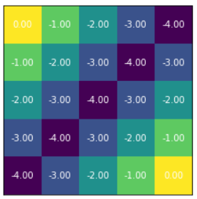

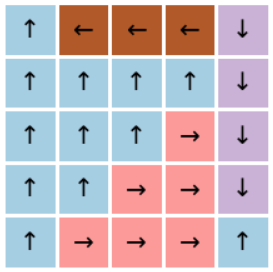

### Prioritized sweeping value iteration — update 순서를 정해서 적용

In-place VI 는 임의의 순서(환경의 상태 index 순서)로 update 했다. 순서를 잘 정하면 더 효율적일까.
**Bellman error 가 큰 것부터** — 새로 계산한 값과 현재 값의 차이가 큰 것부터 — update 하면 수렴
속도가 향상된다.

$$
V(s) \leftarrow newV(s) = \max_{a \in A} Q(s,a) = \max_{a \in A}\Big( R_s^a + \gamma \sum_{s' \in S} P^a_{ss'} V(s') \Big),
\qquad e(s) = |V(s) - newV(s)|
$$

**구현 idea** : `PriorityQueue()` 를 만들고, 그 안에 `(bellman_error, s_index)` 를 넣어 준 뒤,
queue 에서 error 가 큰 것부터 꺼내 $v$ 를 update 한다. `PriorityQueue()` 는 **값이 낮은 순서부터
리턴**하므로 $-e(s)$ 를 `put()` 해 주어야 한다.

```python
@AsyncDP.add_method
def prioritized_sweeping_vi(self, v_init=None):

    if v_init is not None:
        value = v_init
    else:
        value = np.zeros(self.ns)

    info = dict()
    info['v'] = list()
    info['pi'] = list()
    info['gap'] = list()
    info['converge'] = False
    info['step'] = None

    steps = 0
    while True:
        # compute the Bellman errors
        # e(s,) <- v(s,) - v(s',)
        bellman_errors = value - (self.R.T + self.P.dot(value)).max(axis=0)
        state_indices = range(self.ns)
        # priority queue <- (-error,s_idx)
        priority_queue = PriorityQueue()
        for bellman_error, s_idx in zip(bellman_errors, state_indices):
            priority_queue.put((-bellman_error, s_idx))
        # pi update
        pi = self.construct_policy_from_v(value)
        info['pi'].append(pi.copy())
        # error가 큰것부터 v update
        delta_v = 0
        while not priority_queue.empty():
            be, s = priority_queue.get()
            qs = self.compute_q_from_v(value)[:, s] # (a,) <- (a,s)[:,s]
            v = qs.max(axis=0)                      # newV(s)= max_aQ(a,)
            delta_v += np.linalg.norm(value[s] - v)
            value[s] = v
        info['gap'].append(delta_v)
        info['v'].append(value.copy())
        print(f"iter[{steps:02d}] Delta V: {delta_v:.5f}")
        if delta_v < self.error_tol:
            if info['converge']:
                info['step'] = steps
                break
            else:
                info['converge'] = True
        else:
            steps += 1
    return info
```

```python
info_ps_vi = asyncDPagent.prioritized_sweeping_vi()
```

```text
iter[00] Delta V: 23.00000
iter[01] Delta V: 19.00000
iter[02] Delta V: 13.00000
iter[03] Delta V: 5.00000
iter[04] Delta V: 0.00000
iter[04] Delta V: 0.00000
```

이 작은 Gridworld 에서는 반복 횟수가 In-place 와 같다. 결과 가치와 정책도 같다.

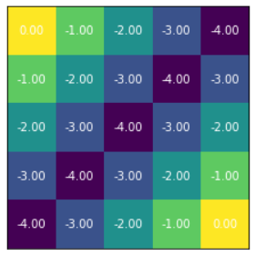

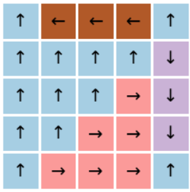

### Partial sweeping DP — 전체 state 의 일부만 update

**Full sweeping** 은 지금까지의 Asynchronous DP 처럼 매 value iteration 마다 모든 $v(s)$ 및
$v(s,a)$ 를 update 하는 것이다. state 가 늘어나면 상당히 비현실적이다 — 전체를 처리하기 위해
많은 수의 샘플이 필요하다.

**Partial sweeping** 은 value iteration 마다 모든 $v(s)$ 를 update 하지 않아도 수렴할 수 있다는
성질을 쓴다. 모든 $v(s)$ 를 업데이트하지 않아도 비동기적 가치 반복 알고리즘은 수렴한다. 단,
**모든 value iteration update 동안에 모든 $v(s)$ 가 (언젠가는) 업데이트되어야** 한다.

**구현 및 실험** — In-place VI 에 두 인수를 더한다.

- `update_prob` : value iteration 동안 state update 를 적용할 확률.
- `vi_iters` : 몇 번의 value iteration 을 수행할지.

상태 loop 안에서 `np.random.binomial(size=1, n=1, p=update_prob)` 로 동전을 던져, 실패한 상태는
이번 sweep 에서 건너뛴다.

```python
@AsyncDP.add_method
def in_place_vi_partial_update(self,
                                v_init=None,
                                update_prob=0.5,
                                vi_iters: int = 100):

    if v_init is not None:
        value = v_init
    else:
        value = np.zeros(self.ns)

    info = dict()
    info['v'] = list()
    info['pi'] = list()
    info['gap'] = list()

    for steps in range(vi_iters):
        # perform in-place VI
        delta_v = 0
        for s in range(self.ns): # in_place VI(partial sweeping)
            perform_update = np.random.binomial(size=1, n=1, p=update_prob)
            if not perform_update: continue
            # qs(a,) <- self.R.T + self.gamma * self.P.dot(value)
            qs = self.compute_q_from_v(value)[:, s]
            v = qs.max(axis=0)  # v <- max_a(Q)
            # v 변화량 accum
            delta_v += np.linalg.norm(value[s] - v)
            value[s] = v
        info['gap'].append(delta_v)
        info['v'].append(value.copy())
        pi = self.construct_policy_from_v(value)
        info['pi'].append(pi)
        print(f"iter[{steps:02d}] Delta V: {delta_v:.2f}")

    return info
```

```python
info_ip_partial_vi = asyncDPagent.in_place_vi_partial_update(update_prob=0.2,
                                                             vi_iters=60)
```

```text
…
iter[10] Delta V: 4.00
iter[11] Delta V: 2.00
iter[12] Delta V: 0.00
iter[13] Delta V: 0.00
iter[14] Delta V: 1.00
iter[15] Delta V: 3.00
…
```

update 확률을 0.2 로 낮게 두었으므로 $\Delta V$ 는 단조 감소하지 않고 0 이었다가 다시 튀기도
한다 — 이번 sweep 에 뽑히지 않았던 상태가 다음 sweep 에 뽑혀 갱신되기 때문이다. 5 회마다 가치
함수를 그려 보면, 값이 채워지는 위치가 무작위로 흩어져 있다가 점차 전체가 최적 가치로 수렴하는
것을 볼 수 있다.

```python
fig, ax = plt.subplots(n_rows,n_cols, figsize=(n_cols*3, n_rows*2.5))
ax = ax.reshape(-1)
for i in range(n_figs):
    viz_i = i * viz_every
    visualize_value_function(ax[i],info_ip_partial_vi['v'][viz_i], nx, ny)
    ax[i].set_title(f"{viz_i+5} th update")
```

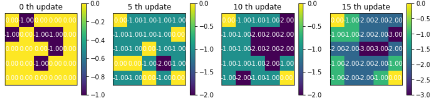

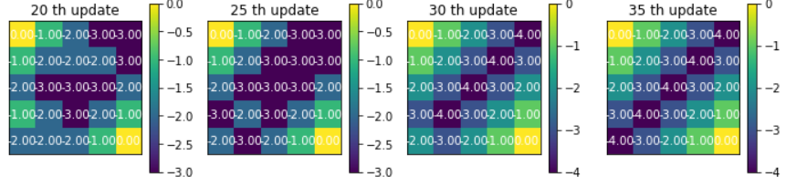

노트북의 끝에는 `in_place_vi_partial_update()` 를 수정해 iteration 횟수를 지정하지 않고 학습이
자동으로 종료되도록 바꾸는 과제가 있다. In-place VI 의 수렴 판정을 어떻게 옮겨 오면 될지 생각해 보자.

---

## 2.3.8 정리
<!-- 슬라이드 169~170 -->
<!-- 슬라이드 170 : 숨김 MEMO 슬라이드, 내용 없음 -->

동적 계획법은 **환경에 대한 정보가 주어진 MDP 문제를 푸는 방법론**이다.

- **정책 반복(Policy Iteration)** — 정책 반복 loop 안에서 정책 평가($V_s^\pi$, prediction)와
  정책 개선($Q_s^\pi$ 계산 → $\pi$ update, control)을 번갈아 수행한다.
- **가치 반복(Value Iteration)** — 벨만 최적가치 함수를 구하며 동시에 정책을 발전시킨다.
  명시적인 정책 개선 없이 greedy policy improvement 가 수행된다.
- **Asynchronous DP** — 큰 문제에서 빠르게 처리하기 위한 접근법. 1) In-place DP(full-sweeping),
  2) Prioritized sweeping, 3) Partial sweeping DP, 4) Real-time DP.

DP 의 전제 — 상태천이확률 $P$ 와 보상 $R$ 을 안다 — 가 깨지는 순간, 즉 환경을 완벽히 모를 때
어떻게 가치를 추산하는가가 다음 절(Monte-Carlo)의 주제다.
