# 2.4 Monte-Carlo Method

**학습 목표**

- 환경 모델($P$, $R$)을 모를 때 왜 DP 를 쓸 수 없고, 경험(에피소드)만으로 가치를 추산해야
  하는지 — 진정한 강화학습의 출발점 — 를 설명할 수 있다.
- Generalized Policy Iteration 의 틀에서 정책 평가(prediction)와 정책 개선(control)을 임의의
  방법으로 대체할 수 있음을 이해한다.
- First-visit · Every-visit · Incremental MC 정책 평가의 차이를 예제로 계산하고,
  $V(s) \leftarrow V(s) + \alpha (G_t - V(s))$ 의 뜻을 설명할 수 있다.
- MC 로 행동가치 $Q(s,a)$ 를 추정해 정책을 개선할 때 greedy 정책의 탐색 문제를 지적하고,
  $\epsilon$-greedy 와 GLIE 조건으로 해결할 수 있다.
- Gridworld 에서 MC 정책 평가와 MC control 을 구현하고, 결과를 DP 의 정답과 비교하여
  분산 · learning rate · $\epsilon$ scheduling 의 영향을 설명할 수 있다.

**이 절의 구성**

- 2.4.1 환경을 완벽히 모를 때 — Generalized Policy Iteration 과 Monte Carlo
- 2.4.2 First-visit 과 Every-visit MC 정책 평가
- 2.4.3 Incremental MC 정책 평가
- 2.4.4 MC 를 통한 정책 개선과 MC 평가의 정리
- 2.4.5 실습 2.4.1 — Monte Carlo policy evaluation
- 2.4.6 정책 개선 — 탐욕적 정책의 문제와 $\epsilon$-greedy
- 2.4.7 실습 2.4.2 — Monte Carlo policy improvement (MC control)
- 2.4.8 정리

---

## 2.4.1 환경을 완벽히 모를 때 — Generalized Policy Iteration 과 Monte Carlo
<!-- 슬라이드 172~173 -->

### 환경 정보를 알 때와 모를 때

환경 정보를 **완벽히 알고 있을 때**는 Dynamic Programming 으로 해결한다 — Policy iteration
(policy evaluation + policy improvement), Value iteration(Synchronous DP · Asynchronous DP:
In-place(full-sweeping) · Prioritized sweeping · Partial sweeping · Real-time). 계산을 통해 최적의
가치 함수와 정책 함수를 얻을 수 있으므로 **RL 이라 할 수 없다.**

환경 정보를 **모를 때**는 action 을 통해 가치 함수 · 정책 함수 · 환경 모델을 학습해야 한다.
이것이 **진정한 RL** 이다.

### Generalized Policy Iteration

정책 반복의 두 단계를 일반화하면 질문은 둘로 정리된다.

- 어떻게 $V_s^\pi$ 를 계산하고 **정책 평가**할 것인가? → MC, TD, … (prediction / policy evaluation)
- 어떻게 $\pi'$ 를 수정하고 **정책 개선**할 것인가? → MC, SARSA, … (control / policy improvement)

| Policy Iteration | Generalized Policy Iteration |
|---|---|
| Input : 임의의 정책 $\pi$ | Input : 임의의 정책 $\pi$ |
| Output : 개선된 정책 $\pi'$ | Output : 개선된 정책 $\pi'$ |
| 정책 평가를 통해 $V^\pi(s)$ 계산 | **임의의 방식으로** $V^\pi(s)$ 계산 |
| 정책 개선을 통해 $\pi'$ 수정 | **임의의 방식으로** $\pi'$ 수정 |

### Model free 가치 추산 방법 — MC 와 TD

환경을 모를 때 가치를 추산하는 방법은 두 갈래다.

- **MC(Monte Carlo methods)** : Non-bootstrap 방법. data(경험)만 사용한다.
- **TD(Temporal Difference methods)** : Bootstrap 방법. data 와 가치 함수를 함께 사용한다.

그 사이에 TD(λ)가 존재한다. 이 절은 MC, 다음 절은 TD 다.

### Monte Carlo methods

Monte Carlo 방법은 계산하기 어려운 값을 **수많은 시행을 통해 추산**한다. 단위 정사각형 안에
점을 무작위로 뿌리고 원점에서 거리 1 이하인 점의 비율을 세면 사분원의 넓이, 곧 $\pi/4$ 가
추정된다.

$$
\frac{\pi R^2}{4} = \frac{\text{원의 넓이}}{4} \approx \frac{\text{거리가 1 이하인 점}}{\text{모든 점}}
$$


**MC 를 통한 $V_s^\pi$ 추정 — 정책 평가(policy evaluation).** 가치 함수 $V^\pi(s)$ 는 현재 $\pi$
에서 얻을 수 있는 보상의 기댓값이다.

$$
V^\pi(s) = E_\pi[\, G_t \mid S_t = s \,], \qquad G_t \triangleq R_{t+1} + \gamma R_{t+2} + \cdots + \gamma^{T-1} R_T
$$

$G_t$ 를 여러 번 시뮬레이션하여 평균을 구하면 $V^\pi(s)$ 를 추정할 수 있다. Episode 를 여러 번
수행하고, 특정 $s$ 에 대한 $G_t$ 값의 평균을 구하는 것이다. 시행이 적으면 분산이 크다.

---

## 2.4.2 First-visit 과 Every-visit MC 정책 평가
<!-- 슬라이드 174~175 -->

한 에피소드 안에서 같은 상태를 여러 번 방문할 수 있다. 그 상태의 리턴을 **처음 방문 때만** 셀
것인가, **방문할 때마다** 셀 것인가에 따라 두 방식이 나뉜다. 다음 세 에피소드로 계산해 보자.
각 튜플은 $(s, a, r)$ 이고, $\gamma = 1$ 이다.

- Episode 1 : $(s^1, a^2, 1);\ (s^3, a^1, 5);\ (s^2, a^3, 3);\ (s^1, a^3, 10);\ (s^2, a^2, 2)$
- Episode 2 : $(s^3, a^1, 5);\ (s^3, a^2, 2);\ (s^1, a^2, 1);\ (s^2, a^3, 3);\ (s^1, a^3, 10)$
- Episode 3 : $(s^2, a^3, 3);\ (s^1, a^2, 1);\ (s^3, a^1, 5);\ (s^1, a^3, 10);\ (s^2, a^2, 2)$

### First-visit Monte Carlo policy evaluation — 최초 방문 MC 정책 평가

**최초 방문한** state 의 보상을 사용하여 $G_t$ 를 추산한다. $s^1$ 의 가치 $V^\pi(s^1)$ 은 각
에피소드에서 $s^1$ 을 처음 만난 시점 이후의 보상 합이다.

- Episode 1 : $G_1(s^1) = 1 + 5 + 3 + 10 + 2 = 21$
- Episode 2 : $G_2(s^1) = 1 + 3 + 10 = 14$
- Episode 3 : $G_3(s^1) = 1 + 5 + 10 + 2 = 18$

$$
V^\pi(s^1) = \frac{21 + 14 + 18}{3} = 17.7
$$

일반화하면

$$
V^\pi(s^1) = E_\pi[\, G_t \mid S_t = s^1 \,] \approx \frac{1}{N} \sum_{n=1}^{N} G_n^\pi(s^1), \qquad n : \text{episode}
$$

이다. 즉 return $G_t$ 를 알면 정책 평가(policy evaluation)가 가능하다.

### Every-visit Monte Carlo policy evaluation — 모든 방문 MC 정책 평가

방문한 state 의 보상을 **모두** 사용하여 $G_t$ 를 추산한다. data 수집에 유리하지만 bias 를
가진다. 같은 세 에피소드에서 $s^1$ 은 각각 두 번 나오므로 두 개의 리턴이 생긴다.

- Episode 1 : $G_1(s^1) = (1 + 5 + 3 + 10 + 2 = 21) + (10 + 2 = 12) = 33$
- Episode 2 : $G_2(s^1) = (1 + 3 + 10 = 14) + (10) = 24$
- Episode 3 : $G_3(s^1) = (1 + 5 + 10 + 2 = 18) + (10 + 2 = 12) = 30$

$$
V^\pi(s^1) = \frac{33 + 24 + 30}{6} = 14.5
$$

분모가 6 인 것은 $s^1$ 의 방문 횟수가 총 6 회이기 때문이다.

### Online 평균 기법 적용하기

Episode 가 많아야 하므로 모든 episode 의 모든 상태를 저장해야 하고, memory 문제가 발생한다.
Batch 산술평균을 **online 평균 기법**으로 바꾸면 이 문제가 풀리고, 그것이 incremental MC policy
evaluation 으로 발전한다. $x_k$ 를 $k$ 번째 방문의 $G_t$ 라 하면

$$
\mu_k = \frac{1}{k} \sum_{j=1}^{k} x_j = \mu_{k-1} + \frac{1}{k}\,(x_k - \mu_{k-1})
$$

이다(산술평균 → online 평균). 이를 가치 함수에 적용해 다시 표현하면

$$
V(s) \leftarrow V(s) + \frac{1}{k}\,\big( G_t - V(s) \big)
$$

가 된다. 모든 리턴을 저장하지 않고 **현재 추정값과 새 리턴의 차이**만으로 갱신한다.

---

## 2.4.3 Incremental MC 정책 평가
<!-- 슬라이드 176 -->

MC 정책 평가는 $V(s) \leftarrow \dfrac{G(s) = \sum G_t(s)}{N(s)}$ 였다. Incremental MC 정책
평가는 이것을 online 평균으로 바꾼 것이다.

$$
V(s) \leftarrow V(s) + \frac{1}{N(s)}\,\big( G_t(s) - V(s) \big), \qquad N(s) : s \text{ 방문 횟수}
$$

그런데 각 $s$ 에 대한 방문 횟수 $N(s)$ 를 관리하는 것도 부담이다. $\dfrac{1}{N(s)}$ 대신 **적당히
작은 값**을 써도 수렴한다는 것이 알려져 있다("A Stochastic Approximation Method").

$$
V(s) \leftarrow V(s) + \alpha\,\big( G_t(s) - V(s) \big)
$$

여기서 $\alpha$ 는 **learning rate** 에 해당하며, 민감한 hyper parameter 다. 이 형태
"현재값 + $\alpha$ × (목표 − 현재값)" 은 이후 TD · Q-Learning · DQN 까지 그대로 이어지는
강화학습 갱신식의 원형이다.

---

## 2.4.4 MC 를 통한 정책 개선과 MC 평가의 정리
<!-- 슬라이드 177~178 -->

### First-visit MC 행동가치 $Q^\pi(s,a)$ 추정

정책을 개선하려면 상태가치가 아니라 **행동가치**가 필요하다. 같은 세 에피소드에서 $s^1$ 의
행동가치 $Q^\pi(s^1, a^2)$ 를 추정하면, 각 에피소드에서 $(s^1, a^2)$ 쌍이 처음 나온 시점 이후의
보상 합이다($\gamma = 1$).

- Episode 1 : $G_1(s^1, a^2) = 1 + 5 + 3 + 10 + 2 = 21$
- Episode 2 : $G_2(s^1, a^2) = 1 + 3 + 10 = 14$
- Episode 3 : $G_3(s^1, a^2) = 1 + 5 + 10 + 2 = 18$

$$
Q^\pi(s^1, a^2) = \frac{21 + 14 + 18}{3} = 17.7
$$

Every-visit MC 행동가치 추정도, Incremental MC 행동가치 추정도 동일하게 적용된다. 이렇게 얻은
$Q^\pi(s,a)$ 를 사용해 policy improvement 를 적용하면 된다.

### MC evaluation 정리

**장점**

- 환경에 대한 정보가 필요 없다.
- 직관적이고 구현이 쉽다.
- 정확한 가치 함수 값을 얻는다(편향 없는 표본 평균).

**단점**

- Episode 가 끝나야 계산을 시작한다. 무한 길이 episode 에 적용(일정 길이까지만 적용)하면
  정확도가 낮아진다.
- DP 보다 효율이 떨어진다 — 각 상태 및 행동의 관계에 대한 고려가 없다(관계를 적용하면 계산이
  줄고 효율이 높아진다).
- 많은 시행(시뮬레이션)이 필요하고 수렴이 늦다.

---

## 2.4.5 실습 2.4.1 — Monte Carlo policy evaluation
<!-- 슬라이드 179~188 -->

> 노트북: `code/2.4.1.MC_Policy_Evaluation.ipynb`
> [](https://colab.research.google.com/github/AI-BoostCamp/ReinforcementLearning/blob/main/code/2.4.1.MC_Policy_Evaluation.ipynb)

**목적** : Monte Carlo method 를 사용해 policy evaluation 을 수행한다.

**실습 개요** — GridworldEnv 상에서 다음을 수행한다.

- `VanillaMCAgent()` : Vanilla MC evaluation
  - $V(s) \leftarrow \dfrac{G(s) = \sum G_t(s)}{N(s)}$ update
  - policy update : 행동가치 함수 $Q(s,a)$ 에 대해 $\epsilon$-greedy policy 적용
  - First-visit policy evaluation 적용해 보기
  - Every-visit policy evaluation 적용해 보기
  - 시행 횟수에 따른 policy evaluation 분산 확인하기
- `MCAgent()` : Incremental MC policy evaluation
  - $V(s) \leftarrow V(s) + \alpha (G_t - V(s))$ update
  - $\alpha$ 의 영향 확인하기

### VanillaMCAgent() — RL 의 기본 process

이 실습부터는 DP 와 달리 **Agent 가 환경과 상호작용**한다. Gym Env. 와의 interaction 은 다음
네 method 로 이루어진다.

1. Env. 생성 및 초기화 : `env.reset()`
2. 현재 상태 관측 : `env.observe()`
3. 행동 결정 : `action = mc_agent.get_action(cur_state)`
4. 행동 시행 : `next_state, reward, done, info = env.step(action)` — 다음 상태와 보상
   (`next_state`, `reward`), 종결 여부(`done`)를 얻는다.

전체 흐름을 의사코드로 쓰면 다음과 같다.

```text
Repeat :                       # episode 반복
    Env. 실행
    Repeat :                   # step 반복
        s  ← 환경으로부터 현재 상태 관측
        a  ← π(s), 정책함수에서 action 선택
        s', r ← Env(a), 환경에 '현재 행동'을 적용
        if s' == T : break
    policy evaluation : compute v(s)
```

`VanillaMCAgent` 는 상태별 리턴 합 `s_v`, 방문 횟수 `n_v`(그리고 상태-행동 쌍에 대해 `s_q`,
`n_q`)를 통계로 들고 있다가 $V = s_v / n_v$, $Q = s_q / n_q$ 로 가치를 계산한다. 생성 인자는
`gamma`(감가율), `num_states`, `num_actions`, `epsilon`($\epsilon$-greedy 에서 random action 을
고를 확률. 1.0 이면 100% random)이다. 정책에 쓰는 $Q$(`_policy_q`)는 추산 중인 `q` 와 분리해
둔다 — 정책 평가와 정책 개선을 코드에서 명확히 나누기 위해서다.

```python
class VanillaMCAgent:
    """
    V(s) <- s(s) / n(s)  : s(s)=sum(Gt(s))
    Q(s,a) <- s(s,a) / n(s,a)
    """
    def __init__(self,
                 gamma: float,
                 num_states: int,
                 num_actions: int,
                 epsilon: float):
        self.gamma = gamma
        self.num_states = num_states
        self.num_actions = num_actions
        self.epsilon = epsilon

        self._eps = 1e-10  # for stable computation of V and Q. NOT the one for e-greedy !

        # Initialize statistics
        self.s_v = None # s(s)
        self.n_v = None # n(s)
        self.s_q = None # s(s,a)
        self.n_q = None # n(s,a)

        self.reset_statistics()
        # Initialize state value function V and action value function Q
        self.v = None
        self.q = None
        self.reset_values()

        # Initialize "policy Q"
        # "policy Q" is the one used for policy generation.
        self._policy_q = None
        self.reset_policy()

    def reset_statistics(self):
        self.s_v = np.zeros(shape=self.num_states) # sum_v(Gt(s))
        self.n_v = np.zeros(shape=self.num_states) # n_v(s)
        self.s_q = np.zeros(shape=(self.num_states, self.num_actions)) #sum_q(s,a))
        self.n_q = np.zeros(shape=(self.num_states, self.num_actions)) #n_q(s,a)

    def reset_values(self):
        self.v = np.zeros(shape=self.num_states) #v(s,)
        self.q = np.zeros(shape=(self.num_states, self.num_actions)) #q(s,a)

    def reset_policy(self):
        self._policy_q = np.zeros(shape=(self.num_states, self.num_actions))

    def reset(self):
        self.reset_statistics()
        self.reset_values()
        self.reset_policy()

    def update(self, episode):
        states, actions, rewards = episode

        # reversing the inputs!
        # for efficient computation of returns
        states = reversed(states)
        actions = reversed(actions)
        rewards = reversed(rewards)

        iter = zip(states, actions, rewards)
        cum_r = 0
        for s, a, r in iter: # Every-visit MC policy evaluation
            cum_r *= self.gamma
            cum_r += r

            self.n_v[s] += 1
            self.n_q[s, a] += 1

            self.s_v[s] += cum_r
            self.s_q[s, a] += cum_r
        self.compute_values()

    def compute_values(self):
        self.v = self.s_v / (self.n_v + self._eps)
        self.q = self.s_q / (self.n_q + self._eps)

    def get_action(self, state):
        prob = np.random.uniform(0.0, 1.0, 1)
        # e-greedy policy over Q
        if prob <= self.epsilon:  # random action(policy) 비율
            action = np.random.choice(range(self.num_actions))
        else:  # greedy policy
            action = self._policy_q[state, :].argmax()
        return action

    def improve_policy(self):
        self._policy_q = self.q.copy()
        self.reset_statistics()

    def decaying_epsilon(self, factor):
        self.epsilon *= factor
```

### Interaction 실험

4×4 Gridworld 환경과 Agent 를 만든다. `epsilon=1.0` 이므로 모든 행동을 random 으로 고른다
(greedy 없음).

```python
nx, ny = 4, 4
env = GridworldEnv([ny, nx])

mc_agent = VanillaMCAgent(gamma=1.0,
                        num_states=nx * ny,
                        num_actions=4,
                        epsilon=1.0) # 1.0:모든 행동을 random으로 적용(greedy X)
```

`get_action()` 은 $\epsilon$-greedy 다. 난수가 `epsilon` 이하면 random action, 아니면
`_policy_q[state]` 의 argmax 를 고른다.

```python
    def get_action(self, state):
        prob = np.random.uniform(0.0, 1.0, 1)
        # e-greedy policy over Q
        if prob <= self.epsilon:  # random action(policy) 비율
            action = np.random.choice(range(self.num_actions))
        else:  # greedy policy
            action = self._policy_q[state, :].argmax()
        return action
```

2.2 절과 같은 interaction loop 인데, action 을 `np.random.randint` 대신 **agent 로부터 받는다**는
점만 다르다.

```python
env.reset()
step_counter = 0
while True:
    print(f"At t = {step_counter}")
    env.render()
    ##
    cur_state = env.observe()
    action = mc_agent.get_action(cur_state) # agent로 부터 action 받음
    next_state, reward, done, info = env.step(action)
    ##
    print(f"state : {cur_state}\t aciton : {action_mapper[action]}")
    print(f"reward : {reward}\t next state : {next_state}\n")
    step_counter += 1
    if done: break
```

```text
At t = 0
==========
T  o  o  o
o  o  o  o
o  o  x  o
o  o  o  T
==========
state : 10       aciton : UP
reward : -1.0    next state : 6

At t = 1
==========
T  o  o  o
o  o  x  o
o  o  o  o
o  o  o  T
==========
state : 6        aciton : RIGHT
reward : -1.0    next state : 7
…
```

### Episode 시행 / Agent update — run_episode()

한 에피소드를 끝까지 돌리며 `(states, actions, rewards)` trajectory 를 저장하고, 에피소드가
**끝난 뒤 한 번** `agent.update(episode)` 를 호출한다. MC 는 리턴 $G_t$ 를 알아야 하므로 에피소드
종료 전에는 갱신할 수 없다. `timeout` 을 넘겨 Terminal 에 닿지 못한 에피소드는 리턴이 정의되지
않으므로 갱신에서 제외한다.

```python
def run_episode(env, agent, timeout=200):
    env.reset()   # s <- random state
    states = []   # trajectory 보관
    actions = []
    rewards = []

    i = 0
    timeouted = False
    while True:    # Terminal 나올때 까지
        state = env.s
        action = agent.get_action(state)
        next_state, reward, done, info = env.step(action)
        # trajectory 저장
        states.append(state)
        actions.append(action)
        rewards.append(reward)

        if done: break
        i += 1
        if i > timeout:
            timeouted = True
            break

    if not timeouted: # agent update
        episode = (states, actions, rewards)
        agent.update(episode)  # every-visit Monte-carlo evaluation
```

에피소드를 10 번 반복해 $V(s)$, $Q(s,a)$ 를 update 한다.

```python
mc_agent.reset_statistics() # v(s,),n_v(s,) q(s,a), n_q(s,a) <- 0
for _ in range(10):
    run_episode(env, mc_agent)
```

### agent.update() — Every-visit Monte-Carlo policy evaluation

`update()` 는 trajectory 를 **뒤에서부터** 훑는다. 마지막 step 부터 거꾸로 가면
$G = R + \gamma G'$ 한 줄로 모든 시점의 리턴을 효율적으로 계산할 수 있기 때문이다
($G_t \triangleq R_{t+1} + \gamma R_{t+2} + \cdots + \gamma^{T-1} R_T$). 방문할 때마다 `n_v[s]`,
`n_q[s,a]` 를 1 씩 늘리고 `s_v[s]`, `s_q[s,a]` 에 현재까지의 $G$ 를 더하므로 **Every-visit** 이다.
마지막에 `compute_values()` 가 $V(s) \leftarrow \sum G_t(s) / N(s)$ 를 계산한다.

```python
    def update(self, episode):
        states, actions, rewards = episode
        # 마지막 부터 역으로 계산(효율 향상)
        states = reversed(states)
        actions = reversed(actions)
        rewards = reversed(rewards)

        iter = zip(states, actions, rewards)
        cum_r = 0
        for s, a, r in iter:
            cum_r *= self.gamma #
            cum_r += r          # G = R + gamma*G'
            # s 방문 회수 update
            self.n_v[s] += 1
            self.n_q[s, a] += 1
            # s_v(s),s_q(s,a)에 G update
            self.s_v[s] += cum_r    # 현재까지의 G add
            self.s_q[s, a] += cum_r #
        self.compute_values()       # v(s),q(s,a)update

    def compute_values(self):
        self.v = self.s_v / (self.n_v + self._eps)
        self.q = self.s_q / (self.n_q + self._eps)
```

### $V(s)$, $Q(s,a)$ 확인 — DP evaluation 과 성능 비교

10 에피소드 뒤의 `mc_agent.v` 와 `mc_agent.q` 를 찍어 보면 Terminal 두 곳만 0 이고 나머지는 음수다.

```python
mc_agent.v #v(s)
```

```text
array([  0.        ,  -9.58823529, -12.81818182, -18.3125    ,
       -20.07692308, -16.17647059, -22.54545455, -15.44444444,
       -21.76470588, -17.66666667, -16.        , -17.33333333,
       -33.47058824, -31.63636364, -16.5       ,   0.        ])
```

정답은 2.3 절의 DP 다. `lib/tensorized_dp.py` 의 `TensorDP` 로 같은 random policy 를 정책 평가해
나란히 그린다.

```python
from tensorized_dp import TensorDP

dp_agent = TensorDP()
dp_agent.set_env(env)
# Random policy에 대한 evaluation 결과 얻어 오기
v_pi = dp_agent.policy_evaluation()

fig, ax = plt.subplots(1,2, figsize=(8,3))
visualize_value_function(ax[0], mc_agent.v, nx, ny)
_ = ax[0].set_title("Monte-carlo Policy evaluation")

visualize_value_function(ax[1], v_pi, nx, ny)
_ = ax[1].set_title("Dynamic programming Policy evaluation")
```

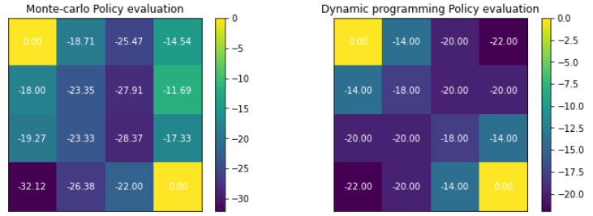

10 에피소드로는 값이 크게 흔들린다. 표본이 적을 때 MC 추정의 분산이 크다는 것이 그대로 보인다.

### Episode 를 늘려 성능 확인

`run_episodes()` 는 `total_eps` 번 시행하면서 `log_every` 간격으로 $V$ 를 저장한다.

```python
## total_eps 시행, log_every간견으로 log 저장
def run_episodes(env, agent, total_eps, log_every):
    mc_values = []
    log_iters = []
    agent.reset_statistics() # v(s,),n_v(s,) q(s,a), n_q(s,a) <- 0
    for i in range(total_eps+1):
        run_episode(env, agent)
        if i % log_every == 0:
            mc_values.append(agent.v.copy())
            log_iters.append(i)
    info = dict()
    info['values'] = mc_values
    info['iters'] = log_iters
    return info
```

```python
total_eps = 2000
log_every = 500
## [0, 500, 1000, 1500, 2000]에서 log 저장
info = run_episodes(env, mc_agent, total_eps, log_every)
```

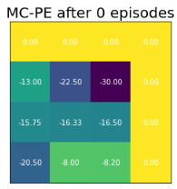

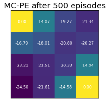

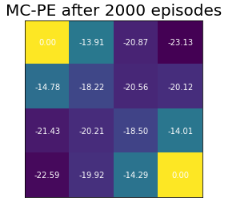

### Monte-Carlo policy evaluation 의 분산 확인 — 정답인 DP 의 결과와 비교

3000 episode 를 10 번 반복(reps)하며 30 에피소드마다 log 를 저장한다. 그런 다음 DP 의 $v(s)$ 와
MC 의 $v(s)$ 16 개 값의 차이(norm)를 구해 반복 간 평균과 분산을 계산한다.

```python
reps = 10
values_over_runs = []
total_eps = 3000
log_every = 30

for i in range(reps): # 3000 epi x 10 reps
    print(f"start to run {i}th experiment ... ")
    info = run_episodes(env, mc_agent, total_eps, log_every)
    values_over_runs.append(info['values']) #(logs,v(s,))

values_over_runs = np.stack(values_over_runs) #(reps,logs,s):(10,101,16)
```

```python
## v_pi = dp_agent.policy_evaluation() #dp로 얻은 정답
v_pi_expanded = np.expand_dims(v_pi, axis=(0,1)) #(1,1,16)

errors = np.linalg.norm(values_over_runs - v_pi_expanded, axis=-1)
error_mean = np.mean(errors, axis=0)
error_std = np.std(errors, axis=0)
```

```python
fig, ax = plt.subplots(1,1, figsize=(8,4))
ax.grid()
ax.fill_between(x=info['iters'],
                y1=error_mean + error_std,
                y2=error_mean - error_std,
                label='mean+-err_std',
                alpha=0.3)
ax.plot(info['iters'], error_mean, '-', label='mean error')
ax.plot(info['iters'], error_std*10,'--', label="error_std*10",linewidth=1)

ax.legend()
_ = ax.set_xlabel('episodes')
_ = ax.set_ylabel('Errors')
```

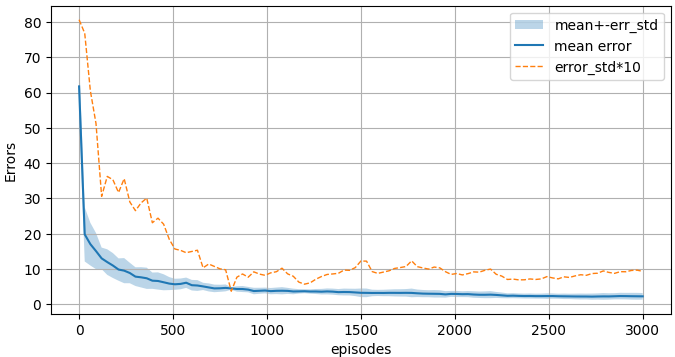

오차의 평균도 분산도 에피소드가 쌓일수록 줄어들지만, 초기의 감소가 급하고 그 뒤로는 완만하다 —
MC 의 "많은 시행이 필요하고 수렴이 늦다"는 단점이 곡선으로 보인다.

### MCAgent() — Incremental MC policy evaluation

state 방문 횟수를 제거하고 learning rate 로 대치한다.

$$
V(s) \leftarrow V(s) + \alpha\,\big( G_t(s) - V(s) \big), \qquad \alpha : \text{learning rate} \leftarrow \frac{1}{N(s)}
$$

`VanillaMCAgent` 를 상속받아 `update()` 만 수정한다. statistics(`s_v`, `n_v`) 없이 `v`, `q` 를
바로 update 하므로 코드가 더 짧다.

```python
## VanillaMCAgent 상속 받아서 updata만 수정 ##
class MCAgent(VanillaMCAgent):
    """
    lr 적용
    V(s) <- V(s) + lr * (Gt - V(s))
    Q(s,a) <- Q(s,a) + lr * (Gt - Q(s,a))
    """
    def __init__(self,
                 gamma: float,
                 num_states: int,
                 num_actions: int,
                 epsilon: float,
                 lr: float):
        super(MCAgent, self).__init__(gamma=gamma,
                                      num_states=num_states,
                                      num_actions=num_actions,
                                      epsilon=epsilon)
        self.lr = lr

    def update(self, episode):
        states, actions, rewards = episode

        states = reversed(states) # reversing the inputs!
        actions = reversed(actions)
        rewards = reversed(rewards)

        iter = zip(states, actions, rewards)
        cum_r = 0
        for s, a, r in iter: # epi.에 있는 v,q update
            cum_r *= self.gamma
            cum_r += r
            # v(s)<- V(s) + alpha * (Gt - v(s))
            self.v[s] += self.lr * (cum_r - self.v[s])
            # q(s,a)<- alpha * (Gt - q(s,a))
            self.q[s, a] += self.lr * (cum_r - self.q[s, a])
```

```python
inc_mc_agent = MCAgent(gamma=1.0,
                       lr=1e-3,
                       num_states=nx * ny,
                       num_actions=4,
                       epsilon=1.0)

for _ in range(2000):
    run_episode(env, inc_mc_agent)
```

### 2000 epi. 시행 후 비교

```python
fig, ax = plt.subplots(1,3, figsize=(12,3))
visualize_value_function(ax[0], mc_agent.v, nx, ny)
_ = ax[0].set_title("Vanilla_MC Policy evaluation")

visualize_value_function(ax[1], inc_mc_agent.v, nx, ny)
_ = ax[1].set_title("Inc_MC Policy evaluation")

visualize_value_function(ax[2], v_pi, nx, ny)
_ = ax[2].set_title("DP Policy evaluation")
```

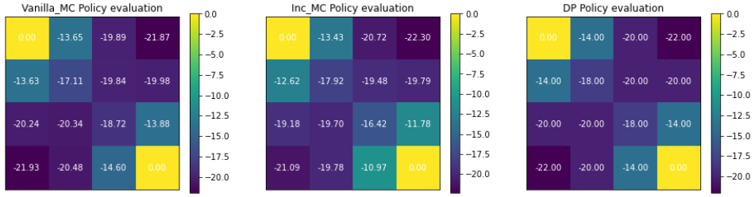

### Learning rate 변화에 따른 학습 비교

같은 2000 에피소드를 $\alpha = 1.0,\ 0.01,\ 0.001$ 로 각각 학습한다.

```python
def run_mc_agent_with_lr(agent, env):
    lr_list = [1.0,0.01,0.001]
    mc_v = []
    for i in range(len(lr_list)):
        agent.reset()
        agent.lr = lr_list[i]
        for _ in range(2000):
            run_episode(env, agent)
        mc_v.append(agent.v)

    fig, ax = plt.subplots(1,3, figsize=(12,3))
    visualize_value_function(ax[0], mc_v[0], nx, ny)
    _ = ax[0].set_title(f"Inc. MC(lr={lr_list[0]})")
    visualize_value_function(ax[1], mc_v[1], nx, ny)
    _ = ax[1].set_title(f"Inc. MC(lr={lr_list[1]})")
    visualize_value_function(ax[2], mc_v[2], nx, ny)
    _ = ax[2].set_title(f"Inc. MC(lr={lr_list[2]})")

run_mc_agent_with_lr(inc_mc_agent,env)
```

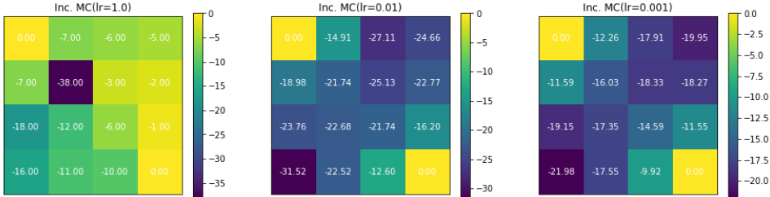

$\alpha = 1$ 이면 $V(s) \leftarrow G_t$ 가 되어 **가장 최근 리턴 하나**만 기억한다 — 평균이 아니다.
$\alpha$ 가 너무 크면 추정이 요동치고, 적당히 작아야 여러 리턴의 평균 역할을 한다. 그래서
$\alpha$ 가 민감한 hyper parameter 다.

---

## 2.4.6 정책 개선 — 탐욕적 정책의 문제와 $\epsilon$-greedy
<!-- 슬라이드 189 -->

### 탐욕적 정책 개선(greedy policy improvement)의 문제점

**Exploration(탐험) vs. Exploitation(안주)** 문제다. 상태 $s_0$ 에서 두 행동의 보상이 다음 분포를
따른다고 하자.

- $Q(s_0, a_0) = R \sim N(1, 2)$
- $Q(s_0, a_1) = R \sim N(5, 1)$

$a_1$ 이 평균적으로 훨씬 좋다. 그런데 greedy 정책 개선을 사용하고, 초기 episode 에서 우연히
$a_0$ 에서 좋은 $R$ 을 받았다면 $\pi(s_0, a_0) = 1$ 이 되어 다시는 $a_1$ 을 시도하지 않게 되고
최적해를 찾을 수 없게 된다.

### $\epsilon$-greedy policy

$\epsilon$ 을 random 비율로 두고, 그 확률만큼은 무작위로 행동한다.

$$
\pi(a|s) = \begin{cases}
(1 - \epsilon) + \epsilon / |A|, & \text{if } a = \arg\max_{a \in A} Q_k(s,a) \\
\epsilon / |A|, & \text{otherwise}
\end{cases}
\qquad |A| : \text{Cardinality, 가능한 action 의 수}
$$

간단하지만 매우 잘 작동한다. 그러나 문제점이 있다. **$\epsilon$-greedy policy 를 사용하면 최적
정책을 찾을 수 있다? — 아니다.** 항상 $\epsilon$ 의 확률로 좋지 않은 action 을 취하게 되므로 정책
개선에는 도움이 되지만, 그 자체가 최적 정책이 될 수는 없다.

**해결책** — 초기에 $\epsilon$ 을 크게, 점차 줄여서 $\epsilon \to 0$ 으로 scheduling 한다. 단
**GLIE(Greedy in the Limit of infinite Exploration)** 조건이 필요하다 — 모든 $N(s,a)$ 횟수가
$\infty$ 로 가야 한다. GLIE 조건에서 최적해를 찾는 것이 증명되어 있다. 예: $\epsilon_k = 1/k$,
$k$ = episode index.

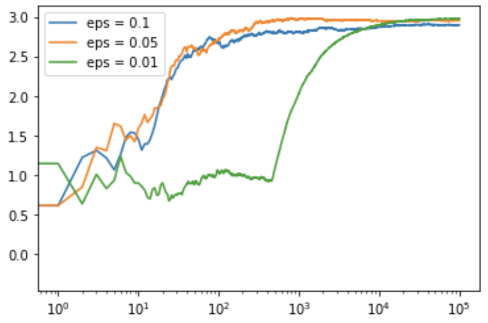

---

## 2.4.7 실습 2.4.2 — Monte Carlo policy improvement (MC control)
<!-- 슬라이드 190~194 -->

> 노트북: `code/2.4.2.MC_control.ipynb`
> [](https://colab.research.google.com/github/AI-BoostCamp/ReinforcementLearning/blob/main/code/2.4.2.MC_control.ipynb)

**목적** : Monte Carlo method 로 최적 정책을 찾는다.

**실습 개요** — GridworldEnv 상에서 다음을 수행한다.

- Incremental MC Agent 를 준비한다.
- Episode 반복 : 각 episode 종료 시점에 아래를 실행한다.
  - Policy evaluation : $V(s) \leftarrow V(s) + \alpha (G_t - V(s))$ update
  - Action value evaluation : $Q(s,a) \leftarrow Q(s,a) + \alpha (G(s,a) - Q(s,a))$ update
- Greedy Policy Improvement 실행 — policy 변화 확인
- $\epsilon$-greedy policy Improvement 실행 — 변화에 따른 학습 성능 확인
  - $\epsilon = 1$ : greedy policy = random policy
  - $\epsilon = [0.9, 0.9, 0.1, 0.1, 0.1, 0]$ scheduling
  - $\epsilon = 0.001$

### Incremental MC Agent 준비

앞 실습의 `MCAgent` 를 `lib/monte_carlo.py` 에서 가져와 쓴다. $\alpha = 10^{-3}$, $\epsilon = 1.0$
(100% random policy)으로 시작한다.

```python
import monte_carlo as mc

mc_agent = mc.MCAgent(gamma=1.0,  # Incremental MC policy evaluation
                   lr=1e-3,       # alpha
                   num_states=nx * ny,
                   num_actions=4,
                   epsilon=1.0)   # epsilon=1.0 : 100% random policy
```

### run_episode() 수정

에피소드가 끝나지 않는 경우를 대비해 `timeout`(1000 step)으로 강제 종료하고, timeout 된 에피소드는
추산에서 제외한다.

```python
def run_episode(env, agent, timeout=1000):
    env.reset()  # s <- random state
    states = []
    actions = []
    rewards = []
    i = done = 0
    while not(done or i>timeout): #episode가 끝나지 않는 경우 강제 종료
        state = env.s
        action = agent.get_action(state)
        next_state, reward, done, info = env.step(action)
        states.append(state)
        actions.append(action)
        rewards.append(reward)
        i += 1
    if done: # timeout은 epi.가 끝나지 않아 추산에서 제외
        episode = (states, actions, rewards)
        agent.update(episode) # Incremental MC policy evaluation: v(s),q(s,a) update
```

```python
for _ in range(5000):
    run_episode(env, mc_agent)
```

### Improvement Policy — greedy improvement policy

명시적으로 policy improvement 를 수행하기 위해 $q$ 를 분리했다. `get_action()` 은
`self._policy_q` 에서 action 을 얻고, `improve_policy()` 는 추산 중인 `q` 를 `_policy_q` 로 복사한다.
일반적으로는 최신 $Q(s,a)$ 를 바로 정책에 쓰지만, 여기서는 정책 평가와 정책 개선을 코드에서
명확히 구분하기 위해 이렇게 나눴다.

```python
class VanillaMCAgent:
    def get_action(self, state):
        prob = np.random.uniform(0.0, 1.0, 1)
        if prob <= self.epsilon:  # random action(policy) 비율
            action = np.random.choice(range(self.num_actions))
        else:  # greedy policy
            action = self._policy_q[state, :].argmax()
        return action
    def improve_policy(self):
        self._policy_q = self.q.copy()
```

5000 에피소드 동안 정책 평가만 수행했으므로 아직 정책 개선은 이루어지지 않았다. `_policy_q` 는
0 으로 차 있고 `get_action` 은 random policy 만 적용하고 있다. 명시적으로 정책 개선을 수행하면
`_policy_q` 가 추산된 $Q$ 로 바뀐다.

```python
mc_agent._policy_q # 개선되지 않은 Q(s,a)
## get_action(): action = self._policy_q[state, :].argmax() 이므로
## _policy_q table을 update하는 것이 policy update임
mc_agent.improve_policy() # self._policy_q = self.q.copy()
mc_agent._policy_q # policy로 사용되는 Q(s,a)
```

### $V(s)$, $Q(s,a)$ 확인하기

추산된 $Q(s,a)$ 를 표로 만들어 상태마다 최댓값을 강조해 본다(`Q(s,a).T`, 행 = up/right/down/left,
열 = 상태 0~15). Terminal(0, 15)은 모두 0 이고, 각 상태에서 노란 칸이 greedy 정책이 고를 행동이다.

```python
def highlight_max(s):
    # highlight the maximum in a Series green.
    is_max = s == s.max()
    return ['background-color: yellow' if v else '' for v in is_max]

def visualize_q(q):
    df = pd.DataFrame(q, columns=['up', 'right', 'down', 'left']).T
    df = df.style.apply(highlight_max)
    return df

visualize_q(mc_agent.q)
```

상태가치와 greedy policy 를 시각화한다. 시각화한 policy 는 greedy policy(max 선택)를 적용했을 때의
결과다.

```python
fig, ax = plt.subplots(1,2, figsize=(8,3))
visualize_value_function(ax[0], mc_agent.v, nx, ny)
_ = ax[0].set_title("Value pi")
visualize_policy(ax[1], mc_agent.q, nx, ny)
_ = ax[1].set_title("Greedy policy")
```

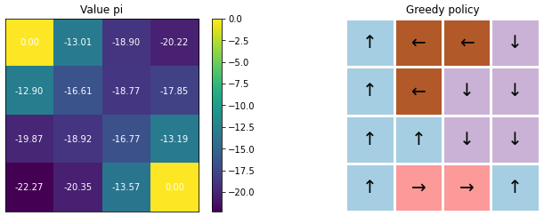

### $\epsilon$-greedy policy Improvement

`epsilon` 을 조금씩 줄이면서 최적 정책 함수 · 최적 상태가치 함수 · 최적 행동가치 함수를 찾아
본다. `decaying_epsilon(factor)` 는 $\epsilon \leftarrow \epsilon \times$ factor 다.
`decaying_epsilon_and_run()` 은 통계를 초기화하고 $\epsilon$ 을 감쇠시킨 뒤 `n_runs` 에피소드를
돌리고, 마지막에 한 번 정책을 개선해 결과를 그린다.

```python
def decaying_epsilon_and_run(agent, env,
                             decaying_factor:float,
                             n_runs:int = 5000):
    agent.reset_statistics()
    agent.decaying_epsilon(decaying_factor)
    print(f"epsilon : {agent.epsilon:0.6f}")

    for _ in range(n_runs):
        # 한번의 episode, agent.update(episode): v(s),q(s,a)update(Incremental MC)
        run_episode(env, agent)
    agent.improve_policy()

    fig, ax = plt.subplots(1,2, figsize=(8,3))
    visualize_value_function(ax[0], agent.v, nx, ny)
    _ = ax[0].set_title("Value pi")
    visualize_policy(ax[1], agent._policy_q, nx, ny)
    _ = ax[1].set_title("Greedy policy")
```

`factors` 를 다섯 단계로 주어 $\epsilon$ scheduling 을 실험한다. 각 단계는 5000 에피소드, 총
25000 에피소드다.

```python
mc_agent.epsilon= 1.0
mc_agent.reset() # v,q,_policy_q <- 0

### epsilon = epsilon * factor
factors = [1.0,1.0,1.0,1.0,1.0]  # case 1 : epsilon 유지
#factors = [0.5,1.0,1.0,1.0,1.0]  # case 2
#factors = [0.9,0.9,0.9,0.9,0.9]  # case 3
#factors = [0.9,0.9,0.1,0.1,0.1]  # case 4

for i,_ in enumerate(factors):
  decaying_epsilon_and_run(mc_agent, env, factors[i], n_runs=5000)
```

### $\epsilon$ scheduling 효과 — DP 로 찾은 정답과 비교

네 가지 스케줄의 $V(s)$ 를 DP 로 찾은 정답과 비교한다.

- `factors = [1.0, 1.0, 1.0, 1.0, 1.0]` : $\epsilon = 1.0$ 유지, 25000 epi.
- `factors = [0.5, 1.0, 1.0, 1.0, 1.0]` : $\epsilon = 0.5$ 유지
- `factors = [0.9, 0.9, 0.9, 0.9, 0.9]` : $\epsilon = [0.9, 0.81, 0.73, 0.65, 0.59]$
- `factors = [0.9, 0.9, 0.1, 0.1, 0.1]` : $\epsilon = [0.9, 0.81, 0.081, 0.0081, 0.00081]$

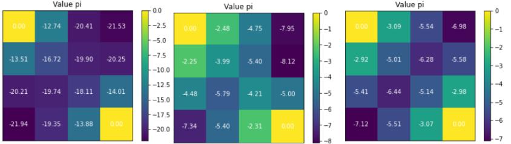

![factors=[0.9,0.9,0.1,0.1,0.1] 로 ε 을 빠르게 줄인 결과의 Value pi. −1.34, −3.21, −6.81 … 로 최적 가치(−1, −2, −3)에 근접하지만 아직 정확하지는 않다.](images/s193_02.png)

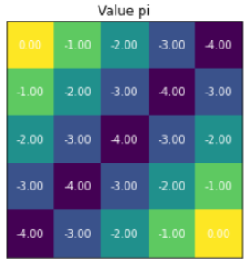

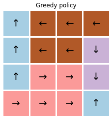

$\epsilon$ 을 유지하면 정책은 random 이므로 $V$ 도 random policy 의 가치에 머문다. $\epsilon$ 을
줄이면 greedy 행동의 비중이 커져 $V$ 가 최적 가치에 접근한다. 한편 **greedy policy 자체는 빠르게
최적화된다** — 가치가 부정확해도 상태 간 상대적 크기만 맞으면 argmax 는 이미 정답이기 때문이다.

### 최적 정책 함수를 고정하고 정책 평가만 반복하기

앞의 greedy policy 를 보면 학습 초기에 이미 최적 정책 함수는 찾았다. 그렇다면 정책 개선을 하지
않은 상태에서 정책 평가만 반복하여 최적 상태가치 함수 · 최적 행동가치 함수를 찾을 수 있는지 확인해
본다.

1) 먼저 random policy 에서 MC policy evaluation 으로 최적 정책 함수를 찾아 놓는다.

```python
mc_agent.epsilon= 1.0
mc_agent.reset()
# 마지막에 한번 정책개선 수행
decaying_epsilon_and_run(mc_agent, env, decaying_factor=1, n_runs=5000)
```

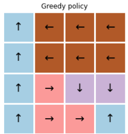

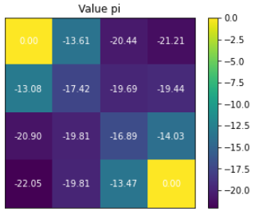

2) 최적 정책을 찾았으니 정책 개선 없이 정책 평가를 반복한다. `decaying_factor=0.0` 으로 random
policy 확률을 0% 로 만든다. random policy 가 적용되지 않으면 에피소드가 짧아져 시행 시간도
단축된다(5000 에피소드에 0.3 초). 정책 개선은 마지막에 한 번만 수행된다.

```python
# decaying_factor=0.0 으로 하여 random policy 확률 0%
# random ploicy가 적용되지 않으면 episode가 짧아짐(시행시간 단축)
# 정책개선은 마지막에 한번만 수행됨
decaying_epsilon_and_run(mc_agent, env, decaying_factor=0.0, n_runs=5000)
decaying_epsilon_and_run(mc_agent, env, decaying_factor=0.0, n_runs=100000)
```

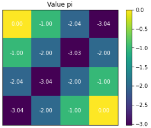

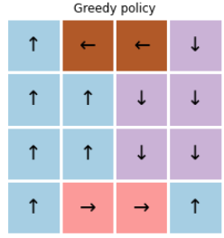

### 성급한 decaying — $\epsilon$ 을 너무 빠르게 줄이면

$\epsilon$-decay 에는 적당한 schedule 이 필수다. 그렇지 못하면 최적 정책을 찾지 못하게 된다.

```python
mc_agent.epsilon= 1.0
mc_agent.reset()
factors = [0.5, 0.1, 0.1, 0.0, 0.0]

for i,_ in enumerate(factors):
  decaying_epsilon_and_run(mc_agent, env, factors[i],n_runs=5000)
```

$\epsilon$ 이 $0.5 \to 0.05 \to 0.005 \to 0 \to 0$ 으로 급히 떨어지면, 아직 충분히 방문하지 못한
상태-행동 쌍의 $Q$ 가 잘못된 채 굳어 버린다. GLIE 조건 — 모든 $(s,a)$ 를 무한히 방문 — 이 깨지는
것이다. 직접 실행해 greedy policy 가 어디에서 어긋나는지 확인해 보자.

---

## 2.4.8 정리
<!-- 이 절의 요약. 원문에 별도의 review 슬라이드는 없다 -->

- 환경 모델을 모르면 DP 를 쓸 수 없다. **경험(에피소드)의 리턴을 평균**해 가치를 추산하는 것이
  Monte-Carlo 방법이며, Generalized Policy Iteration 의 틀에서 정책 평가와 정책 개선을 MC 로
  대체한다.
- **First-visit** 은 상태를 처음 방문한 시점의 리턴만, **Every-visit** 은 모든 방문의 리턴을 쓴다.
  **Incremental MC** 는 $V(s) \leftarrow V(s) + \alpha (G_t - V(s))$ 로 저장 없이 갱신한다.
  $\alpha$ 는 민감한 hyper parameter 다.
- MC 는 환경 정보가 필요 없고 편향이 없지만, 에피소드가 끝나야 갱신할 수 있고 분산이 크며
  수렴이 늦다.
- 정책 개선에 greedy 만 쓰면 탐색이 멈춘다. **$\epsilon$-greedy** 로 탐색을 유지하되, GLIE 조건
  아래 $\epsilon \to 0$ 으로 scheduling 해야 최적 정책에 이른다. 너무 빨리 줄이면 실패한다.
- 다음 절의 TD 는 에피소드가 끝나기를 기다리지 않고, 다음 상태의 가치 추정값(bootstrap)으로
  즉시 갱신한다.
