# 2.5 Temporal-Difference Method

**학습 목표**

- DP · MC · TD 세 방법을 "환경 모델이 필요한가", "에피소드가 끝나야 하는가", "bootstrap 을
  쓰는가" 의 축으로 비교할 수 있다.
- TD(0) 의 TD target $R_{t+1} + \gamma V(S_{t+1})$ 과 TD error $\delta_t$ 를 정의하고,
  MC 의 리턴 $G_t$ 와 어떻게 다른지 설명할 수 있다.
- n-step TD 와 TD(λ)가 1-step TD 와 MC 사이를 어떻게 잇는지, 그리고 $\lambda$ 가 몇 step 까지
  반영하는지를 계산할 수 있다.
- TD 는 MC 보다 분산이 작고 편향이 크다는 특성을 실험(오차 곡선)으로 확인하고, 그 이유를
  설명할 수 있다.
- Gridworld 에서 1-step TD 와 n-step TD 정책 평가를 구현하고, 에피소드 끝의 dummy state
  처리를 이해한다.

**이 절의 구성**

- 2.5.1 TD evaluation 개요 — DP · MC · TD 의 장단점
- 2.5.2 TD(0) — TD target 과 TD error, 그리고 n-step TD
- 2.5.3 TD(λ) — 여러 step 의 TD 를 가중 평균하기
- 2.5.4 TD 정책 평가의 특성
- 2.5.5 실습 2.5.1 — Temporal-Difference policy evaluation
- 2.5.6 정리

---

## 2.5.1 TD evaluation 개요 — DP · MC · TD 의 장단점
<!-- 슬라이드 196 -->

세 방법을 나란히 놓고 비교하면 TD 가 왜 필요한지 분명해진다.

**Dynamic Programming 의 장단점.** 장점은 현재 정보를 사용하여 모르는 값을 추정한다는 것이다 —
각 상태와 행동의 관계를 최대한 활용하므로 계산량이 줄고, 각 step 에서 학습이 가능해 episode
길이와 무관하다. 단점은 환경에 대한 모델 정보를 필요로 한다는 것이다.

**Monte Carlo policy evaluation 의 장단점.** 장점은 환경에 대한 사전 정보(선험적 지식)가 필요
없다는 것이다 — 많은 시행을 통해 (이론적으로) 정확한 값을 계산할 수 있다. 단점은 각 상태와
행동에 대한 정보를 활용할 수 없다는 것 — Episode 가 끝나야 학습하므로 episode 가 긴 경우 불리하다.

**Temporal Difference policy evaluation 의 장단점.** 장점은 두 방법의 장점을 합친 것이다 —
현재의 정보를 사용하여 모르는 값을 추정하고, 각 상태와 행동의 관계를 최대한 활용하여 계산량을
줄이며, 환경에 대한 사전 정보가 필요 없고, Episode 끝까지 기다리지 않는다. 단점은 추산 오차가
발생할 수 있다는 것 — unbiased estimate(불편 추정량)가 아니다. 즉 bias 가 발생한다.

> **핵심 메시지**
> TD 는 **환경 모델 없이(MC 처럼), 에피소드가 끝나기 전에(DP 처럼)** 갱신한다. 그 대가로 편향이
> 생긴다. TD 가 **Q-learning 의 기반**이다.

아래 세 백업 다이어그램은 각 방법이 $V(S_t)$ 를 갱신할 때 어느 범위의 정보를 쓰는지 보여 준다.

![Dynamic Programming 의 백업 다이어그램. V(S_t) ← E_π[R_{t+1} + γV(S_{t+1})]. 상태 S_t 에서 가능한 모든 행동과 모든 다음 상태 S_{t+1} 이 한 층 전체(붉은 영역)로 칠해져 있다 — 한 step 깊이의 전체 폭.](images/s196_01.png)

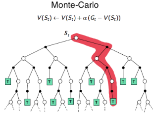

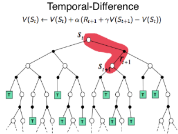

---

## 2.5.2 TD(0) — TD target 과 TD error, 그리고 n-step TD
<!-- 슬라이드 197 -->

Incremental MC policy evaluation 의 갱신식은 다음과 같았다.

$$
V(s) \leftarrow V(s) + \alpha\,\big( G_t - V(s) \big)
$$

TD 는 이 식의 **$G_t$ 자리를 바꾼다.**

### TD(0) — 1-step TD

**TD target** 을 다음과 같이 정의한다.

$$
G_t \triangleq R_{t+1} + \gamma\, V(S_{t+1})
$$

에피소드 끝까지의 실제 리턴 대신, **한 step 의 보상과 다음 상태의 현재 가치 추정값**을 쓴다.
$V(s)$ 가 TD target 과 같아지도록 학습하는 것이 TD method 다. MDP 에서
$V(S_t) = E[R_{t+1} + \gamma V(S_{t+1})]$ 이었으므로(벨만 기댓값 방정식), TD target 은 그
기댓값의 한 표본이다.

**TD error** 는 TD target 과 현재 추정값의 차이다.

$$
\delta_t = R_{t+1} + \gamma\, V(S_{t+1}) - V(S_t) = \text{TD\_target} - V(S_t)
$$

Prioritized sweeping 에서 Bellman error $e(s) = |newV(s) - V(s)|$ 를 사용한 것과 유사한
개념이다. TD 에서도 error 가 큰 것부터 학습하여 효율을 높일 수 있다.

### n-step TD

한 step 대신 $n$ step 의 실제 보상을 쓰고 $n$ step 뒤의 가치로 마무리하면 n-step TD 다.

$$
G_t \triangleq R_{t+1} + \gamma R_{t+2} + \gamma^2 R_{t+3} + \cdots + \gamma^{n-1} R_{t+n} + \gamma^n V(S_{t+n}) = G_t^{(n)}
$$

$n$ 은 최적화가 필요하다. $\infty$-step TD 는 MC 와 같다 — MC 의 경우
$G_t \triangleq R_{t+1} + \gamma R_{t+2} + \cdots + \gamma^{T-1} R_T$ 이므로.

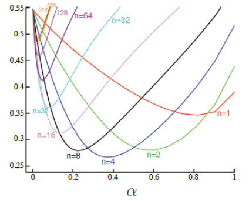

---

## 2.5.3 TD(λ) — 여러 step 의 TD 를 가중 평균하기
<!-- 슬라이드 198 -->

다양한 step 의 TD 를 섞어서 최적화할 수는 없을까. Every-visit MC policy evaluation 과 같은
개념으로 모든 step 의 리턴을 단순 평균하면

$$
G_t \triangleq \frac{1}{T}\big( G_t^{(1)} + G_t^{(2)} + \cdots + G_t^{(T)} \big)
$$

이다. 여기서 $G_t^{(1)}$ 은 적은 분산 · 큰 편향, $G_t^{(T)}$ 는 큰 분산 · 적은 편향을 가진다.
그러나 더 좋은 통합 방법이 필요하다 — **step 에 대한 가중치를 조정**하는 방법이다.

### TD(λ)

TD(λ)는 n-step 까지 가중 평균된 보상 $G_t^\lambda$ 를 사용한다.

$$
G_t^\lambda \triangleq (1 - \lambda) \sum_{n=1}^{\infty} \lambda^{n-1} G_t^{(n)}, \qquad 0 \leq \lambda \leq 1
$$

가중치 $(1-\lambda)\lambda^{n-1}$ 은 $n$ 이 커질수록 $\lambda$ 배씩 줄어드는 기하급수이고
전체 합은 1 이다.

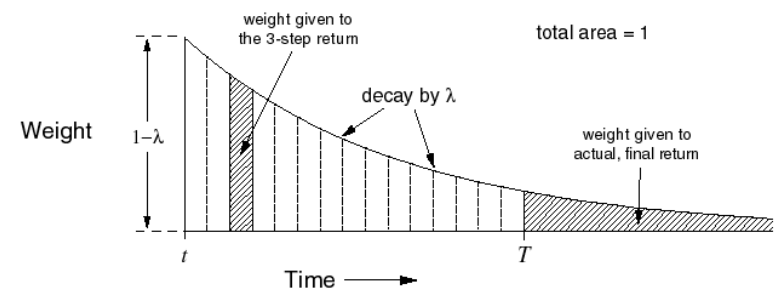

$\lambda$ 가 몇 step 까지 반영하는지 셈해 보자.
$\sum_{n=1}^{N} \lambda^{n-1} = \dfrac{1 - \lambda^N}{1 - \lambda}$ ($\lambda \neq 1$)이고 $N$ 이
충분히 크면 $\sum_{n=1}^{N} \lambda^{n} \approx \dfrac{1}{1 - \lambda}$ 이다. $\lambda = 0.9$ 라면
$\dfrac{1}{1 - 0.9} = 10$, 즉 **10 step 까지 반영**되는 셈이다.

- TD($\lambda = 0$) : 1-step TD
- TD($\lambda = 1$) : Every-visit MC 와 유사

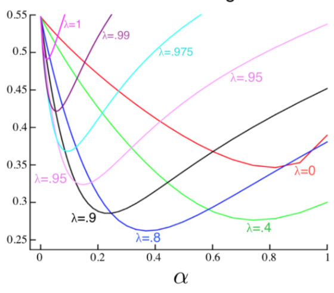

(참고: https://people.cs.umass.edu/~barto/courses/cs687/Chapter%207-printable.pdf)

---

## 2.5.4 TD 정책 평가의 특성
<!-- 슬라이드 199 -->

- MC method 보다 **분산은 작고, 편향(bias, mean error)은 크다.**
- Episode 가 끝나지 않아도 학습할 수 있다.
- **Markov property**(확률적 프로세스의 메모리 없는 속성)가 요구된다. TD target 이 "다음 상태의
  가치" 하나로 미래를 대표하기 때문이다. 필요 시 환경을 markovian 에 가깝도록 설계(표현)할 필요가
  있다.
- 정확하지 않지만 **빠르게** 추산할 수 있다(특히 episode 가 매우 길 경우).
- TD(λ)의 경우 $\alpha$, $\lambda$ 두 hyper parameter 를 튜닝해야 한다. TD(n)에서 $\alpha$, $n$ 을
  튜닝하는 것이 좀 더 쉬울 수 있다.

---

## 2.5.5 실습 2.5.1 — Temporal-Difference policy evaluation
<!-- 슬라이드 200~206 -->
<!-- 슬라이드 206 : 숨김 MEMO 슬라이드, 내용 없음 -->

> 노트북: `code/2.5.1.TD.ipynb`
> [](https://colab.research.google.com/github/AI-BoostCamp/ReinforcementLearning/blob/main/code/2.5.1.TD.ipynb)

**목적** : Temporal-Difference method 를 사용하여 정책을 추정하고, TD 의 특성을 분석한다.

**실습 개요** — GridworldEnv 상에서 다음을 수행한다.

- TD(0) : 1-step TD 적용해 보기 — MC 와 학습 속도, 분산 특성 비교
- TD(n) : 5-step TD 적용해 보기 — TD(0), TD(5), MC 와 학습 속도, 분산 특성 비교
- `TDAgent()` : Temporal-Difference evaluation Agent 생성

### TDAgent

`TDAgent` 는 MC 의 `MCAgent` 와 같은 뼈대(`v`, `q`, `_policy_q`, $\epsilon$-greedy `get_action`)에
`n_step` 인수가 추가되었다. `update()` 는 n-step TD, `sample_update()` 는 1-step TD 갱신이다.
학습률은 $10^{-2}$ 로 MC 실습(10^{-3})보다 크게 두었다.

```python
class TDAgent:
    def __init__(self,
                 gamma: float,
                 num_states: int,
                 num_actions: int,
                 epsilon: float,
                 lr: float,
                 n_step: int):

        self.gamma = gamma
        self.num_states = num_states
        self.num_actions = num_actions
        self.lr = lr
        self.epsilon = epsilon
        self.n_step = n_step

        # Initialize state value function V and action value function Q
        self.v = None
        self.q = None
        self.reset_values()

        # Initialize "policy Q"
        # "policy Q" is the one used for policy generation.
        self._policy_q = None
        self.reset_policy()

    def reset_values(self):
        self.v = np.zeros(shape=self.num_states)
        self.q = np.zeros(shape=(self.num_states, self.num_actions))

    def reset_policy(self):
        self._policy_q = np.zeros(shape=(self.num_states, self.num_actions))

    def get_action(self, state):
        prob = np.random.uniform(0.0, 1.0, 1)
        # e-greedy policy over Q
        if prob <= self.epsilon:  # random
            action = np.random.choice(range(self.num_actions))
        else:  # greedy
            action = self._policy_q[state, :].argmax()
        return action

    def sample_update(self, state, action, reward, next_state, done):
        # 1-step TD target
        td_target = reward + self.gamma * self.v[next_state] * (1 - done)
        self.v[state] += self.lr * (td_target - self.v[state])

    def decaying_epsilon(self, factor):
        self.epsilon *= factor
```

```python
td_agent = TDAgent(gamma=1.0,
                      num_states=nx * ny,
                      num_actions=4,
                      epsilon=1.0,
                      lr=1e-2,
                      n_step=1)
```

### run_episode() — 1-step TD 를 적용하여 episode 를 시행하면서 $V(s)$ 를 update

$$
V(s) \leftarrow V(s) + \alpha\,(G_t - V(s)), \qquad \text{TD target: } G_t \triangleq R_{t+1} + \gamma V(S_{t+1})
$$

MC 와 결정적으로 다른 점이 여기 있다. **매 step 마다** TD target 을 만들어 `agent.v[state]` 를
바로 갱신한다 — Terminal 조건이 나올 때까지 value update 를 계속하며, `agent.update()` 대신
직접 `agent.v[s]` 를 update 한다. `(1 - done)` 은 다음 상태가 Terminal 이면 $V(S_{t+1})$ 을 0 으로
만드는 장치다.

```python
## agent.update를 사용하지 않고 직접 agent.v[s] update 함 ##
def run_episode(env, agent):
    env.reset()
    while True:
        state = env.observe()
        action = agent.get_action(state)
        next_state, reward, done, info = env.step(action)
        # 1-step TD target
        td_target = reward + agent.gamma * agent.v[next_state] * (1 - done)
        # v(s) update
        agent.v[state] += agent.lr * (td_target - agent.v[state])
        if done:  break
```

### 2000 episode 시행 결과 확인

```python
def run_episodes(env, agent, total_eps, log_every):
    values = []
    log_iters = []
    for i in range(total_eps+1):
        run_episode(env, agent)
        if i % log_every == 0:
            values.append(agent.v.copy()) # [(16,),...]
            log_iters.append(i)
    info = dict()
    info['values'] = values
    info['iters'] = log_iters
    return info

total_eps = 2000
log_every = 500

td_agent.reset_values() # v,q <- 0
info = run_episodes(env, td_agent, total_eps, log_every)
```

DP 정책 평가(`TensorDP`)의 정답과 나란히 그린다.

```python
from tensorized_dp import TensorDP

dp_agent = TensorDP()
dp_agent.set_env(env)
v_pi = dp_agent.policy_evaluation()

for viz_i, i in enumerate(log_iters):
    visualize_value_function(ax[viz_i, 0], mc_values[viz_i], nx, ny, plot_cbar=False)
    _ = ax[viz_i, 0].set_title("TD-PE after {} episodes".format(i), size=10)
    visualize_value_function(ax[viz_i, 1], v_pi, nx, ny, plot_cbar=False)
    _ = ax[viz_i, 1].set_title("DP-PE", size=10)
```

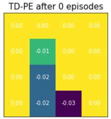

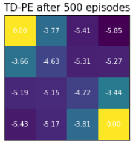

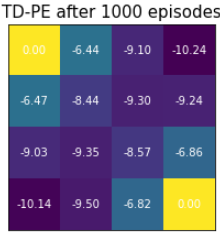

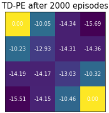

MC 는 처음부터 값이 정답 크기(−14 ~ −22)를 맴돌며 흔들렸는데, TD 는 0 에서 시작해 **천천히
정답 쪽으로 자라난다.** TD target 이 "다음 상태의 (아직 0 에 가까운) 추정값" 을 쓰기 때문에
초기의 편향이 크다.

### 3000 epi. 시행을 10 번 반복하여 error 값의 평균과 분산 확인

MC evaluation 에서 했던 것과 같은 실험을 하고 두 결과를 함께 그린다. 이론적으로 MC 는 분산은
크고 bias 는 적고, TD 는 분산은 작고 bias(mean error)는 크다.

```python
reps = 10
values_over_runs = []
total_eps = 3000
log_every = 30

for i in range(reps):
    td_agent.reset_values()
    print(f"start to run {i}th experiment ... ")
    info = run_episodes(env, td_agent, total_eps, log_every)
    values_over_runs.append(info['values'])

values_over_runs = np.stack(values_over_runs)

v_pi_expanded = np.expand_dims(v_pi, axis=(0,1)) # v_pi: from DP
errors = np.linalg.norm(values_over_runs - v_pi_expanded, axis=-1)
error_mean = np.mean(errors, axis=0)
error_std = np.std(errors, axis=0)
```

MC 실습에서 저장해 둔 `mc_errors.npy` 를 불러와 겹쳐 그린다.

```python
mc_errors = np.load(g_drive+'mc_errors.npy')
mc_error_mean = np.mean(mc_errors, axis=0)
mc_error_std = np.std(mc_errors, axis=0)

fig, ax = plt.subplots(1,1, figsize=(8,4))
ax.grid()
ax.fill_between(x=info['iters'], y1=error_mean + error_std, y2=error_mean - error_std, alpha=0.3)
ax.plot(info['iters'], error_mean, 'b-', label='1-step TD evaluation error')
ax.plot(info['iters'], error_std*10+10,'b--', label="1-stepTD,std*10+10",linewidth=1)

ax.fill_between(x=info['iters'], y1=mc_error_mean + mc_error_std, y2=mc_error_mean - mc_error_std, alpha=0.3)
ax.plot(info['iters'], mc_error_mean, 'r-', label='MC evaluation error')
ax.plot(info['iters'], mc_error_std*10+10,'r--',label="MC,std*10+10",linewidth=1)

ax.legend()
_ = ax.set_xlabel('episodes')
_ = ax.set_ylabel('Errors')
```

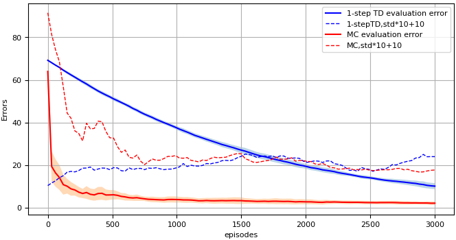

그림이 이론을 그대로 보여 준다. **MC 는 평균 오차(bias)가 빨리 사라지지만 분산이 크고, TD 는
분산이 작지만 평균 오차가 오래 남는다.**

### n-step TD 구현

n-step 뒤의 보상까지 return 계산에 사용한다.

$$
G_t \triangleq R_{t+1} + \gamma R_{t+2} + \gamma^2 R_{t+3} + \cdots + \gamma^{n-1} R_{t+n} + \gamma^n V(S_{t+n})
$$

에피소드의 길이가 random variable 이기 때문에 episode 의 한 형태로 구현한다 — 즉 MC 처럼
trajectory 를 모아 두고 에피소드가 끝난 뒤 `agent.update(episode)` 로 갱신한다.

```python
n_steps = 5
n_step_td_agent = TDAgent(gamma=1.0,
                             num_states=nx * ny,
                             num_actions=4,
                             epsilon=1.0,
                             lr=1e-2,
                             n_step=n_steps)
```

```python
def run_episode(env, agent):
    env.reset()
    states = []
    actions = []
    rewards = []
    while True :# for i in range(10000):
        state = env.observe()
        action = agent.get_action(state)
        next_state, reward, done, info = env.step(action)

        states.append(state)
        actions.append(action)
        rewards.append(reward)

        if done:
            break
    episode = (states, actions, rewards)
    agent.update(episode)
```

**Episode 의 끝부분에서 남은 state 가 steps 보다 짧은 경우 $G_t$ 처리가 필요하다.** 예를 들어
에피소드 길이가 10 이고 n-step 이 2 일 때, 9 번째 상태 $S_9$ 의 TD target
$G_9 = R_{10} + \gamma R_{11} + \gamma^2 V(S_{11})$ 에서 $R_{11}$, $S_{11}$ 은 존재하지 않는다.
그런데 agent 가 종결 상태에 방문하면 어느 행동을 하든 종결 상태로 되돌아오고 그에 따른 보상은
0 으로 볼 수 있다. 따라서 **부족한 state 만큼 dummy state(state=0, reward=0, done=1)를 넣어서**
처리하면 된다.

### Agent.update() — n-step TD 를 적용한 v[s] update

`kernel` 은 $[\gamma^0, \gamma^1, \ldots, \gamma^{n-1}]$ 이다. 위치 $i$ 마다 그 뒤 $n$ 개
보상에 kernel 을 곱해 더하고, $n$ step 뒤 상태 `ns` 의 가치를 $\gamma^n$ 배 하여 더한다.
`done` 이 1 인 dummy 구간에서는 마지막 항이 0 이 된다.

```python
    def update(self, episode): # n-step TD
        states, actions, rewards = episode
        ep_len = len(states)

        states += [0] * (self.n_step + 1)  # append dummy states
        rewards += [0] * (self.n_step + 1)  # append dummy rewards
        dones = [0] * ep_len + [1] * (self.n_step + 1)  #dummys <-done
        # kernel [gamma, gamma^2,... ]
        kernel = np.array([self.gamma ** i for i in range(self.n_step)])
        for i in range(ep_len):
            s = states[i]                # 현재 s
            ns = states[i + self.n_step] # 마지막 s
            done = dones[i]              # dummy는 1

            # compute n-step TD target
            g = np.sum(rewards[i:i + self.n_step] * kernel)
            # 마지막 term : done이 아니면 v[ns]를 사용
            g += (self.gamma ** self.n_step) * self.v[ns] * (1 - done)
            # v(s) <- lr * (g - v(s))
            self.v[s] += self.lr * (g - self.v[s])
```

### 5-step TD, TD(4) 학습 결과 확인

```python
n_step_td_agent.reset_values()
info = run_episodes(env, n_step_td_agent, 2000, 500)
```

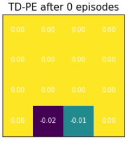

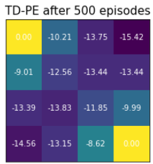

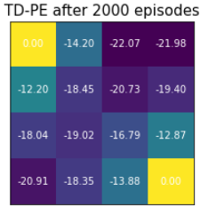

5 step 의 실제 보상을 쓰므로 1-step TD 보다 훨씬 빨리 정답 크기에 도달한다.

### 1-step TD, 5-step TD, MC 학습 결과 비교

```python
n_step_errors = np.linalg.norm(n_step_values_over_runs - v_pi_expanded, axis=-1)
n_step_error_mean = np.mean(n_step_errors, axis=0)
n_step_error_std = np.std(n_step_errors, axis=0)

ax.plot(info['iters'], error_mean, 'b-', label='1-step TD evaluation error')
ax.plot(info['iters'], n_step_error_mean,'g-', label=f"{n_steps}-step TD evaluation error")
ax.plot(info['iters'], mc_error_mean,'r-', label='MC evaluation error')
```

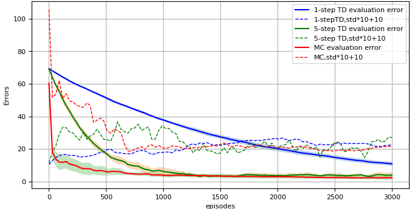

**Step 이 늘어나면 분산은 커지고 bias(평균)는 감소한다**는 것이 확인된다. 1-step TD 와 MC 의
중간에 n-step TD 가 놓이는 것이다.

---

## 2.5.6 정리
<!-- 이 절의 요약. 원문에 별도의 review 슬라이드는 없다 -->

- TD 는 MC 의 리턴 $G_t$ 자리에 **TD target** $R_{t+1} + \gamma V(S_{t+1})$ 을 넣는다. 환경
  모델 없이, 에피소드가 끝나기 전에, 매 step 갱신한다. 다음 상태의 추정값을 빌려 쓰므로
  **bootstrap** 이고, 그래서 편향이 생긴다.
- **TD error** $\delta_t = R_{t+1} + \gamma V(S_{t+1}) - V(S_t)$ 가 갱신의 크기를 정한다.
- **n-step TD** 는 $n$ 개의 실제 보상 뒤에 $\gamma^n V(S_{t+n})$ 을 붙인다. $n \to \infty$ 면 MC 다.
  **TD(λ)** 는 모든 n-step 리턴을 $(1-\lambda)\lambda^{n-1}$ 로 가중 평균한다.
  $\lambda = 0$ 은 1-step TD, $\lambda = 1$ 은 MC 에 가깝다.
- 실험: **TD 는 분산이 작고 편향이 크며, MC 는 반대**다. step 을 늘리면 분산이 커지고 편향이 줄어
  그 사이를 잇는다.
- TD 는 Markov property 를 전제한다. 이 TD 의 갱신식을 $V$ 대신 $Q(s,a)$ 에 적용한 것이 다음 절의
  SARSA 이고, 그것이 Q-learning 으로 이어진다.
