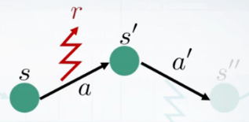
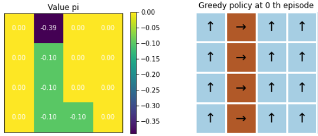
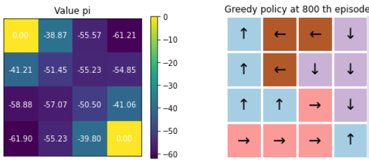

# 2.6 SARSA Algorithm

**학습 목표**

- SARSA 가 TD(0) 를 상태가치 $V$ 가 아닌 행동가치 $Q(s,a)$ 에 적용한 것임을 설명하고,
  갱신 단위 $(s, a, r, s', a')$ 에서 이름이 나온 이유를 말할 수 있다.
- SARSA 의 target $r + \gamma Q(s', a')$ 에서 $a' = \pi(s')$ 가 **현재 정책이 실제로 고른 다음
  행동**이라는 점 — 즉 on-policy 라는 점 — 을 설명할 수 있다.
- SARSA control(SARSA 평가 + $\epsilon$-greedy), n-step SARSA, SARSA(λ)의 갱신식을 쓸 수 있다.
- TDAgent 를 상속받아 SARSA Agent 를 구현하고, $Q(s,a)$ 학습 결과를 greedy policy 로 시각화할 수 있다.

**이 절의 구성**

- 2.6.1 SARSA — TD(0) 로 행동가치 함수 추산하기
- 2.6.2 SARSA control, n-step SARSA, SARSA(λ)
- 2.6.3 실습 2.6.1 — SARSA
- 2.6.4 정리

---

## 2.6.1 SARSA — TD(0) 로 행동가치 함수 추산하기
<!-- 슬라이드 208 -->

앞 절의 TD 는 상태가치 $V(s)$ 를 추산했다. 그러나 정책을 개선하려면 행동가치 $Q(s,a)$ 가
필요하다. 최적 행동가치 함수의 벨만 방정식은

$$
Q^{*}(s,a) = R + \gamma Q^{*}(s', a'), \qquad a' = \pi^{*}(s')
$$

이고, **SARSA** 는 TD(0) 를 활용하여 행동가치 함수 $Q^\pi$ 를 추산하는 방법 — SARSA policy
evaluation — 이다.

$$
Q(s,a) \leftarrow Q(s,a) + \alpha\,\big( G_t - Q(s,a) \big), \qquad G_t \triangleq r + \gamma\, Q(s', a'),\quad a' = \pi(s')
$$

TD(0) 와 비교해 보면 형태가 같다.

$$
V(s) \leftarrow V(s) + \alpha\,\big( G_t - V(s) \big), \qquad G_t \triangleq R_{t+1} + \gamma\, V(S_{t+1})
$$

다른 점은 $V(s)$ 가 $Q(s,a)$ 로, $V(S_{t+1})$ 이 $Q(s', a')$ 로 바뀐 것이다. Episode 의 임의의
$s$ 부터 **$s \to a \to r \to s' \to a'$** 를 기본 단위로 $Q$ 를 추산한다 — 그래서 이름이
**S**tate-**A**ction-**R**eward-**S**tate-**A**ction 이다. SARSA 알고리즘은 $Q(s', a')$, 즉
**다음 상태 $s'$ 에서의 action $a'$ 를 추산에 참여시킨다.** 이 $a'$ 는 현재 정책 $\pi$ 가 $s'$
에서 실제로 고른 행동이다.



### SARSA 알고리즘

1. Init. : $Q(s,a) \leftarrow 0$
2. Episode Repeat :
   - $s \leftarrow$ 환경으로부터 현재 상태 관측
   - $a \leftarrow Q(s,a)$ 에서 $\pi$ 로 action 선택 ($a = \pi(s)$)
   - Repeat :
     - $s', r \leftarrow$ `env.step(a)`, '현재 행동'을 시행
     - $a' \leftarrow Q(s', a')$ 에서 $\pi$ 로 action 선택 ($a' = \pi(s')$)
     - $Q(s,a) \mathrel{+}= \alpha\,\big( r + \gamma Q(s', a') - Q(s,a) \big)$ — Q update
     - $s \leftarrow s'$ ; $a \leftarrow a'$
   - until : $s == T$
3. Until : $\Delta Q(s,a) \approx 0$

---

## 2.6.2 SARSA control, n-step SARSA, SARSA(λ)
<!-- 슬라이드 209 -->

### SARSA control — policy improvement

SARSA policy evaluation 에 **$\epsilon$-greedy policy** 를 결합하면 control 이 된다. $\epsilon$
scheduling 으로 최적 정책을 찾을 수 있으나, GLIE(Greedy in the Limit of infinite Exploration)
조건을 만족시키기 어려워 성능이 예상보다 좋지 않은 경우도 많다.

### n-step SARSA

TD 의 n-step 확장과 같은 방식으로, $n$ step 의 보상 뒤에 $Q$ 를 붙인다.

$$
Q(s_t, a_t) \leftarrow Q(s_t, a_t) + \alpha\,\big( q_t^{(n)} - Q(s_t, a_t) \big)
$$

$$
q_t^{(n)} \triangleq R_{t+1} + \gamma R_{t+2} + \cdots + \gamma^{n-1} R_{t+n} + \gamma^n Q(S_{t+n})
$$

여기서 $Q(S_{t+n}) = Q^\pi(s_{t+n}, a)$ 는 $s_{t+n}$ 상태의 action 중에 정책 함수 $\pi$ 로
선택된 행동의 가치 함수다.

### SARSA(λ)

TD(λ)와 같은 방식으로 n-step 리턴을 가중 평균한다.

$$
Q(s_t, a_t) \leftarrow Q(s_t, a_t) + \alpha\,\big( q_t^\lambda - Q(s_t, a_t) \big), \qquad
q_t^\lambda \triangleq (1 - \lambda) \sum_{n=1}^{\infty} \lambda^{n-1} q_t^{(n)},\quad 0 \leq \lambda \leq 1
$$

---

## 2.6.3 실습 2.6.1 — SARSA
<!-- 슬라이드 210~212 -->

> 노트북: `code/2.6.1.SARSA.ipynb`
> [](https://colab.research.google.com/github/AI-BoostCamp/ReinforcementLearning/blob/main/code/2.6.1.SARSA.ipynb)

**목적** : SARSA 알고리즘 실습.

**실습 개요** — GridworldEnv 상에서 다음을 수행한다.

- TD Agent 를 상속받아 SARSA Agent 구현
- SARSA 알고리즘 구현 — SARSA update method, $Q(s,a)$ 학습 확인 및 greedy policy 로 시각화

### SARSA Agent constructor define — TDAgent 를 상속

`SARSA` 는 앞 절의 `TDAgent` 를 상속받아 `n_step=1` 로 고정한다. `get_action()` 은 한 가지가
달라진다 — TD 에서는 정책용 `_policy_q` 에서 action 을 얻었지만, 여기서는 **학습 중인 `q` table
에서 직접** argmax 를 얻는다. 즉 평가 중인 $Q$ 가 곧 정책이다(on-policy).

`update_sample()` 이 SARSA 갱신이다. `td_target = r + γ·q[ns, na]·(1−done)` 에 다음 상태 `ns`
와 **다음 행동 `na`** 가 함께 들어간다.

```python
class SARSA(TDAgent):
    def __init__(self,
                 gamma: float,
                 num_states: int,
                 num_actions: int,
                 epsilon: float,
                 lr: float):
        super(SARSA, self).__init__(gamma=gamma,
                                    num_states=num_states,
                                    num_actions=num_actions,
                                    epsilon=epsilon,
                                    lr=lr,
                                    n_step=1)

    def get_action(self, state): # self._policy_q[]) 수정
        prob = np.random.uniform(0.0, 1.0, 1)
        # e-greedy policy over Q
        if prob <= self.epsilon:  # random
            action = np.random.choice(range(self.num_actions))
        else:  # greedy
            ### action = self._policy_q[state, :].argmax()# TD에서의 방식
            action = self.q[state, :].argmax()  # q table에서 직접 얻음
        return action

    ## g table update
    def update_sample(self, state, action, reward, next_state, next_action, done):
        s, a, r, ns, na = state, action, reward, next_state, next_action
        # SARSA target
        td_target = r + self.gamma * self.q[ns, na] * (1 - done)
        self.q[s, a] += self.lr * (td_target - self.q[s, a])
```

Agent 를 생성한다. 학습률 $10^{-1}$, $\epsilon = 1.0$(random policy 비율 100%)이다.

```python
sarsa_agent = SARSA(gamma=1.0,          # 감가율
                    lr=1e-1,            # learning rate
                    num_states=env.nS,
                    num_actions=env.nA,
                    epsilon=1.0)        # random policy 비율
```

### SARSA algorithm — main loop

한 step 마다 $(s, a, r, s', a')$ 다섯 값을 모아 `update_sample()` 을 부른다. **$a'$ 를 먼저
골라 놓고** 그것으로 $Q(s,a)$ 를 갱신하는 것이 SARSA 의 순서다. 200 에피소드마다 평균 에피소드
길이를 찍고 $Q$ 를 보관한다.

```python
sarsa_agent.reset_values() # v, q <- 0

num_eps = 1000
report_every = 200
sarsa_qs = []    # 시각화를 위해 q(s,a)보관
iter_idx = []    # No. of episode

path_length = 0
for i in range(num_eps): # 시행할 episode
    env.reset()      # s <- random state
    while True: # Terminal 상태까지 반복
        state = env.s                                    # s : random
        action = sarsa_agent.get_action(state)           # a <- pi(s,a)
        next_state, reward, done, info = env.step(action)# s' <- step(a)
        next_action = sarsa_agent.get_action(next_state) # a' <- pi(s',a)

        sarsa_agent.update_sample(state=state,            # s
                                  action=action,          # a
                                  reward=reward,          # r
                                  next_state=next_state,  # s'
                                  next_action=next_action,# a'
                                  done=done)
        path_length += 1 # episode 길이
        if done: break
    if i % report_every == 0:
        print(f">>Mean Length : {path_length/report_every}") # sum(epi길이)/report_every
        sarsa_qs.append(sarsa_agent.q.copy())                #시각화를 위해 q(s,a)보관
        iter_idx.append(i)
        path_length = 0
```

```text
>>Mean Length : 0.06
>>Mean Length : 16.595
>>Mean Length : 18.24
>>Mean Length : 16.115
>>Mean Length : 16.665
```

### 결과 시각화

상태가치는 $V(s) = \text{mean}_a Q(s,a)$, 즉 `np.sum(q, axis=1)/4` 로 만들어 그리고, 정책은 $Q$
의 argmax 화살표로 그린다.

```python
num_plots = len(sarsa_qs)
fig, ax = plt.subplots(num_plots,2, figsize=(6, num_plots*2.5))
for i, (q, viz_i) in enumerate(zip(sarsa_qs, iter_idx)):
    visualize_value_function(ax[i][0], np.sum(q,axis=1)/4, nx, ny)   # V(s)=sum(Q(s,a))/4
    _ = ax[i][0].set_title("Value pi")
    visualize_policy(ax[i][1], q, env.shape[0], env.shape[1])
    _ = ax[i][1].set_title("Greedy policy at {} th episode".format(viz_i))
```





주목할 점이 있다. **이 실습은 정책 개선을 하지 않고 있다**(random policy, $\epsilon = 1.0$).
그래서 200 에피소드 동안의 평균 length 가 16~18 로 변화가 없다 — 행동은 여전히 무작위다.
그런데도 $Q$ 의 argmax 로 그린 greedy policy 는 800 에피소드에서 최적 정책의 모양을 갖췄다.
random policy 아래에서 추산한 $Q$ 라도 상태 간 상대적 크기가 맞으면 greedy 정책은 정답이 된다.
$\epsilon$ 을 줄여 이 greedy 정책을 실제로 따르게 하는 것이 SARSA control 이고, 그것을 다음 절의
CliffWalking 실습에서 Q-Learning 과 비교한다.

---

## 2.6.4 정리
<!-- 이 절의 요약. 원문에 별도의 review 슬라이드는 없다 -->

- SARSA 는 **TD(0) 를 행동가치 $Q(s,a)$ 에 적용**한 것이다. 갱신 단위 $(s, a, r, s', a')$ 에서
  이름이 왔다.
- target 은 $r + \gamma Q(s', a')$ 이고, $a'$ 는 **현재 정책이 $s'$ 에서 실제로 고른 행동**이다.
  평가하는 정책과 행동하는 정책이 같으므로 **on-policy** 다.
- SARSA + $\epsilon$-greedy = SARSA control. n-step SARSA 와 SARSA(λ)는 TD 의 확장과 같은 꼴이다.
- 구현: `TDAgent` 를 상속, `q` table 에서 직접 action 을 고르고, `update_sample(s, a, r, s', a', done)`
  으로 갱신한다.
