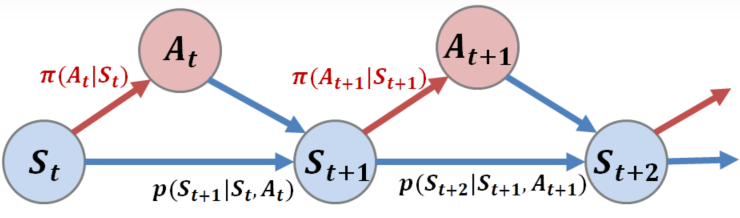
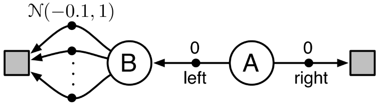
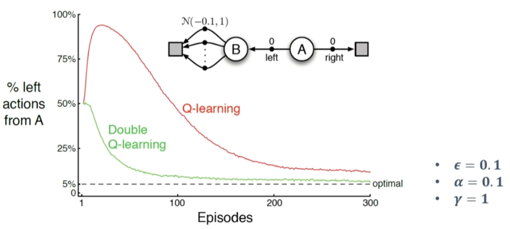
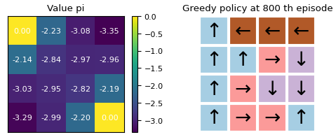
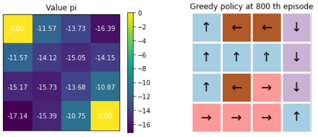
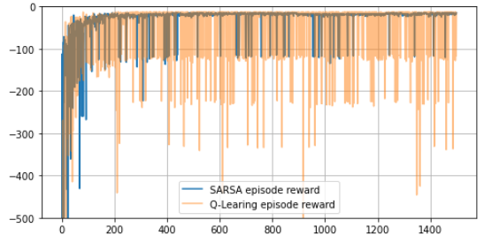
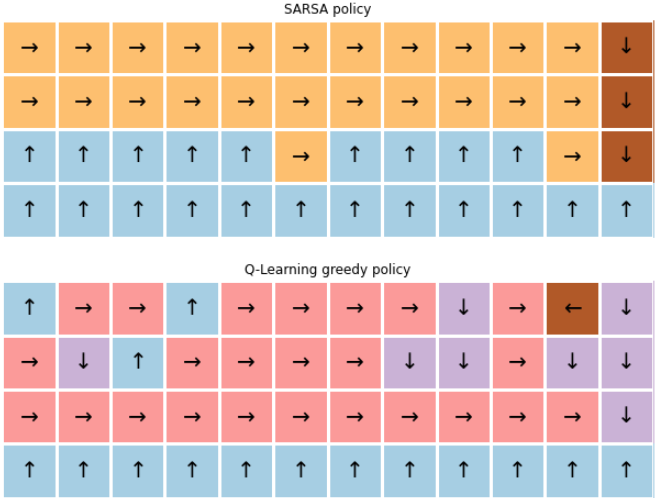
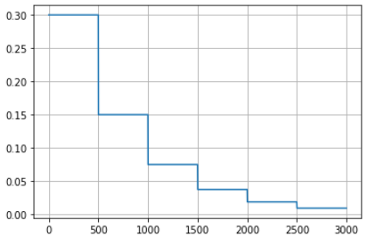
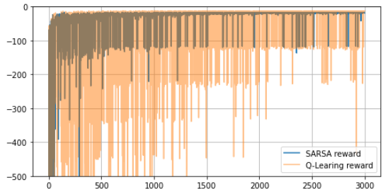

# 2.7 Off-policy Control 과 Q-Learning

**학습 목표**

- On-policy 평가와 Off-policy 평가의 차이 — 어떤 정책이 만든 경험으로 어떤 정책을 평가하는가 —
  를 정의하고, Off-policy 학습의 장점을 열거할 수 있다.
- Trajectory 의 확률을 정책과 환경 모델의 곱으로 쓰고, 두 정책의 비율 $\rho$ 가 환경 모델과
  무관하게 계산되는 이유(Importance sampling)를 설명할 수 있다.
- Q-Learning 이 벨만 최적 방정식에서 어떻게 유도되며, 왜 Importance sampling 없이 off-policy
  학습이 가능한지 설명할 수 있다.
- Maximization bias 의 원인과 Double Q-Learning 의 해결 방식을 설명할 수 있다.
- Gridworld 와 CliffWalking 에서 Q-Learning 과 SARSA 를 구현 · 비교하고, 두 알고리즘이 다른
  경로(최적 경로 vs. 안전한 경로)를 배우는 이유를 설명할 수 있다.

**이 절의 구성**

- 2.7.1 Off-policy Learning 이란
- 2.7.2 Trajectory 의 확률과 Importance sampling
- 2.7.3 Q-Learning — Importance sampling 없는 Off-policy TD control
- 2.7.4 Q-Learning 의 특징과 Maximization bias
- 2.7.5 Double Q-Learning
- 2.7.6 실습 2.7.1 — Q-Learning
- 2.7.7 실습 2.7.2 — Q-Learning 과 SARSA 비교 (CliffWalking)
- 2.7.8 실습과제 — 성능 개선, FrozenLake
- 2.7.9 정리

---

## 2.7.1 Off-policy Learning 이란
<!-- 슬라이드 214 -->

Q-Learning 은 **off-policy learning** 이 가능하다. 먼저 두 용어를 나눈다.

- **On-policy evaluation** : 주어진 정책 $\pi(a|s)$ 로 시행한 episode 로 그 정책의 $Q^\pi(s,a)$ 를
  추산하는 것. 앞 절의 SARSA 가 그렇다.
- **Off-policy evaluation** : **임의의 정책 $\mu(a|s)$ 로 시행된 episode** 로 $Q^\pi(s,a)$ 를 추산하는
  것. 행동한 정책과 평가하는 정책이 다르다.

Off-policy 의 장점은 다음과 같다.

- 다른 좋은 정책(예: 사람이 운전한 정보)으로부터 얻은 sample 에서도 학습할 수 있다 — 정책의
  다양성을 포함한 sample 로부터 학습한다.
- 정책 개선 과정에서 **이전 정책의 sample 도 재활용**할 수 있다. 정책 개선마다 새로운 sample 을
  만드는 것은 많은 비용이 요구된다.
- $\pi(a|s)$ 는 최적 정책을 찾지만 $\mu(a|s)$ 는 Exploration 을 할 수 있다 — $\epsilon$-greedy 에서
  $\epsilon$ scheduling 없이 학습이 가능하고, 복잡한 환경에서 좋은 학습의 가능성이 높아진다.

구하고자 하는 $Q^\pi(s,a)$ 를 다시 정리하면

$$
Q^\pi(s,a) \triangleq E_\pi[\, G_t \mid S_t = s, A_t = a \,] = E_\pi[\, R_{t+1} + \gamma R_{t+2} + \cdots \mid S_t = s, A_t = a \,]
$$

이다. $E_\pi[\cdot]$ 는 정책 $\pi$ 에서 발생한 trajectory 의 분포에 대한 평균값이다 — 상태, 행동,
보상의 trajectory 가 모두 $\pi$ 에 따라 결정된다. 그렇다면 $\mu$ 가 만든 trajectory 로 어떻게
$E_\pi$ 를 구할 수 있을까. 그것이 다음 소절이다.

---

## 2.7.2 Trajectory 의 확률과 Importance sampling
<!-- 슬라이드 215~216 -->

### Trajectory 의 확률 표현

$S_t$ 이후 정책 $\pi$ 의 trajectory 확률은 정책과 상태천이확률이 교대로 곱해진 것이다.

$$
\begin{aligned}
p(A_t, S_{t+1}, A_{t+1}, \ldots, S_T \mid S_t, A_{t:T-1} \sim \pi)
&= \pi(A_t|S_t)\, p(S_{t+1}|S_t, A_t)\, \pi(A_{t+1}|S_{t+1})\, p(S_{t+2}|S_{t+1}, A_{t+1}) \cdots p(S_T|S_{T-1}, A_{T-1}) \\
&= \prod_{k=t}^{T-1} \pi(A_k|S_k)\, p(S_{k+1}|S_k, A_k)
\end{aligned}
$$



$S_t$ 이후 정책 $\mu$ 의 trajectory 확률도 같은 꼴이다.

$$
p(A_t, S_{t+1}, A_{t+1}, \ldots, S_T \mid S_t, A_{t:T-1} \sim \mu) = \prod_{k=t}^{T-1} \mu(A_k|S_k)\, p(S_{k+1}|S_k, A_k)
$$

환경의 구조(문제의 구조, 모델)를 모르고 학습한다고 할 때, $p(S_{k+1}|S_k, A_k)$ 는 알 수 없는
부분(경험으로만 알 수 있는 부분)이고, $\pi(A_k|S_k)$, $\mu(A_k|S_k)$ 는 설계한 정책이므로 알 수 있는
부분이다. 두 정책 $\pi$, $\mu$ 의 **trajectory 비율 $\rho$** 를 구하면 알 수 없는 부분이 약분된다.

$$
\rho_{t:T-1} \triangleq \frac{\prod_{k=t}^{T-1} \pi(A_k|S_k)\, p(S_{k+1}|S_k, A_k)}{\prod_{k=t}^{T-1} \mu(A_k|S_k)\, p(S_{k+1}|S_k, A_k)} = \prod_{k=t}^{T-1} \frac{\pi(A_k|S_k)}{\mu(A_k|S_k)}
$$

두 trajectory 각각은 MDP 구조(모델, 환경)의 영향을 받지만 **$\rho$ 는 영향이 없다.** 즉 모델의
구조와 상관없이 계산할 수 있다.

### Importance sampling 이란

분포 $p$ 에 대한 기댓값을 계산하기 어려운 경우(sampling 을 얻기 어려움), sampling 이 가능한
분포 $q$ 를 사용해 추산하는 방법이다.

$$
E_{x \sim P}[f(x)] = \sum_{x \in X} p(x) f(x) = \sum_{x \in X} q(x) \frac{p(x)}{q(x)} f(x) = E_{x \sim Q}\Big[ \frac{p(x)}{q(x)} f(x) \Big]
$$

### Off-policy MC policy evaluation

$Q^\pi(s,a) \triangleq E_\pi[G_t \mid S_t = s, A_t = a]$ 에 Importance sampling trick 을 적용하면

$$
Q^\pi(s,a) = E_\mu[\, \rho_{t:T-1} G_t \mid S_t = s, A_t = a \,]
$$

로 표현할 수 있다. MC policy evaluation 을 위해 $Q^\pi(s,a)$ 를 구해야 하는데, 대신 어떤 정책 $\mu$
로 episode 를 생성하고 MC 로 얻은 return $G_t$ 에 $\rho_{t:T-1}$ 를 곱한다.

$$
G_t^{\pi/\mu} = \rho_{t:T-1} G_t = \prod_{k=t}^{T-1} \frac{\pi(A_k|S_k)}{\mu(A_k|S_k)}\, G_t
$$

MC update 는 다음처럼 수정하면 된다.

$$
Q(s,a) \leftarrow Q(s,a) + \alpha\,\big( G_t^{\pi/\mu} - Q(s_t, a_t) \big)
$$

**문제점 — 현실 적용이 쉽지 않다.**

- $\pi(A_k|S_k) \neq 0$ 일 때 $\mu(A_k|S_k) \neq 0$ 이어야 하고, $\mu(A_k|S_k)$ 를 기록 · 관리해야
  하며, 구현이 복잡하다.
- $\prod_{k} \pi(A_k|S_k) / \mu(A_k|S_k)$ 구조 때문에 **분산이 커지는 경우가 많다.**
- 분산을 줄여 줄 수 있는 최적의 $\mu$ 를 찾는 데 많은 노력이 필요하다.

---

## 2.7.3 Q-Learning — Importance sampling 없는 Off-policy TD control
<!-- 슬라이드 217 -->

**Q-Learning Algorithm**(Watkins, 1989)은 Importance sampling 없이 off-policy 를 달성한다.
출발점은 벨만 최적 방정식의 최적 행동가치 함수다.

$$
Q^{*}(s,a) = R_s^a + \gamma \sum_{s'} P^a_{s,s'} \max_{a'} Q^{*}(s', a') = R_s^a + \gamma\, E_{s' \sim P^a_{s,s'}}\big[ \max_{a'} Q^{*}(s', a') \big]
$$

여기서 $R_s^a$, $P^a_{s,s'}$ 는 환경이 가진 정보라 agent 는 알 수 없다. 그래서 기댓값을 **sample
1 개에 대한 incremental update** 로, 즉 $\alpha$ 를 사용해 바꾼다.

$$
Q(s,a) \leftarrow Q(s,a) + \alpha\,\big( r + \gamma \max_{a'} Q(s', a') - Q(s,a) \big)
$$

이 식을 반복 적용하면 최적해를 찾을 수 있다. 주목할 점은 **정책 함수가 없는 식**이 되었다는
것이다 — 즉 행동 정책 $\mu$ 의 영향을 받지 않는 식이 되어 Importance sampling 이 제거되었다.
이 식을 반복 사용해서 $Q^{*}(s,a)$ 를 얻는 것이 Q-Learning 이다.

### Q-Learning 알고리즘

1. Init. : $Q(s,a) \leftarrow 0$
2. Episode Repeat :
   - $s \leftarrow$ 현재 상태 관측
   - Repeat :
     - $a \leftarrow Q(s,a)$ 에서 임의의 정책 $\mu$ 로 action 선택 (**행동 정책 $\mu$**)
     - $s', r \leftarrow$ `env.step(a)`, 행동을 시행
     - $Q(s,a) \mathrel{+}= \alpha\,\big( r + \gamma \max_{a'} Q(s', a') - Q(s,a) \big)$ (**평가 정책 $\pi$**)
     - $s \leftarrow s'$
   - until : $s == T$

SARSA 와 비교하면 차이가 한 줄이다. SARSA 는 $Q(s', a')$ 의 $a'$ 를 **정책 $\pi$ 가 관여**하여
고른 행동으로 쓰고, Q-Learning 은 $\max_{a'} Q(s', a')$ 로 **greedy 하게** 평가한다. 행동은
$\epsilon$-greedy 같은 $\mu$ 로 하되 평가는 greedy $\pi$ 로 하니 off-policy 다.

---

## 2.7.4 Q-Learning 의 특징과 Maximization bias
<!-- 슬라이드 218 -->

**Q-Learning 특징**

- Importance sampling 없이 off-policy learning 이 가능하다.
- On-policy TD control(SARSA)과 유사한 구조에서 off-policy 를 구현한다.
- 단점 : **Maximization bias** 가 존재한다 — $Q(s,a)$ 값이 실제 값보다 높아지는 문제.

### Maximization bias

Single-state MDP 에서 $E[r|a_1] = E[r|a_2] = 0$ 이라면 $Q(s, a_1) = Q(s, a_2) = 0$ 이라 할 수
있을까. $p(a|s)$ 가 mean = 0 의 정규분포라 할 때, 초기에 sampling 된 $a_1$, $a_2$ 로 추정된 $Q'$ 는
$Q'(s, a_1), Q'(s, a_2) \neq 0$ 일 수 있다. 그러면
$Q(s,a) \leftarrow Q(s,a) + \alpha(r + \gamma \max_{a'} Q(s', a') - Q(s,a))$ 로 얻어지는 $Q(s,a)$ 는
$\max_a$ 의 결과 **positive 값을 가지는 경향**이 생긴다 — 이것이 Maximization bias 다. 잡음이 섞인
추정값들 중 최댓값을 고르면 평균적으로 참값보다 크다.

**Two-state MDP** 에서 보자. State A 는 양방향 모두 $r = 0$, State B 는 left 에서
$r \sim N(-0.1, 1)$ 이다. B 로 가는 것(A 에서 left)은 기대 보상이 음수라 손해인데,
Maximization bias 에 의해 State A 에서 left 선택이 bias 된다.



---

## 2.7.5 Double Q-Learning
<!-- 슬라이드 219 -->

**Double Q-Learning** 은 Double Learning 을 Q-Learning 에 적용한 것이다. 두 개의 $Q$ 를 준비하고
**교대로 참조하여 update** 한다 — 한쪽 $Q$ 로 최선의 행동을 고르고(argmax), 그 행동의 가치는
다른 쪽 $Q$ 로 평가한다. 고르는 추정치와 평가하는 추정치를 분리하면 bias 가 감소한다.
그래도 bias 가 완전히 사라지지는 않는다.

### Double Q-Learning Algorithm

1. Init. : $Q_1(s,a), Q_2(s,a) \leftarrow 0$
2. Episode Repeat :
   - $s \leftarrow$ `env.get_state()`
   - Repeat :
     - $a \leftarrow Q_1(s,a) + Q_2(s,a)$ 에 대한 $\epsilon$-greedy policy
     - $s', r \leftarrow$ `env.step(a)`
     - $p(0.5)$ :
       $Q_1(s,a) \mathrel{+}= \alpha\,\big( r + \gamma\, Q_2(s', \arg\max_{a'} Q_1(s', a')) - Q_1(s,a) \big)$
       — $Q_1$ 으로 고르고 $Q_2$ 로 평가
     - else :
       $Q_2(s,a) \mathrel{+}= \alpha\,\big( r + \gamma\, Q_1(s', \arg\max_{a'} Q_2(s', a')) - Q_2(s,a) \big)$
       — $Q_2$ 로 고르고 $Q_1$ 으로 평가
     - $s \leftarrow s'$
   - until : $s == T$



> 참고 노트북: `code/2.7.1.0.DoubleQ-Learning.ipynb`
> [](https://colab.research.google.com/github/AI-BoostCamp/ReinforcementLearning/blob/main/code/2.7.1.0.DoubleQ-Learning.ipynb)
> 위 Two-state MDP 를 Gym `Env` 로 구현한 `LeftRightEnv` 가 들어 있다(왼쪽 사각형 → B → A →
> 오른쬬 사각형의 네 상태, 0 에서 오른쪽으로 갈 때 $N(-0.1, 1)$ 보상). Maximization bias 를 직접
> 재현해 보는 재료로 쓸 수 있다. 이후 내용은 실습 2.7.1 과 같다.

---

## 2.7.6 실습 2.7.1 — Q-Learning
<!-- 슬라이드 220~222 -->

> 노트북: `code/2.7.1.Q-Learning.ipynb`
> [](https://colab.research.google.com/github/AI-BoostCamp/ReinforcementLearning/blob/main/code/2.7.1.Q-Learning.ipynb)

**목적** : Q-Learning agent 를 구현하고, 학습을 통해 특성을 확인한다.

**실습 개요** — GridworldEnv 상에서 다음을 수행한다.

- TD Agent 를 상속받아 Q-Learning Agent 구현
- Q-Learning 알고리즘 구현 — Q-Learning update method 에서 off-policy 구현 확인
  (행동 정책 $\epsilon$-greedy, 평가 정책 greedy 적용)

### Q-Learning Agent constructor define — TDAgent 를 상속

`QLearner` 도 `TDAgent` 를 상속받아 `n_step=1` 로 고정한다. `get_action()` 은 **행동 정책**이다 —
`mode='train'` 이면 $\epsilon$-greedy, 아니면 greedy. `update_sample()` 이 **평가 정책**이다 —
target 에 `self.q[ns, :].max()` 를 쓴다. SARSA 의 `update_sample` 은 `next_action` 을 인수로
받았지만, 여기서는 받지 않는다. 다음 행동이 무엇이었든 상관없이 최댓값으로 평가하기 때문이다.

```python
class QLearner(TDAgent):

    def __init__(self,
                 gamma: float,
                 num_states: int,
                 num_actions: int,
                 epsilon: float,
                 lr: float):
        super(QLearner, self).__init__(gamma=gamma,
                                       num_states=num_states,
                                       num_actions=num_actions,
                                       epsilon=epsilon,
                                       lr=lr,
                                       n_step=1)

    def get_action(self, state, mode='train'):
        if mode == 'train':
            prob = np.random.uniform(0.0, 1.0, 1)
            # e-greedy policy over Q
            if prob <= self.epsilon:  # random
                action = np.random.choice(range(self.num_actions))
            else:  # greedy
                action = self.q[state, :].argmax()
        else:
            action = self.q[state, :].argmax()
        return action

    def update_sample(self, state, action, reward, next_state, done):
        s, a, r, ns = state, action, reward, next_state
        # Q-Learning target
        td_target = r + self.gamma * self.q[ns, :].max() * (1 - done)
        self.q[s, a] += self.lr * (td_target - self.q[s, a])
```

Agent 를 생성한다. 이번에는 $\epsilon = 0.5$ 로 $\epsilon$-greedy 를 적용한다(SARSA 실습은 1.0 이었다).

```python
qlearning_agent = QLearner(gamma=1.0,        # 감가율
                           lr=1e-1,          # learning rate
                           num_states=env.nS,
                           num_actions=env.nA,
                           epsilon=0.5)      # epsilon-greedy 적용
```

### Q-Learning update() method 구현 — SARSA 와 비교

$$
Q(s,a) \leftarrow Q(s,a) + \alpha\,\big( r + \gamma \max_{a'} Q(s', a') - Q(s,a) \big)
$$

Off-policy : 행동 정책 $\mu$ 로 선택된 $a'$ 를 사용하지 않고, `max()` 를 통해 greedy policy 를
적용한다. SARSA update 와 나란히 놓고 보자 — SARSA 는 `next_action` 을 $\pi$ 로 선택해 `q[ns, na]`
를 쓴다.

```python
# Q-Learning
def update_sample(self, state, action, reward, next_state, done):
    s, a, r, ns = state, action, reward, next_state
    # Q-Learning target
    td_target = r + self.gamma * self.q[ns, :].max() * (1 - done)
    self.q[s, a] += self.lr * (td_target - self.q[s, a])
```

```python
# SARSA
def update_sample(self, state, action, reward, next_state, next_action, done):
    s, a, r, ns, na = state, action, reward, next_state, next_action
    # SARSA target
    td_target = r + self.gamma * self.q[ns, na] * (1 - done)
    # q(s,a) update
    self.q[s, a] += self.lr * (td_target - self.q[s, a])
```

### Q-Learning 시행

main loop 도 SARSA 보다 한 줄 짧다 — `next_action` 을 고를 필요가 없다.

```python
qlearning_agent.reset_values() # v, q <- 0

num_eps = 1000
report_every = 200
qlearning_qs = []
iter_idx = []

path_length = 0
for i in range(num_eps):  # 시행할 episode
    env.reset()           # s <- random state
    while True:           # Terminal 상태까지 반복
        state = env.s                                       # s : random
        action = qlearning_agent.get_action(state)          # a <- pi(s,a)
        next_state, reward, done, info = env.step(action)   # s' <- step(a)
        qlearning_agent.update_sample(state=state,          # s
                                      action=action,        # a
                                      reward=reward,        # r
                                      next_state=next_state,# s'
                                      done=done)
        path_length += 1 # episode 길이
        if done: break
    if i % report_every == 0:
        print(f">>Mean Length : {path_length/report_every}")# sum(epi길이)/report_every
        qlearning_qs.append(qlearning_agent.q.copy())       #시각화를 위해 q(s,a)보관
        iter_idx.append(i)
        path_length = 0
```

```text
>>Mean Length : 0.025
>>Mean Length : 6.7
>>Mean Length : 3.56
>>Mean Length : 3.725
>>Mean Length : 3.675
```

이 실습도 명시적 **정책 개선은 하지 않고 있다.** 그러나 행동 정책이 $\epsilon$-greedy($\epsilon = 0.5$)
이므로 random action 이 감소하여, SARSA 실습(random policy, 평균 길이 16~18)과 달리 **episode 길이가
3~4 로 줄고 학습 속도가 빨라진다.**

### 학습 과정 시각화

```python
num_plots = len(qlearning_qs)
fig, ax = plt.subplots(num_plots,2, figsize=(6, num_plots*2.5))
for i, (q, viz_i) in enumerate(zip(qlearning_qs, iter_idx)):
    visualize_value_function(ax[i][0], np.sum(q,axis=1)/4, nx, ny) #V(s)=sum(Q(s,a))/4
    _ = ax[i][0].set_title("Value pi")
    visualize_policy(ax[i][1], q, env.shape[0], env.shape[1])
    _ = ax[i][1].set_title("Greedy policy at {} th episode".format(viz_i))
```





State value 가 크게 **향상된 것으로 보인다.** SARSA(random policy, $\epsilon = 1$)의 $Q$ 는 random
행동의 가치를 반영해 −11 ~ −17 이었는데, Q-Learning 의 $Q$ 는 greedy 평가 덕에 최적 가치
(−1 ~ −3)에 가까워졌다. 물론 $\epsilon$ 도 다르므로 두 결과를 그대로 비교할 수는 없다 — 공정한
비교가 다음 실습이다.

---

## 2.7.7 실습 2.7.2 — Q-Learning 과 SARSA 비교 (CliffWalking)
<!-- 슬라이드 223~227 -->

> 노트북: `code/2.7.2.SARSA_vs_Q-Learning.ipynb`
> [](https://colab.research.google.com/github/AI-BoostCamp/ReinforcementLearning/blob/main/code/2.7.2.SARSA_vs_Q-Learning.ipynb)

**목적** : Q-Learning 과 SARSA 의 성능을 비교한다.

**실습 개요** — CliffWalkingEnv 상에서 Q-Learning Agent 와 SARSA Agent 를 학습시켜 두 모델의
특성을 확인한다. CliffWalkingEnv 는 다음과 같다.

1. 상태공간 $S$ : 12 × 4 격자 공간, 48 state 존재
2. 행동 공간 $A$ : '상', '우', '하', '좌'
3. 보상함수는 매 이동마다 −1, 절벽에 도달할 때마다 −100
4. 절벽 상태에 도달하면 다시 초기 상태로 돌아간다

초기 상태는 항상 좌측 하단 셀, 종결 상태는 가장 오른쪽 하단이며, 절벽은 그 사이의 최하단 셀 전부다.


### CliffWalkingEnv 준비

(참고: https://www.gymlibrary.dev/environments/toy_text/cliff_walking/) 환경을 두 개 만들어
SARSA 용과 Q-Learning 용으로 쓴다. 텍스트 렌더링에서 `x` 가 현재 위치, `C` 가 절벽, `T` 가 목표다.

```python
import gymnasium as gym

cliff_env = CliffWalkingEnv(render_mode="ansi")
cliff_env_q = CliffWalkingEnv(render_mode="ansi")

cliff_env.reset()
print(cliff_env.render()[0])
cliff_env.nS, cliff_env.nA  #(48, 4)
```

```text
o  o  o  o  o  o  o  o  o  o  o  o
o  o  o  o  o  o  o  o  o  o  o  o
o  o  o  o  o  o  o  o  o  o  o  o
x  C  C  C  C  C  C  C  C  C  C  T
```

Agent 는 `lib/temporal_difference.py` 의 `SARSA` 와 `QLearner` 를 쓴다. $\gamma = 0.9$,
$\alpha = 0.1$, $\epsilon = 0.1$ 로 두 agent 를 **같은 조건**으로 초기화한다.

```python
sarsa_agent = td.SARSA(gamma=0.9,
                    lr=1e-1,
                    num_states=cliff_env.nS,
                    num_actions=cliff_env.nA,
                    epsilon=0.1)

q_agent = td.QLearner(gamma=0.9,
                   lr=1e-1,
                   num_states=cliff_env.nS,
                   num_actions=cliff_env.nA,
                   epsilon=0.1)
```

TD method 를 활용해 최적 정책을 찾는 두 대표 방법을 다시 정리하면:

- **SARSA** : On-policy policy evaluation. 행동 정책, 평가 정책 모두 $\epsilon$-greedy policy.
- **Q-Learning** : Off-policy policy evaluation. 행동 정책은 $\epsilon$-greedy policy, 평가 정책은
  greedy policy.

### Algorithm 실행 — 동일한 조건에서 하나의 episode 를 시행하는 함수

두 함수는 갱신 한 줄만 다르다. `run_sarsa` 는 다음 행동 `next_action` 을 골라 넘기고,
`run_qlearning` 은 넘기지 않는다. 에피소드의 보상 합을 돌려준다.

```python
def run_sarsa(agent, env):
    env.reset()                                          # s <- random state
    reward_sum = 0
    while True:                                          # Episode 시행
        state = env.s                                    # s : random
        action = agent.get_action(state)                 # a <- epsilon greedy
        next_state, reward, done, info,_ = env.step(action)# s' <- step(a)
        next_action = sarsa_agent.get_action(next_state) # a' <- epsilon greedy
        agent.update_sample(state=state,
                            action=action,
                            reward=reward,
                            next_state=next_state,       ##
                            next_action=next_action,     ##
                            done=done)
        reward_sum += reward                             # epi. 보상의 합
        if done: break
    return reward_sum

def run_qlearning(agent, env):
    env.reset()                                           # s <- random state
    reward_sum = 0
    while True:                                           # Episode 시행
        state = env.s                                     # s : random
        action = agent.get_action(state)                  # a <- epsilon greedy
        next_state, reward, done, info,_ = env.step(action) # s' <- step(a)
        agent.update_sample(state=state,
                            action=action,
                            reward=reward,
                            next_state=next_state,        ##
                            done=done)
        reward_sum += reward
        if done: break
    return reward_sum
```

### Training loop

1500 에피소드를 돌리며 에피소드별 보상 합을 기록한다. 정책 개선(`reset_policy`)은 하지 않는다 —
두 agent 모두 `q` 에서 직접 행동을 고르므로 $Q$ 가 갱신되는 것이 곧 정책이 바뀌는 것이다.

```python
num_eps = 1500              # 반복 시행할 Epi.
sarsa_rewards = []          # Epi.별 보상 합
qlearning_rewards = []      #

q_agent.reset_values()      # v, q <- 0
sarsa_agent.reset_values()  # v, q <- 0

for i in range(num_eps):
    sarsa_reward_sum = run_sarsa(sarsa_agent, cliff_env)    # Training 1-Epi.
    qlearning_reward_sum = run_qlearning(q_agent, cliff_env_q)

    sarsa_rewards.append(sarsa_reward_sum)                  # Epi. 보상 합 저장
    qlearning_rewards.append(qlearning_reward_sum)
```

### 결과 분석 — Epi. 별 보상 합

```python
fig, ax = plt.subplots(1,1, figsize=(6,3))
ax.plot(sarsa_rewards, label='SARSA reward')
ax.plot(qlearning_rewards, label='Q-Learing reward', alpha=0.5)
ax.grid()
ax.legend()
plt.ylim(-500,0)
plt.show()
```



두 질문이 생긴다. **왜 q-agent 가 더 실패(절벽 추락)가 많을까? 왜 더 이상 개선되지 않을까?**
답은 학습된 정책을 보면 나온다.

### 결과 분석 — $q(s,a)$ 와 정책

```python
fig, ax = plt.subplots(2,1, figsize=(10, 5))
visualize_policy(ax[0], sarsa_agent.q, cliff_env.shape[0], cliff_env.shape[1])
_ = ax[0].set_title("SARSA policy")

visualize_policy(ax[1], q_agent.q, cliff_env_q.shape[0], cliff_env.shape[1])
_ = ax[1].set_title("Q-Learning greedy policy")
```



**SARSA 는 최적 경로를 회피하는가? — 안전한 경로를 찾는 모델이 된다.** 행동 정책이
$\epsilon$-greedy 이므로 $\epsilon$ 의 확률로 random 하게 절벽에 빠지는데, SARSA 는 **그 random
행동까지 포함해 평가**한다(on-policy). 절벽 옆 칸의 $Q$ 는 추락 위험이 반영되어 낮아지고, 결과적으로
절벽에서 떨어진 경로가 더 좋게 평가된다. Epsilon 을 0 으로 하면 최단 경로를 찾는다.

**Q-agent 는? — 최적 경로를 찾는 모델이 된다.** 평가 정책이 greedy 이기 때문에 random 성을
판단하지 못한다. 절벽 옆을 달리는 것이 greedy 로는 최적이므로 그 경로를 배우지만, 행동은 여전히
$\epsilon$-greedy 라 가끔 절벽에 떨어진다 — 그것이 보상 곡선의 스파이크다. 그리고 그 실패는 평가에
반영되지 않으므로 "더 이상 개선되지" 않는다.

**역방향 경로.** 정책 그림 위쪽 줄에 ← 나 ↓ 같은 화살표가 남아 있는 것은 아직 학습하지 않은
경로가 존재하기 때문이다. Epsilon 을 높여 exploration 을 확대하면 해결되지만, SARSA 의 최적 경로
회피가 심해지고 학습 시간이 늘어난다.

---

## 2.7.8 실습과제 — 성능 개선, FrozenLake
<!-- 슬라이드 228~229 -->

### 실습과제 1 — 성능 개선: 역방향 경로가 나오지 않도록

$\epsilon$-greedy scheduling 을 적용하고 `num_eps` 를 조정해 본다.

- Epsilon = 0 일 때 결과는 어떻게 나올까? 결과를 확인하고 설명해 보자.
- Epsilon = 0.1, num_eps = 3000 으로 수정하자. 결과를 확인하고 설명해 보자.
- Epsilon = 1.0, num_eps = 50 으로 수정하자. 결과를 확인하고 설명해 보자.
- Epsilon = 0.5, num_eps = 3000 으로 수정하고 scheduling 을 적용하여 최적화해 보자. 결과를
  확인하고 설명해 보자.

노트북에는 계단형 감쇠의 예가 들어 있다 — `decay_step` 마다 $\epsilon$ 을 `epsi_decay` 배로 줄인다.

```python
num_eps = 5000              # 반복 시행할 Epi.
decay_step = 500
epsi_start = 0.6 # 0.5
epsi_decay = 0.5 # 0.3

for i in range(num_eps):
    epsi_new = epsi_start * epsi_decay**(i//decay_step)
    sarsa_agent.epsilon = q_agent.epsilon = epsi_new

    sarsa_reward_sum = run_sarsa(sarsa_agent, cliff_env)    # Training 1-Epi.
    qlearning_reward_sum = run_qlearning(q_agent, cliff_env_q)

    sarsa_rewards.append(sarsa_reward_sum)                  # Epi. 보상 합 저장
    qlearning_rewards.append(qlearning_reward_sum)
```





### 실습과제 2 — FrozenLake

Gym 에서 제공하는 환경 FrozenLake 를 사용해 본다(https://www.gymlibrary.dev/environments/toy_text/frozen_lake/).
Frozen(F) 호수 위를 걸으면서 Hole(H)에 떨어지지 않고 Start(S)에서 Goal(G)까지 호수를 건넌다.
호수는 미끄럽기 때문에 에이전트가 의도한 방향으로 움직일 확률은 1/3 이다.


4×4 지도, 행동, 보상은 다음과 같다.

```text
SFFF
FHFH
FFFH
HFFG
```

| 행동 | 값 | | 보상 | 값 |
|---|---|---|---|---|
| LEFT | 0 | | Reach goal(G) | +1 |
| DOWN | 1 | | Reach hole(H) | 0 |
| RIGHT | 2 | | Reach frozen(F) | 0 |
| UP | 3 | | | |

미끄러움(`is_slippery=True`)의 규칙: 예를 들어 action 이 left 이면 P(move left) = 1/3,
P(move up) = 1/3, P(move down) = 1/3 이다.

**Env. 생성하기** — 그리고 $\epsilon$-greedy 를 적용해 학습시켜 보자. **어떻게 성능을 확인할
것인가?** CliffWalking 과 달리 보상이 목표 도달 시 +1 뿐이므로, 에피소드별 보상 합 대신 최근
에피소드들의 평균 보상(성공률)을 보는 것이 자연스럽다. 노트북은 마지막 25 에피소드의 평균을 추적한다.

```python
import gym.envs.toy_text.frozen_lake as fl
env = fl.FrozenLakeEnv(map_name="4x4",render_mode="ansi") # 8x8
env.reset()
print(env.render()[0])
```

```python
num_states=16
sarsa_agent = td.SARSA(gamma=0.9, lr=1e-1, num_states=num_states, num_actions=4, epsilon=0.5)
q_agent = td.QLearner(gamma=0.9, lr=1e-1, num_states=num_states, num_actions=4, epsilon=0.5)

num_eps = 5000             # 반복 시행할 Epi.
epsi_start = 1.0
epsi_decay = .5
decay_step = 1000

for i in range(1,num_eps+1):
    epsi_new = epsi_start * epsi_decay**(i//decay_step)
    sarsa_agent.epsilon = q_agent.epsilon = epsi_new

    sarsa_reward_sum = run_sarsa(sarsa_agent, env)    # Training 1-Epi.
    qlearning_reward_sum = run_qlearning(q_agent, env)

    sarsa_rewards.append(sarsa_reward_sum)                  # Epi. 보상 합 저장
    qlearning_rewards.append(qlearning_reward_sum)
    s_reward_mean.append(np.array(sarsa_rewards[-25:]).mean())
    q_reward_mean.append(np.array(qlearning_rewards[-25:]).mean())
```

같은 코드를 `map_name="8x8"`(64 상태)로 바꾸고 에피소드 수와 감쇠 스케줄을 키워 실행해 보는 것도
노트북에 들어 있다.

---

## 2.7.9 정리
<!-- 이 절의 요약. 2장 전체의 review 는 2장 개요 끝에 있다 -->

- **Off-policy** 는 행동 정책 $\mu$ 가 만든 경험으로 평가 정책 $\pi$ 를 학습한다. 다른 정책의
  sample 재활용, 탐색과 최적화의 분리가 장점이다.
- MC 를 off-policy 로 만들려면 **Importance sampling** 비율
  $\rho = \prod_k \pi(A_k|S_k)/\mu(A_k|S_k)$ 를 곱해야 한다. 환경 모델은 약분되지만 분산이 커서
  현실 적용이 어렵다.
- **Q-Learning** 은 벨만 최적 방정식의 $\max_{a'} Q(s', a')$ 를 target 으로 쓴다. 식에 정책이 없어
  Importance sampling 없이 off-policy 가 된다. 행동은 $\epsilon$-greedy, 평가는 greedy.
- 단점은 **Maximization bias** — 잡음 섞인 추정치의 max 는 과대평가된다. **Double Q-Learning** 은
  고르는 $Q$ 와 평가하는 $Q$ 를 분리해 bias 를 줄인다. 이 아이디어가 4장의 Double DQN 으로 이어진다.
- CliffWalking 에서 **SARSA 는 안전한 경로**(random 추락까지 평가에 반영), **Q-Learning 은 최단
  경로**(greedy 평가)를 배운다. 이것이 on-policy 와 off-policy 의 차이를 보여 주는 고전적 예다.
