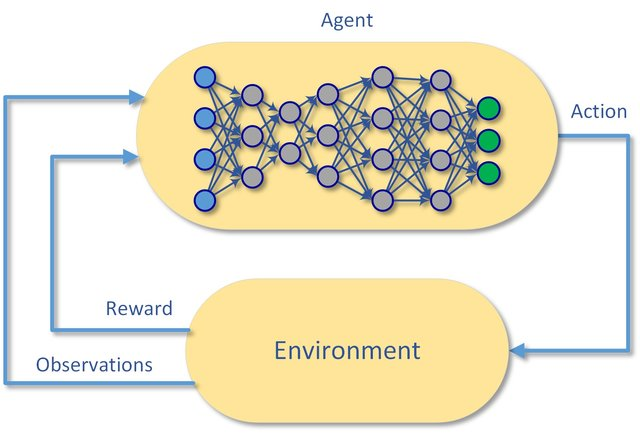

# 3장 개요 — Deep Reinforcement Learning

<!-- 슬라이드 233, 237, 243, 249, 259, 279, 321 : 장 표지 (237 이하는 절 사이에 다시 나오는 같은 목차 표지) -->
<!-- 슬라이드 234~236, 338~340 : 숨김 공백·MEMO 슬라이드, 내용 없음 -->

3장은 2장의 **표(table)를 신경망으로 바꾼다.** 상태가 연속적이거나 너무 많아 $V(s)$, $Q(s,a)$ 를
표로 들고 다닐 수 없을 때, 가치 함수와 정책 함수를 **파라미터 $w$ 를 가진 함수**로 근사한다
(Function Approximation). 그 함수가 Deep Neural Network 이면 심층강화학습(Deep RL)이다. 2장의
Q-Learning 갱신식이 그대로 신경망의 loss 가 되는 Naïve Deep Q-Learning 에서 시작해, 학습을
안정화하는 두 장치(Experience Replay · Target Network)를 더한 DQN, 가치 대신 정책을 직접
학습하는 Policy Gradient(REINFORCE · Actor-Critic), 그리고 연속 행동 공간을 다루는 DDPG 로
나아간다. 실습은 Gym 의 CartPole 과 Pendulum 위에서 Keras 로 진행한다.

**이 장의 구성**

- **3.1 Function Approximation** — Q-table 의 한계, 가치 함수를 파라미터 함수로 근사하기,
  MC · TD · Q-Learning target 을 loss 로 쓰는 Incremental Prediction, 가치 함수 근사의 세 형태.
- **3.2 Deep Neural Network** — Regression 과 Logistic Regression, 이항 · 다항 로지스틱 회귀,
  Softmax. 신경망을 함수 근사기로 쓰기 위한 최소한의 배경.
- **3.3 Naïve Deep Q-Learning** — Q-Learning 의 갱신식을 MSE loss 로 옮긴 Q-Network, CartPole
  실습, 왜 tuning 이 어려운가.
- **3.4 Deep Q-Network(DQN)** — Deep Q-Learning 의 문제점(상관성, moving target), Experience
  Replay 와 Target Network, Sensory input(이미지) 처리, DQN 알고리즘과 CartPole 실습.
- **3.5 Policy Gradient — REINFORCE 와 Actor-Critic** — 목적 함수 $J(\theta)$ 와 Policy Gradient
  Theorem, REINFORCE 와 Baseline · Return Normalization, Actor-Critic · A2C · TD Actor-Critic,
  CartPole 실습과 모델 관리(W&B).
- **3.6 DDPG(Deep Deterministic Policy Gradient)** — 연속 행동 공간, Deterministic Policy
  Gradient, DQN 의 장치를 결합한 Off-policy Actor-Critic, Pendulum 실습.

---

## 이 장을 마치며 — 3장 review
<!-- 슬라이드 337 -->

3장을 다 읽고 나면 다음 항목을 스스로 설명할 수 있어야 한다.

| 절 | 핵심 |
|---|---|
| 3.1 Function Approximation | table 대신 $\hat{v}(s, w)$, $\hat{q}(s, a, w)$. target 은 MC · TD · Q-Learning 에서 |
| 3.2 Deep Neural Network | Regression · Logistic regression · Softmax |
| 3.3 Naïve Deep Q-Learning | Off-policy, continuous state space. Q-table → Q-Network |
| 3.4 DQN(Deep Q-Network) | off-policy, value based. Sensory Input, Experience replay, Target network |
| 3.5 Policy Gradient(REINFORCE, Actor-critic) | stochastic policy. REINFORCE — MC 로 $G_t$ 추정, on-policy, epi. 단위로 묶어서 학습, Return Normalization. Actor-critic — NN 으로 $G_t$ 추정, on-policy. Q Actor-Critic, Advantage Actor-Critic(A2C), TD Actor-Critic |
| 3.6 DDPG(Deep Deterministic Policy Gradient) | continuous action space. DPG + Actor-Critic + RM, TargetNet(DQN) |
