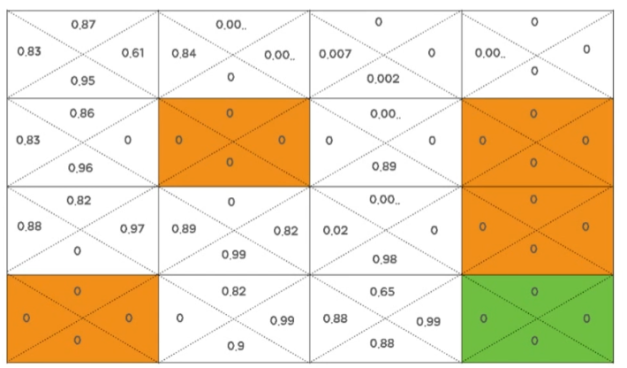
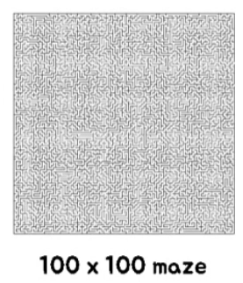
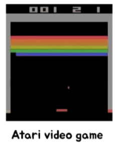
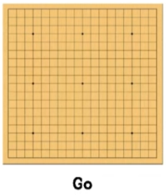
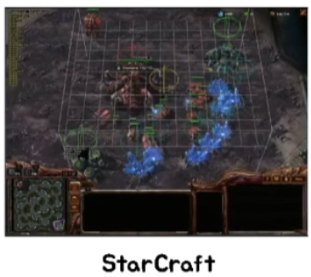
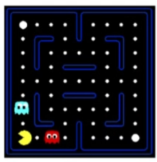
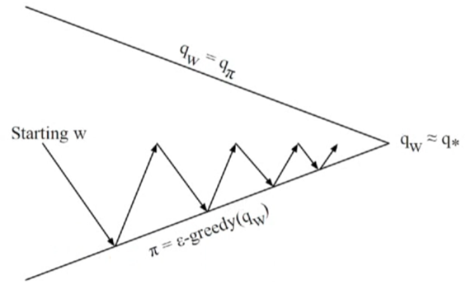
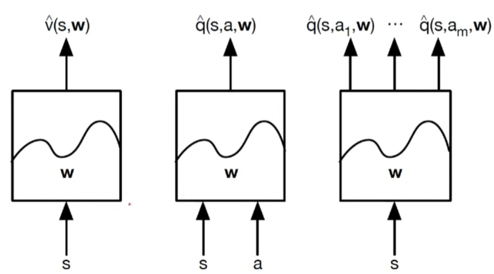

# 3.1 Function Approximation

**학습 목표**

- Q-table 이 커질 때(상태 수 폭증, 연속 상태) 왜 lookup table 을 버리고 가치 함수를 파라미터 함수로
  표현해야 하는지 설명할 수 있다.
- Function Approximation 의 장점 — compact representation 과 generalization — 을 memory ·
  exploration · computation 의 관점에서 말할 수 있다.
- 선형 가치 함수 $\hat{v}(s, w) = x(s)^T w$ 와 MSE loss, gradient descent 갱신을 쓸 수 있다.
- 정답 $v_\pi^*(s)$ 가 없는 RL 에서 MC 리턴 · TD target · Q-Learning target 을 loss 의 target 으로
  쓰는 Incremental Prediction / Control 의 구조를 설명할 수 있다.
- 가치 함수 근사의 세 가지 형태(입력 $s$ → $\hat{v}$, 입력 $(s,a)$ → $\hat{q}$, 입력 $s$ → 모든
  action 의 $\hat{q}$)를 구분하고, DQN 이 어느 형태인지 말할 수 있다.

**이 절의 구성**

- 3.1.1 Function Approximation 개요 — Q-Table 의 한계
- 3.1.2 Approximation 의 장점과 선형 가치 함수
- 3.1.3 Incremental Prediction Algorithm 과 Control with Function Approximation
- 3.1.4 가치 함수 근사의 형태와 Deep Neural Network 이 할 수 있는 것
- 3.1.5 정리

---

## 3.1.1 Function Approximation 개요 — Q-Table 의 한계
<!-- 슬라이드 238 -->

2장의 FrozenLake 환경에서 Q-table 은 16 × 4 = 64 칸이었다. 상태 16 개, 행동 4 개이니 표 하나로
충분하다. 그런데 **더 큰 문제(larger problem)는 어떻게 할까.**

100 × 100 미로는 상태가 10,000 개, Atari 비디오 게임은 화면 픽셀이 상태, 바둑(Go)은 상태 수가
$3^{19 \times 19}$, StarCraft 는 그 이상이다. 이런 문제에 lookup table 을 쓰면

- 너무 많은 memory 가 필요하고,
- 모든 state 에 대한 value 를 학습하기 위해 각 state 를 여러 번 방문해야 하므로 아주 많은 시간이
  필요하며,
- 애초에 **모든 문제를 discrete 으로 표현할 수 없다.**

> **핵심 메시지**
> **Function Approximation(FA)** — Lookup table 을 버리고 $V$, $Q$ 를 **Function 으로 표현**한다.
> 함수는 continuous state 에도 적용할 수 있다.

---

## 3.1.2 Approximation 의 장점과 선형 가치 함수
<!-- 슬라이드 239 -->

### Compact representation & Generalization

- **Memory 감소** : $V(s)$, $Q(s,a)$ table 이 필요 없다.
- **Exploration 감소** : 모든 곳을 여러 번 탐색하여 계산하지 않아도 된다.
- **Computation 감소** : 전체적인 반복 계산이 감소한다.
- **복잡하고 어려운 환경** : 유사한 상황을 **일반화**할 수 있다. 전통적인 RL 에서는 Pac-Man 을
  풀 때 ghost 와의 거리, 남아 있는 점의 수, 큰 점과의 거리 등의 feature $x$ 를 넣어 처리했다 —
  아래 세 장면처럼 배치는 달라도 "ghost 가 가까이 있다" 는 특징은 같은 상태로 묶인다.

### Linear Value Function

가장 단순한 함수 근사는 feature 벡터 $x(s)$ 의 선형 결합이다.

$$
\hat{v}(s, w) = x(s)^T w = \sum_{j=1}^{n} x_j(s)\, w_j
$$

최적의 parameter vector $w$ 를 찾아야 한다. 기준은 참값과의 **Mean Square Error** 다.

$$
L(w) = E_\pi\big[ \big( v_\pi^{*}(s) - \hat{v}(s, w) \big)^2 \big]
$$

이것이 최소가 되도록 parameter 를 update 한다 — **Gradient descent** 로 local minimum 을 찾는다.

$$
\Delta w \mathrel{+}= -\tfrac{1}{2}\,\alpha\, \nabla_w L(w)
$$

여기서 질문이 하나 남는다. **모르는 정답 $v_\pi^{*}(s)$ 는 어떻게 구하지?** 지도학습은 레이블이
있지만 RL 에는 없다.

---

## 3.1.3 Incremental Prediction Algorithm 과 Control with Function Approximation
<!-- 슬라이드 240 -->

### Incremental Prediction Algorithm

$v_\pi^{*}(s)$ 를 target 으로 사용해야 하는데 RL 은 target 이 없다. 그래서 **점진적으로 좋아지는
target** 을 사용한다. loss $L(w) = E_\pi[(v_\pi^{*}(s) - \hat{v}(s,w))^2]$ 를 계산하기 위해 2장의
두 방법을 그대로 가져온다.

- **MC** 에서는 $G_t$ 를 target 으로 사용했으므로, $v_\pi^{*}(S)$ 를 $G_t$ 로 대체한다.
  $$L(w) = E_\pi\big[ (G_t - \hat{v}(s, w))^2 \big]$$
  $G_t$ 의 분산이 커서 학습이 쉽지 않다.
- **TD** 에서는 target 으로 $R_{t+1} + \gamma \hat{v}(s_{t+1}, w)$ 를 사용한다.
  $$L(w) = E_\pi\big[ (R_{t+1} + \gamma \hat{v}(s_{t+1}, w) - \hat{v}(s, w))^2 \big]$$

target 자체가 $w$ 로 만들어지므로, **학습 과정에서 target 과 함께 좋아지게 된다.** 이것이 2장의
bootstrap 을 함수 근사로 옮긴 것이다.

### Control with Function Approximation

Policy improvement 를 하려면 $Q$ 를 사용해야 한다. $\hat{q}(s, a, w) \approx q_\pi^{*}$ 가 되도록
학습하자 — 행동은 epsilon greedy 로, $\pi = \epsilon\text{-greedy}(q_w)$.

$$
L(w) = E_\pi\big[ \big( R_{t+1} + \gamma \max_{a'} \hat{q}(s_{t+1}, a', w) - \hat{q}(s_t, a_t, w) \big)^2 \big]
$$

**Q-Learning 의 target** 을 그대로 쓴 것이다. 아래 그림은 이 과정을 정책 반복의 그림으로 나타낸
것 — $w$ 에서 시작해 $q_w \approx q_\pi$(평가)와 $\pi = \epsilon\text{-greedy}(q_w)$(개선) 사이를
오가며 $q_w \approx q_*$ 에 수렴한다.

---

## 3.1.4 가치 함수 근사의 형태와 Deep Neural Network 이 할 수 있는 것
<!-- 슬라이드 241~242 -->
<!-- 슬라이드 242 : 숨김 MEMO 슬라이드, 내용 없음 -->

### Type of Value Function Approximation

- **Input $s$** : Image, vector, continuous value — 무엇이든 함수의 입력이 된다.
- **Output** : 학습된 FA model 에 의해 출력이 결정된다. 세 가지 형태가 있다.

**DQN 은 오른쪽 형태**다 — 입력 $s$ 에 대해 **action 별 $q$ 값**을 한 번에 출력한다. 그래야
$\max_{a'} \hat{q}(s', a', w)$ 를 한 번의 forward pass 로 얻을 수 있다.

### Deep Neural Network 이 할 수 있는 것

신경망은 세 가지 모두를 근사할 수 있다.

- **Value function modeling** — 3.3, 3.4 (DQN)
- **Policy function modeling** — 3.5 (Policy Gradient)
- **Env. modeling (Model)** — model-based RL

---

## 3.1.5 정리
<!-- 이 절의 요약. 원문에 별도의 review 슬라이드는 없다 -->

- 상태가 많거나 연속이면 Q-table 을 쓸 수 없다. **가치 함수를 파라미터 $w$ 를 가진 함수로
  근사**하면 memory · exploration · computation 이 줄고, 유사한 상태로 일반화된다.
- 선형 근사 $\hat{v}(s,w) = x(s)^T w$ 에서 loss 는 MSE, 갱신은 gradient descent 다.
- RL 에는 정답 레이블이 없으므로 **MC 리턴, TD target, Q-Learning target** 을 loss 의 target 으로
  쓴다. target 도 $w$ 로 만들어지므로 함께 좋아진다.
- 근사기의 세 형태 중 DQN 은 "입력 $s$ → 모든 action 의 $\hat{q}$" 형태다. 신경망은 가치 · 정책 ·
  환경 모델 어느 것이든 근사할 수 있다.
