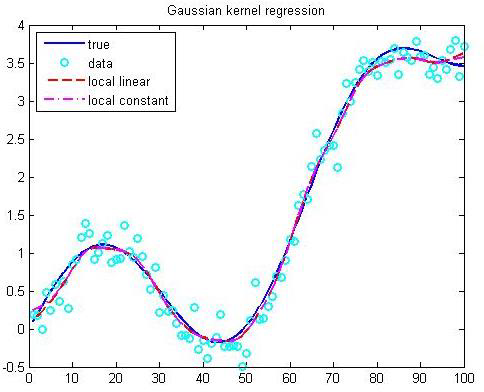
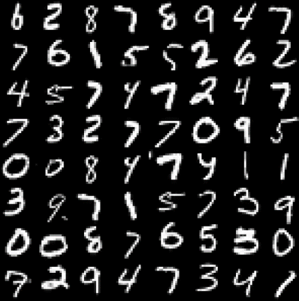
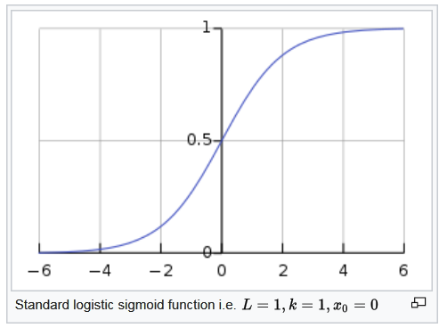
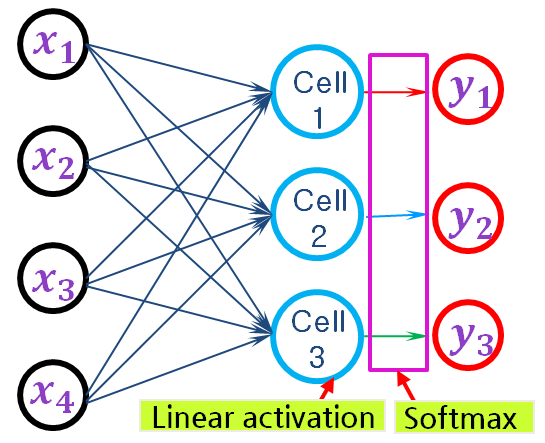

# 3.2 Deep Neural Network

**학습 목표**

- Regression(값 추정)과 Logistic regression(분류)의 차이를 말하고, 확률 → odds → logit → logistic
  함수의 관계를 설명할 수 있다.
- 이항 로지스틱 회귀가 "선형 회귀 + sigmoid" 이며 하나의 뉴런과 같은 구조임을 설명할 수 있다.
- 다항 로지스틱 회귀가 $d$ 차원 입력을 합이 1 인 $m$ 개 확률로 사상하는 함수 $Y = \sigma(XW + b)$
  이고, softmax 가 cell 밖의 layer 로 동작하는 이유를 설명할 수 있다.

**이 절의 구성**

- 3.2.1 Regression — Linear, Nonlinear, Logistic
- 3.2.2 이항 로지스틱 회귀(Binomial logistic regression)
- 3.2.3 다항 로지스틱 회귀(Multinomial logistic regression)와 Softmax
- 3.2.4 정리

이 절은 3.3 이후에서 Q-Network · Policy Network 를 만들 때 필요한 신경망의 최소 배경을 압축한
것이다. Deep Learning 의 전반은 강의 1장(이 교재에서는 목차만 수록)에서 다룬다.

---

## 3.2.1 Regression — Linear, Nonlinear, Logistic
<!-- 슬라이드 244 -->

**Regression** 은 어떤 입력 데이터에 대해, 출력에 영향을 주는 조건을 고려한 **평균값을 구하는
것**이다.

**Linear regression / Nonlinear regression — Value 추정.** 모델이 선형 결합이면 linear, 아니면
nonlinear regression 이다.

**Logistic regression — Classification(분류).** 출력에 logistic function 을 적용한다. Logistic 은
원래 물류 · 병참, 즉 "적절한 것을 적절한 곳에 제공하는" 이라는 뜻이다. 손글씨 숫자 이미지를 0~9
로 분류하는 것이 대표적 예다.

### Logistic function

Logistic function 은 $\mp\infty$ 의 값을 **존재할 확률(0~1)로 변환**한다(logit 의 역변환). 확률에서
출발해 세 단계로 이어진다.

$$
\text{확률 } p \;\Rightarrow\; \text{승산(odds)} : \frac{p}{1-p}
\;\Rightarrow\; \text{logit} : \log\Big( \frac{p}{1-p} \Big) = y
$$

$$
\text{logistic(sigmoid)} : \frac{1}{1 + e^{-x}} \;\Rightarrow\; \text{확률 } p
$$

Standard logistic sigmoid function 은 일반형 $f(x) = L / (1 + e^{-k(x - x_0)})$ 에서
$L = 1, k = 1, x_0 = 0$ 인 경우다. 딥러닝에서 "sigmoid" 라 부르는 것이 바로 이것이다.

---

## 3.2.2 이항 로지스틱 회귀(Binomial logistic regression)
<!-- 슬라이드 245 -->

Logistic regression 은 종속변수 $y$ 가 범주형(categorical)인 Classification 이다. 출력 범주의 수에
따라 **이항(Binomial)** 과 **다항(Multinomial)** logistic regression 으로 나뉜다 — 범주의 수가
2(이항) 또는 3 이상(다항)이고, 출력은 범주의 확률값(sum to 1)이다.

**이항 로지스틱 회귀**는 두 범주를 분리하는 하나의 출력을 낸다. 출력에 logistic function(sigmoid
func.)을 적용하며, $d$ 개의 실수 정보 $x$ 를 1 개의 확률 값에 mapping 하는 함수를 찾는 것이다.

$$
f : \mathbb{R}^d \longrightarrow \mathbb{R}^1_{\,0 \sim 1}
$$

예를 들어 Input features $x \in \mathbb{R}^d$ 가 Age, Height, Weight, Blood pressure, … 이고
Outputs $y \in \mathbb{R}^1_{\,0\sim1}$ 가 Clean(0) / Cancer(1) 인 진단 문제다.

**Linear regression + logistic function.**

$$
y_1 = \sigma( b + w_1 x_1 + w_2 x_2 + \cdots + w_d x_d ) = \sigma\Big( \sum_i w_i x_i + b \Big),
\qquad \sigma : \text{sigmoid func.} = \frac{1}{1 + e^{-x}}, \text{ nonlinear func.}
$$

이 식은 **뉴런 하나**와 같다. 입력 $x_i$ 에 가중치 $w_i$ 를 곱해 더하고($\sum_i w_i x_i + b$),
활성화 함수 $f$ 를 통과시킨 것이 출력이다.

---

## 3.2.3 다항 로지스틱 회귀(Multinomial logistic regression)와 Softmax
<!-- 슬라이드 246~248 -->
<!-- 슬라이드 248 : 숨김 MEMO 슬라이드, 내용 없음 -->

**다항 로지스틱 회귀**를 사용한 Multi class Classification 은 Logistic regression 의 출력을 여러
개로 확장한 것이다. 다수 출력을 확률로 변환해야 하며, $d$ 개의 실수 정보 $x$ 를 $m$ 개의 확률
값에 mapping 하는 함수를 찾는 것이다. 각 값이 확률이므로 합하면 1 이다(Sum to 1).

$$
f : \mathbb{R}^d \longrightarrow \mathbb{R}^m_{\,\text{sum to 1}}
$$

같은 진단 예에서 Input features $x \in \mathbb{R}^d$ (Age, Height, Weight, Blood pressure, …)를
Outputs $y \in \mathbb{R}^m_{\text{sum to 1}}$ (Clean, Cancer, Cold, High blood pressure, …)로 보낸다.

### 함수 $f$ 를 matrix 로 표현하면

$d$ 개의 실수 정보 $x$ 를 $m$ 개의 확률(sum to 1)로 mapping 하는 함수 $f$ 를 선형 결합으로
표현하면 다음과 같다.

$$
[\, x_1\ x_2\ \cdots\ x_d \,]_{1 \times d} \cdot W_{d \times m} + [\, b \,] = [\, y_1\ y_2\ \cdots\ y_m \,]_{\text{sum to 1}}
$$

$$
f : Y = \sigma(X \cdot W + b), \qquad \sigma = \text{softmax} \text{ (sum to 1 변환 함수)}, \quad W \in \mathbb{R}^{d \times m}
$$

**Training 의 목표**는 $Y = f(X)$ 인 $f(\cdot)$ 를 만드는 것, 즉 주어진 dataset 에서 최적의
parameter $W$, $b$ 를 찾는 것이다.

### Softmax activation 의 위치

**Softmax activation 은 cell 밖에 있고 layer 로 동작한다.** 구현상 Cell 내부에 activation 이
없고(linear activation), 다음 layer 에 activation 함수를 명시한다. sigmoid 는 뉴런 하나의 출력만
보고 계산할 수 있지만, softmax 는 **모든 출력 cell 의 값을 함께** 보아야 합이 1 이 되도록 정규화할
수 있기 때문이다.

---

## 3.2.4 정리
<!-- 이 절의 요약. 원문에 별도의 review 슬라이드는 없다 -->

- Regression 은 조건부 평균을 추정한다. Logistic regression 은 그 위에 logistic(sigmoid) 함수를
  얹어 확률(0~1)을 내는 분류 모델이다. 확률 → odds → logit 이 sigmoid 의 역변환이다.
- 이항 로지스틱 회귀 $y = \sigma(\sum_i w_i x_i + b)$ 는 **뉴런 하나**다.
- 다항 로지스틱 회귀 $Y = \text{softmax}(XW + b)$ 는 $d$ 차원 입력을 합이 1 인 $m$ 개 확률로
  보낸다. softmax 는 cell 밖의 layer 로 구현된다.
- 3.3 의 Q-Network 는 마지막 층이 **linear activation** 이다 — $Q$ 값은 확률이 아니라 실수이기
  때문이다. 3.5 의 Policy Network 는 마지막 층이 **softmax** 다 — 행동 확률을 내기 때문이다.
