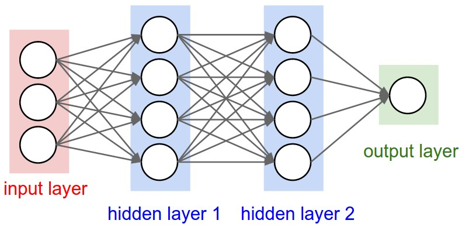
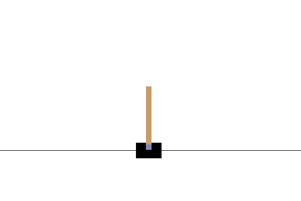
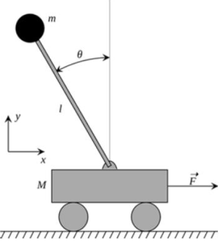
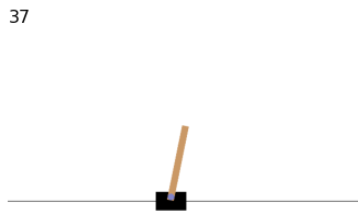
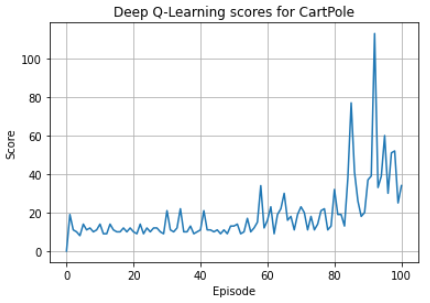
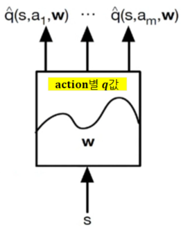

# 3.3 Naïve Deep Q-Learning

**학습 목표**

- Q-Learning 의 갱신식 $Q(s,a) \mathrel{+}= \alpha(r + \gamma \max_{a'} Q(s',a') - Q(s,a))$ 가
  신경망에서는 MSE loss $L(w)$ 와 batch 단위 gradient update 로 바뀌는 과정을 설명할 수 있다.
- Target Q · Predicted Q · Current Q 세 항의 뜻과, Predicted Q 가 "다음 상태 $s'$ 를 같은 network
  에 다시 넣어 얻은 출력" 이라는 점을 말할 수 있다.
- Gym 의 CartPole 환경(상태 4 차원, 행동 2 개, 보상 · 종료 조건)을 설명하고 기본 interaction
  코드를 쓸 수 있다.
- Keras 로 Q-Network 를 만들고, $\epsilon$-greedy 행동 정책과 `fit(s, target)` 학습 루프로 Naïve
  Deep Q-Learning 을 구현할 수 있다.
- 이 단순한 구현이 왜 tuning 이 어렵고 불안정한지 관찰하고, 다음 절 DQN 의 동기를 말할 수 있다.

**이 절의 구성**

- 3.3.1 Deep Q-Learning — Q-Learning 의 갱신식을 신경망 loss 로
- 3.3.2 실습 3.3.1 — Deep Q-Learning 으로 CartPole 학습
- 3.3.3 실습과제 — 100 episode 에서 성능 높이기
- 3.3.4 정리 — Review

---

## 3.3.1 Deep Q-Learning — Q-Learning 의 갱신식을 신경망 loss 로
<!-- 슬라이드 250 -->

이 절의 제목에 붙은 "Naïve" 와 "(!DQN)" 은 같은 뜻이다 — 아직 DQN 이 **아닌**, Q-Learning 에
신경망을 곧바로 끼워 넣은 가장 소박한 형태다.

### Q-Learning — Off-policy

2.7 절의 Q-Learning 알고리즘을 다시 적는다. 행동 정책은 $\epsilon$-greedy, 평가 정책은 greedy 다.

1. Init. : $Q(s,a) \leftarrow 0$
2. Episode Repeat :
   - $s \leftarrow$ 현재 상태 관측
   - Repeat :
     - $a \leftarrow Q(s,a)$ 에서 $\epsilon$-greedy $\mu$ 로 action 선택 (행동 정책 $\mu$)
     - $s', r \leftarrow$ `env.step(a)`, 행동을 시행
     - $Q(s,a) \mathrel{+}= \alpha\,[\, r + \gamma \max_{a'} Q(s',a') - Q(s,a) \,]$ (평가 정책 $\pi$)
     - $s \leftarrow s'$
   - until : $s == T$

### Deep Q-Learning

$Q$ table 을 신경망 $Q(s_t, a)$ 로 바꾼다. 입력은 상태 $s_t$, 출력은 action 별 $Q$ 값이다.



TD method 로 표현된 **FA loss** 는 3.1 절의 Control with Function Approximation 그대로다.

$$
L(w) = E_\pi\Big[ \big( (R_{t+1} + \gamma \max_a Q(s', a')) - Q(s_t, a_t) \big)^2 \Big]
$$

세 항의 이름을 붙여 두면 뒤가 편하다.

- **Target Q** : $R_{t+1} + \gamma \max_a Q(s', a')$ — 맞추어야 할 값.
- **Predicted Q** : $\max_a Q(s', a')$ — **next $s'$ 를 network 에 다시 넣어서 얻은 출력.** target 을
  만드는 데 쓰인다.
- **Current Q** : $Q(s_t, a_t)$ — 지금 network 가 내는 값. 이것을 target 쪽으로 밀어낸다.

NN 이 포함되면 Q update 식 $Q(s,a) \mathrel{+}= \alpha[\, r + \gamma \max_{a'} Q(s',a') - Q(s,a) \,]$ 은
**batch 단위로 Loss 를 계산해서 parameter 를 update** 하도록 수정된다.

$$
L(\theta) = E\big( r + \gamma \max_{a'} Q(s', a') - Q(s,a) \big), \qquad
\theta \mathrel{-}= \alpha\, \nabla_\theta\, E\big( r + \gamma \max_{a'} Q(s',a') - Q(s,a) \big)
$$

table 의 한 칸을 고치던 것이, 신경망 전체 파라미터 $\theta$ 를 loss 의 기울기 방향으로 조금 움직이는
것으로 바뀐다. 한 칸을 고치면 다른 칸은 그대로였지만, $\theta$ 를 움직이면 **모든 상태의 $Q$ 가
함께 변한다** — 이것이 일반화의 힘이자 다음 절에서 보게 될 불안정의 원인이다.

---

## 3.3.2 실습 3.3.1 — Deep Q-Learning 으로 CartPole 학습
<!-- 슬라이드 251~256 -->

> 노트북: `code/3.3.1.NaiveDeepQ-Learning.ipynb`
> [](https://colab.research.google.com/github/AI-BoostCamp/ReinforcementLearning/blob/main/code/3.3.1.NaiveDeepQ-Learning.ipynb)
> PyTorch 구현: `code/3.3.1.pt.NaiveDeepQ-Learning.ipynb`
> [](https://colab.research.google.com/github/AI-BoostCamp/ReinforcementLearning/blob/main/code/3.3.1.pt.NaiveDeepQ-Learning.ipynb)

Gym Env. 로 제공되는 CartPole 을 학습해 본다 — CartPole 환경을 알아보고, Deep Q-Learning 을
통해 학습하며, Deep Q-Learning 의 구현 방법을 확인한다.

### CartPole Env.

(참고: https://www.gymlibrary.dev/environments/classic_control/cart_pole)

- **목표** : pole 균형 잡기.
- **State** : start state 는 $U(-0.05, 0.05)$ 의 작은 난수. 관측은 4 차원이다.
- **Reward** : 매 time step 마다 1. 오래 버틸수록 보상이 쌓인다.
- **Episode End** : Pole Angle $\geq \pm 12°$, Cart Position $\geq \pm 2.4$, 또는 Episode length $\geq 500$.

| Num | Observation | Min | Max |
|---|---|---|---|
| 0 | Cart Position | -4.8 | 4.8 |
| 1 | Cart Velocity | -Inf | Inf |
| 2 | Pole Angle | ~ -0.418 rad (-24°) | ~ 0.418 rad (24°) |
| 3 | Pole Angular Velocity | -Inf | Inf |

| Num | Action |
|---|---|
| 0 | Push cart to the left |
| 1 | Push cart to the right |





### Gym 개요와 CartPole 시행 기본 process

Gym(https://www.gymlibrary.ml/)은 강화학습을 위한 **표준 API** 이며 다양한 reference environments
의 모음이다. 강화학습 알고리즘을 개발하고 비교하기 위한 toolkit 으로, Agent 의 구조에 대해서
가정을 하지 않는다. 강화학습 알고리즘을 적용할 테스트 문제(환경)들의 모음이며, 이 환경들은
인터페이스를 공유해 일반적인 알고리즘을 검증할 수 있게 해 준다.

> 참고 노트북: `code/3.3.0.cartpole_visualize.ipynb`
> [](https://colab.research.google.com/github/AI-BoostCamp/ReinforcementLearning/blob/main/code/3.3.0.cartpole_visualize.ipynb)
> 아래의 기본 process 와 결과 시각화(snapshot · video clip) 코드가 들어 있다.

가장 단순한 제어 규칙 — pole 이 왼쪽으로 기울면(angle < 0) cart 를 왼쪽으로, 아니면 오른쪽으로 —
로 환경을 돌려 보는 것이 기본 process 다. `env.step(action)` 이 (관측, 보상, 종료, 정보)를 돌려주는
구조는 2장의 Gridworld 와 같다.

```python
env = gym.make("CartPole-v1", render_mode="rgb_array")

observation,_ = env.reset()
action_l = []
for i in range(500): # while True:
    plt.figure(figsize=(5,3))
    plt.imshow(env.render())
    plt.text(0,0,str(i),fontsize=10)
    ###
    if observation[2] < 0 : # pole angle
      action = 0            # push to the left
    else: action = 1        #        ``   right
    action_l.append(action)
    ###
    observation, reward, done , info, _ = env.step(action)
    if done: break;
    else: plt.show()
env.close()
print(f'Length[{len(action_l)}]:{action_l}')
```

### 결과 시각화 — Snap shot 과 Video clip

Colab 에는 화면이 없으므로 `env.render()` 가 돌려주는 rgb 배열을 그림으로 찍는다.
`render_as_image()` 는 한 step 의 snapshot 을 그리고 이전 출력을 지워 애니메이션처럼 보이게 한다
(`lib/render.py`).

```python
def render_as_image(env, step=0):
    img = env.render()
    if isinstance(img, list): img = img[0]
    if img.ndim == 4: img = img.squeeze(0)
    plt.imshow(img)
    plt.text(5, 5, f"step: {step}", fontsize=12, color='white',
             bbox=dict(facecolor='black', alpha=0.5))
    plt.axis('off')
    ipython_display(plt.gcf())
    clear_output(wait=True)
```

```python
from render import  render_as_image

def run_cartpole(env,step=500):
    observation, _ = env.reset()
    for i in range(step):
        render_as_image(env,step=i)
        if observation[2] < 0 : # pole angle
          action = 0            # push to the left
        else: action = 1        #        ``   right
        observation, reward, done , info, _ = env.step(action)
        if done: break;
    env.close()

run_cartpole(env,100)
```



Video clip 은 `gymnasium.wrappers.RecordVideo` 로 환경을 감싸(`wrap_env`) 실행하면 `video/`
폴더에 mp4 와 meta.json 이 만들어지고, `show_video()` 가 그것을 base64 로 읽어 노트북 안에서
재생한다. 가상 디스플레이(`pyvirtualdisplay`)가 필요하다.

```python
from gymnasium.wrappers import RecordVideo  ## Moniter<=0.21.0
def wrap_env(env,path="",name_prefix='cart_pole'):
  env = RecordVideo(env,
                    video_folder=path+'video',
                    video_length=1000,
                    name_prefix=name_prefix)
  return env
```

```python
from render import  show_video, wrap_env
from pyvirtualdisplay import Display
display = Display(visible=0, size=(400, 300))
display.start()

env_v = wrap_env(env)
run_cartpole(env_v)
show_video()
```

```text
video/
├── cart_pole-episode-0.meta.json
└── cart_pole-episode-0.mp4
```

### Q-Network 구성

이제 규칙 대신 신경망이 행동을 고른다. 입력은 4 차원 관측(position, velocity, angle, angular
velocity), 출력은 2 개 action 의 $Q$ 값이다. 은닉층은 ReLU 두 층, **출력층은 linear** — $Q$ 값은
확률이 아닌 실수이기 때문이다. loss 는 `mse`, optimizer 는 Adam(learning rate 0.001, weight decay 0.02).

```python
# (position,velocity,angle,angular_velocity)
input_d = env.observation_space.shape[0] # 4
output_d = env.action_space.n            # 2(left,right)

def NeuralNetwork():
    model=Sequential()
    model.add(keras.Input(shape=(input_d,)))        # input:4
    model.add(Dense(32, activation='relu'))
    model.add(Dense(32, activation='relu'))
    model.add(Dense(output_d, activation='linear')) # output:2
    model.compile(loss='mse', optimizer=tf.optimizers.Adam(0.001,weight_decay=0.02))
    return model

q_network = NeuralNetwork()
q_network.summary()
```

```text
Layer (type)                 Output Shape              Param #
=================================================================
dense (Dense)                (None, 32)                160
dense_1 (Dense)              (None, 32)                1056
dense_2 (Dense)              (None, 2)                 66
=================================================================
Total params: 1282 (5.01 KB)
```

**행동 정책** : $a \leftarrow Q(s,a)$ 에서 임의의 정책 $\mu$ 로 action 을 선택한다. $\epsilon$-greedy
로, exploration 이면 random action, exploitation 이면 Q-Network 에서 $q$ 값을 추정해 argmax 를 고른다.

```python
def get_action(state,epsilon): #epsilon greedy policy
    if(np.random.random() < epsilon): # exploration
        a = np.random.randint(0, env.action_space.n)
    else:                             # exploitation
        ## Q-Network에서 q값 추정
        q = q_network.predict(state, verbose=0)
        a = np.argmax(q[0])
    return a
```

### Q-Network Learning

$Q(s,a) \mathrel{+}= \alpha(r + \gamma \max_{a'} Q(s',a') - Q(s,a))$ (평가 정책 $\pi$)를 loss 로 옮기면

$$
Loss = E_\pi\Big[ \big( (R_{t+1} + \gamma \max_{a'} \hat{Q}(s_{t+1}, a')) - Q(s_t, a_t) \big)^2 \Big] = MSE(target, Q(s_t, a_t))
$$

이고, `q_network.fit(s, target)` 이 $Q(s)$ 와 target 이 같아지도록 'mse' loss 로 학습한다.
`model_learning()` 의 순서를 따라가 보자.

1. `target = q_network.predict(ns)` — 다음 상태 $s'$ 를 **같은 network** 에 넣어 (1, 2) 모양의
   $Q(s', \cdot)$ 을 얻는다. 이것이 Predicted Q 다.
2. 선택된 action $a$ 자리만 바꾼다. Terminal 이면 `target[0][a] = r`, 아니면
   `target[0][a] = r + gamma * np.max(target)`. **선택하지 않은 action 의 값은 그대로** 두어 그
   쪽에는 loss 가 생기지 않게 한다.
3. `q_network.fit(s, target, epochs=1)` — 현재 상태 $s$ 에 대한 출력(Current Q)이 target 을 향하게
   한 step 학습한다.

```python
## Q-network Tranining
gamma     = 0.99 # 할인율
def model_learning(s,a,r,ns,done,print_q=False):
    s = s.reshape(1,4)
    ns = ns.reshape(1,4)
    target = q_network.predict(ns, verbose=0)  #(1,2)
    if done:     # Terminal 이면 현재 reward가 Target
        target[0][a] = r    #
    else:        # Target = r+ gamma*max_aQ'(s',a')
        target[0][a] = r + gamma * np.max(target)
    if print_q :
        current = q_network.predict(s, verbose=0)  #(1,2)
        print(f"curent:{current[0]}")
        print(f"target:{target[0]}")
    history = q_network.fit(s, target, epochs=1, verbose=0)
    return history.history['loss'][0]
```

### Main loop

에피소드마다 환경을 reset 하고, 종료까지 매 step $\epsilon$-greedy 로 행동 → `env.step` → **한
sample 로 즉시 `model_learning`** 을 반복한다. 최근 5 에피소드의 평균 점수가 기준(20)을 넘으면
greedy 정책으로 5 에피소드를 평가(`q_net_eval`)하고, 최고 기록이면 모델을 저장한다. 평균이 50 을
넘으면 멈춘다.

```python
def q_net_eval(n_episode):
  mean_score = 0
  for i in range(n_episode):
      s,_ = env.reset()
      score = 0                # Eps.별 보상
      while True :                    # Termination 까지
          a = q_network.predict(s.reshape(1,4),verbose=0)
          a = np.argmax(a)
          s, r, done, _, _ = env.step(a)# step(a)
          score += r                  # episode내 reward
          if done : break
      mean_score += score/n_episode
  print(f'Evaluation score:{mean_score:.1f}')
  return mean_score
```

```python
save_path = './model_save.keras'
env.reset()
q_network = NeuralNetwork()

n_episode = 50
eps = epsilon = 0.5 # 0.2
scores=[0]     # Eps.별 누적보상
losses=[]
max_eval_score = 20

# RL Training loop
for i in range(n_episode):
#    eps =  epsilon*(n_episode-i)/n_episode
    s, _ = env.reset()                 # s <- random
    score = loss = 0                # Eps.별 보상
    while True :                    # Termination 까지
        a = get_action(s.reshape(1,4),eps)# epsilon greedy policy
        ns, r, done, info, _ = env.step(a) # step(a)
        loss = model_learning(s,a,r,ns,done) # Training
        s = ns
        score += r                  # episode내 reward
        if done : break
    scores.append(score)
    losses.append(loss)
    mean_score = np.mean(scores[-5:])
    print(f'Eps.[{i:03d}], mean_score:{mean_score:.1f}, score:{score:.1f}, loss:{loss:.4f}, Epsilon:{eps:.4f}')
    if mean_score > max_eval_score : # model evaluation & save
        eval_score = q_net_eval(5)
        if eval_score > max_eval_score :
            max_eval_score = eval_score
            q_network.save(save_path)
            print(f"Saved model({eval_score:.1f})")
    if mean_score > 50 : break
env.close()
```

학습 곡선과 loss 를 그린다.

```python
plt.figure(figsize=(10,3))
plt.subplot(121)
plt.title(f"Deep Q-Learning scores for CartPole,Max score:{max(scores)}")
plt.ylabel('Score')
plt.xlabel('Episode')
plt.plot(scores)
plt.grid()

plt.subplot(122)
plt.plot(losses)
plt.semilogy()
plt.grid()
plt.show()
```

학습이 끝나면 저장한 모델을 불러와 greedy 로 실행하며 snapshot 과 video 로 확인한다(Evaluation).

```python
q_network = keras.models.load_model(save_path)
env_v = wrap_env(env, path=path, name_prefix="q2")

state, _ = env_v.reset()
cnt = 0
while True:
    render_as_image(env_v,step=cnt)
    predict = q_network.predict(state.reshape(1,4),verbose=0)
    action = np.argmax(predict)
    state, reward, done, info, _ = env_v.step(action)
    if done or cnt > 50:  break;
    cnt += 1
show_video(path=path,name_prefix='q2')
```

---

## 3.3.3 실습과제 — 100 episode 에서 성능 높이기
<!-- 슬라이드 257 -->

100 episode 안에서 성능을 최대한 높여 보자. 어떤 부분을 tuning 해 볼 수 있을까.

- Epsilon 수정, Epsilon scheduling
- Learning rate 수정
- Model 수정 — Layer 추가, layer node 추가, activation function 수정, weight decay 적용
- 학습 과정의 $Q(s)$ 값을 확인해 보자. Eps. 진행에 따른 $Q(s)$ 값의 변화는 어떤 의미일까?
  Loss 의 변화와의 관계를 검토해 보자.



`model_learning(..., print_q=True)` 로 current 와 target 을 찍어 보면 학습이 어떻게 진행되는지
보인다. 학습 초기에는 두 값이 모두 0 근처인데 target 의 선택된 action 자리에만 보상 1 이 더해져
`1.00…` 이 나타난다.

```text
curent:[-0.00091765  0.02097313]
target:[0.00789878 1.0078198 ]
curent:[ 0.00902594 -0.00187754]
target:[0.01412994 1.0139886 ]
curent:[0.01433982 0.00078514]
target:[1.004105   0.00116777]
…
```

학습이 진행되면 $Q$ 값이 커진다 — 오래 버티면 보상이 쌓이므로 $Q$ 는 "앞으로 몇 step 더 버틸
수 있는가" 의 할인된 추정치가 된다. 그러나 target 이 current 보다 계속 앞서 달리고, 마지막 줄처럼
종료 시점에는 target 이 갑자기 1 로 떨어지기도 한다.

```text
target:[12.099862 12.978864]
curent:[12.12663  10.345458]
target:[11.059009  9.002969]
curent:[10.180584  9.025032]
…
target:[1.        5.779841]
Eps.[059], score:20.0, loss:16.3991, Epsilon:0.3000
```

> **핵심 메시지**
> **Tuning 이 쉽지 않다.** 점수가 오르는 듯하다가 무너지고, loss 가 커진다. 다음 절의 DQN 은 이
> 불안정의 원인 두 가지 — 연속 sample 의 상관성과 움직이는 target — 를 짚어 고친다.

---

## 3.3.4 정리 — Review
<!-- 슬라이드 258 -->

**Q-Network 적용**

- Q-Learning 의 Q table 대신, Q function 을 approximate 하는 NN 을 사용한다.
- $Q(s,a)$ : state 를 입력받고 **action 별 value 를 출력**한다. State 는 continuous, action 은
  discrete 다.



- TD method 로 표현된 Q-Network loss
  $$L(w) = E_\pi\Big[ \big( (R_{t+1} + \gamma \max_a Q(s', a')) - Q(s_t, a_t) \big)^2 \Big]$$
  Target Q(첫 항 전체)와 Current Q($Q(s_t, a_t)$) 값이 같아지도록 Q-Net 을 수정한다. Predicted
  Q($\max_a Q(s',a')$)는 target 을 만드는 데 쓰인다.
