# 3.4 Deep Q-Network(DQN)

**학습 목표**

- DQN(2013, DeepMind)의 세 가지 기여 — Sensory input 처리(CNN), Experience Replay, Target Network —
  를 말할 수 있다.
- Naïve Deep Q-Learning 이 수렴하지 못하는 두 원인(sample 간 correlation, non-stationary target)을
  설명하고, 각각을 Experience Replay 와 Fixed Target 이 어떻게 푸는지 설명할 수 있다.
- Atari 화면을 84×84 흑백 4 장 stack 으로 전처리하는 이유(markovian 상태 만들기)를 설명할 수 있다.
- DQN 의 pseudo code 를 쓰고, hard update 와 soft update($\tau$)의 차이를 말할 수 있다.
- Keras 로 Q-Network · Target-Network · Replay Memory 를 갖춘 DQN 을 구현해 CartPole 을 학습시키고,
  mini-batch 단위 target 계산과 주기적 target update 를 코드로 설명할 수 있다.

**이 절의 구성**

- 3.4.1 DQN — Sensory input 으로부터 정책을 배우는 최초의 Deep RL
- 3.4.2 DeepMind 가 주목한 Deep Q-Learning 의 문제점
- 3.4.3 Experience Replay 와 Fixed Target
- 3.4.4 Sensory input 처리 — Image 전처리, Image stacking, Target network
- 3.4.5 DQN Algorithm 과 성능 평가
- 3.4.6 실습 3.4.1 — Deep Q-Network 으로 CartPole 학습
- 3.4.7 실습과제 — Hyper parameter tuning, Atari Breakout
- 3.4.8 정리 — DQN Review

---

## 3.4.1 DQN — Sensory input 으로부터 정책을 배우는 최초의 Deep RL
<!-- 슬라이드 260~261 -->

**DQN(Deep Q-Network)** 은 "Playing Atari with Deep Reinforcement Learning"(2013, DeepMind)에서
제안되었다. 앞 절의 Naïve Deep Q-Learning 과 구별해 (!Naïve Deep Q-Learning)이라 적어 둔다.
**Sensory input 으로부터 정책을 배우는 최초의 Deep RL 모델**이며, 주요 기여는 세 가지다.

- **Sensory input 을 RL agent 에 적용하는 방법 제시** — Game 의 화면을 CNN 을 통해 처리한다.
- **Sample 간의 시간적 연관성을 줄이는 방법 제시** — Experience Replay.
- **Moving Q-target 문제를 해결하는 방법** — Target Network.

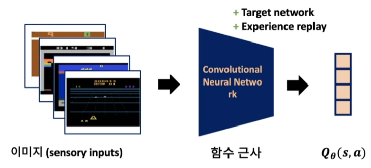

### Q-Learning 의 세 단계

- **Classic Q-Learning** : Q-table 의 최적값을 찾는 문제. 확장성의 제약이 있다.
- **(Naïve) Deep Q-Learning** : NN 으로 FA 를 대치하려는 시도. 학습이 쉽지 않고, case by case
  모델들이 제시되었다.
- **DQN(Deep Q-Network)** : Deep Q-Learning 의 문제점을 개선했다 — Experience replay(Replay
  memory), Target network. Sensory input 처리 방법을 제시했다 — Image data 처리에 CNN 도입.
  이후 **Deep Q-Learning 의 기본 구조**가 되었다.

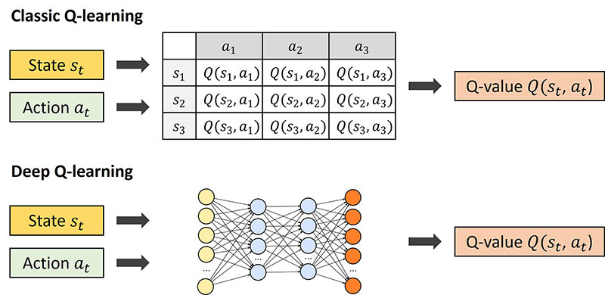


---

## 3.4.2 DeepMind 가 주목한 Deep Q-Learning 의 문제점
<!-- 슬라이드 262 -->

Naïve Deep Q-Learning 은 수렴하지 못하고 불안정하다. 두 가지 문제 때문이다.

1. **Sample 간 Correlations 이 너무 크다.**
2. **Target 이 Non-stationary 하다.**

### Correlations issue

강화학습 시작에서 얻어지는 dataset 의 correlation 이 크다 — 처음 경험하는 정보가 **유사한 정보들로
이루어져** 있다. 연속된 step 의 상태는 서로 비슷하고, 그 시점의 정책이 만든 것이라 편향되어 있다.
아래 그림처럼 국소적으로만 보면 전체와 다른 추세로 fitting 될 수 있다.

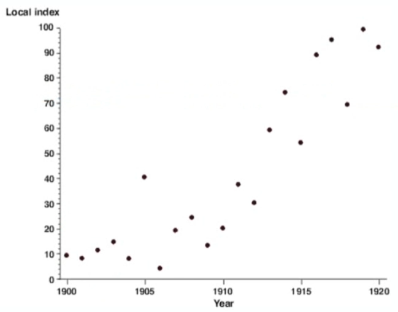

### Non-stationary target issue (moving target issue)

$$
L(w) = E_\pi\Big[ \big( R_{t+1} + \gamma \max_{a'} Q(s', a') - Q(s_t, a_t) \big)^2 \Big]
$$

NN 의 $w$ 를 수정하면, 현재 $Q(s_t, a_t)$ 와 예측한 $Q(s', a')$ 이 **같은 방향으로 움직여** 학습이
진행되지 않는다. 둘이 같은 network 에서 나오므로 서로 너무 얽혀 있다. 당근을 막대에 매달아 앞에
둔 당나귀처럼, 다가가면 목표도 함께 움직인다.

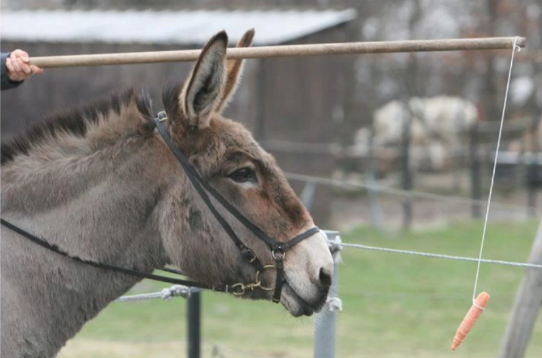

### 제시한 해결책

- **Experience Replay** — 과거의 경험들을 재사용한다.
- **Fixed Target** — Target Network 를 분리하고 고정한다.

---

## 3.4.3 Experience Replay 와 Fixed Target
<!-- 슬라이드 263~264 -->

### Experience Replay(replay buffer) — Correlations issue 해결책

Agent 의 experience 를 저장하고 재사용한다. 최근 경험들은 서로 연관되어 있으므로, **DQN 의 training
data 를 replay buffer 에서 sampling** 하자는 것이 idea 다.

- Random sampling 된 data 는 상관 관계가 줄어들고,
- Agent 의 다양한 경험을 반영할 수 있으며,
- Overfitting 을 줄일 수 있다.
- Queue 로 최근 경험만 저장하고 이전 정보는 삭제한다.

효과는 data 수집 효율 증가, data correlation 감소, 학습 안정성 증가다.

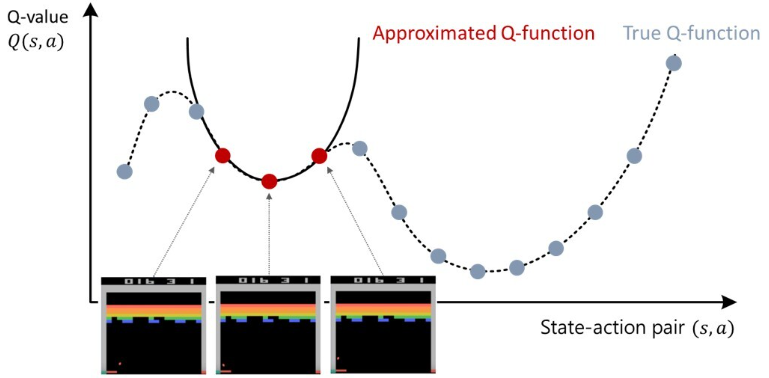

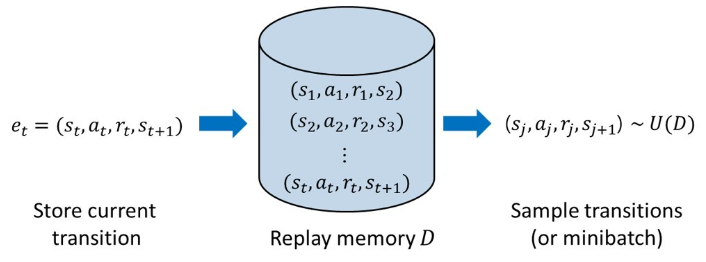

### Fixed Target — Target network 추가

moving target issue 로 $w$ 가 oscillation 하며 학습이 안 된다. 그래서 **target 값을 예측하기 위한
모델(Target network)을 추가**한다 — 기존 Q-network 의 복사본이다. loss 의 target 항에 들어가는
network 를 $Q_t$ 로 분리하면

$$
L(w) = E_\pi\Big[ \big( R_{t+1} + \gamma \max_{a'} Q_t(s', a') - Q(s_t, a_t) \big)^2 \Big]
$$

이고, $Q$ 를 update 해도 $Q_t$ 는 움직이지 않으므로 target 이 고정된다.


---

## 3.4.4 Sensory input 처리 — Image 전처리, Image stacking, Target network
<!-- 슬라이드 265~267 -->

### Image 전처리

Atari 화면은 210 × 160 RGB 다. 이것을 **84 × 84 흑백(b/w)** 으로 줄이고, **이전 화면 4 장을 묶는다**
(현재 + 과거 3 장). 그래서 하나의 image sample 은 84 × 84 × 4 다.

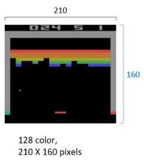

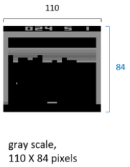

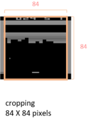

### CNN 구조를 사용한 Q-Network 구성

4 장의 image 를 하나의 sample(input state)로 사용한다. CNN 모델에 state(image sample)를 넣고 출력
$Q(s, a)$ 를 얻어 내며, 출력은 joystick 4 가지 방향(↑ ↓ ← →)이다.

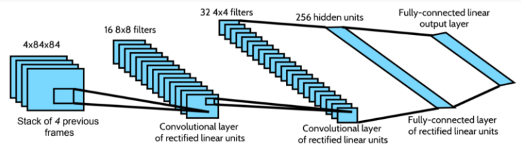

### Image stacking 의 가치

RL 은 MDP 문제를 해결하는 방법인데, 게임 화면 한 장은 markovian 이 아니다 — 공이 어느 방향으로
움직이는지 한 장으로는 알 수 없다. **과거의 이미지를 stacking 하면 non-MDP 를 MDP 로 바꾸는
기법**에 해당한다(참고: "AI, OR and Control Theory: A Rosetta Stone for Stochastic Optimization").

### Sample 간의 correlation 문제 (시간적 연관성) — 다시 보기

$Q(s,a) \leftarrow Q(s,a) + \alpha(r + \gamma \max_{a'} Q(s', a') - Q(s,a))$ 에서, 학습 초기에 network
가 prediction 한 $Q(s,a)$ 와 $Q(s', a')$ 는 불안정하다.

- $\max_{a'}$ operation 의 영향으로 큰 값이 출력된다(maximization bias 문제).
- $\epsilon$-greedy 정책의 영향으로 한 번의 update 에서 값의 변화가 크다.
- MDP 문제이므로 최근의 경험 $(s, a, r, s')$ 들은 서로 깊은 연관성을 가진다.

Experience replay(Replay buffer)를 적용하면 — 최근 experience $(s, a, r, s')$ 를 저장하고(FIFO 구조,
오래된 sample 은 제거), **mini batch 단위로 $Q(s,a)$ 를 update** 하며, sample loss 들의 평균을 사용하게
된다 → correlation 감소, variance 감소.

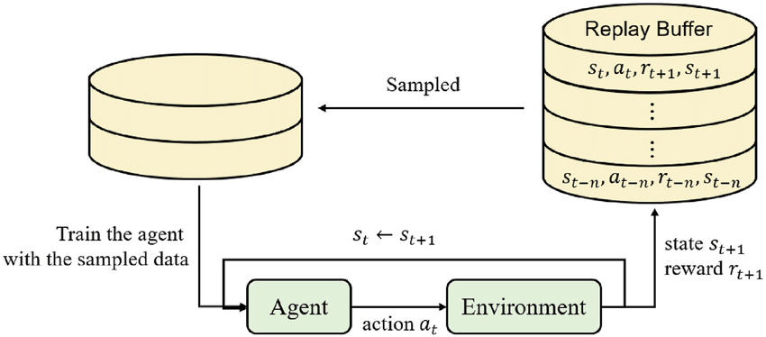

### Target network 도입

Moving target 문제를 해결하기 위해 사용한다. **Q-Net 이 학습하는 동안 target 값을 제공하는 network
를 고정**한다. Target Net 의 출력값과 같은 출력이 되도록 Q-Net 을 학습하고, Q-Net 학습 후 copy 해서
Target Net 을 개선한다.


---

## 3.4.5 DQN Algorithm 과 성능 평가
<!-- 슬라이드 268~270 -->

### DQN Algorithm pseudo code

1. Replay memory $D$ 초기화
2. Q-Net $Q^\theta$, Q-target $Q_t^\theta$ — $Q_t \leftarrow Q$ parameter copy
3. Episode Repeat :
   - $s \leftarrow$ 현재 상태 관측 ($s$ : stacked image sample)
   - Repeat($t = 1, \ldots, T$) — episode 내부 :
     - $a \leftarrow \max_a Q(s,a)$ and $\epsilon$-greedy
     - $s', r \leftarrow$ `env.step(a)`, 행동을 시행
     - $D \leftarrow (s, a, r, s')$
     - $(\tilde{s}, \tilde{a}, \tilde{r}, \tilde{s}') \leftarrow$ random($D$, batch_size)
     - $y = \tilde{r}$ (done) or $\tilde{r} + \gamma Q_t(\tilde{s}, \tilde{a}, \tilde{r}, \tilde{s}')$
     - $\delta \leftarrow \big( y - Q(\tilde{s}, \tilde{a}, \tilde{r}, \tilde{s}') \big)^2$
     - $\theta \leftarrow \theta - \eta \dfrac{\partial \delta}{\partial \theta}$
     - $\theta_t \leftarrow \theta$ — **C-step 에 한 번씩**
   - until : $s == T$

Target Net 을 갱신하는 방식은 두 가지다.

- **Hard update** : C-step 에 한 번씩 Target Net 을 update 한다. C-step 마다 moving target 문제를
  (잠시) 만나게 된다.
- **Soft update** : update 정도를 $\tau$ 만큼만 반영한다.
  $$\theta_t \leftarrow \tau\theta + (1 - \tau)\theta_t$$
  $\tau = 1$ 이면 hard update, $\tau = 0$ 이면 update 하지 않는 것이다.

### DQN 성능 평가 — Atari 2600

Atari 2600 은 data 수집이 쉽고 보상 함수가 잘 정의되어 있다. 그러나 game 에 따라 성능 차이가
많다 — game 에서 step 마다 reward 를 얻을 수 있는지에 따라 성능의 차이가 나며, step 마다 reward 를
얻지 못하는 경우 여전히 학습이 어렵다. 학습에 최소 10 million frame 이 필요하다 — 여전히 sample
efficiency 가 매우 낮다.

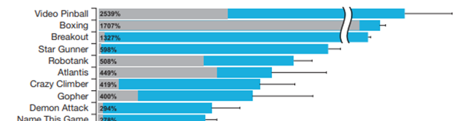

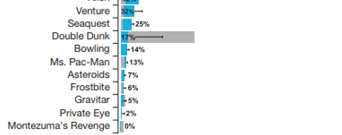

- Breakout : https://youtu.be/TmPfTpjtdgg
- Boxing : https://youtu.be/IM4lG0haB0U

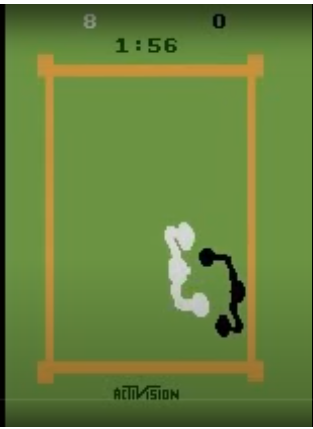

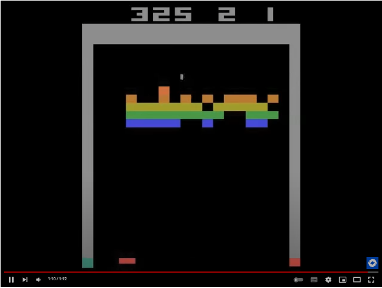

---

## 3.4.6 실습 3.4.1 — Deep Q-Network 으로 CartPole 학습
<!-- 슬라이드 271~276 -->

> 노트북: `code/3.4.1.DeepQ-Learning(DQN).ipynb`
> [](https://colab.research.google.com/github/AI-BoostCamp/ReinforcementLearning/blob/main/code/3.4.1.DeepQ-Learning%28DQN%29.ipynb)
> PyTorch 구현: `code/3.4.1.pt.DeepQ-Learning(DQN).ipynb`
> [](https://colab.research.google.com/github/AI-BoostCamp/ReinforcementLearning/blob/main/code/3.4.1.pt.DeepQ-Learning%28DQN%29.ipynb)

앞 절의 Naïve Deep Q-Learning 에 세 가지를 더한다.

- **Q-Network, Target-Network** : state 와 action 을 mapping 하는 $Q(s_t, a_t)$, $Q_t(s_t', a_t')$.
- **Replay Memory** : RM, `deque(maxlen=…)`.
- **Loss** : $mse\big( q_{net}(s),\ f(t_{net}(s'), r, \gamma) \big)$ — Q-Net 의 출력과, Target-Net 의
  출력으로 만든 target 사이의 MSE.

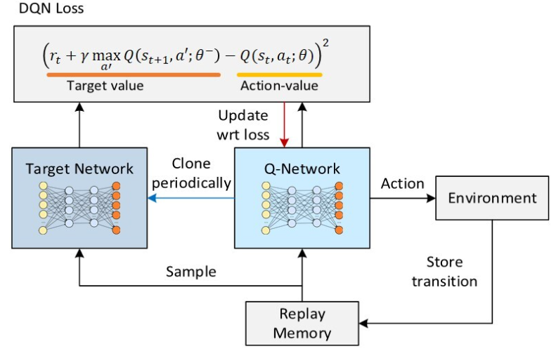

### Q-Network, Target-Network — 3 Layer Neural Network

입력 state(4 차원)에 대한 최적의 action 을 학습한다. 구조는 앞 절과 같고(ReLU 두 층 + linear
출력), **같은 함수로 network 를 두 개** 만든다 — `q_network` 와 `t_network`. 은닉층 크기는 128,
학습률은 0.0005 다.

```python
lr = 0.0005 # defalut : 0.001

input_d = env.observation_space.shape[0]# 4(position,velocity,angle,angular_velocity)
output_d = env.action_space.n           # 2(left,right)

def Network():
    model=Sequential()
    model.add(keras.Input(shape=(input_d,)))        # input:4
    model.add(Dense(128, activation='relu'))
    model.add(Dense(128, activation='relu'))
    model.add(Dense(output_d, activation='linear')) #output:(2,)
    model.compile(loss='mse',optimizer=tf.optimizers.Adam(learning_rate=lr))
    return model

q_network = Network()
t_network = Network()
q_network.summary()
```

### Q-Network Training

$$
L(w) = E_\pi\Big[ \big( (R_{t+1} + \gamma \max_a Q_t(s_{t+1}, a')) - Q(s_t, a_t) \big)^2 \Big]
$$

Target-value 는 **Target-Net** 으로, $Q(s_t, a_t)$ 는 **Q-Network** 로 계산한다. `model_learning()`
의 순서는 다음과 같다.

1. **RM 에서 mini-batch sampling** — `random.sample(RM, batch_siz)` 로 `(s, a, r, s', done)` 튜플
   `batch_siz` 개를 뽑아 열별 배열로 나눈다.
2. **Target Q 값 계산** — `t_network.predict(next_s)` 로 다음 상태의 $Q'$ 를 예측하고 행동 축으로
   max 를 취한다. `target = reward + gamma * max_q_prime * (1 - done)` — 게임이 종료(done=1)된
   sample 은 target 이 reward 만 남는다.
3. **GradientTape 로 학습** — `q_network(state)` 의 출력 중 **실제 선택했던 action 의 $Q$ 값만**
   `tf.gather_nd` 로 뽑아 target 과의 MSE 를 loss 로 하고, gradient 를 Q-Network 에만 적용한다.
   앞 절처럼 "선택된 action 측의 값만 변경, 나머지는 동일한 값 유지" 를 `fit` 대신 mask 로 구현한
   것이다.

```python
import random

gamma = 0.99

# DQN Training (수정된 함수)
def model_learning():
    # 1. RM에서 미니배치 샘플링
    mini_batch = random.sample(RM, batch_siz)
    state = np.array([sample[0] for sample in mini_batch], dtype=np.float32)
    action = np.array([sample[1] for sample in mini_batch], dtype=np.int32)
    reward = np.array([sample[2] for sample in mini_batch], dtype=np.float32)
    next_s = np.array([sample[3] for sample in mini_batch], dtype=np.float32)
    done = np.array([sample[4] for sample in mini_batch], dtype=np.float32) # bool을 float으로 변환 (True=1.0, False=0.0)

    # 2. 타겟 Q 값 계산 (Vectorized)
    # Target-Network에서 다음 상태(next_s)의 Q' 값들을 예측
    target_val = t_network.predict(next_s, verbose=0)
    # 각 샘플에 대해 Q' 값들 중 최댓값을 선택
    max_q_prime = np.max(target_val, axis=1)

    # 벨만 최적 방정식에 따라 타겟값 계산
    # 게임이 종료(done=1.0)된 경우: target = reward
    # 게임이 진행 중(done=0.0)인 경우: target = reward + gamma * max_q'
    target = reward + gamma * max_q_prime * (1 - done)

    # 3. GradientTape를 이용한 모델 학습
    with tf.GradientTape() as tape:
        # Q-Network에서 현재 상태(state)의 Q 값들을 예측
        q_values = q_network(state)

        # 실제 선택했던 행동(action)에 해당하는 Q 값만 추출
        # 예를 들어, action이 [1, 0, 1]이면, 0번 샘플에선 1번 행동의 Q값, 1번 샘플에선 0번 행동의 Q값을 가져옴
        action_indices = tf.stack([tf.range(batch_siz, dtype=tf.int32), action], axis=1)
        q_for_action = tf.gather_nd(q_values, action_indices)

        # 예측된 Q값(q_for_action)과 목표 Q값(target) 사이의 손실(loss) 계산
        loss = loss_function(target, q_for_action)

    # 손실(loss)을 기반으로 경사도(gradient) 계산
    grads = tape.gradient(loss, q_network.trainable_variables)

    # 계산된 경사도를 이용해 Q-Network의 가중치 업데이트
    optimizer.apply_gradients(zip(grads, q_network.trainable_variables))

    return loss.numpy()
```

강의 슬라이드에는 같은 함수의 이전 버전 — `q_network.predict(state)` 로 target 배열을 만들고
`for i in range(batch_siz)` 로 선택된 action 자리에 `reward[i] + gamma * np.amax(target_val[i])` 를
넣은 뒤 `q_network.fit(state, target, batch_size=batch_siz, epochs=1)` 하는 형태 — 가 실려 있다.
동작은 같고, 위 코드는 그것을 벡터화한 것이다.

### Helper function — Target update, $\epsilon$ schedule, 행동 정책

Target Net 은 Q-Net 의 weights 를 통째로 복사한다(hard update).

```python
def update_t_network():
    t_network.set_weights(q_network.get_weights())
    return
```

$\epsilon$ 은 계단형으로 감쇠시킨다 — 전체 에피소드의 1/3 마다 `eps_decay` 배로 줄이고 최소 0.01 을
유지한다.

```python
def eps_schedule(step, eps_start, eps_decay, plot= False):
    eps_decay_step =  n_episode // 3
    epsilon = max(0.01, eps_start*eps_decay**(step//eps_decay_step))
    if plot == True :
        epsilon_l=[]
        for step in range(n_episode):
            epsilon = max(0.01, eps_start*eps_decay**(step//eps_decay_step))
            epsilon_l.append(epsilon)
        plt.plot(epsilon_l)
        plt.grid()
        plt.show()
    return epsilon

n_episode = 100
epsilon = eps_start = 0.5   # epsilon 초기값
eps_decay = 0.6   # 감소율

_ = eps_schedule(0, eps_start, eps_decay, plot=True)
```

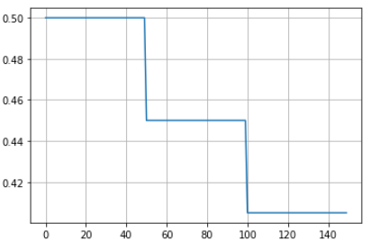

행동 정책은 $\epsilon$-greedy 다. step(에피소드 번호)으로 현재 $\epsilon$ 을 구해 exploration 이면
random, 아니면 Q-Network 의 argmax 를 고른다.

```python
def get_action(step, state): #epsilon greedy policy
    epsilon = eps_schedule(step,eps_start,eps_decay)
    if(np.random.random() < epsilon): # exploration: eps-greedy
        a = np.random.randint(0, env.action_space.n)
    else:                             # exploitation
        ## Q-Network에서 q값 추정
        q = q_network.predict(np.reshape(state,[1,4]), verbose=0)
        a = np.argmax(q[0])           # greedy
    return a, epsilon
```

### Training Main Loop

매 step 마다 transition 을 RM 에 넣고, **RM 이 batch 크기보다 커진 뒤부터**(학습을 시작하는 조건)
step 마다 `model_learning()` 을 호출한다. `target_update_freq` 에피소드마다 Target Net 을 갱신하고,
최근 10 에피소드 평균 점수가 100 을 넘으면 종료한다.

```python
target_update_freq = 5 # episodes
epochs = 1
batch_siz = 64 #128
scores=[0]      # Eps.단위
losses=[]
max_score=50    # break 조건

q_network = Network()
t_network = Network()
RM=deque(maxlen=10000)

optimizer = tf.keras.optimizers.Adam(learning_rate=0.001)
loss_function = tf.keras.losses.MeanSquaredError()

# RL Training loop
for e in range(1,n_episode+1):
    s = env.reset()
    if isinstance(s, tuple): s = s[0]

    score = loss = 0                # Eps.별 보상
    while True :                    # Termination 까지
        a, epsilon = get_action(e, s)# epsilon greedy policy
        ns, r, done, _, _ = env.step(a)# step(a)
        RM.append((s,a,r,ns,done))
        ## Q-Network Training
        if len(RM) > batch_siz * 1:
            loss = model_learning() # step마다 Q-Net Training
        if loss is not None: losses.append(loss)
        s = ns
        score += r                  # episode내 reward
        if done : break
    # 주기적으로 Target Network 업데이트
    if e % target_update_freq == 0:
        update_t_network() # T-Net <- Q-Net
        print(f"Episode {e}: Target network updated.")
    mean_score = np.mean(scores[-min(10,len(scores)):])
    print(f"Eps.[{e:03d}], mean score:{int(mean_score):.1f}",end="")
    print(f",loss:{loss:.2f}, Epsilon:{epsilon:.2f}, Length_RM:{len(RM)}")
    scores.append(score), losses.append(loss)
    # 목표 점수 도달 시 조기 종료
    if mean_score >= 100 :
        print("목표 점수 도달! 학습을 종료합니다.")
        break

env.close()
```

```text
Episode 35: Target network updated.
Eps.[035], mean score:43.0,loss:0.38, Epsilon:0.30, Length_RM:1137
Eps.[036], mean score:61.0,loss:0.06, Epsilon:0.30, Length_RM:1409
Eps.[037], mean score:87.0,loss:0.04, Epsilon:0.30, Length_RM:1523
Eps.[038], mean score:98.0,loss:0.01, Epsilon:0.30, Length_RM:1763
Eps.[039], mean score:118.0,loss:0.10, Epsilon:0.30, Length_RM:1868
목표 점수 도달! 학습을 종료합니다.
Wall time: 4min
```

### RL 학습 과정 확인

```python
plt.plot(scores)
plt.title('DQN scores for CartPole')
plt.ylabel('Score')
plt.xlabel('Episode')
plt.grid()
plt.show()
```

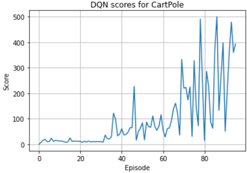

Naïve 버전이 100 에피소드 동안 최고 110 점에 그쳤던 것과 비교하면, DQN 은 같은 CartPole 에서 최대
점수(500)에 도달한다.

### RL model Evaluation

학습된 Q-Network 의 성능을 확인한다. 가상 디스플레이와 `render` 도우미로 greedy 실행을 녹화한다.

```python
%%capture
!pip install gym pyvirtualdisplay
!apt-get install -y xvfb python-opengl ffmpeg
```

```python
from render import  show_video, wrap_env, render_as_image
from pyvirtualdisplay import Display
display = Display(visible=0, size=(400, 300))
display.start()

env_v = wrap_env(env, path=path, name_prefix="q2")
```

```python
state = env_v.reset()
if isinstance(state, tuple): state = state[0]

cnt = 0
while True:
    render_as_image(env_v,step=cnt)
    predict = q_network.predict(state.reshape(1,4),verbose=0)
    action = np.argmax(predict)
    state, reward, done, info,_ = env_v.step(action)
    if done:  break;
    cnt += 1
    if cnt > 50 : break
env_v.close()

show_video(path=path,name_prefix='q2')
```

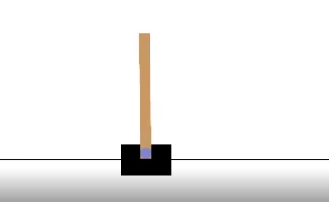

---

## 3.4.7 실습과제 — Hyper parameter tuning, Atari Breakout
<!-- 슬라이드 277 -->

### 실습과제 — Hyper parameter tuning

`n_episode = 75` 로 고정하고 다음을 조정해 성능을 개선해 보자.

- `eps_start = 0.5`
- `batch_siz = 128`
- `epochs = 1`
- `len(RM) > batch_size * 3` — 학습 시작 시점

### 참고 실습 3.4.2 — DQN 으로 Atari Breakout 학습

> 노트북: `code/3.4.2.DQN_breakout.ipynb`
> [](https://colab.research.google.com/github/AI-BoostCamp/ReinforcementLearning/blob/main/code/3.4.2.DQN_breakout.ipynb)
> PyTorch 구현: `code/3.4.2.pt.DQN_breakout.ipynb`
> [](https://colab.research.google.com/github/AI-BoostCamp/ReinforcementLearning/blob/main/code/3.4.2.pt.DQN_breakout.ipynb)

3.4.4 의 sensory input 처리를 실제로 해 보는 노트북이다(Keras 예제
https://keras.io/examples/rl/deep_q_network_breakout/ 기반). `AtariPreprocessing`(frame skip 4,
grayscale) 과 `FrameStackObservation(4)` wrapper 로 84 × 84 × 4 관측을 만들고, DeepMind 논문의 CNN
구조로 Q-model 과 target model 을 만든다. Colab 에서 짧게 돌려 볼 수 있게 replay 길이와 target 갱신
주기를 줄여 두었다.

```python
import gymnasium as gym
import ale_py
from gymnasium.wrappers import AtariPreprocessing, FrameStackObservation

env = gym.make("ALE/Breakout-v5",render_mode="rgb_array", frameskip=1)
env = AtariPreprocessing(env,frame_skip=4, grayscale_obs=True)
env = FrameStackObservation(env, 4)
print('State space shape: ', env.observation_space.shape)  # (4, 84, 84)
print('Action space: ', env.action_space.n)                # 4
```

```python
num_actions = 4

def create_q_model():
    # Network defined by the Deepmind paper
    inputs = layers.Input(shape=(84, 84, 4,))

    # Convolutions on the frames on the screen
    layer1 = layers.Conv2D(32, 8, strides=4, activation="relu")(inputs)
    layer2 = layers.Conv2D(64, 4, strides=2, activation="relu")(layer1)
    layer3 = layers.Conv2D(64, 3, strides=1, activation="relu")(layer2)

    layer4 = layers.Flatten()(layer3)

    layer5 = layers.Dense(512, activation="relu")(layer4)
    action = layers.Dense(num_actions, activation="linear")(layer5)

    return keras.Model(inputs=inputs, outputs=action)

model = create_q_model()
model_target = create_q_model()
```

학습 루프의 핵심 — `model_target` 으로 future reward 를 구하고, 선택한 action 의 one-hot mask 로
그 action 의 $Q$ 만 loss 에 넣는다 — 는 CartPole 과 같다. loss 는 안정성을 위해 Huber 를 쓴다.

```python
# target model로 부터 future reward 구하기
future_rewards = model_target.predict(state_next_sample,verbose=0)
# Q value = reward + discount factor * expected future reward
updated_q_values = rewards_sample + gamma * tf.reduce_max( future_rewards, axis=1 )
# done일때 예외처리
updated_q_values = updated_q_values * (1 - done_sample) - done_sample

# Create a mask so we only calculate loss on the updated Q-values
masks = tf.one_hot(action_sample, num_actions)

with tf.GradientTape() as tape:
    q_values = model(state_sample)
    q_action = tf.reduce_sum(tf.multiply(q_values, masks), axis=1)
    loss = loss_function(updated_q_values, q_action)

grads = tape.gradient(loss, model.trainable_variables)
optimizer.apply_gradients(zip(grads, model.trainable_variables))

if frame_count % update_target_network == 0:
    # update the the target network with new weights
    model_target.set_weights(model.get_weights())
```

---

## 3.4.8 정리 — DQN Review
<!-- 슬라이드 278 -->

**Deep Q-Learning 의 문제점 개선**

1. **Sample 간 Correlations 이 너무 크다.** 강화학습 시작에서 얻어지는 dataset 의 correlation 이
   크다 — 처음 경험하는 정보가 유사한 정보들로 이루어져 있다. → **Experience Replay**, 과거의
   경험들을 재사용한다.
2. **Target 이 Non-stationary 하다.**
   $L(w) = E_\pi[((R_{t+1} + \gamma \max_{a'} Q(s',a')) - Q(s,a))^2]$ 에서 NN 의 $w$ 를 수정하면
   현재 $\hat{q}$ 값과 목표에 포함된 $\hat{q}$ 이 같은 방향으로 움직여 학습이 진행되지 않는다(서로
   너무 얽혀 있다). → **Fixed Target**, Target Network 를 분리하고 고정한다.


여기까지가 **가치 기반(value-based)** 심층강화학습의 뼈대다. 다음 절은 방향을 바꿔 가치 함수를 거치지
않고 **정책을 직접** 신경망으로 학습한다.
