# 3.5 Policy Gradient — REINFORCE 와 Actor-Critic

**학습 목표**

- Value-based RL 과 Policy-based RL 의 차이 — 무엇을 학습하고, 행동을 어떻게 고르는가 — 를
  설명하고, stochastic policy 가 exploration 을 자동으로 포함하는 이유를 말할 수 있다.
- 정책의 좋음을 재는 목적 함수 $J(\theta) = V^{\pi_\theta}(s_0)$ 를 정의하고, 그 gradient 가
  $E_\pi[\nabla_\theta \ln \pi_\theta(a|s)\, Q^\pi(s,a)]$ 로 정리되는 Policy Gradient Theorem 의
  흐름을 따라갈 수 있다.
- REINFORCE(Monte Carlo Policy Gradient)의 갱신식과 세 가지 개선(에피소드 단위 · 여러 에피소드 묶음
  · Baseline / Return Normalization)을 설명하고 구현할 수 있다.
- Actor-Critic 이 $G_t$ 를 Critic network 으로 대체하는 이유와, Advantage · TD error 를 쓰는 A2C ·
  TD Actor-Critic 의 갱신식을 설명하고 구현할 수 있다.
- Keras 로 Policy network(softmax 출력)와 Critic network 를 만들고, `-log π(a|s) · G` 형태의
  loss 를 GradientTape 로 학습시킬 수 있다. W&B 로 실험 설정과 모델을 기록 · 복원할 수 있다.

**이 절의 구성**

- ⟨ Part A ⟩ Policy Gradient — 정책을 직접 학습하기
  - 3.5.1 Policy-based RL 과 Value-based RL
  - 3.5.2 목적 함수 $J(\theta)$ 와 그 gradient — 재귀식으로 바꾸기
  - 3.5.3 Policy Gradient Theorem
- ⟨ Part B ⟩ REINFORCE — Monte Carlo Policy Gradient
  - 3.5.4 REINFORCE 알고리즘과 그 개선
  - 3.5.5 REINFORCE with Baseline 과 Return Normalization
  - 3.5.6 Policy Gradient review
  - 3.5.7 실습 3.5.1 — REINFORCE 로 CartPole 학습
  - 3.5.8 실습 3.5.2 — Episode 단위 update 와 Return Normalization
  - 3.5.9 Policy Gradient Review — Value-based 와 Policy-based
  - 3.5.10 실습 3.5.3 — Model Management (W&B)
- ⟨ Part C ⟩ Actor-Critic 과 A2C(Advantage Actor-Critic)
  - 3.5.11 Actor-Critic — $G_t$ 를 Q-Net 으로 modeling
  - 3.5.12 가장 간단한 Actor-Critic (SARSA style)
  - 3.5.13 A2C 와 TD Actor-Critic — Advantage function
  - 3.5.14 실습 3.5.4 — TD Actor-Critic 으로 CartPole 학습
  - 3.5.15 실습과제 — Actor-Critic 결합 모델
  - 3.5.16 정리 — Actor-Critic, A2C Review

---

**⟨ Part A ⟩ Policy Gradient — 정책을 직접 학습하기**

> 3.3 · 3.4 는 가치 함수 $Q$ 를 신경망으로 근사하고 그 argmax 로 행동했다. 이제 방향을 바꾸어
> **정책 $\pi_\theta(a|s)$ 자체를 신경망으로 두고**, 그것을 좋게 만드는 gradient 를 구한다.

## 3.5.1 Policy-based RL 과 Value-based RL
<!-- 슬라이드 280~281 -->

### Policy-based RL

Policy 에 따라 action 을 선택한다. Policy function 에 function approximation 을 적용하면 **연속적인
행동 공간**에도 적용할 수 있다.

- Table 형태의 정책을 NN 을 통해 function 형태로 대체한다. Learning(update) 대상이 **Policy** 다.
  Input 은 state, output 은 action 의 확률(또는 확률 분포)이다.
- **확률적으로 행동을 선택**한다(stochastic policy). 학습된 policy 가 결정적이지 않다 — 예를 들어
  Left : 0.7, Right : 0.3 이면 높은 확률을 고르는 것이 아니라 **sampling 으로 선택**한다. 그래서
  **Exploration 이 자동적으로 적용**된다.
- REINFORCE, Actor-Critic, A3C, … 가 여기에 속한다.

### Value-based RL 은?

Value function($Q$)에 따라 action 을 선택한다. 연속적인 **상태** 공간에는 적용되지만 연속 **행동**
공간에는 적용되지 않는다.

- $Q$ function 을 보고 action 을 선택한다. 대부분 policy 가 결정적이다(학습 과정의 exploration 과는 별도로).
- Value function 추정(policy evaluation)에 function approximation 을 적용한다. Learning(update) 대상이
  $Q$ function 이다(policy 도 update 되지만…). Input 은 state, output 은 action 의 value 다.
- Data + 정책 평가로 $Q(s,a)$ 를 추정 → $\pi(a|s)$ update.
- SARSA, Q-Learning, … 가 여기에 속한다. deterministic policy 의 문제 — **최적 정책이 random 일
  수도 있는데** 결정적 정책은 그것을 표현할 수 없다.

### Policy-based RL 의 기본 절차

1. **정책에 따라 행동하기** — 확률적(stochastic) 정책에 따라 행동한다.
2. **행동했던 결과에 따라 정책을 평가하기** — 어떻게 정책을 평가할 것인가?
3. **평가한 결과에 따라 정책을 개선하기** — 어떻게 정책을 update 할 것인가?

$Q$ 추정 없이 **직접 Policy function 을 최적화**하자. Data + 정책 함수(정책 경사) 평가 → $\pi(a|s)$
update 다. (Value-based 는 Data + 정책 평가로 $Q(s,a)$ 추정 → $\pi(a|s)$ update 였다.)
**정책 경사(policy gradient)** 는 세 단계다.

1. 정책 $\pi_\theta(a|s)$ 의 가치(얼마나 좋은지)를 판단하는 $J(\theta)$ 를 만들고,
2. $J(\theta)$ 에 대한 gradient 를 계산하여,
3. 정책을 좋은 방향($J(\theta)$ 가 커지는 방향 — **gradient ascent**)으로 최적화한다.

표기에 관해 한 가지. Control 분야에서는 objective function 을 주로 $J(\theta)$ 로, Learning 분야에서는
$L(\theta)$ 로 쓴다. 이 절은 $J(\theta)$ 를 쓴다. 실습 환경은 CartPole 이며 $\pi(a|s)$ 의 입력 state 는
(4,) — Cart Position, Cart Velocity, Pole Angle, Pole Angular Velocity — 이다.

---

## 3.5.2 목적 함수 $J(\theta)$ 와 그 gradient — 재귀식으로 바꾸기
<!-- 슬라이드 282 -->

### $J(\theta)$ 정의

$$
J(\theta) = V^{\pi_\theta}(s_0)
$$

시작 상태에 대해서 정책 $\pi_\theta(a|s)$ 로 찾은 상태가치다. $V^{\pi_\theta}(s_0) \triangleq
E_{\pi_\theta}[G_0 \mid S = s_0]$ 이다. 정책이 좋으면 시작 상태의 가치가 높다 — 그러니 이 값을 키우자.

### $J(\theta)$ 의 gradient 를 recursive 식으로 변환하기

$\nabla_\theta J(\theta) = \nabla_\theta V^{\pi_\theta}(s_0)$ 다. 이후 $\pi_\theta$ 대신 $\pi$ 로 간략화해
표현한다. 어떤 $s$ 에 대해 일반화하여 $\nabla_\theta V^\pi(s)$ 를 전개한다. 기호를 미리 정리하면 —
$\nabla$(del, nabla) : gradient, del operator; $\partial$(dee) : 편미분;
$\Delta$(delta) : $\frac{\Delta y}{\Delta x}$(유한차분) $\approx \frac{dy}{dx}$(미분).

$$
\begin{aligned}
\nabla_\theta V^\pi(s) &= \nabla_\theta \Big( \sum_{a \in A} \pi_\theta(a|s)\, Q^\pi(s,a) \Big) \\
&= \sum_{a \in A} \Big( \nabla_\theta \pi_\theta(a|s)\, Q^\pi(s,a) + \pi_\theta(a|s)\, \nabla_\theta Q^\pi(s,a) \Big)
 \qquad \text{곱의 미분, } (xy)' = x'y + xy' \\
&= \sum_{a \in A} \Big( \nabla_\theta \pi_\theta(a|s)\, Q^\pi(s,a) + \pi_\theta(a|s)\, \nabla_\theta \sum_{s', r} P(s', r|s,a)\,(r + V^\pi(s')) \Big)
 \qquad \text{1 step 전개} \\
&= \sum_{a \in A} \Big( \nabla_\theta \pi_\theta(a|s)\, Q^\pi(s,a) + \pi_\theta(a|s) \sum_{s', r} P(s', r|s,a)\, \nabla_\theta V^\pi(s') \Big)
 \qquad V^{\pi_\theta} \text{ 만 } \theta \text{ 의 함수} \\
&= \sum_{a \in A} \Big( \nabla_\theta \pi_\theta(a|s)\, Q^\pi(s,a) + \pi_\theta(a|s) \sum_{s'} P(s'|s,a)\, \nabla_\theta V^\pi(s') \Big)
\end{aligned}
$$

마지막 줄은 $P(s'|s,a) = \sum_r P(s', r|s,a)$ 로 간략화한 것이다($\nabla_\theta r = 0$). 정리하면

$$
\nabla_\theta V^\pi(s) = \sum_{a \in A} \Big( \nabla_\theta \pi_\theta(a|s)\, Q^\pi(s,a) + \pi_\theta(a|s) \sum_{s'} P(s'|s,a)\, \nabla_\theta V^\pi(s') \Big)
$$

즉 **$s$ 의 함수가 다음 step $s'$ 의 함수로 recursive 하게 표현**된다.

---

## 3.5.3 Policy Gradient Theorem
<!-- 슬라이드 283~285 -->

### 재귀식을 unroll 하기

앞의 식에서 첫 항을 $\phi(s) = \sum_{a \in A} \nabla_\theta \pi_\theta(a|s)\, Q^\pi(s,a)$ 로 놓는다
($\nabla_\theta \pi_\theta(s)$ 처럼 $s$ 의 함수로 표현할 수 있다). 그러면

$$
\begin{aligned}
\nabla_\theta V^\pi(s) &= \phi(s) + \sum_{a \in A} \pi_\theta(a|s) \sum_{s'} P(s'|s,a)\, \nabla_\theta V^\pi(s') \\
&= \phi(s) + \sum_{s'} \sum_a \pi_\theta(a|s)\, P(s'|s,a)\, \nabla_\theta V^\pi(s') \\
&= \phi(s) + \sum_{s'} \rho^\pi(s \to s', 1)\, \nabla_\theta V^\pi(s') \qquad \text{— (1)}
\end{aligned}
$$

여기서 $\rho^\pi(s \to s', 1) = \sum_a \pi_\theta(a|s)\, P(s'|s,a)$ 는 **$\pi$ 정책하에서 한 번의
action 으로 $s$ 에서 $s'$ 로 갈 확률**이다. (1)의 $\nabla_\theta V^\pi(s')$ 자리에 다시 (1)을 대입해
다음 step 으로 확장하면

$$
\begin{aligned}
&= \phi(s) + \sum_{s'} \rho^\pi(s \to s', 1) \Big[ \phi(s') + \sum_{s''} \rho^\pi(s' \to s'', 1)\, \nabla_\theta V^\pi(s'') \Big] \\
&= \phi(s) + \sum_{s'} \rho^\pi(s \to s', 1)\, \phi(s') + \sum_{s''} \rho^\pi(s \to s'', 2)\, \nabla_\theta V^\pi(s'')
\end{aligned}
$$

이고, $\rho^\pi(s \to s'', 2) = \sum_{s'} \rho^\pi(s \to s', 1) \sum_{s''} \rho^\pi(s' \to s'', 1)$ 은
$s$ 에서 $s''$ 로 2 번에 도착할 확률이다. 계속하면

$$
= \phi(s) + \sum_{s'} \rho^\pi(s \to s', 1)\, \phi(s') + \sum_{s''} \rho^\pi(s \to s'', 2)\, \phi(s'') + \sum_{s'''} \rho^\pi(s \to s''', 3)\, \nabla_\theta V^\pi(s''') + \cdots
$$

$\nabla_\theta V^\pi(s)$ 를 반복해서 unroll 하면 결국 **$\nabla$ 가 제거**되고

$$
\nabla_\theta V^\pi(s) = \sum_{x \in S} \sum_{k=0}^{\infty} \rho^\pi(s \to x, k)\, \phi(x)
$$

가 된다. $\rho^\pi(s_0 \to s_0, 0) = 1$ — 시작 state $s_0$ 에서 0 step, 즉 제자리에 있을 때 $s_0$ 의
확률은 1 이므로 $\phi(s) = \sum_s \rho^\pi(s \to s, 0)\, \phi(s)$ 로 첫 항도 같은 꼴에 들어간다.
(참고: https://lilianweng.github.io/posts/2018-04-08-policy-gradient/)

### Policy Gradient Theorem 정리(2) — stationary distribution

$$
\begin{aligned}
\nabla_\theta J(\theta) &= \nabla_\theta V^\pi(s) = \sum_{x \in S} \sum_{k=0}^{\infty} \rho^\pi(s \to x, k)\, \phi(x) \\
&= \sum_s \eta(s)\, \phi(s), \qquad \eta(s) = \sum_{k=0}^{\infty} \rho^\pi(s_0 \to s, k)
\end{aligned}
$$

$\eta(s)$ 는 $s_0$ 에서 어떤 $s$ 까지 $k$ 번에 갈 확률의 합이다(확률은 아니다 — 합이 1 이 아니다).
위아래에 $\sum_s \eta(s)$ 를 곱해 주면

$$
= \Big( \sum_s \eta(s) \Big) \sum_s \frac{\eta(s)}{\sum_s \eta(s)}\, \phi(s)
\;\propto\; \sum_s \frac{\eta(s)}{\sum_s \eta(s)}\, \phi(s)
$$

$\sum_s \eta(s)$ 는 상수이므로 삭제하고 비례 관계로 표시했다. $\eta(s)$ 를 모든 상태에 대한 $\eta$ 값의
합으로 나누어 확률로 변환한 것이 $d^\pi(s)$ 다. $\phi(s) = \sum_a \nabla_\theta \pi_\theta(a|s) Q^\pi(s,a)$
를 다시 소환하면

$$
\nabla_\theta J(\theta) = \sum_s d^\pi(s) \sum_{a \in A} \nabla_\theta \pi_\theta(a|s)\, Q^\pi(s,a)
$$

$d^\pi(s) = \lim_{t \to \infty} P(s_t = s \mid s_0, \pi_\theta)$ — 즉 긴 시간 후 $s_0$ 에서 출발해 $s$ 까지
갈 확률이다. $d^\pi(s)$ 는 정책 $\pi$ 에 따라 행동하는 에이전트가 상태 공간에서 어떻게 분포되는지를
설명한다. 특정 상태 $s$ 에서의 값이 높으면 정책 $\pi$ 하에서 자주 방문된다는 뜻이다.

$d^\pi$ 확률은 **stationary distribution** 이라고 가정한다(아니면 계속 변화하는 문제가 된다). MDP 에서
$aP = a$ 일 때 $a$ 를 stationary distribution 이라 하고, 이는 상태천이 $P$ 가 반복 적용되어도 항상 같은
확률을 갖는(유지하는) 것이다. 즉 특정 state 에 갈 확률 분포가 stationary 한 것이다.

> **핵심 메시지**
> $\nabla_\theta J(\theta)$ 는 **stationary 분포 $d^\pi$ 와 행동가치 함수 $Q^\pi$ 의 기울기($\nabla_\theta$)
> 곱에 비례**한다.

### Policy Gradient Theorem 정리(3) — Monte-Carlo 로 계산할 수 있는 꼴로

$\nabla_\theta J(\theta) = \sum_s d^\pi(s) \sum_a \nabla_\theta \pi_\theta(a|s) Q^\pi(s,a)$ 는 계산을 통해
얻기 어렵다. Sampling 을 통해 식을 재구성한다. 위아래에 $\pi_\theta(a|s)$ 를 곱해 주면

$$
\begin{aligned}
\nabla_\theta J(\theta) &= \sum_s d^\pi(s) \sum_{a \in A} \pi_\theta(a|s)\, \frac{\nabla_\theta \pi_\theta(a|s)}{\pi_\theta(a|s)}\, Q^\pi(s,a) \\
&= E_{\pi\,(s \sim d^\pi,\ a \sim \pi_\theta)}\Big[ \frac{\nabla_\theta \pi_\theta(a|s)}{\pi_\theta(a|s)}\, Q^\pi(s,a) \Big] \\
&= E_\pi\big[ \nabla_\theta \ln \pi_\theta(a|s)\, Q^\pi(s,a) \big]
\end{aligned}
$$

둘째 줄에서 $d^\pi$ 는 확률이므로 $\sum_s d^\pi(s) = 1$ 이 되어 기댓값 $E_{s \sim d^\pi, a \sim \pi_\theta}$
로 묶였고 — 이것을 Monte-Carlo 로 추산한다(bias ↓, variance ↑). 셋째 줄은
$\nabla_\theta \ln \pi_\theta(a|s) = \dfrac{\nabla_\theta \pi_\theta(a|s)}{\pi_\theta(a|s)}$
($\because \nabla \ln x = \nabla x / x$)를 쓴 것이다.

$$
\nabla_\theta J(\theta) = E_\pi\big[ \nabla_\theta \ln \pi_\theta(a|s)\, Q^\pi(s,a) \big]
$$

목적 함수 $J(\theta)$ 의 $\nabla_\theta$ 를 **MC method 로 계산하기 쉽도록** 만들었다.

**$Q^\pi(s,a)$ 찾기.** 여기서 $Q^\pi(s,a)$ 는 추정치가 아니라 $\pi_\theta$ 의 **정답**이었다. 따라서
$Q^\pi(s,a)$ 를 추정해야 식을 풀 수 있다 — 그 추정 방식이 Part B(REINFORCE)와 Part C(Actor-Critic)를
가른다.

---

**⟨ Part B ⟩ REINFORCE — Monte Carlo Policy Gradient**

> $Q^\pi(S_t, A_t)$ 자리에 Monte Carlo 로 얻은 리턴 $G_t$ 를 넣는 것이 REINFORCE 다.

## 3.5.4 REINFORCE 알고리즘과 그 개선
<!-- 슬라이드 286~287 -->

### REINFORCE (Williams 1992) : Monte Carlo Policy Gradient

$$
\begin{aligned}
\nabla_\theta J(\theta) &= E_\pi\big[ \nabla_\theta \ln \pi_\theta(a|s)\, Q^\pi(s,a) \big]
 = E_\pi\big[ \nabla_\theta \ln \pi_\theta(A_t|S_t)\, Q^\pi(S_t, A_t) \big] \\
&= E_\pi\big[ Q^\pi(S_t, A_t)\, \nabla_\theta \ln \pi_\theta(A_t|S_t) \big] \\
&= E_\pi\big[ G_t\, \nabla_\theta \ln \pi_\theta(A_t|S_t) \big]
\end{aligned}
$$

- $S_t$ : $t$ 시점의 상태들에 대해서, $\pi_\theta(A_t|S_t)$ 는 정책 함수 — NN 으로 prediction
  (evaluation)할 값이다.
- NN 학습 과정에서 $\alpha$(learning rate)를 사용하게 되므로, 비례 $\propto$ 는 $=$ 로 대치했다.
- 특정 시점에 계산할 값 $Q_t$ 는 $\nabla_\theta$ 와 무관하므로 $\nabla_\theta$ 밖으로 이동했다.
- $Q^\pi(S_t, A_t) \triangleq E_\pi[G_t \mid S_t = s, A_t = a]$ 이므로 $G_t$ 로 대치했다.

**REINFORCE** 는 $G_t$ 를 MC 로 얻고 $J(\theta)$ 가 커지는 방향으로 $\pi_\theta$ 의 $\theta$ 를
update 하는 algorithm 이다. 최적의 policy 를 갖도록 policy neural network 을 학습한다. MC 이므로
episode 가 끝나야 시작되고, 각 $t$ 에서 update 를 하게 되어 효율적이지 않다.

**알고리즘**

1. Init. : $\pi_\theta(a|s)$ 의 parameter $\theta$ 초기화
2. Episode Repeat :
   - 정책 $\pi_\theta(a|s)$ 로 trajectory 생성 — $\{ s_1, a_1, r_2, s_2, a_2, r_3, \ldots, s_T \}$
   - Repeat($t = 1, \ldots, T$) :
     - $G_t \leftarrow \sum_{k=t+1}^{T} \gamma^{k-t-1} R_k$ (MC 로 추정)
     - $\theta \leftarrow \theta + \alpha\, G_t\, \nabla_\theta \ln \pi_\theta(A_t|S_t)$

### REINFORCE 개선

- **각 $t$ 에서 update** : $\theta \leftarrow \theta + \alpha G_t \nabla_\theta \ln \pi_\theta(A_t|S_t)$
- **Episode 단위로 update** : $\theta \leftarrow \theta + \alpha \big[ \sum_{t=1}^{T} G_t \nabla_\theta \ln \pi_\theta(A_t|S_t) \big]$
  — mini batch 처럼 update.
- **여러 epi. 묶어서 update** :
  $\theta \leftarrow \theta + \alpha \Big[ \frac{1}{N} \sum_{i=1}^{N} \sum_{t=1}^{T} G_t^{(i)} \nabla_\theta \ln \pi_\theta(A_t^{(i)}|S_t^{(i)}) \Big]$
  — epi. 를 mini batch 처럼. 다만 DQN 의 Replay memory 처럼 (오래된 경험을 재사용해) 쓰는 것은
  아니다 — on-policy 이므로 현재 정책이 만든 에피소드만 쓴다.

**문제점** — MC 를 사용하므로 variance 가 크다. Variance 를 줄이기 위한 기법 도입이 필요하다 →
**"Baseline" 기법**.

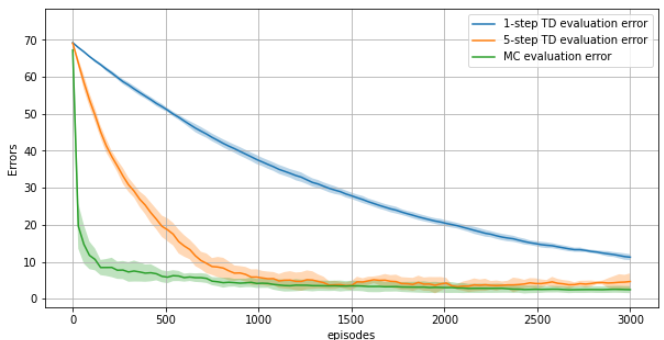

---

## 3.5.5 REINFORCE with Baseline 과 Return Normalization
<!-- 슬라이드 288~289 -->

### REINFORCE with Baseline

$Q^\pi(s,a)$ 를 $(Q^\pi(s,a) - b(s))$ 로 수정해도 결과에 영향이 없는 함수 $b(s)$ 를 추가한다.

$$
\nabla_\theta J(\theta) = \sum_s d^\pi(s) \sum_{a \in A} \nabla_\theta \pi_\theta(a|s)\, Q^\pi(s,a)
\;\Longrightarrow\;
\nabla_\theta J(\theta) = \sum_s d^\pi(s) \sum_{a \in A} \nabla_\theta \pi_\theta(a|s)\, \big( Q^\pi(s,a) - b(s) \big)
$$

결과에 영향이 없다는 것은 다음을 만족하는 것이다.

$$
\sum_{a \in A} \nabla_\theta \pi_\theta(a|s)\, b(s) = b(s)\, \nabla_\theta \sum_{a \in A} \pi_\theta(a|s) = b(s)\, \nabla_\theta 1 = 0
$$

- $b(s)$ 는 $s$ 의 함수이므로 $\sum_{a \in A}$ 밖으로 이동한다.
- $\sum_{a \in A} \pi_\theta(a|s)$ 는 각 action 확률의 합이므로 1 이다.
- $\nabla_\theta 1$ 은 0 이다.
- ∴ $b(s)$ 는 **action 과 독립인 어떤 함수라도** 가능하다.

이 식을 REINFORCE 에 적용하면

$$
\theta \leftarrow \theta + \alpha\, \big( G_t - b(s) \big)\, \nabla_\theta \ln \pi_\theta(A_t|S_t)
$$

가 된다. 효과는 — $b(s)$ 를 잘 만들어서 $G_t$ 의 분산을 줄일 수 있고, 분산이 줄어들면 학습 속도가
빨라진다. 그렇다면 **어떻게 좋은 $b(s)$ 를 만들까?**

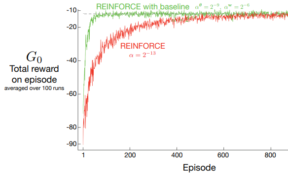

### 간단한 Baseline Trick — Return Normalization

Trajectory 내의 Return $G = \{G_1, G_2, \ldots, G_T\}$ 에서 평균 $\bar{G}$ 와 표준편차 $\sigma(G)$ 를
구해 $G_t$ 를 normalize 한 $G_t^{*} = \dfrac{G_t - \bar{G}}{\sigma(G)}$ 를 구하여

$$
\theta \leftarrow \theta + \alpha\, \gamma^t\, G_t^{*}\, \nabla_\theta \ln \pi_\theta(A_t|S_t)
$$

로 적용하는 방법이다. $G_t$ 를 normalize 하여 변동성을 줄이는 것이다. $\gamma^t G_t^{*}$ 는 근본이
없어 보이는 형태이지만(써 왔던 $G_t = R_{t+1} + \gamma R_{t+2} + \gamma^2 R_{t+3} + \cdots$ 가 아님에
주의) **엄청 잘 동작하는 방법**이다. PPO(Proximal Policy Optimization) algorithm 구현에 적용되어 있고,
"Implementation Matters in Deep Policy Gradients: A Case Study on PPO and TRPO"(ICLR 2020)는 PPO 의
성능 향상에 baseline 구현이 기여함을 확인했다.

**일반적으로 Baseline 은** 분산에 큰 영향을 줄 수 있다. MDP 의 경우 baseline 은 state 에 따라 달라야
한다 — 어떤 state 는 모든 행동이 높은 가치를 가지며, 따라서 높은 baseline 이 그 state 의 행동가치의
차이를 구별하는 기준이 된다. 어떤 상태에서 모든 action 이 낮은 가치를 가지면 낮은 baseline 이 적절하다.
"Attention, Learn to Solve Routing Problems!"(ICLR 2019)에서는 REINFORCE with greedy Rollout baseline
기법이 제안되었다.

---

## 3.5.6 Policy Gradient review
<!-- 슬라이드 290 -->

여기까지를 한 번 매듭짓는다.

- 정책 함수가 얼마나 좋은지를 평가하는 함수 $J(\theta)$ 를 정의했다 — $J(\theta) = V^{\pi_\theta}(s_0)$,
  시작 상태에 대해서 정책 $\pi_\theta(a|s)$ 로 찾은 상태가치.
- **Policy Gradient Theorem** — $J(\theta)$ 를 키우는 $\pi_\theta$ 를 찾기 위해
  $\nabla_\theta J(\theta) = \nabla_\theta V^{\pi_\theta}(s_0)$ 식을 유도하여
  $\nabla_\theta J(\theta) = E_\pi[\nabla_\theta \ln \pi_\theta(a|s)\, Q^\pi(s,a)]$ 를 얻었다.
- **REINFORCE algorithm** — $\nabla_\theta J(\theta) = E_\pi[G_t \nabla_\theta \ln \pi_\theta(A_t|S_t)]$
  로 변형하고, $G_t$ 를 MC method 로 추정한 값을 사용해서
  $\theta \leftarrow \theta + \alpha G_t \nabla_\theta \ln \pi_\theta(A_t|S_t)$ 로 NN parameter 를 update 한다.
- **With Baseline** — MC 의 분산을 낮추기 위해 Baseline 함수를 적용하여
  $\theta \leftarrow \theta + \alpha (G_t - b(s)) \nabla_\theta \ln \pi_\theta(A_t|S_t)$ 로 수정한다.
  Return Normalization 을 적용해도 성능 향상을 얻을 수 있다.

---

## 3.5.7 실습 3.5.1 — REINFORCE 로 CartPole 학습
<!-- 슬라이드 291~296 -->

> 노트북: `code/3.5.1.REINFORCE_CartPole.ipynb`
> [](https://colab.research.google.com/github/AI-BoostCamp/ReinforcementLearning/blob/main/code/3.5.1.REINFORCE_CartPole.ipynb)
> PyTorch 구현: `code/3.5.1.pt.REINFORCE_CartPole.ipynb`
> [](https://colab.research.google.com/github/AI-BoostCamp/ReinforcementLearning/blob/main/code/3.5.1.pt.REINFORCE_CartPole.ipynb)

Gym Env. 로 제공되는 CartPole 을 REINFORCE 로 학습시킨다. REINFORCE algorithm 을 구현하고, 알고리즘을
개선하며 성능을 비교한다.

1. **Step 단위 update** : $\theta \leftarrow \theta + \alpha G_t \nabla_\theta \ln \pi_\theta(A_t|S_t)$ 방식으로 구현해 보자. (이 실습)
2. **Episode 단위로 update** : $\theta \leftarrow \theta + \alpha [\sum_{t=1}^{T} G_t \nabla_\theta \ln \pi_\theta(A_t|S_t)]$ 방식으로 구현해 보자. (실습 3.5.2)
3. **여러 epi. 묶어서 update** : $\theta \leftarrow \theta + \alpha [\frac{1}{N} \sum_{i=1}^{N} \sum_{t=1}^{T} G_t^{(i)} \nabla_\theta \ln \pi_\theta(A_t^{(i)}|S_t^{(i)})]$ 방식으로 구현해 보자. (실습 3.5.2)
4. **Baseline Trick** : Return Normalization 을 적용해서 변화가 있는지 확인해 보자. (실습 3.5.2)

### REINFORCE 로 기본 구조 만들기 — Policy network

Policy network $\pi_\theta(A_t|S_t)$ 는 state 에 대한 최적 action 을 modeling 하는 network 다. Input 은
Env. 의 State (bs, s), Output 은 Action (bs, a) 의 확률이다. Q-Network 와 구조는 같지만 **출력층이
softmax** 다 — 두 action 의 확률(합 1)을 낸다.

```python
def NeuralNetwork(state_size=4, action_size=2, hidden_size=30, learning_rate=0.001):
    model = Sequential()
    model.add(Input(shape=(state_size,)))
    model.add(Dense(hidden_size, activation='relu'))
    model.add(Dense(hidden_size, activation='relu'))
    model.add(Dense(action_size, activation='softmax'))
    return model

net = NeuralNetwork()
net.summary()
```

### REINFORCE(policy_model) Agent

앞에서 준비된 NN model 을 받아 Agent 를 생성한다.

- `get_action()` : model 에서 예측한 action 의 확률을 받아서 **sampling** 하여 action 을 결정한다.
  `np.random.choice(2, 1, p=prob_a)` — argmax 가 아니다. 이것이 stochastic policy 의 exploration 이다.
- `_pre_process_inputs()` : 에피소드의 trajectory 를 **역순으로** 재배치한다. 뒤에서부터 $\gamma$ 를
  적용해 $G_t$ 를 계산하기 위해서다.
- `loss()` : $\theta \leftarrow \theta + \alpha G_t \nabla_\theta \ln \pi_\theta(A_t|S_t)$ 를 gradient
  **descent** 의 loss 로 옮기면 $loss = -\ln(\pi_\theta(A_t|S_t)) \cdot G_t$ 다. `prob_a = [0.3, 0.7]`,
  `action = 1` 이면 `log(prob_a[action])` → `log(0.7)`. $\ln x$ 는 $x \in (0, 1]$ 에서 음수이므로 부호를
  뒤집어 최소화한다.
- `update()` : sample-by-sample update version 의 REINFORCE. 역순으로 훑으며 `g = r + gamma * g` 로
  $G_t$ 를 만들고, step 마다 GradientTape 로 loss 의 gradient 를 적용한다.

```python
class REINFORCE:
    def __init__(self, policy_model,
                 gamma = 1.0, lr = 0.001):
        super(REINFORCE, self).__init__()
        self.model = policy_model
        self.gamma = gamma
        self.optimizer = Adam(learning_rate=lr) # NN optimizer
        self._eps = 1e-25

    def get_action(self, state): # action <- sampling(model(state))
        prob_a = self.model.predict(state, batch_size=1,verbose=0).flatten()
        return np.random.choice(2, 1, p=prob_a)[0] #p(left, right)에서 sampling

    def _pre_process_inputs(self,episode):# epi. trejectory를 역순으로 재배치
        states, actions, rewards = episode
        states = np.flip(states,axis=0) #(steps,s)
        actions = np.flip(actions)      #(steps,)
        rewards = np.flip(rewards)      #(steps,)
        return states, actions, rewards

    def loss(self, prob_a, action, gt):
        log_probability = tf.math.log(prob_a[0][action] + self._eps)
        loss = -log_probability * gt
        return loss

    # sample-by-sample update version of REINFORCE
    def update(self, episode):
        ## _pre_process_inputs: trajectory 순서 뒤집기,뒤부터 gamma적용하기 위해
        states, actions, rewards = self._pre_process_inputs(episode)
        g = tot_loss = 0
        for i,(s, a, r) in enumerate(zip(states, actions, rewards)): # step반복
            with tf.GradientTape() as tape:
                g = r + self.gamma * g                    # 현 setp에서 Gt 계산
                prob_a = self.model(s.reshape(1,4), training=True)#두action의 확률
                loss = self.loss(prob_a, a, g)            # -log(pi(selected_a))*Gt
            grads = tape.gradient(loss, self.model.trainable_variables)
            self.optimizer.apply_gradients(zip(grads, self.model.trainable_variables))
            tot_loss += loss
        return tot_loss/(i+1)
```

`self._eps = 1e-25` 는 확률이 0 이 되었을 때 $\ln 0$ 을 막는 작은 값이다.

### REINFORCE main loop — MC 이므로 epi. 가 종료되면 학습 수행

한 에피소드 동안 trajectory(states, actions, rewards)를 모으고, 에피소드가 끝난 뒤 `agent.update(episode)`
로 학습한다. 최근 10 에피소드 평균 점수가 300 을 넘으면 멈춘다.

```python
net = NeuralNetwork(state_size=s_dim, action_size=a_dim)
agent = REINFORCE(net)

n_eps = 150
print_every = 2
scores = [0]
losses =[]
max_score = 0

for ep in range(n_eps): # episode 반복
    s, info = env.reset()     # evn. 초기화
    cum_r = 0           # epi.내에서 reward sum
    states = []
    actions = []
    rewards = []
    while True:         # 하나의 episode 시행
        s = np.reshape(s, (1, 4))           # (bs,s)
        a = agent.get_action(s)             # plocy net. 출력에서 sampling한 action
        ns, r, done, info, _ = env.step(a)  # env. feedback
        states.append(s)                # trajectory 저장
        actions.append(a)               #
        rewards.append(r)               #
        s = ns                          # state update
        cum_r += r                      # epi. 길이 (epi.score)
        if done: break                  # Termination
    scores.append(cum_r)
    states = np.array(states).reshape(-1,4)  #(steps,s) # reshape
    actions = np.array(actions).reshape(-1,) #(steps,)  #
    rewards = np.array(rewards).reshape(-1,) #(steps,)  #
    episode = (states, actions, rewards)
    loss = agent.update(episode)        ## model Training
    losses.append(loss)
    mean_score = np.mean(scores[-min(10,len(scores)):])
    if ep % print_every == 0:
        print(f"Episode {ep} || mean_score: {mean_score:.1f} ||  Loss: {loss:.2f} ")
    if mean_score > max_score:
        max_score = mean_score
        net.save(model_path)
        print(f"  model saved..")
    if mean_score > 300 : break
```

### 학습 과정과 학습된 모델 적용

```text
Episode 0 || mean_score: 9.0000 || Loss: [6.700677]
Episode 2 || mean_score: 17.0000 || Loss: [5.2594237]
Episode 4 || mean_score: 20.8333 || Loss: [11.996266]
…
Episode 122 || mean_score: 212.4000 || Loss: [142.20467]
Episode 124 || mean_score: 259.9000 || Loss: [85.10926]
Episode 126 || mean_score: 326.2000 || Loss: [97.50537]
Wall time: 18min 18s
```

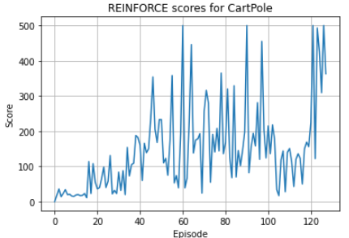

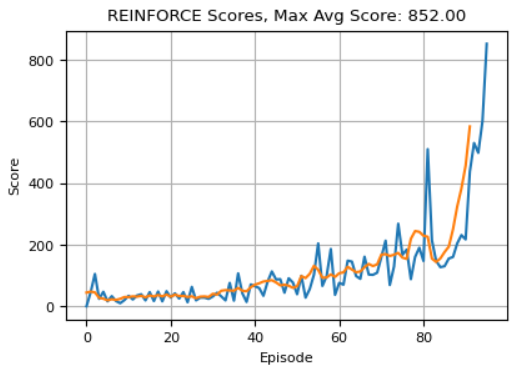

점수가 오르긴 하지만 **에피소드마다 심하게 흔들린다** — MC 리턴의 큰 분산이 그대로 정책 갱신의
분산이 된다. 학습된 모델을 greedy(argmax)로 실행하면 pole 을 세워 둘 수 있다.

```python
net = keras.models.load_model(model_path)
env_v = wrap_env(env, path=path, name_prefix="REINFORCE")

state, _ = env_v.reset()
cnt = 0
while True:
    render_as_image(env_v,step=cnt)
    predict = net.predict(state.reshape(1,4),verbose=0)
    action = np.argmax(predict)
    state, reward, done, info, _ = env_v.step(action)
    if done or cnt > 50:  break;
    cnt += 1
env_v.close()
show_video(path=path,name_prefix='REINFORCE')
```

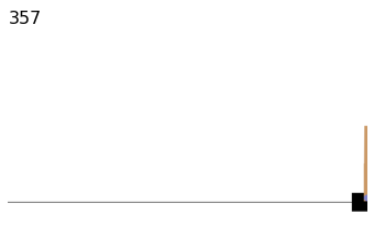

---

## 3.5.8 실습 3.5.2 — Episode 단위 update 와 Return Normalization
<!-- 슬라이드 297~301 -->

> 노트북: `code/3.5.2.REINFORCE_CartPole_Norm.ipynb`
> [](https://colab.research.google.com/github/AI-BoostCamp/ReinforcementLearning/blob/main/code/3.5.2.REINFORCE_CartPole_Norm.ipynb)
> PyTorch 구현: `code/3.5.2.pt.REINFORCE_CartPole_Norm.ipynb`
> [](https://colab.research.google.com/github/AI-BoostCamp/ReinforcementLearning/blob/main/code/3.5.2.pt.REINFORCE_CartPole_Norm.ipynb)

step 마다 갱신하던 것을 **에피소드(여러 개)를 묶어 한 번에** 갱신하고, Return Normalization 을 적용한다.
그러려면 trajectory 를 담아 두는 memory 가 필요하다.

### Trajectory class — Trajectory 를 받아서 저장, done 을 만나면 return 값을 계산해서 보관

`push()` 로 $(s, a, r, s', done)$ 을 쌓다가 `done` 을 만나면 `compute_return()` 이 뒤에서부터
`g = r + gamma * g` 로 모든 시점의 리턴을 계산해 `returns` 에 보관한다. `get_samples()` 는 리스트들을
numpy 배열로 돌려준다.

```python
class Trajectory:

    def __init__(self, gamma: float):
        self.gamma = gamma
        self.states = list()
        self.actions = list()
        self.rewards = list()
        self.next_states = list()
        self.dones = list()

        self.length = 0
        self.returns = None
        self._discounted = False

    def push(self, state, action, reward, next_state, done):
        if done and self._discounted:
            raise RuntimeError("done is given at least two times!")

        self.states.append(state)
        self.actions.append(action)
        self.rewards.append(reward)
        self.next_states.append(next_state)
        self.dones.append(done)
        self.length += 1

        if done and not self._discounted:
            # compute returns
            self.compute_return()

    def compute_return(self):
        rewards = self.rewards
        returns = list()
        g = 0
        # iterating returns in reverse order
        for r in rewards[::-1]:
            g = r + self.gamma * g
            returns.insert(0, g)
        self.returns = returns
        self._discounted = True

    def get_samples(self):
        states = np.array(self.states)    # na.array() <- list()
        actions = np.array(self.actions)  # (steps,)
        rewards = np.array(self.rewards)
        next_states = np.array(self.next_states)
        dones = np.array(self.dones)
        returns = np.array(self.returns)
        return states, actions,rewards,next_states, dones, returns
```

### EpisodicMemory — Queue 에 Trajectory 단위로 push / pop

`deque` 에 trajectory 들을 저장한다(queue 는 FIFO, deque 는 양쪽에서 추가 · 제거 가능). `push()` 는
임시 trajectory 에 sample 을 넣고, episode 가 끝나면 전체 trajectory 를 deque 에 저장한 뒤 새 임시
trajectory 를 만든다. `get_samples()` 는 저장된 trajectory 들을 모두 꺼내어 분해하고 `np.concatenate`
로 이어 붙여 (epi.×steps, …) 모양의 배열들로 조립한다.

```python
# queue : FIFO
# deque : 양쪽 방향에서 element 추가, 제거 가능
from collections import deque

class EpisodicMemory:

    def __init__(self, max_size: int, gamma: float):
        self.max_size = max_size  # maximum number of trajectories
        self.gamma = gamma
        self.trajectories = deque(maxlen=max_size) #trajectory들을 저장
        self._trajectory = Trajectory(gamma=gamma)

    def push(self, state, action, reward, next_state, done):
        self._trajectory.push(state, action, reward, next_state, done)
        if done: #episode가 끝나면 전체 trajectory 저장
            self.trajectories.append(self._trajectory)
            self._trajectory = Trajectory(gamma=self.gamma) # 임시 trajectory

    def reset(self):
        self.trajectories.clear()
        self._trajectory = Trajectory(gamma=self.gamma)

    def get_samples(self):
        states,actions,rewards,next_states,dones,returns = [],[],[],[],[],[]
        while self.trajectories:           # trajecory들을 모두 꺼내어 분해, 조립
            traj = self.trajectories.pop() # 하나의 Traj. 가져오고
            s, a, r, ns, done, g = traj.get_samples()# trajectory 분해
            states.append(s)               #모든 traj.의 states 모음
            actions.append(a)
            rewards.append(r)
            next_states.append(ns)
            dones.append(done)
            returns.append(g)

        states = np.concatenate(states)    # (steps,s) <- [(s,),(s,),...]
        actions = np.concatenate(actions)  # (steps,)
        rewards = np.concatenate(rewards)  # (steps,)
        next_states = np.concatenate(next_states)
        dones = np.concatenate(dones)
        returns = np.concatenate(returns)
        return states, actions, rewards, next_states, dones, returns
```

### Episode 단위로 update + return normalization

$$
\theta \leftarrow \theta + \alpha \Big[ \frac{1}{N} \sum_{i=1}^{N} \sum_{t=1}^{T} G_t^{(i)}\, \nabla_\theta \ln \pi_\theta(A_t^{(i)}|S_t^{(i)}) \Big]
$$

여러 epi. 를 묶어서 학습하고, Return Normalization 을 적용한다. `REINFORCE` 에 batch update 판
`update_episodes()` 를 추가한다. `use_norm=True` 이면 returns 를 평균 0 · 표준편차 1 로 정규화하고,
모아 둔 모든 step 의 (state, action, return)에 대해 loss 를 한 번에 계산해 평균한 뒤 gradient 를
한 번 적용한다.

```python
    ## episodes ## batch update version of REINFORCE
    def update_episodes(self, states, actions, returns, use_norm=True):
        if use_norm:  ## return값 Normalization
            returns = (returns - returns.mean())/(returns.std()+self._eps)
        with tf.GradientTape() as tape:
            prob_a = self.model(states.reshape(-1,4), training=True) #(steps,2)
            losses = self.loss(prob_a, actions, returns)             #(steps,)
            loss = tf.math.reduce_mean(losses)                       # sclar
        grads = tape.gradient(loss, self.model.trainable_variables)
        self.optimizer.apply_gradients(zip(grads, self.model.trainable_variables))
        return loss
```

### Main loop — NN model training : batch(n×epi.) update

`memory.push()` 로 매 step 을 memory 에 넣고, `update_every` 에피소드마다 `memory.get_samples()` 로 꺼내
`update_episodes()` 를 부른다.

```python
memory = EpisodicMemory(max_size=500, gamma=1.0)

net = NeuralNetwork(state_size=s_dim, action_size=a_dim)
agent = REINFORCE(net)
memory.reset()

print_every = 1
update_every = 2 # Update episodes
n_eps = 150*update_every

scores = [0]
mean_r = 0
max_score = 0

for ep in range(n_eps): # episode 반복
    s, _ = env.reset()  # evn. 초기화
    cum_r = 0           # epi.내에서 reward sum
    while True:         # 하나의 episode 시행
        s = np.reshape(s, (1, 4))       # (bs,s)
        a = agent.get_action(s)         # plocy net. 출력에서 sampling한 action
        ns, r, done, info, _ = env.step(a) # env. feedback
        memory.push(s,a,r,ns,done)
        s = ns                          # state update
        cum_r += r                      # epi. 길이 (epi.score)
        if done: break                  # Termination
    scores.append(cum_r)
    if ep % update_every == 0:
        s,a, _, _, done, g = memory.get_samples()
        loss = agent.update_episodes(s, a, g, use_norm=True)
        mean_score = np.mean(scores[-10:])
        print(f"Epi./Iter. {ep}/{ep//update_every} || mean_score: {mean_score:.1f} ||  Loss: {loss:.6f} ")
    if mean_score > max_score and len(scores) > 10:
        max_score = mean_score
        agent.model.save(model_path)
        print(f"  model saved..")
    if max_score > 300 :
        print("목표 점수에 도달하여 학습을 조기 종료합니다.")
        agent.model.save(model_path)
        break
print("학습 종료!")
```

```text
Episode/Iteration 0/0 || mean_score: 5.500000 || Loss: 0.002980
Episode/Iteration 8/2 || mean_score: 9.333333 || Loss: 0.001675
…
Episode/Iteration 584/146 || mean_score: 106.600000 || Loss: -0.007903
Episode/Iteration 592/148 || mean_score: 110.500000 || Loss: -0.030817
Wall time: 22min 35s
```

### 학습 결과

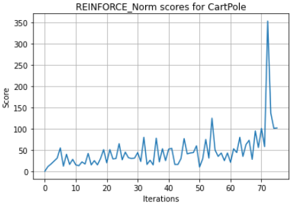

Step 단위 REINFORCE(왼쪽)와 Episode 단위 + Normalization(오른쪽)을 나란히 놓고 보자.

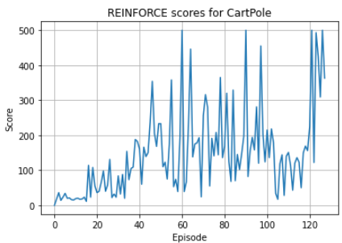

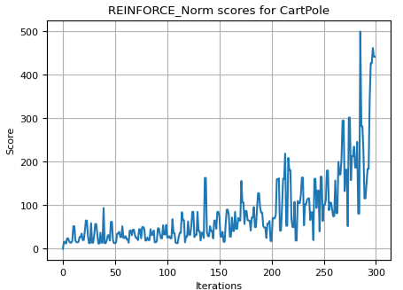

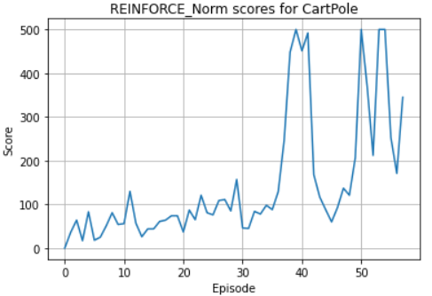

Normalize 를 사용하면 **변동성이 감소**한다. loss 값도 0 근처의 작은 값으로 안정된다(정규화된 리턴은
평균이 0 이므로).

### 실습과제

결과가 더 좋지 못한가? 원인을 생각해 보자.

1. `update_every = 1` 로 수정하고,
2. episode 당 학습 횟수를 늘리면 어떻게 될까?
3. Return Normalization 의 효과를 확인해 보자.

---

## 3.5.9 Policy Gradient Review — Value-based 와 Policy-based
<!-- 슬라이드 302 -->

**Policy-based RL — continuous action space.**

- Policy function 표현에 NN 을 적용한다. State 를 입력받아 action 별 확률을 출력한다.
- 확률적으로 행동을 선택한다(stochastic policy). 학습된 policy 가 결정적이지 않다 — 높은 확률을
  선택하는 것이 아니라 sampling 으로 선택하며, Exploration 이 자동적으로 적용된다.
- Policy evaluation 없이 직접 Policy function 을 최적화한다 — Data + 정책 함수(정책 경사) 평가 →
  $\pi(a|s)$ update.
- 정책 평가 :
  $\nabla_\theta J(\theta) = E_\pi[\nabla_\theta \ln \pi_\theta(a|s) Q^\pi(s,a)] = E_\pi[Q^\pi(S_t,A_t) \nabla_\theta \ln \pi_\theta(A_t|S_t)] = E_\pi[G_t \nabla_\theta \ln \pi_\theta(A_t|S_t)]$,
  $Q^\pi(S_t, A_t) \triangleq E_\pi[G_t \mid S_t = s, A_t = a]$.
- **REINFORCE** : $G_t$ 를 MC 로 추정, $G_t$ 가 커지도록 학습. on-policy, stochastic policy.
  $\theta \leftarrow \theta + \alpha G_t \nabla_\theta \ln \pi_\theta(A_t|S_t)$.
  With Baseline — MC 의 분산을 낮추기 위해 Baseline 함수를 적용,
  $\theta \leftarrow \theta + \alpha (G_t - b(s)) \nabla_\theta \ln \pi_\theta(A_t|S_t)$.
  Return Normalization 적용 — 분산을 감소하여 성능이 향상된다.

**Value-based RL — continuous state space.**

- DQN 에서 state 를 입력받아 action 별 Q value 를 출력한다.
- Q function 을 보고 action 을 선택한다(policy 가 결정적이다).
- 학습 : Data + 정책 평가로 $Q(s,a)$ 추정 → $\pi(a|s)$ update.

---

## 3.5.10 실습 3.5.3 — Model Management (W&B)
<!-- 슬라이드 303~306 -->

> 노트북: `code/3.5.3.Model_Logging.ipynb`
> [](https://colab.research.google.com/github/AI-BoostCamp/ReinforcementLearning/blob/main/code/3.5.3.Model_Logging.ipynb)

개발 과정에서 모델의 Hyper Parameter 들과 모델의 성능, 모델 관리를 자동화해 본다. 모델 개발은 수많은
수정 과정이 필요하고, 각각의 수정 사항(Hyper Parameter)과 결과를 통합 관리해야 한다. 결과를 Jupyter
notebook 에 포함하여 관리하는 것은 한계가 분명하다 — 여러 결과를 비교하기 힘들고, 수정 사항이 명확하게
보이지 않으며, 모델을 저장해도 저장된 모델의 hyper parameter 는 별도로 관리해야 한다.

간단한 솔루션 **wandb(Weights & Biases)** 를 사용해 본다(https://wandb.ai/site). 간단하게 모델
개발 · 관리를 지원하고 Local server 에 porting 도 가능하다. Sign Up 해서 계정을 만들자.

### Code 에서 사용하기

1. "wandb" package install — `!pip install wandb`
2. "wandb" login — API key 는 https://app.wandb.ai/settings 페이지의 API keys 에서 가져온다.
   `!wandb login '<your-api-key>'`. **API key 는 노트북에 직접 적어 두지 않는 것이 원칙**이다(Colab
   보안 비밀 등에 보관).
3. 기본 환경 설정

```python
import wandb
import json
import os; os.environ['WANDB_NOTEBOOK_NAME'] = 'jyp' # jupyter notebook
from os.path import join
```

4. Model config 저장 — `wandb.config` 로 모델의 Configuration 을 기록한다. `wandb.init()` 이 run 을
   시작한다.

```python
update_every = 1 # Update episodes
epochs = 10
n_eps = 50

config = dict()
config['update_every'] = update_every
config['epochs'] = epochs
config['n_eps'] = n_eps

n_project='rl-2211'
wandb.init(project=n_project, config=config)
```

```text
Tracking run with wandb version 0.13.5
Run data is saved locally in /content/wandb/run-2022…
Syncing run balmy-field-6 to Weights & Biases (docs)
```

### wandb.log() 로 logging 할 값들 저장, Model 및 config 저장

실습 3.5.2 의 학습 루프에 `wandb.log(log_dict)` 한 줄을 넣어 에피소드마다 `cum_return` 과
`mean_score` 를 기록한다. 학습이 끝나면 config 를 json 으로, 모델을 h5 로 `wandb.run.dir`(server 의
기본 path)에 저장하고 `wandb.join()` 으로 session 을 닫는다.

```python
for ep in range(n_eps): # episode 반복
    ...
    if ep % update_every == 0:
        s,a, _, _, done, g = memory.get_samples()
        for i in range(epochs):
            loss = agent.update_episodes(s, a, g) # use_norm=True
            tot_loss += loss
            mean_score = np.mean(scores[-min(10,len(scores)):])
        tot_loss = tot_loss / epochs
        print(f"Epi./Iter. {ep}/{epochs*ep//update_every} || mean_score: {mean_score:03f} ||  Tot_Loss: {tot_loss:06f} ")
    if mean_score > 300 : break

    log_dict = dict()
    log_dict['cum_return'] = cum_r
    log_dict['mean_score'] = mean_score
    wandb.log(log_dict)

# Save model and experiment configuration
json_val = json.dumps(config)                            # json format을 준비
with open(join(wandb.run.dir, 'config.json'), 'w') as f: # server의 기본 path을 받아서
    json.dump(json_val, f)                               # 'config.jon'파일명으로 저장
keras.models.save_model(net, join(wandb.run.dir, 'REINFORCE_Norm.h5'))
# close wandb session
wandb.join()
```

```text
Run history:
  cum_return ▂▃▁▁▂▁▁▁▁▂▁▁▁▂▁▁▁▁▂▁
Run summary:
  cum_return 9.0
Synced whole-spaceship-7: https://wandb.ai/rl-2211/RL-2211/runs/mtsx406j
Synced 5 W&B file(s), 0 media file(s), 0 artifact file(s) and 2 other file(s)
```

W&B 의 run 페이지 Files 탭에는 `config.json`, `config.yaml`, `output.log`, `REINFORCE_Norm.h5`,
`requirements.txt`, `wandb-metadata.json`, `wandb-summary.json` 이 올라가 있다. 여러 run 의
`cum_return` 곡선을 한 그래프에 겹쳐 비교할 수도 있다.

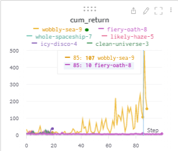

### Model 및 config 읽어오기 — Run path copy & paste

run 페이지의 **Run path**(`entity/project/run_id`)를 복사해 `wandb.restore()` 에 넘기면 저장한
config 와 모델을 내려받아 복원할 수 있다.

```python
wandb_run_path = 'rl-2211/RL-2211/w0pnb6qh' ### 수정!!
model_config_path = wandb.restore('config.json', wandb_run_path, replace=True)

with open(model_config_path.name, "r") as f:
    config_str = json.load(f)
    config_loaded = json.loads(config_str)

print("loaded config")
print(config_loaded)
```

```text
loaded config
{'update_every': 1, 'epochs': 2, 'n_eps': 20}
```

```python
model_path = wandb.restore('REINFORCE_Norm.h5', wandb_run_path, replace=True)
net2 = keras.models.load_model(model_path.name)
net2.summary()
```

복원한 `net2` 로 3.5.7 과 같은 Evaluation(snapshot · video)을 할 수 있다.

### 실습과제

`n_eps = 50` 을 고정하고 `update_every = 1, 3, 5`, `epochs = 1, 3, 5, 7` 을 수정하면서 학습한 결과를
비교해 보자. 효율적인 조합이 있는가? 학습 시간도 비교해 보자. W&B 에 run 이 쌓이면 이 비교가 한
화면에서 된다.

---

**⟨ Part C ⟩ Actor-Critic 과 A2C(Advantage Actor-Critic)**

> REINFORCE 의 $G_t$ 는 분산이 너무 크다. $G_t$ 를 **신경망(Critic)으로 추정**해 넣으면 Actor-Critic 이 된다.

## 3.5.11 Actor-Critic — $G_t$ 를 Q-Net 으로 modeling
<!-- 슬라이드 307 -->

### REINFORCE Algorithm 의 문제점

$$
\nabla_\theta J(\theta) = E_\pi\big[ Q^\pi(S_t, A_t)\, \nabla_\theta \ln \pi_\theta(A_t|S_t) \big] = E_\pi\big[ G_t\, \nabla_\theta \ln \pi_\theta(A_t|S_t) \big]
$$

$Q^\pi(S_t, A_t)$ 는 정답이고, $G_t$ 는 MC 로 추정한 것이다. 알고리즘은
$G_t \leftarrow \sum_{k=t+1}^{T} \gamma^{k-t-1} R_k$, $\theta \leftarrow \theta + \alpha G_t \nabla_\theta \ln \pi_\theta(A_t|S_t)$
였다. **$G_t$ 의 분산이 너무 커서 학습에 방해가 된다** → $G_t$ 를 modeling 해서 사용하자.

### $Q^\pi(S_t, a)$ 를 modeling 하는 network 을 사용

Network 이 학습을 통해 좋은 $G_t$ 를 출력하면 — 즉 $G_t$ 함수를 대치할 $Q_\phi^\pi(S_t, a)$ model 을
사용하면 — 분산 감소가 가능하고 학습 효율 향상이 가능하다. 그래서 **Critic network 를 추가**한다.
Actor net. 의 policy 를 평가하므로 Critic net. 이라 한다.

$$
G_t \leftarrow Q_\phi^\pi(S_t, A_t), \qquad \theta \leftarrow \theta + \alpha\, G_t\, \nabla_\theta \ln \pi_\theta(A_t|S_t)
$$

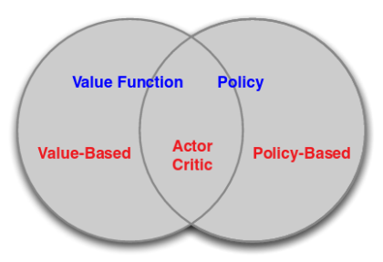


Actor 는 게임을 하고(행동), Critic 은 옆에서 "그 수는 나쁘다" 고 평가한다. Actor 는 Critic 의 평가로
자신의 정책을 고친다.

---

## 3.5.12 가장 간단한 Actor-Critic (SARSA style)
<!-- 슬라이드 308 -->

추가된 Critic network 은 시행으로 얻은 $r + \gamma Q_\phi(s', a')$ 를 target 으로 학습한다(TD error 를
줄이도록 학습). SARSA 의 target 과 같다.

**알고리즘**

1. 초기화 : $\pi_\theta(a|s)$, $Q_\phi^\pi(s,a)$ parameter 초기화
2. Episode Repeat :
   - $s \leftarrow$ 현재 상태 관측
   - Repeat($t = 1, \ldots, T$) — episode 내부 :
     - $a \leftarrow \pi_\theta(a|s)$ 로 결정(sampling)
     - $s', r \leftarrow$ `env.step(a)`, 행동을 시행
     - $a' \leftarrow \pi_\theta(a'|s')$ 로 결정(sampling)
     - $\delta = \| r + \gamma Q_\phi(s', a') - Q_\phi(s,a) \|_2$ — TD error 계산
     - $\phi \leftarrow \phi - \eta\, \delta\, \nabla_\phi Q_\phi(s,a)$ — Critic 은 TD error 가 줄도록
     - $\theta \leftarrow \theta + \alpha\, Q_\phi(s,a)\, \nabla_\theta \ln \pi_\theta(A_t|S_t)$ — Actor 는 $Q$ 가 큰 행동의 확률이 커지도록
     - $a, s \leftarrow a', s'$
   - until : $s == T$

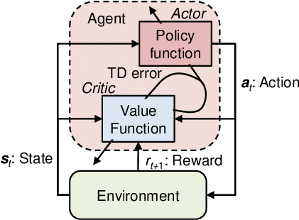

### Baseline 기법을 추가 적용해 보자

$$
\nabla_\theta J(\theta) = \sum_s d^\pi(s) \sum_{a \in A} \nabla_\theta \pi_\theta(a|s)\, \big( Q^\pi(s,a) - b(s) \big)
$$

$b(s)$ 는 $s$ 의 함수, 즉 $a$ 와 무관한 함수면 사용 가능하므로 **$b(s) = V^\pi(s)$** 를 사용할 수 있다.
$b(s)$ 는 각 상태의 변동성을 낮추어 분산을 줄이는 역할을 하므로 적절하다.

---

## 3.5.13 A2C 와 TD Actor-Critic — Advantage function
<!-- 슬라이드 309~311 -->

### A2C, Advantage Actor-Critic algorithm — advantage function 추가

**Advantage function** 은 특정 state 에서 특정 action 이 다른 action 보다 얼마나 좋은지(상대적)를
표현한다.

$$
A^\pi(s,a) = Q^\pi(s,a) - V^\pi(s)
$$

**구현 방법 1 — Advantage Actor-Critic algorithm**

1. $Q^\pi(s,a)$ 근사 : $Q^\pi(s,a) \approx Q_\phi^\pi(s,a)$ — Q-Learning, SARSA 등 사용
2. $V^\pi(s)$ 근사 : $V^\pi(s) \approx V_\psi^\pi(s)$ — MC, TD 등 사용
3. $A^\pi(s,a)$ 근사 : $A_{\phi,\psi}^\pi(s,a) \approx Q_\phi^\pi(s,a) - V_\psi^\pi(s)$
4. $\nabla_\theta J(\theta) = E_\pi[\nabla_\theta \ln \pi_\theta(a|s)\, A^\pi(s,a)]$

→ 3 개의 함수 $Q_\phi^\pi$, $V_\psi^\pi$, $\pi_\theta$ 를 학습해야 한다. 부담된다.

### TD Actor-Critic algorithm — TD 로부터 advantage function 계산

$$
\nabla_\theta J(\theta) = \sum_s d^\pi(s) \sum_{a \in A} \nabla_\theta \pi_\theta(a|s)\, \big( Q^\pi(s,a) - b(s) \big) = \sum_s d^\pi(s) \sum_{a \in A} \nabla_\theta \pi_\theta(a|s)\, A^\pi(s,a)
$$

**구현 방법 2 — true TD error 로부터 $A^\pi(s,a)$ 계산하기.**

- 정답 $Q^\pi(s,a) = E_\pi[\, r + \gamma V^\pi(s') \mid S_t = s, A_t = a \,]$ 이고,
- 정답 TD error $\delta^\pi \triangleq r + \gamma V^\pi(s') - V^\pi(s)$ 이므로($r + \gamma V^\pi(s')$ : TD target),
- **TD error 의 기댓값 = Advantage function** 으로 사용 가능하다.

$$
\begin{aligned}
E_\pi[\, \delta^\pi \mid s, a \,] &= E_\pi[\, r + \gamma V^\pi(s') \mid s, a \,] - V^\pi(s) \qquad V^\pi(s) \text{ 는 } a \text{ 와 무관한 기준값이므로 밖으로 나옴} \\
&= Q^\pi(s,a) - V^\pi(s) \\
&= A^\pi(s,a)
\end{aligned}
$$

TD error 의 기댓값이 Advantage function 이다. 따라서

$$
\nabla_\theta J(\theta) = E_\pi\big[ \delta_\psi(s,a)\, \nabla_\theta \ln \pi_\theta(A_t|S_t) \big]
$$

하지만 정답 TD error 는 알 수 없으니 추산해야 한다 — $\delta_\psi = r + \gamma V_\psi^\pi(s') - V_\psi^\pi(s)$
로 추산해서 사용하면 된다. TD error $\delta_\psi$ 가 작아지도록 $V_\psi^\pi(s)$ 를 학습한다.
→ **$V_\psi^\pi(s)$ 와 $\pi_\theta(a|s)$ 두 function 만 modeling 하면 된다.**

### Policy Gradient review — 한 식의 다섯 얼굴

$$
\begin{aligned}
\nabla_\theta J(\theta) &= E_\pi\big[ Q^\pi(s,a)\, \nabla_\theta \ln \pi_\theta(a|s) \big] && Q^\pi(s,a) \text{ 는 정답} \\
&= E_\pi\big[ G_t\, \nabla_\theta \ln \pi_\theta(A_t|S_t) \big] && \text{REINFORCE — } G_t \text{ : MC 로 추산} \\
&= E_\pi\big[ Q_\phi(s,a)\, \nabla_\theta \ln \pi_\theta(A_t|S_t) \big] && \text{Q Actor-critic} \\
&= E_\pi\big[ A_{\phi,\psi}(s,a)\, \nabla_\theta \ln \pi_\theta(A_t|S_t) \big] && \text{Advantage Actor-critic (A2C)} \\
&= E_\pi\big[ \delta_\psi(s,a)\, \nabla_\theta \ln \pi_\theta(A_t|S_t) \big] && \text{TD Actor-critic (A2C)}
\end{aligned}
$$

---

## 3.5.14 실습 3.5.4 — TD Actor-Critic 으로 CartPole 학습
<!-- 슬라이드 312~317 -->

> 노트북: `code/3.5.4.TD_Actor_Critic.ipynb`
> [](https://colab.research.google.com/github/AI-BoostCamp/ReinforcementLearning/blob/main/code/3.5.4.TD_Actor_Critic.ipynb)
> PyTorch 구현: `code/3.5.4.pt.TD_Actor_Critic.ipynb`
> [](https://colab.research.google.com/github/AI-BoostCamp/ReinforcementLearning/blob/main/code/3.5.4.pt.TD_Actor_Critic.ipynb)

Gym Env. 로 제공되는 CartPole 을 TD Actor-critic 으로 학습시킨다. 두 개의 network 은 **분리해서**
구현하는 경우(Type #1)와 **Parameter 를 공유**하도록 구현하는 경우(Type #2)가 있다. 이 실습은 분리형,
실습과제는 공유형이다.

$$
\nabla_\theta J(\theta) = E_\pi\big[ \delta_\psi(s,a)\, \nabla_\theta \ln \pi_\theta(A_t|S_t) \big], \qquad
A^\pi(s,a) \approx \delta_\psi = r + \gamma V_\psi^\pi(s') - V_\psi^\pi(s)
$$

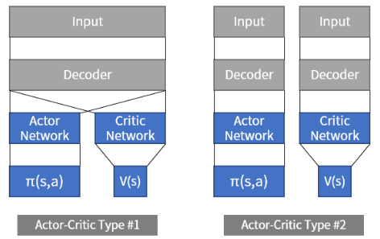

**알고리즘**

1. 초기화 : $\pi_\theta(a|s)$, $V_\psi^\pi(s)$ parameter 초기화
2. Episode Repeat :
   - $s \leftarrow$ 현재 상태 관측
   - Repeat($t = 1, \ldots, T$) — episode 내부 :
     - $a \leftarrow \pi_\theta(a|s)$ 로 결정(sampling)
     - $s', r \leftarrow$ `env.step(a)`, 행동을 시행
     - $\delta = \| r + \gamma V_\psi^\pi(s') - V_\psi^\pi(s) \|_2$ — TD error, $A(\cdot)$ 계산 (TD target: $r + \gamma V_\psi^\pi(s')$)
     - $\psi \leftarrow \psi - \eta \dfrac{\partial \delta}{\partial \psi}$ — critic 은 $\delta$ 가 작아지도록 학습
     - $\theta \leftarrow \theta + \alpha\, \delta\, \nabla_\theta \ln \pi_\theta(A_t|S_t)$ — actor 는 커지도록 학습
     - $a, s \leftarrow a', s'$
   - until : $s == T$

### Actor, Critic network — 동일한 구조 사용

Actor 는 action 의 선택을 확률적으로 결정하도록(softmax 출력) 학습하고, Critic 은 상태가치 값 $V(s)$
를 찾도록(linear 출력 1 개) 학습한다. 은닉층은 같다.

```python
actor_lr = 0.01
critic_lr = 0.01

# actor network : output= prob(action)
def build_actor():
    actor = Sequential()
    actor.add(Input(shape=(state_size,)))
    actor.add(Dense(30, activation='relu', kernel_initializer='he_uniform'))
    actor.add(Dense(30, activation='relu', kernel_initializer='he_uniform'))
    actor.add(Dense(action_size, activation='softmax',
                    kernel_initializer='he_uniform'))
    actor.optimizer=Adam(learning_rate=actor_lr)
    return actor

# critic: state is input and value of state is output of model
def build_critic():
    critic = Sequential()
    critic.add(Input(shape=(state_size,)))
    critic.add(Dense(30, activation='relu', kernel_initializer='he_uniform'))
    critic.add(Dense(30, activation='relu', kernel_initializer='he_uniform'))
    critic.add(Dense(value_size, activation='linear',
                     kernel_initializer='he_uniform'))
    critic.optimizer=Adam(learning_rate=critic_lr)
    return critic

actor = build_actor()
actor.summary()
critic = build_critic()
critic.summary()
```

### CartPole Env. 생성, A2C Agent — TD Advantage Actor-critic Agent 만들기

```python
env = gym.make("CartPole-v1", render_mode="rgb_array")
state_size = env.observation_space.shape[0]
action_size = env.action_space.n
value_size = 1
```

`A2CAgent` 는 actor 와 critic network 을 받아서 사용한다. `get_action()` 은 REINFORCE 와 같이 actor 의
출력 확률에서 sampling 한다. `train_model()` 이 핵심이다.

- Critic 은 $\delta = \| r + \gamma V_\psi^\pi(s') - V_\psi^\pi(s) \|_2$ 값이 작아지도록 학습한다 —
  `td_target = reward + gamma * next_value * (1 - done)`, `c_loss = (value - td_target)²`.
- Actor 는 $\delta\, \nabla_\theta \ln \pi_\theta(A_t|S_t)$ 이 커지도록 학습한다 —
  `a_loss = -log(prob_a[action]) * td_error`, $\delta$ = TD error.
- 두 개의 `GradientTape` 로 각 network 의 gradient 를 따로 구해 각자의 optimizer 로 적용한다.

```python
### A2C(Advantage Actor-Critic) agent for the Cartpole
class A2CAgent:
    def __init__(self, actor, critic):
        self.actor = actor
        self.critic = critic
        self.state_size = state_size
        self.action_size = action_size
        self.value_size = 1
        self.gamma = 0.99
        self._eps = 1e-25

    def get_action(self, state):
        policy = self.actor.predict(state, batch_size=1,verbose=0).flatten()
        return np.random.choice(self.action_size, 1, p=policy)[0]

    def actor_loss(self, prob_a, action, td_error):
        log_probability = tf.math.log(prob_a[0][action] + self._eps)
        loss = -log_probability * td_error
        return loss

    # update policy network every episode
    def train_model(self, state, action, reward, next_state, done):
        with tf.GradientTape() as a_tape, tf.GradientTape() as c_tape:
            value = self.critic(state, training=True)[0]
            next_value = self.critic(next_state, training=True)[0]
            td_target = reward + self.gamma*next_value *(1-done)
            td_error = td_target - value
            c_loss = tf.math.square((value-td_target))
            prob_a = self.actor(state.reshape(1,4), training=True)#두action의 확률
            a_loss = self.actor_loss(prob_a, action, td_error)    #-log(pi()*td_error
            loss = a_loss + c_loss
        c_grads = c_tape.gradient(c_loss, self.critic.trainable_variables)
        a_grads = a_tape.gradient(a_loss, self.actor.trainable_variables)
        self.critic.optimizer.apply_gradients(zip(c_grads,self.critic.trainable_variables))
        self.actor.optimizer.apply_gradients(zip(a_grads,self.actor.trainable_variables))
        return (loss,a_loss,c_loss)
```

`actor_loss` 는 `tfp.distributions.Categorical(probs=prob_a).log_prob(action)` 으로도 쓸 수 있다
(`# = log(P(pi(prob_a<-model(s))|a))`). 뜻은 같다.

### Main loop — TD method 사용, step 단위 학습

MC 와 달리 **매 step `train_model()`** 을 부른다. 에피소드가 `max_steps` 전에 끝나면(pole 이 넘어지면)
보상을 −100 으로 바꿔 벌점을 주고, 점수를 집계할 때 다시 100 을 더해 보상한다.

```python
# make A2C agent
actor = build_actor()
critic = build_critic()
agent = A2CAgent(actor,critic)

n_eps = 200
mean_score = 0
print_every = 2
max_steps = 200
scores = []

for ep in range(n_eps):
    score = 0
    state, _ = env.reset()
    state = np.reshape(state, [1, state_size])
    while True:
        action = agent.get_action(state)
        next_state, reward, done, info, _ = env.step(action)
        next_state = np.reshape(next_state, [1, state_size])
        if done and score < max_steps: reward = -100   # 중간에 끝나면 벌점
        losses = agent.train_model(state, action, reward, next_state, done)
        score += reward
        state = next_state
        if done: break
    score = score if score > max_steps else score + 100 # 벌점 보상
    scores.append(score)
    mean_score = np.mean(scores[-min(10,len(scores)):])
    if ep % print_every == 0:
        print(f"Episode {ep} || mean_score: {mean_score:0.1f} ||  Actor_Loss: {losses[1]}, Critic_loss:{losses[2]}")
    if mean_score > 200: break
```

### 학습 과정 확인 및 REINFORCE 비교

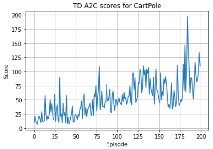

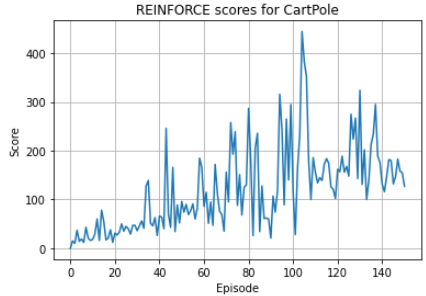

- A2C 는 Critic network 으로 Q value 를 근사하므로 좀 더 **안정적인 학습**이 가능하다. 곡선이
  REINFORCE 보다 훨씬 덜 요동친다.
- 단, 두 개의 network 을 학습해야 하므로 두 network 의 구조, 학습 속도 등을 tuning 할 필요가 있다.
- Episode 중에 학습 가능하므로 매우 긴 episode 를 갖는 환경에 유리하다.

---

## 3.5.15 실습과제 — Actor-Critic 결합 모델
<!-- 슬라이드 318~319 -->

Actor-critic 이 **결합된 모델**(Type #1, parameter 공유)을 만들어 학습해 보자. 입력층과 은닉층(Body)을
공유하고 마지막에 Policy Head(softmax, action 확률)와 Value Head(linear, $\hat{v}(s)$)로 갈라진다.
Keras functional API 로 출력이 둘인 `Model` 을 만든다.

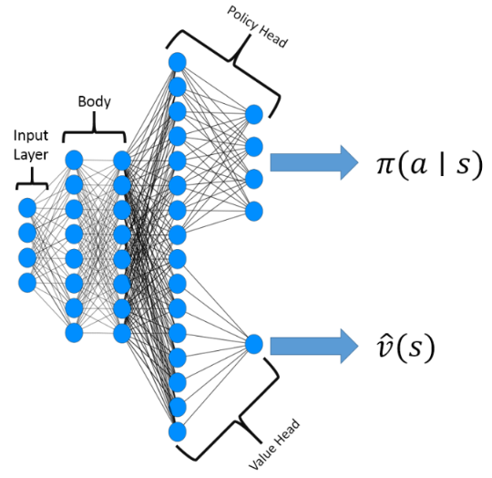

```python
def ActorCritic(lr=0.001):
    in_layer = keras.Input(shape=(state_size,))
    fc1 = keras.layers.Dense(24, activation="relu",
                             kernel_initializer='he_uniform')(in_layer)
    fc2 = keras.layers.Dense(24, activation="relu")(fc1)

    critic = keras.layers.Dense(1, kernel_initializer='he_uniform',name='critic')(fc2)
    actor = keras.layers.Dense(action_size,activation='softmax',
                               kernel_initializer='he_uniform',name='actor')(fc2)
    actor_critic = keras.Model(inputs=in_layer,outputs=[actor,critic])
    actor_critic.optimizer=Adam(lr=lr,clipnorm=5.0)
    return actor_critic
actor_critic = ActorCritic()
```

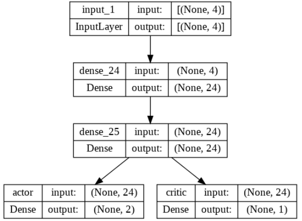

`train_model()` 은 network 이 하나이므로 GradientTape 도 하나다. `self.actor_critic(state)` 가
(prob_a, value) 두 출력을 함께 돌려주므로, TD target · TD error · critic loss · actor loss 를 계산해
합친 loss 로 한 번에 gradient 를 적용한다. **비어 있는 부분(`### ... ###`)을 완성해 학습하고 결과를
검토해 보자.**

```python
# A2C(Advantage Actor-Critic) agent for the Cartpole
class A2CAgent:
    def __init__(self, actor_critic):
        self.actor_critic = actor_critic
        self.state_size = state_size
        self.action_size = action_size
        self.value_size = 1
        self.gamma = 0.99

#    def get_action(self, state): ##########

#    def actor_loss(self,prob_a, action, td_error): ##########

    def train_model(self, state, action, reward, next_state, done):
        with tf.GradientTape() as tape:
            _, value = self.actor_critic(state, training=True)

            ### ... ###

            prob_a,_ = self.actor_critic(state.reshape(1,4), training=True)
            a_loss = self.actor_loss(prob_a, action, td_error)

            loss = a_loss + c_loss
        grads = tape.gradient(loss, self.actor_critic.trainable_variables)
        self.actor_critic.optimizer.apply_gradients(zip(grads,\
                                self.actor_critic.trainable_variables))
        return (loss,a_loss,c_loss)
```

```python
for ep in range(n_eps):
    done = False
    score = 0
    state = env.reset()
    state = np.reshape(state, [1, state_size])
    while True:
    ### ... ###
        losses = agent.train_model(state, action, reward, next_state, done)
    ### ... ###
        if done: break
    score = score if score > max_steps else score + 100 # 벌점 보상
    scores.append(score)
    episodes.append(ep)
    mean_score = np.mean(scores[-min(10,len(scores)):])
```

---

## 3.5.16 정리 — Actor-Critic, A2C Review
<!-- 슬라이드 320 -->

$$
\nabla_\theta J(\theta) = E_\pi[\nabla_\theta \ln \pi_\theta(a|s)\, Q^\pi(s,a)] = E_\pi[Q^\pi(S_t,A_t)\, \nabla_\theta \ln \pi_\theta(A_t|S_t)] = E_\pi[G_t\, \nabla_\theta \ln \pi_\theta(A_t|S_t)]
$$

($Q^\pi(S_t, A_t) \triangleq E_\pi[G_t \mid S_t = s, A_t = a]$)

- **REINFORCE** : $G_t$ 를 MC 로 추정한다 — $G_t \leftarrow \sum_{k=t+1}^{T} \gamma^{k-t-1} R_k$,
  $\theta \leftarrow \theta + \alpha G_t \nabla_\theta \ln \pi_\theta(A_t|S_t)$. $G_t$ 의 분산이 너무 크다.
- **Actor-critic** : $G_t$ 를 Q-Net 으로 modeling 한다. $Q^\pi(S_t, a)$ 를 modeling 하는 network 을
  사용해 $G_t$ 함수를 대치할 $Q_\phi^\pi(S_t, a)$ model 을 쓴다(**Critic network**) —
  $G_t \leftarrow Q_\phi^\pi(S_t, A_t)$, $\theta \leftarrow \theta + \alpha G_t \nabla_\theta \ln \pi_\theta(A_t|S_t)$.
  Actor net. 의 policy 를 평가하므로 Critic net. 이라 한다.
- **Advantage Actor-Critic** : $G_t$ With Baseline. $G_t$ 함수를 대치하여 $A^\pi$ 를 사용한다.
  $\theta \leftarrow \theta + \alpha (G_t - b(s)) \nabla_\theta \ln \pi_\theta(A_t|S_t)$ 에서 $b(s) = V^\pi(s)$
  라면 Advantage function 은 $A^\pi(s,a) = Q^\pi(s,a) - V^\pi(s)$.
- **TD Advantage Actor-Critic** : TD error 의 기댓값을 Advantage function 으로 사용한다.
  $E_\pi[\delta^\pi \mid s,a] = E_\pi[r + \gamma V^\pi(s') \mid s,a] - V^\pi(s) = Q^\pi(s,a) - V^\pi(s) = A^\pi(s,a)$.
  ∴ $\nabla_\theta J(\theta) = E_\pi[\delta_\psi(s,a)\, \nabla_\theta \ln \pi_\theta(A_t|S_t)]$,
  $\delta_\psi = r + \gamma V_\psi^\pi(s') - V_\psi^\pi(s)$. TD error $\delta_\psi$ 가 작아지도록
  $V_\psi^\pi(s)$ 를 학습한다.

다음 절의 DDPG 는 이 Actor-Critic 구조를 **연속 행동 공간**으로 가져가면서, DQN 의 두 장치(Replay
Memory · Target Network)를 결합한다.
