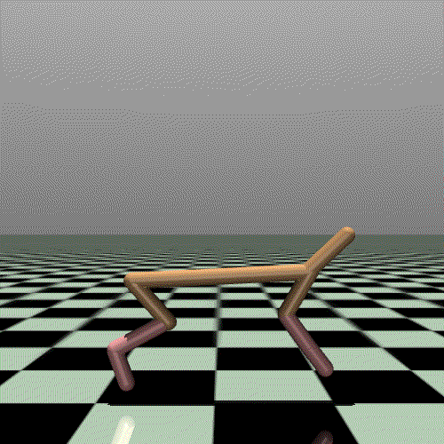
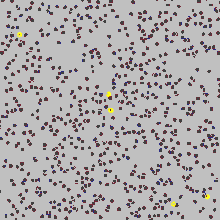
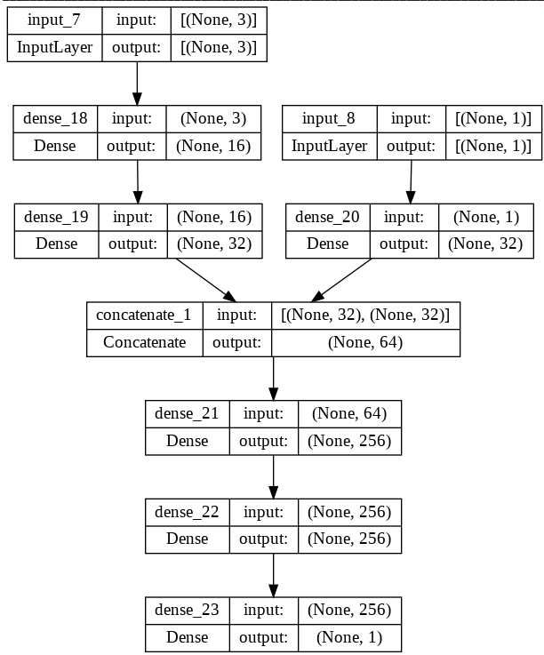
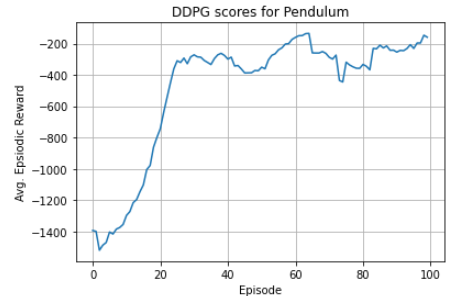

# 3.6 DDPG(Deep Deterministic Policy Gradient)

**학습 목표**

- DDPG = Actor-Critic + DPG(Deterministic Policy Gradient) + DQN 이라는 구성을 요소별로 설명할 수 있다.
- 연속 행동 공간에서 Q-Learning 의 $\max_{a'} Q(s', a')$ 가 왜 어려운지, deterministic policy
  $\mu_\theta(s)$ 가 그 문제를 어떻게 피하는지 설명할 수 있다.
- Deterministic policy 의 성능 함수 $J(\mu_\theta)$ 와 그 gradient
  $E_{s}[\nabla_\theta \mu_\theta(s)\, \nabla_a Q(s,a)|_{a=\mu_\theta(s)}]$ 의 뜻(두 변화율의 곱)을 말할 수 있다.
- Critic loss(MSBE), Actor loss, OU noise 탐색, Replay buffer, Target network(soft update)로 이루어진
  DDPG 알고리즘을 쓰고 Keras 로 구현할 수 있다.
- Pendulum 환경에서 hyper parameter(buffer · batch · learning rate · OU std · $\tau$)가 학습 곡선에
  주는 영향을 관찰할 수 있다.

**이 절의 구성**

- 3.6.1 DDPG 란 — Actor-Critic + DPG + DQN
- 3.6.2 연속 행동 공간 해결하기
- 3.6.3 Deterministic policy 의 성능 함수
- 3.6.4 Deterministic Policy Gradient 와 Exploration
- 3.6.5 DDPG — Off-policy Actor-Critic Model 과 알고리즘
- 3.6.6 실습 3.6.1 — DDPG 로 Pendulum 학습
- 3.6.7 실습과제 — Hyper Parameter 수정
- 3.6.8 참고 실습 3.6.2 — DDPG 로 LunarLander 학습
- 3.6.9 정리 — Review

---

## 3.6.1 DDPG 란 — Actor-Critic + DPG + DQN
<!-- 슬라이드 322 -->

**DDPG(Deep Deterministic Policy Gradient, 2015)** 는 세 가지의 결합이다.

$$
\text{DDPG} = \text{Actor-Critic} + \text{DPG(Deterministic Policy Gradient)} + \text{DQN}
$$

- **연속적인 행동 공간**에 대한 정책을 최적화할 수 있다 — Continuous action, 실수 값을 갖는 action
  domain 에 적용된다.
- **Deterministic Policy**(vs. stochastic policy)를 사용한다. Actor-Critic 구조의 policy gradient 기반
  model-free 알고리즘이며(deterministic policy), **Off-policy 학습이 가능**하고 RM(Replay Memory)을
  사용한 sample 효율이 높아진다. Deterministic policy 의 문제(탐색이 없다)를 해결하기 위해 Policy net.
  의 출력에 **noise 를 추가**하여 exploration 기능을 제공한다.
- **Target Network 을 사용**한다(Actor, Critic 모두). 학습 안정성이 향상되고, Soft update 를 적용한다.


---

## 3.6.2 연속 행동 공간 해결하기
<!-- 슬라이드 323 -->

MuJoCo(Multi-Joint dynamics with Contact) Env. 에서의 action 은 **각 관절의 모터를 control** 하는
실수 값이다. Motor control 을 stochastic control 하는 것은 무리이고, discrete space 의 수를 늘리는
것도 무리다. 따라서 **연속 공간에서 control 값을 찾아야** 한다.



### Q-Learning 을 적용하면?

$$
Q(s,a) \mathrel{+}= \alpha\,\big( r + \gamma \max_{a'} Q(s', a') - Q(s,a) \big)
$$

$\max_{a'} Q(s', a')$ 의 계산이 어렵고 비효율적이다. 대부분의 경우 convex function 이 아니고, action
space 가 넓기 때문에 **max 를 푸는 것 자체가 또 하나의 최적화 문제**가 된다.

### 연속적인 정책 함수 $\pi(a|s)$ 를 사용하면?

Actor-critic 구조를 기반으로 **Actor 를 deterministic 하게 설계**해 보자. Deterministic policy 를
사용한다는 것은 — stochastic policy 식

$$
Q^\pi(s_t, a_t) = E_{r_t, s_{t+1} \sim E}\Big[ r(s_t, a_t) + \gamma\, E_{a_{t+1} \sim \pi}\big[ Q^\pi(s_{t+1}, a_{t+1}) \big] \Big]
$$

에서 $Q^\pi(s_t, a_t)$ 는 환경 $E$ 와 정책 $\pi$ 의 영향을 받는데, 정책 $\mu$ 가 deterministic 하다면
정책에 대한 기댓값을 계산할 필요가 없으므로(기댓값 없이 결정값을 사용)

$$
Q^\mu(s_t, a_t) = E_{r_t, s_{t+1} \sim E}\big[ r(s_t, a_t) + \gamma\, Q^\mu(s_{t+1}, \mu(s_{t+1})) \big]
$$

가 된다. 안쪽 기댓값 하나가 사라진 것이다.

---

## 3.6.3 Deterministic policy 의 성능 함수
<!-- 슬라이드 324 -->

Deterministic policy 를 사용해도 문제가 없을까. Stochastic 한 policy 에 대한 성능 함수 $J(\pi_\theta)$
를 다시 정의해 보자("Deterministic Policy Gradient Algorithms: Supplementary Material").

3.5 절에서는 policy gradient 계산을 위해 $J(\pi_\theta) = V^{\pi_\theta}(s_0) = E_{\pi_\theta}[G_0 \mid S = s_0]$
로 정의했었다. 이번에는 $p(s \to s', t, \pi)$ 를 정책 $\pi$ 하에서 $s$ 에서 $s'$ 로 $t$ step 에 갈
확률로 정의하고, **할인된 상태 분포**

$$
\rho^\pi(s') \triangleq \int_{s \in S} \sum_{t=1}^{\infty} \gamma^{t-1}\, p_1(s)\, p(s \to s', t, \pi)\, ds
$$

를 정의한다($p_1(s)$ : 초기 상태 분포). $\rho^\pi(s')$ 는 $s'$ 을 방문할 가능성 — 시간에 대한 감가
$\gamma$ 를 적용한, 모든 상태 $s$ 에서 $s'$ 로 갈 확률의 합이다. 그러면 $J(\pi_\theta)$ 를 재정의할 수 있다.

$$
J(\pi_\theta) = \int_{s \in S} \rho^{\pi_\theta}(s) \int_{a \in A} \pi_\theta(a|s)\, r(s,a)\, da\, ds
= E_{s \sim \rho^{\pi_\theta},\ a \sim \pi_\theta}\big[ r(s,a) \big]
$$

안쪽 적분 $\int_a \pi_\theta(a|s) r(s,a) da$ 는 상태 $s$ 에서의 $r$ 의 기댓값이고, 그것을 할인된 상태
분포 $\rho^{\pi_\theta}$ 로 가중 합한 것이다 — $\rho^{\pi_\theta}$ 분포에서 sampling 된 $s$, $\pi_\theta$
에서 sampling 된 $a$ 로부터 얻은 보상 $r(s,a)$ 의 기댓값.

**Deterministic 한 policy 에 대한 성능 함수 $J(\mu_\theta)$** 를 같은 방식으로 표현하면, 확률 $\pi$ 로
결정되던 $a$ 가 결정 함수 $\mu$ 로 대치된다.

$$
J(\mu_\theta) = \int_{s \in S} \rho^{\mu_\theta}(s)\, r\big(s, \mu_\theta(s)\big)\, ds = E_{s \sim \rho^{\mu_\theta}}\big[ r(s, \mu_\theta(s)) \big]
$$

기댓값 계산이 한 번으로 감소한다 — 그래서 **분산이 감소**된다.

---

## 3.6.4 Deterministic Policy Gradient 와 Exploration
<!-- 슬라이드 325 -->

### Deterministic Policy Gradient 를 구해 보자

$$
\begin{aligned}
\nabla_\theta J(\mu_\theta) &= \nabla_\theta \int_{s \in S} \rho^{\mu_\theta}(s)\, r(s, \mu_\theta(s))\, ds \\
&= \int_{s \in S} \rho^{\mu_\theta}(s)\, \nabla_\theta \mu_\theta(s)\, \nabla_a Q(s,a)\big|_{a = \mu_\theta(s)}\, ds \\
&= E_{s \sim \rho^{\mu_\theta}}\Big[ \nabla_\theta \mu_\theta(s)\, \nabla_a Q(s,a)\big|_{a = \mu_\theta(s)} \Big]
\end{aligned}
$$

둘째 줄은 reward 미분 없이 유도할 수 있고(같은 논문의 Supplementary Material), 셋째 줄을 **loss 로
사용**한다. 두 인수의 뜻을 새겨 두자.

- $\nabla_a Q(s,a)\big|_{a=\mu_\theta(s)}$ : **$a$ 의 변화와 $Q$ 변화의 비율** — $a$ 를 어떻게 바꾸면 $Q$ 가
  바뀌는지 평가한다.
- $\nabla_\theta \mu_\theta(s)$ : **$\theta$ 의 변화와 $a$ 변화의 비율** — $\theta$ 를 어떻게 바꾸면 $a$ 가
  바뀌는지 평가한다.
- 둘을 곱하면(chain rule), **$Q$ 가 커지는 쪽으로 $\theta$ 를 update** 한다.

Deterministic policy gradient 는 Stochastic policy gradient 의 특별한 case 다 — stochastic 에서 분산이
0 인 경우가 deterministic case 다. 따라서 기본적으로 Deterministic policy gradient 를 계산하는 데
문제가 없다.

### $\mu$ 는 Actor-Net, $Q$ 는 Critic-Net 으로 modeling 하자

- Actor-Net 의 학습에는 **policy gradient** 를 적용한다.
- Critic-Net 의 학습에는 **Bellman error** 를 적용한다.

### Deterministic policy 를 사용하면 — Exploration 이 필요하다

Deterministic policy 를 사용하면 **Off-policy 학습이 가능**해 RM 을 사용할 수 있다. 그런데
**Exploration 을 제공해야** 한다 — action 에 random 성을 추가해야 하는데, 얼마나, 어떻게?
**Ornstein-Uhlenbeck process**(Brown motion 의 수학적 정의)라고 보고, random 성이 제한적인 부분에서
주어지면 된다고 본다 → action 에 약간의 random noise 를 추가한다.



---

## 3.6.5 DDPG — Off-policy Actor-Critic Model 과 알고리즘
<!-- 슬라이드 326~327 -->

### Algorithm 을 정리하면

- **Critic loss** : $Q$ 함수 최적화 — 다음 step 의 $G$ 값에 근사하도록 update 한다.
  $$c\_loss = \frac{1}{N} \sum_i^N \Big( \big( r_i + \gamma\, Q_t(s_{t+1}, \mu_t(s_{t+1})) \big) - Q(s_t, a_t) \Big)^2$$
  — **MSBE**(mean squared Bellman Error). $Q_t$, $\mu_t$ 는 target net 이다. Bellman error 는
  $e(s) = |V(s') - V(s)|$ 였다.
- **Actor loss** : Policy gradient 를 계산해서 커지도록 update 한다.
  $$a\_loss = \nabla_\theta J(\mu_\theta) = E_{s \sim \rho^{\mu_\theta}}\Big[ \nabla_\theta \mu_\theta(s)\, \nabla_a Q(s,a)\big|_{a = \mu_\theta(s)} \Big]$$
- **Action** : $\mu_\theta'(s_t) = \mu_\theta(s) + \epsilon$ — $\epsilon$ 은 Ornstein-Uhlenbeck process 에
  따라 계산된 noise.
- **+ Replay buffer + Target network** (Actor, Critic 모두 적용).
- Batch Normalization 적용.


### DDPG algorithm

Actor loss 는 chain rule 로 정리하면 $\nabla_\theta Q(s, \mu_\theta(s)) = \nabla_\theta \mu_\theta(s)\, \nabla_a Q(s,a)|_{a=\mu_\theta(s)}$
이므로, 구현에서는 **$a\_loss = Q(s, \mu_\theta(s))$ 를 최대화**(부호를 바꿔 최소화)하면 된다.

1. Replay memory $D$ 초기화
2. Actor-Net $\mu$, Critic-Net $Q$ 초기화
3. Target-Net $Q_t \leftarrow Q$, $\mu_t \leftarrow \mu$ parameter copy
4. Episode Repeat :
   - $s \leftarrow$ 현재 상태 관측
   - $\epsilon \leftarrow$ random process
   - Repeat($t = 1, \ldots, T$) — episode 내부 :
     - $a \leftarrow \mu_\theta(s) + \epsilon$
     - $s', r \leftarrow$ `env.step(a)`
     - $D \leftarrow (s, a, r, s')$
     - $(s, a, r, s') \leftarrow$ random($D$, batch_size)
     - $y = r + \gamma\, Q_t(s', \mu_t(s'))$ — (bs, a)
     - $closs(y, Q(s,a))$
     - $\theta^Q \leftarrow \theta^Q - \eta \dfrac{\partial\, closs}{\partial \theta^Q}$ — critic update
     - $\theta^\mu \leftarrow \theta^\mu + \dfrac{1}{N} \sum \nabla_\theta \mu_\theta(s)\, \nabla_a Q(s,a)\big|_{a=\mu_\theta(s)}$ — actor update
     - update target networks (soft update):
       $\theta^{Q_t} \leftarrow \tau \theta^Q + (1 - \tau)\theta^{Q_t}$,
       $\theta^{\mu_t} \leftarrow \tau \theta^\mu + (1 - \tau)\theta^{\mu_t}$
   - until : $s == T$

$$
closs = \frac{1}{N} \sum_i^N \Big( \big( r_i + \gamma\, Q_t(s_{i+1}, \mu_t(s_{i+1})) \big) - Q(s_i, a_i) \Big)^2
$$

$\nabla_a Q(s,a)|_{a=\mu_\theta(s)}$ 는 Critic $Q$ 함수의 행동 $a$ 에 대한 변화율이다.

---

## 3.6.6 실습 3.6.1 — DDPG 로 Pendulum 학습
<!-- 슬라이드 328~334 -->

> 노트북: `code/3.6.1.DDPG.ipynb`
> [](https://colab.research.google.com/github/AI-BoostCamp/ReinforcementLearning/blob/main/code/3.6.1.DDPG.ipynb)
> PyTorch 구현: `code/3.6.1.pt.DDPG.ipynb`
> [](https://colab.research.google.com/github/AI-BoostCamp/ReinforcementLearning/blob/main/code/3.6.1.pt.DDPG.ipynb)

Pendulum 환경을 사용하여 DDPG 알고리즘을 수행시킨다 — Pendulum 환경을 확인하고, DDPG 알고리즘을
구현하고, 학습을 통해 continuous action 환경에서의 학습 경향을 확인하고, Hyper parameter 들을 변경하여
모델의 특성을 파악한다.

### Pendulum Env.

(참고: https://www.gymlibrary.dev/environments/classic_control/pendulum/) Observation Space 와 Action
Space 가 모두 **continuous** 다. 막대를 세워 두는 것이 목표이고, 관측은 각도의 cos · sin 과 각속도다.

| Num | Observation | Min | Max |
|---|---|---|---|
| 0 | x = cos(theta) | -1.0 | 1.0 |
| 1 | y = sin(angle) | -1.0 | 1.0 |
| 2 | Angular Velocity | -8.0 | 8.0 |

Action 은 관절에 가하는 토크 하나, 범위 $[-2, 2]$ 의 실수다. **Rewards** 는 theta(−π ~ π 사이에서
정규화된 pendulum 의 angle, 0 이 수직)와 각속도 · 토크의 크기에 벌점을 주는 형태로, 범위는
−16.2736044 ~ 0 이다. 매 step 보상이 음수이므로 에피소드 보상은 항상 음수이고, 0 에 가까울수록 좋다.


```python
import gymnasium as gym
env = gym.make("Pendulum-v1", render_mode="rgb_array")

num_states = env.observation_space.shape[0]
print("Size of State Space ->  {}".format(num_states))       # 3
num_actions = env.action_space.shape[0]
print("Size of Action Space ->  {}".format(num_actions))     # 1

upper_bound = env.action_space.high[0]
lower_bound = env.action_space.low[0]

print("Max Value of Action ->  {}".format(upper_bound))      # 2.0
print("Min Value of Action ->  {}".format(lower_bound))      # -2.0
```

### Ornstein-Uhlenbeck process 에 따라 Noise 계산

OU noise 는 이전 값 `x_prev` 에 평균으로 되돌아가는 힘($\theta(\mu - x_{prev})dt$)과 gaussian 잡음
($\sigma \sqrt{dt}\, \mathcal{N}$)을 더한다. 그래서 **다음 noise 가 현재 noise 에 의존**하고, 부드럽게
이어지는 탐색이 된다.

```python
class OUActionNoise:
    def __init__(self, mean, std_deviation, theta=0.15, dt=1e-2, x_initial=None):
        self.theta = theta
        self.mean = mean
        self.std_dev = std_deviation
        self.dt = dt
        self.x_initial = x_initial
        self.reset()

    def __call__(self):
        # Formula taken from https://www.wikipedia.org/wiki/Ornstein-Uhlenbeck_process.
        x = (
            self.x_prev
            + self.theta * (self.mean - self.x_prev) * self.dt
            + self.std_dev * np.sqrt(self.dt) * np.random.normal(size=self.mean.shape)
        )
        # Store x into x_prev
        # Makes next noise dependent on current one
        self.x_prev = x
        return x

    def reset(self):
        if self.x_initial is not None:
            self.x_prev = self.x_initial
        else:
            self.x_prev = np.zeros_like(self.mean)
```

### Actor Network

Actor 는 state(3)를 받아 **tanh** 출력 하나를 내고 `upper_bound`(2.0)를 곱해 $[-2, 2]$ 의 실수 action 을
만든다. 마지막 층의 가중치를 $\pm 0.003$ 의 작은 값으로 초기화해 처음에는 action 이 0 근처에서 시작하게 한다.

```python
def get_actor():
    last_init = tf.random_uniform_initializer(minval=-0.003, maxval=0.003)
    inputs = layers.Input(shape=(num_states,))
    out = layers.Dense(256, activation="relu")(inputs)
    out = layers.Dense(256, activation="relu")(out)
    outputs = layers.Dense(1, activation="tanh", kernel_initializer=last_init)(out)
    outputs = outputs * upper_bound # (-2 ~ +2)
    model = tf.keras.Model(inputs, outputs)
    return model
```

```text
Layer (type)                 Output Shape              Param #
=================================================================
input_6 (InputLayer)         [(None, 3)]               0
dense_15 (Dense)             (None, 256)               1024
dense_16 (Dense)             (None, 256)               65792
dense_17 (Dense)             (None, 1)                 257
tf.math.multiply_3 (TFOpLambda) (None, 1)              0
=================================================================
Total params: 67,073
```

### Critic Network

Critic 은 **state 와 action 두 입력**을 받아 $Q(s,a)$ 하나를 낸다. state 와 action 을 각자의 Dense 층으로
처리한 뒤 `Concatenate` 로 합친다. DQN 의 Q-Network 이 action 별 출력을 내던 것과 다르다 — 연속
action 은 입력으로 넣어야 한다.

```python
def get_critic():
    state_input = layers.Input(shape=(num_states,)) ## State input
    action_input = layers.Input(shape=(num_actions,)) ## Action input
    state_out = layers.Dense(16, activation="relu")(state_input)
    state_out = layers.Dense(32, activation="relu")(state_out)
    action_out = layers.Dense(32, activation="relu")(action_input)
    concat = layers.Concatenate()([state_out, action_out])
    out = layers.Dense(256, activation="relu")(concat)
    out = layers.Dense(256, activation="relu")(out)
    outputs = layers.Dense(1)(out)
    model = tf.keras.Model([state_input, action_input], outputs)
    return model
```



### Agent — Replay Buffer sampling & update

`DDPG_Agent` 는 replay buffer(numpy 배열 4 개, 순환 index)와 학습 함수를 가진다. `record()` 가 $(s, a, r, s')$
를 저장하고, `learn()` 이 random 하게 batch 를 뽑아 `update()` 를 부른다.

```python
class DDPG_Agent:
    def __init__(self, buffer_capacity=100000, batch_size=64):
        self.buffer_capacity = buffer_capacity
        self.batch_size = batch_size
        self.buffer_counter = 0  # 저장 횟수
        self.states = np.zeros((self.buffer_capacity, num_states))
        self.actions = np.zeros((self.buffer_capacity, num_actions))
        self.rewards = np.zeros((self.buffer_capacity, 1))
        self.next_states = np.zeros((self.buffer_capacity, num_states))

    def record(self, obs_tuple):  #(s,a,r,s')
        index = self.buffer_counter % self.buffer_capacity
        self.states[index] = obs_tuple[0]
        self.actions[index] = obs_tuple[1]
        self.rewards[index] = obs_tuple[2]
        self.next_states[index] = obs_tuple[3]
        self.buffer_counter += 1

    # We compute the loss and update parameters
    def learn(self): # get random samples & update
        record_range = min(self.buffer_counter, self.buffer_capacity)
        batch_indices = np.random.choice(record_range, self.batch_size)
        state_batch = tf.convert_to_tensor(self.states[batch_indices])
        action_batch = tf.convert_to_tensor(self.actions[batch_indices])
        reward_batch = tf.convert_to_tensor(self.rewards[batch_indices])
        reward_batch = tf.cast(reward_batch, dtype=tf.float32)
        next_state_batch = tf.convert_to_tensor(self.next_states[batch_indices])
        self.update(state_batch, action_batch, reward_batch, next_state_batch)
```

### Agent — Network Parameter Update

`update()` 가 알고리즘의 심장이다.

- **Critic network update** : target actor 로 $\mu_t(s')$ 를 만들고, target critic 으로
  $y = r + \gamma Q_t(s', \mu_t(s'))$ 를 계산한다. `critic_model([state, action])` 이 $Q(s_i, a_i)$ 이고,
  둘의 차의 제곱 평균이 $c\_loss$ 다.
- **Actor network update** : actor 가 낸 action $\mu(s)$ 를 critic 에 넣어 $Q(s, \mu(s))$ 를 얻고, 그
  **평균에 (−) 를 붙인 것**을 actor loss 로 한다. 이것을 최소화하면 $Q(s, \mu_\theta(s))$ 가 커지는
  방향으로 $\theta$ 가 움직인다 — gradient 는 critic 을 통과해 actor 로 흐르지만 적용은 actor 변수에만 한다.

```python
    @tf.function
    def update( self, state_batch, action_batch, reward_batch, next_state_batch,):
        with tf.GradientTape() as tape: # Critic network update
            target_actions = target_actor(next_state_batch, training=True)
            y = reward_batch + gamma * target_critic(
                [next_state_batch, target_actions], training=True )
            critic_value = critic_model([state_batch, action_batch], training=True)
            critic_loss = tf.math.reduce_mean(tf.math.square(y - critic_value))
        critic_grad = tape.gradient(critic_loss, critic_model.trainable_variables)
        critic_optimizer.apply_gradients(
            zip(critic_grad, critic_model.trainable_variables) )

        with tf.GradientTape() as tape: # Actor network update
            actions = actor_model(state_batch, training=True)
            critic_value = critic_model([state_batch, actions], training=True)
            actor_loss = -tf.math.reduce_mean(critic_value) ## (-)
        actor_grad = tape.gradient(actor_loss, actor_model.trainable_variables)
        actor_optimizer.apply_gradients(
            zip(actor_grad, actor_model.trainable_variables) )
```

**Target Network update — soft update** : $\theta_t \leftarrow \tau\theta + (1 - \tau)\theta_t$. 변수
하나하나를 $\tau$ 비율로 섞는다.

```python
@tf.function
def update_target(target_model, source_model, tau):
    for target_var, source_var in zip(target_model.trainable_variables,\
                                      source_model.trainable_variables):
        target_var.assign(tau * source_var + (1 - tau) * target_var)
```

### Agent — get action with exploration

`policy()` 는 Actor network 에서 sampling 한 action 에 exploration 을 위한 noise 를 더하고, action 범위
안으로 clip 한다.

```python
def policy(state, noise_object):
    sampled_actions = tf.squeeze(actor_model(state))
    noise = noise_object()
    # Adding noise to action
    sampled_actions = sampled_actions.numpy() + noise
    # We make sure action is within bounds
    legal_action = np.clip(sampled_actions, lower_bound, upper_bound)
    return [np.squeeze(legal_action)]
```

### Model Instantiations — Training hyperparameters

```python
std_dev = 0.2
ou_noise = OUActionNoise(mean=np.zeros(1), std_deviation=float(std_dev) * np.ones(1))

gamma = 0.99
tau = 0.005

critic_lr = 0.002 ##
actor_lr = 0.001  ##

actor_model = get_actor()
critic_model = get_critic()
target_actor = get_actor()
target_critic = get_critic()
# Traget model weigth <- Main model weight
target_actor.set_weights(actor_model.get_weights())
target_critic.set_weights(critic_model.get_weights())
# Optimizer
critic_optimizer = tf.keras.optimizers.Adam(critic_lr)
actor_optimizer = tf.keras.optimizers.Adam(actor_lr)

agent = DDPG_Agent(2000, 64)  ## buffer_capacity=100000, batch_size=64
```

$\tau = 0.005$ 는 매 step target 을 0.5% 씩만 따라가게 하는 아주 느린 soft update 다.

### Main Training Loop

매 step 마다 `policy()` 로 action sampling → `env.step` → `agent.record` → `agent.learn()`(train each
step) → `update_target()` 두 번(Actor, Critic). 에피소드 보상과 최근 10 에피소드 평균을 기록한다.

```python
ep_reward_list = []
avg_reward_list = []
total_episodes = 100

for ep in range(total_episodes):
    prev_state, _ = env.reset()
    episodic_reward = 0
    cnt = 0
    while True:
        action = policy(prev_state.reshape(1,3), ou_noise)
        state, reward, done, info, _ = env.step(action)
        agent.record((prev_state, action, reward, state))
        episodic_reward += reward

        agent.learn()
        update_target(target_actor, actor_model, tau)
        update_target(target_critic, critic_model, tau)
        cnt += 1
        prev_state = state
        if done or cnt > 500 : break
    ep_reward_list.append(episodic_reward)

    avg_reward = np.mean(ep_reward_list[-10:])
    print("Episode * {} * Avg Reward is ==> {}".format(ep, avg_reward))
    avg_reward_list.append(avg_reward)
```

---

## 3.6.7 실습과제 — Hyper Parameter 수정
<!-- 슬라이드 335 -->

### 학습 과정 및 결과

```text
Episode * 0 * Avg Reward is ==> -1393.6065308283148
Episode * 1 * Avg Reward is ==> -1399.4261465531063
Episode * 2 * Avg Reward is ==> -1519.8472278727356
…
Episode * 97 * Avg Reward is ==> -196.16640852275867
Episode * 98 * Avg Reward is ==> -146.62232475220836
Episode * 99 * Avg Reward is ==> -159.1926263043311
Wall time: 3min 19s
```

```python
plt.figure(figsize=(5,3))
name = 'DDPG scores for Pendulum'
plt.title(f"{name}\n Max Avg Episodic Reward: {max(avg_reward_list):.1f}")
plt.plot(avg_reward_list)
plt.xlabel("Episode")
plt.ylabel("Avg. Epsiodic Reward")
plt.grid()
plt.show()
```



100 에피소드, 3 분 남짓으로 막대를 세우는 정책을 배운다. 연속 행동 공간에서도 Actor-Critic + Replay
buffer + Target network 의 조합이 안정적으로 동작하는 것이 보인다.

### 실습과제

Hyper Parameter 를 수정하여 성능을 개선해 보자. 어떤 영향이 있는지 정리해 보자.

- Replay Buffer size
- Batch size
- Network Learning rate
- OU parameter : `std_dev`
- Target update rate : `tau`


노트북에는 "가장 좋은 조건으로 5 회 반복하여 변동성을 확인해 보자" 는 과제도 있다. 같은 설정이라도 실행마다
곡선이 달라지므로, 한 번의 결과로 설정의 우열을 판단하지 않는 습관이 필요하다.

---

## 3.6.8 참고 실습 3.6.2 — DDPG 로 LunarLander 학습
<!-- 대응 슬라이드 없음. 4.3 실습(슬라이드 377)이 "LunarLander 에 DDPG 를 먼저 적용해 보자" 고 하는 그 노트북이다 -->

> 노트북: `code/3.6.2.DDPG_Lunar.ipynb`
> [](https://colab.research.google.com/github/AI-BoostCamp/ReinforcementLearning/blob/main/code/3.6.2.DDPG_Lunar.ipynb)

같은 DDPG 를 4.3 절의 실습 환경 **LunarLanderContinuous**(상태 8 차원, 행동 2 차원 — main · lateral
엔진)에 적용한 노트북이다. 4.3 의 TD3 실습이 "DDPG 를 먼저 적용해 보고, TD3 를 적용해 비교" 하라고
하므로 그 출발점이 된다. 구조는 Pendulum 판과 같되 다음이 다르다.

- Replay buffer(`RBuffer`)가 `done` 도 저장하고, target 계산에서 `dones` 로 종료 상태를 0 처리한다.
- Actor · Critic 을 `tf.keras.Model` subclass 로 쓴다. Critic 은 state 와 action 을 `tf.concat` 으로
  합쳐 한 번에 처리한다(512-512).
- 탐색 noise 는 OU 대신 **gaussian**(`tf.random.normal`, std 0.1)이다.
- target update 는 `replace=5` step 마다 `tau=1.0` — 즉 hard update 다.
- 학습 종료 조건은 최근 30 에피소드 평균 보상 ≥ 30.

```python
class Agent():
  def __init__(self, n_action= len(env.action_space.high)):
    self.actor_main = Actor(n_action)
    self.actor_target = Actor(n_action)
    self.critic_main = Critic()
    self.critic_target = Critic()
    self.actor_target.set_weights(self.actor_main.get_weights()) ##
    self.critic_target.set_weights(self.critic_main.get_weights()) ##

    self.a_opt = tf.keras.optimizers.Adam(1e-4)
    self.c_opt = tf.keras.optimizers.Adam(1e-4)
    self.memory = RBuffer(1_00_000, env.observation_space.shape, len(env.action_space.high))
    self.gamma = 0.99
    self.batch_size = 64
    self.tau = 1.0
    self.n_actions = len(env.action_space.high)
    self.min_action = env.action_space.low[0]
    self.max_action = env.action_space.high[0]

  def act(self, state, evaluate=False):
      state = tf.convert_to_tensor([state], dtype=tf.float32)
      actions = self.actor_main(state)
      if not evaluate:
          actions += tf.random.normal(shape=[self.n_actions], mean=0.0, stddev=0.1)
          actions = self.max_action * (tf.clip_by_value(actions, self.min_action, self.max_action))
      return actions[0]

  @tf.function
  def train(self, states, next_states, rewards, actions, dones):
      with tf.GradientTape() as tape1, tf.GradientTape() as tape2:
          target_actions = self.actor_target(next_states)
          target_next_state_values = tf.squeeze(self.critic_target(next_states, target_actions), 1)
          critic_value = tf.squeeze(self.critic_main(states, actions), 1)
          target_values = rewards + self.gamma * target_next_state_values * dones
          critic_loss = tf.keras.losses.MSE(target_values, critic_value)

          new_policy_actions = self.actor_main(states)
          actor_loss = -self.critic_main(states, new_policy_actions)
          actor_loss = tf.math.reduce_mean(actor_loss)

      grads1 = tape1.gradient(actor_loss, self.actor_main.trainable_variables)
      grads2 = tape2.gradient(critic_loss, self.critic_main.trainable_variables)
      self.a_opt.apply_gradients(zip(grads1, self.actor_main.trainable_variables))
      self.c_opt.apply_gradients(zip(grads2, self.critic_main.trainable_variables))
      return critic_loss, actor_loss
```

300 에피소드(약 27 분)를 돌려도 평균 보상은 −200 ~ −100 사이를 오가며 목표(30)에 이르지 못한다.
LunarLander 가 Pendulum 보다 훨씬 어렵고, DDPG 가 여기서 겪는 어려움(Q 과대평가, 불안정)이 4.3 절
TD3 의 출발점이다.

---

## 3.6.9 정리 — Review
<!-- 슬라이드 336 -->

**DDPG = Actor-critic + DPG(Deterministic Policy Gradient) + DQN**

- **Continuous action space** : 실수 값을 갖는 action domain 에 적용된다. Deterministic Policy(vs.
  stochastic policy)를 사용하고, Actor-Critic 구조의 policy gradient 기반이며, Off-policy 학습이 가능해
  RM 을 사용한 Sample 효율이 높아진다.
- Policy net. 의 출력에 **noise 를 추가**하여(exploration) Deterministic policy 의 문제를 해결한다.
- **Target Network 을 사용**한다(Actor, Critic 모두). Soft update 를 적용한다.

3장은 여기서 끝난다. 4장은 DDPG 와 DQN 의 약점 — Q 의 과대평가, 불안정한 정책 갱신, 느린 학습 — 을
하나씩 고친 알고리즘들(DDQN · TD3 · A3C · PPO · SAC)이다.
