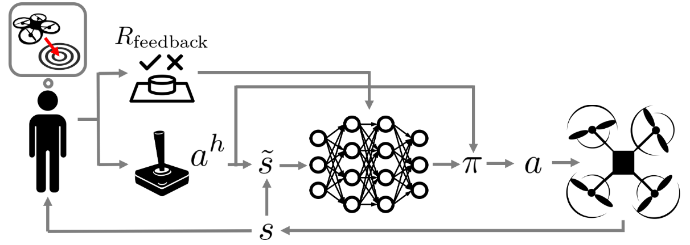

# 4장 개요 — Advanced Deep RL

<!-- 슬라이드 341, 345, 353, 367, 393, 415, 437 : 장 표지 (345 이하는 절 사이에 다시 나오는 같은 표지) -->
<!-- 슬라이드 342~344 : 숨김 공백 슬라이드, 내용 없음 -->
<!-- 슬라이드 341 표지 제목은 "Deep RL Applications", 345 이하와 전체 목차는 "Advanced Deep RL". 교재는 목차 쪽을 따른다 -->

4장은 3장에서 만든 뼈대 — DQN 과 Actor-Critic(DDPG) — 의 **약점을 하나씩 고친 알고리즘**들이다.
먼저 실제 프로젝트를 시작하기 전에 알아야 할 것들(MDP 설계, 알고리즘과 hyper parameter 선택, 재현성)을
정리하고, 이어서 DQN 의 과대평가를 줄이는 DDQN, DDPG 의 불안정을 세 가지 장치로 잡은 TD3, 비동기 병렬로
학습 속도와 상관성 문제를 함께 푼 A3C, 정책 갱신 폭을 제한해 안정성을 얻은 PPO, 엔트로피를 목적 함수에
넣어 탐색과 성능을 함께 얻은 SAC 로 나아간다. 실습은 CartPole · LunarLander 위에서 Keras 로 진행한다.

**이 장의 구성**

- **4.1 Deep RL Project 준비** — 적절한 MDP 설계, RL 알고리즘과 hyper parameter 선택, 효율적 접근
  (공식 구현체, 병렬 처리, Stable Baselines), 관련 라이브러리, 정보 관리, 성능 평가의 통계적 함정.
- **4.2 DDQN(Double DQN)** — Maximization bias 의 원인, Double Q-learning 을 DQN 에 결합한 target,
  bias 감소 효과와 Atari 성능, CartPole 실습.
- **4.3 TD3(Twin Delayed DDPG)** — Actor-Critic 의 overestimation · variance, Clipped Double Q ·
  Delayed policy update · Target policy smoothing, LunarLander 실습과 ablation 과제.
- **4.4 Asynchronous Advantage Actor-Critic(A3C)** — 분산 · 병렬 학습, Asynchronous one-step Q ·
  A3C 알고리즘, Entropy regularization, Python multiprocessing 으로 CartPole 실습.
- **4.5 Proximal Policy Optimization(PPO)** — Actor-Critic 불안정의 원인, Entropy · KL divergence,
  Clipped surrogate loss 와 GAE, PPO 알고리즘과 CartPole 실습.
- **4.6 Soft Actor-Critic(SAC, SAC-v2)** — Entropy-Regularized RL, soft value · soft policy iteration,
  Squashed Gaussian policy 와 reparameterization, temperature 자동 조정(SAC-v2), LunarLander 실습.
