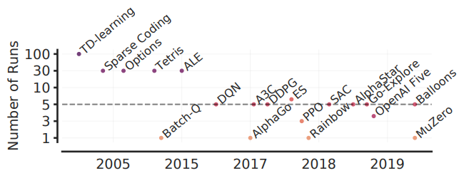
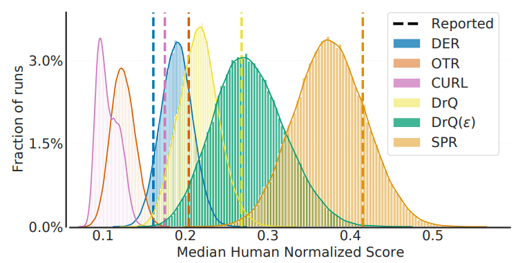
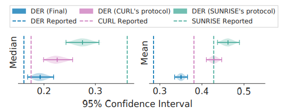
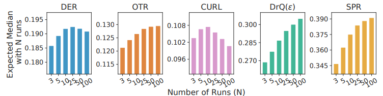

# 4.1 Deep RL Project 준비

**학습 목표**

- 강화학습이 학습 기반의 확률적 최적화(stochastic optimization)라는 점에서 왜 본질적으로 비효율적인지,
  그래서 MDP — 특히 상태 $S$ 와 보상 $R$ — 의 설계가 왜 프로젝트의 핵심인지 설명할 수 있다.
- 문제의 성질(markovian 여부, 리턴의 변동성)에 따라 MC / TD, Value-based / Policy Gradient 를 고르는
  기준을 말할 수 있다.
- Hyper parameter 가 알고리즘 선택만큼 중요하고, 강화학습 결과의 재현이 어렵다는 점을 이해하고, 공식
  구현체 · 병렬 처리 · 기존 baseline 을 활용하는 효율적 접근을 열거할 수 있다.
- 실험 정보 관리(logging)의 필요성과, 소수 실행의 중앙값으로 성능을 비교하는 관행의 통계적 문제를
  설명할 수 있다.

**이 절의 구성**

- 4.1.1 적절한 MDP 설계
- 4.1.2 적절한 RL 알고리즘과 Hyper parameter 선택
- 4.1.3 효율적 접근과 RL 관련 Libraries
- 4.1.4 개발 과정의 정보 관리 — 준비 사항 정리
- 4.1.5 성능 평가에 관해서 — 통계적 절벽의 가장자리
- 4.1.6 정리

---

## 4.1.1 적절한 MDP 설계
<!-- 슬라이드 346 -->

강화학습은 **Learning based Stochastic optimization / Stochastic search** 다.

$$
\frac{\partial J(\theta)}{\partial \theta} = \frac{\partial\, \text{목적}}{\partial\, \text{행동}}
$$

목적이 좋아지는 행동을 찾아야 하는데, 행동에 대한 반응(reward, next state)이 stochastic 하므로
**상당히 비효율적인 방법일 수밖에 없다.** 그래서 문제를 어떻게 정의하느냐가 그 뒤 모든 것을 좌우한다.

MDP $\langle S, A, P, R, \gamma \rangle$ 를 다시 적으면 —

- $S$ : 유한한 상태의 집합
- $A$ : 유한한 행동의 집합
- $P$ : 상태천이 행렬, $P^a_{ss'} = P[S_{t+1} = s' \mid S_t = s, A_t = a]$
- $R$ : 보상 함수, $R_s^a = E[R_{t+1} \mid S_t = s, A_t = a]$
- $\gamma$ : 감소율, $\gamma \in [0, 1]$

**Project 설계의 핵심 요인은 MDP 설계다.**

- 학습 · 알고리즘에 적합한 **$S$ 설계**가 반드시 필요하다. 대부분의 경우 $S$, $R$ 의 튜닝이 가능하다.
  DQN 은 stacking 된 image 를 $S$ 로 설계했다(3.4 절).
- 학습 · 알고리즘에 적합한 **$R$ 설계**가 필요하다. 3장 실습에서 에피소드가 일찍 끝나면 −100 벌점을 준
  것, CliffWalking 의 −100 절벽 보상이 모두 $R$ 설계다.

---

## 4.1.2 적절한 RL 알고리즘과 Hyper parameter 선택
<!-- 슬라이드 347 -->

### 적절한 RL 알고리즘 선택

- **State sequence 가 markovian 인가?** 명확하게 markovian 임이 확인되지 않으면 MC 가 유리하고,
  Markovian 성격이 강하면 TD 가 효율적이다(2.5 절 — TD 는 Markov property 를 전제한다).
- **Value based / Policy Gradient?** Trajectory 상의 한 경우가 전체 trajectory 의 변동성을 크게 하는가?
  그렇다면 Value 의 분산이 커져서 학습 효율이 낮아진다. 변동을 줄이기 위해 Policy based + baseline + …
  다양한 검토가 요구된다.

### 적절한 Hyper parameter 선택

적절한 RL 알고리즘 선택만큼, 또는 **더** 중요하다. 동일한 알고리즘에서도 Hyper parameter 에 따라 전혀
동작하지 않을 수도 있다.

- 강화학습의 결과는 **재현하기 어렵기로 악명이 높다.** 결과의 변동성에 Hyper parameter 의 역할이 크다.
  한 번의 알고리즘 시행으로 성능을 예단하면 안 된다.
- 선행 자료, 논문에 대한 섬세한 검토가 필요하다 — 실험 환경(MDP 설계), Hyper parameter, 구현 환경,
  code, 특별한 trick 사용 여부 등에 세심한 확인이 요구된다.

---

## 4.1.3 효율적 접근과 RL 관련 Libraries
<!-- 슬라이드 348~349 -->

### 효율적 접근

**공식 구현체를 확인한다.** 논문에서 설명하는 것에는 한계가 있다. 설명에는 누락했지만 RL 에서 종종
사용하는 trick 이나 구현 방법이 적용되어 있을 수 있다. Hyper parameter 도 확인한다. (3.5 절의 Return
Normalization 이 PPO 구현에 들어 있던 것이 그런 예다.)

**Env 와 상호작용의 시간이 중요하다.** Agent 학습 시간보다 Env. 와 상호작용을 통한 경험에 많은 시간이
소요된다. 환경을 virtual 화할 수 있어야 하고, Env. 와 상호작용의 **병렬 처리**가 필요한 경우가 많다 —
Ray, Fiber 등 병렬 처리를 지원하는 library 사용이 필요하다(https://docs.ray.io/en/latest/ ,
https://uber.github.io/fiber/).

**바퀴를 다시 발명하지 말 것.** 유명한 환경, 유명한 알고리즘이 공유되어 있다. 각 알고리즘에 대한 주요
Hyper parameter 도 공유되어 있고, Pre-train 된 parameter 도 공유되어 있다.

- Stable Baselines : https://stable-baselines.readthedocs.io/
- Stable Baselines3 : https://stable-baselines3.readthedocs.io/
- RL Baselines Zoo : https://github.com/araffin/rl-baselines-zoo
- RL Baselines3 Zoo : https://stable-baselines3.readthedocs.io/

### RL 관련 Libraries

| Library | 특징 |
|---|---|
| **OpenAI Gym** | OpenAI 에서 개발한 다양한 시뮬레이션 환경(Atari 게임, 로봇 제어, 보드 게임 등)을 제공 |
| **Stable Baselines3** | PyTorch 기반, 쉽고 직관적인 API 제공 |
| **RLlib** | Ray 프레임워크의 일부. 대규모 분산 병렬 학습이 가능하고 클러스터 컴퓨팅을 활용. TensorFlow, PyTorch 와 호환 |
| **TF-Agents, Keras-RL2** | TensorFlow 와의 강력한 통합. 모듈화된 구조를 통해 다양한 알고리즘을 구현 |
| **Dopamine** | Google 에서 개발. 간단하고 효율적인 실험을 위한 환경을 제공, Atari 환경에서 실험을 손쉽게 수행 |
| **MushroomRL** | 교육 및 연구 목적에 최적화. Python 으로 작성되어 이해하기 쉽고 수정이 용이. 문서화가 잘 되어 있고 알고리즘 구현이 직관적 |
| **Coach** | 인텔에서 개발. 다양한 알고리즘과 직관적인 설정을 통해 다양한 환경에서 구현. 고성능의 강화학습 모델 구현 가능 |
| **Garage** | PyTorch 와 TensorFlow 모두 지원. 알고리즘 개발과 평가에 초점. 고유의 실험 및 벤치마크 기능, 프레임워크 간의 유연한 호환성. 여러 프레임워크에서 일관된 실험과 벤치마크를 수행하기에 적합 |

---

## 4.1.4 개발 과정의 정보 관리 — 준비 사항 정리
<!-- 슬라이드 350 -->

**Logging 을 철저하게** — wandb, mlflow 등(3.5 절 실습 3.5.3). RL 은 수많은 Hyper parameter 와의
전쟁이다 — RL parameters, MDP 설계, DNN 구조 등. 재현이 쉽지 않기에 좋은 결과의 원인을 찾기 어렵고,
정보 관리 부족은 많은 시간 허비에 이르게 만든다.

> **Deep Reinforcement Learning Project 를 위한 준비 사항**
> 1. 적절한 MDP 설계
> 2. 적절한 RL 알고리즘 선택
> 3. 적절한 Hyper parameter 선택
> 4. 효율적 접근
> 5. 개발 과정의 정보 관리

---

## 4.1.5 성능 평가에 관해서 — 통계적 절벽의 가장자리
<!-- 슬라이드 351~352 -->
<!-- 슬라이드 352 : 숨김 MEMO 슬라이드, 내용 없음 -->

"Deep Reinforcement Learning at the Edge of the Statistical Precipice"(2021)는 RL algorithm 평가의
문제점을 짚었다.

- **적은 실행 횟수(3~10 회)만으로 성능 비교**를 하고 있다. 아래 그림처럼 알고리즘 하나를 평가한 실행
  횟수는 해가 갈수록 줄어들어, 최근 논문은 5 회 이하가 대부분이다.

- 100 개의 실험 결과에서 5 개씩 추출하여 얻은 중앙값 분포를 보면 **중앙값의 variation 이 상당함**을
  알 수 있다. 발표된 논문에서 보고한 중앙값은 이 변동성을 설명하지 못하며, 실제 논문의 중앙값이 과다 ·
  과소 추정되었다. 성능 지표로 평균값, 중앙값을 사용하면 통계적 불확실성을 상당히 내포한다.

- 또한 **실행 횟수에 따라 중앙값이 변한다.** 일반적으로 20~30 번 실행이면 충분하다고 알려져 있다.
  **신뢰 수준 정보를 포함한 평가**가 필요하다.

(참고: https://neverparadise.tistory.com/43 , https://paperswithcode.com/sota/atari-games-100k-on-atari-100k)

이 절의 실습들이 "가장 좋은 조건으로 3~5 회 반복하여 변동성을 확인해 보자" 는 과제를 붙여 두는 이유가
여기에 있다.

---

## 4.1.6 정리
<!-- 이 절의 요약. 원문에 별도의 review 슬라이드는 없다 -->

- 강화학습은 확률적 최적화라 비효율적이다. **MDP 설계 — 특히 $S$ 와 $R$** — 가 프로젝트의 핵심이다.
- 알고리즘은 문제의 markovian 성질(MC vs TD)과 리턴의 변동성(Value-based vs Policy Gradient + baseline)
  으로 고른다. **Hyper parameter 는 알고리즘 선택만큼 중요**하고, 결과는 재현이 어렵다.
- 공식 구현체와 baseline(Stable Baselines 등)을 확인하고, 환경 상호작용을 병렬화하고, 바퀴를 다시
  발명하지 않는다.
- 실험은 철저히 기록(wandb, mlflow)하고, 성능은 소수 실행의 중앙값이 아니라 **신뢰구간과 함께**
  20~30 회 실행으로 평가한다.
