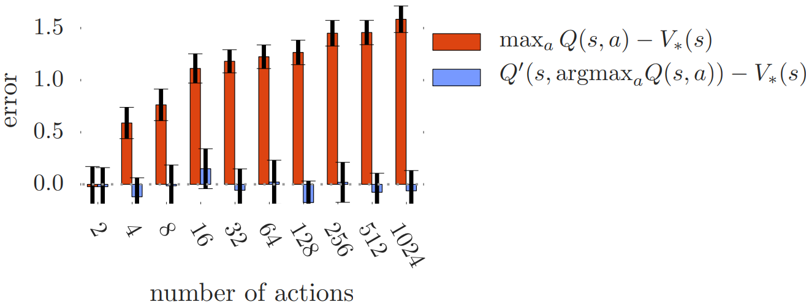
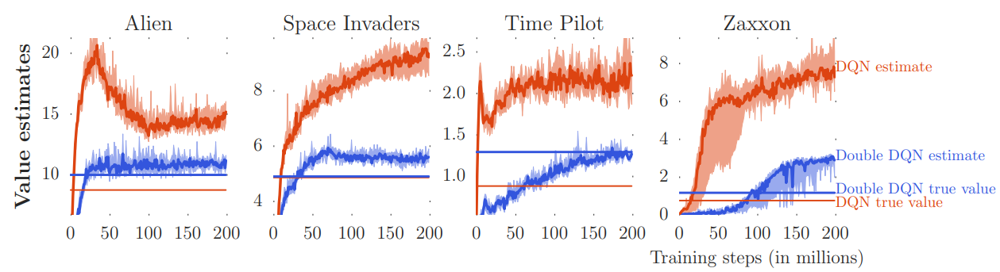
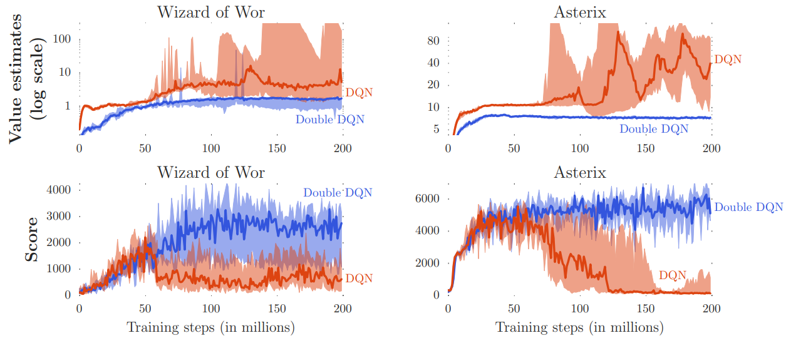
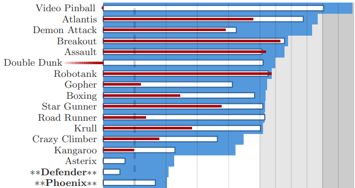
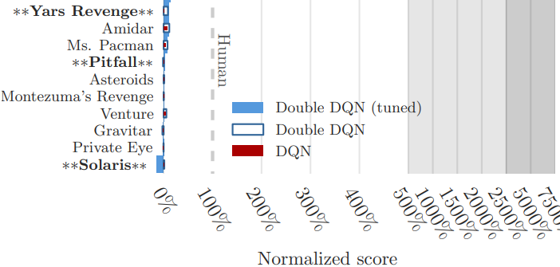
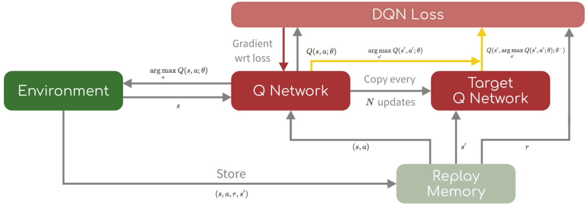
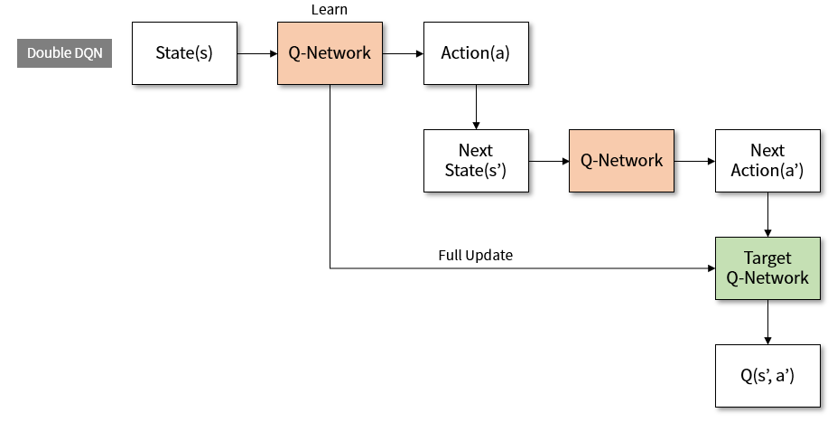
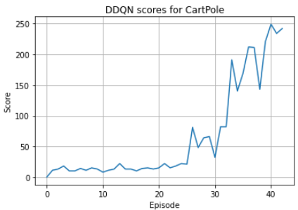
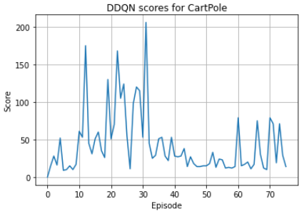

# 4.2 DDQN(Double DQN)

**학습 목표**

- Deep Q-learning 에서 Maximization(overestimation) bias 가 생기는 두 원인 — max operation 과 function
  approximation error — 을 설명할 수 있다.
- Deep Q-learning · Double Q-learning · Double DQN · DQN 의 target function 을 나란히 쓰고, Double DQN 이
  "행동 선택은 $Q$, 평가는 $Q_t$" 로 두 추정치를 분리한다는 점을 설명할 수 있다.
- 행동 수 $m$ 이 커질수록 Q-learning 의 bias 가 커지는 이유와 Double Q-learning 이 그것을 줄이는
  효과를 그림으로 설명할 수 있다.
- DQN 실습을 DDQN 으로 바꾸는 데 필요한 target 계산 변경(argmax 는 `q_net`, 값은 `t_net`)과 soft update
  를 구현할 수 있다.

**이 절의 구성**

- 4.2.1 Maximization bias 를 줄이기 위한 접근
- 4.2.2 DDQN 의 idea — Double Q-learning 에서 $Q_i$ 대신 $Q_t$
- 4.2.3 Double Q learning 의 bias 감소 효과
- 4.2.4 DQN 과 DDQN 비교 — Atari games
- 4.2.5 실습 4.2.1 — DDQN 으로 CartPole 학습
- 4.2.6 실습과제 — Hyper parameter tuning
- 4.2.7 정리 — Review

---

## 4.2.1 Maximization bias 를 줄이기 위한 접근
<!-- 슬라이드 354 -->

2.7 절에서 본 Maximization bias 를 줄이는 접근은 두 갈래다.

- **Q-Learning** 쪽 : Double Q-Learning, 그리고 **Double DQN = Double Q-Learning + DQN**.
- **Actor-Critic** 쪽 : TD3("Addressing Function Approximation Error in Actor-Critic Methods", 4.3 절).

**DDQN(Double DQN)** 은 "Deep Reinforcement Learning with Double Q-learning"(DeepMind, 2016)에서
제안되었다. Deep Q-learning 에서 Maximization bias 가 발생하는 주요 원인은 두 가지다.

1. Q-learning 알고리즘의 **max operation** 으로 overestimation bias 가 발생한다(MDP stochasticity).
2. **Functional approximation error** — 경험하지 않은 부분을 근사하는데, 좀 더 큰 근사가 나오면 첫
   번째 이유가 작동하게 된다. 신경망은 방문하지 않은 $(s,a)$ 에도 값을 내고, 그 값이 우연히 크면 max 가
   그것을 집어 든다.

---

## 4.2.2 DDQN 의 idea — Double Q-learning 에서 $Q_i$ 대신 $Q_t$
<!-- 슬라이드 355 -->

세 갱신식을 나란히 놓는다.

$$
\begin{aligned}
\text{Deep Q-learning} :\quad & Q(s,a) \leftarrow Q(s,a) + \alpha\big( r + \gamma \max_{a'} Q(s', a') - Q(s,a) \big) \\
\text{Double Q-learning} :\quad & Q_i(s,a) \leftarrow Q_i(s,a) + \alpha\big( r + \gamma\, Q_{i'}(s', \arg\max_{a'} Q_i(s', a')) - Q_i(s,a) \big), \quad i = 1, 2 \\
\text{Double DQN} :\quad & Q(s,a) \leftarrow Q(s,a) + \alpha\big( r + \gamma\, Q_t(s', \arg\max_{a'} Q(s', a')) - Q(s,a) \big)
\end{aligned}
$$

**Target function 비교**

| 알고리즘 | Target $y$ | 비고 |
|---|---|---|
| Deep Q-learning | $r + \gamma \max_{a'} Q(s', a')$ | 동일한 Q-Net 사용 |
| Double Q-learning | $r + \gamma\, Q_{i'}(s', \arg\max_{a'} Q_i(s', a'))$ | 두 개의 Q-Net 을 50% 확률로 학습 |
| Double DQN | $r + \gamma\, Q_t(s', \arg\max_{a'} Q(s', a'))$ | 별도의 $Q$ 대신 **$Q_t$** 사용 |
| (참고) DQN | $r + \gamma \max_{a'} Q_t(s', a')$ | Copy 한 $Q_t$-Net 사용 |

여기서 $Q_t(s', \arg\max_{a'} Q(s', a')) = Q_t(s', a')\big|_{a' = \arg\max_{a'} Q(s', a')}$ 다. 즉 **다음
행동은 online $Q$ 로 고르고, 그 행동의 값은 target $Q_t$ 로 읽는다.** DQN 은 이미 $Q_t$ 를 가지고
있으므로, Double Q-learning 의 두 번째 network 자리에 $Q_t$ 를 그대로 쓰면 추가 비용 없이 Double 이
된다는 것이 DDQN 의 idea 다.

---

## 4.2.3 Double Q learning 의 bias 감소 효과
<!-- 슬라이드 356~357 -->

### naïve Q learning 대비 비교

10 개의 상태에 대한 $Q$ 값을 비교한다 — 정답 $Q_*$, Q-learning 의 $\max_a Q_t$, Double Q-learning 의
$Q_t$. bias 는 $\max_a Q_t - Q_*$ 와 Double Q-learning $Q_t$ 의 오차로 비교한다.


$\max_a Q_t$ 는 **overestimate** 되고, Double Q 의 $Q_t$ 는 $Q_*$ 와 많은 점에서 동일 값을 가진다.
표본이 없는 구간에서 근사 곡선이 위로 튀면(세 번째 행) 그 오차가 max 를 통해 그대로 bias 가 된다.

### bias 의 크기 — 행동 수 $m$ 과의 관계

최적 함수 $Q_*(s,a) = V_*(s)$ 일 때(모든 행동의 가치가 같을 때), bias 가 없다면
$\sum_a (Q_t(s,a) - V_*(s)) = 0$ 이다. Bias 가 있다면 $\frac{1}{m} \sum_a (Q_t(s,a) - V_*(s))^2 = C > 0$
($m$ = 행동 수 $\geq 2$, $C$ 는 $Q(s,a)$ 의 분산)인 조건에서, Q-learning 의 $Q$ 는

$$
\max_a Q_t(s,a) \geq V_*(s) + \sqrt{\frac{C}{m-1}}
$$

이다. 즉 최적 함수 $V_*(s)$ 에 대해 **최소 $\sqrt{C/(m-1)}$ 의 bias** 를 가진다. 행동 수 $m$ 이 커지면
$\max_a Q_t(s,a)$ 에서 극단적인 값이 선택될 가능성이 더 커지고, 결과적으로 bias 도 커진다.



Q learning 은 $m$ 이 커지면 편향도 커지지만 Double Q learning 은 그렇지 않다.

---

## 4.2.4 DQN 과 DDQN 비교 — Atari games
<!-- 슬라이드 358~359 -->

### Bias 와 안정성, 변동성



DQN 의 가치 추정은 참값을 크게 넘어서지만(bias), Double DQN 은 참값 근처에 머문다.



bias 는 단순한 추정 오차가 아니다 — 가치가 폭주하는 시점에 **성능이 저하**된다(bias 로 성능 저하).
DDQN 은 안정성과 변동성 모두에서 낫다.

### Atari games 전체





---

## 4.2.5 실습 4.2.1 — DDQN 으로 CartPole 학습
<!-- 슬라이드 360~364 -->

> 노트북: `code/4.2.1.DoubleDQN.ipynb`
> [](https://colab.research.google.com/github/AI-BoostCamp/ReinforcementLearning/blob/main/code/4.2.1.DoubleDQN.ipynb)
> PyTorch 구현: `code/4.2.1.pt.DoubleDQN.ipynb`
> [](https://colab.research.google.com/github/AI-BoostCamp/ReinforcementLearning/blob/main/code/4.2.1.pt.DoubleDQN.ipynb)

**DDQN 구조** : $Q(s,a) \leftarrow Q(s,a) + \alpha\big( r + \gamma\, Q_t(s', \arg\max_{a'} Q(s', a')) - Q(s,a) \big)$.
비교 — DQN : $y = r + \gamma \max_{a'} Q_t(s', a')$.





### $Q$-Network, $Q_t$-Network — DQN 과 동일 구조 사용

```python
learning_rate = 0.0005 # defalut : 0.001
hidden_units=256 #32 # 64

n_state = env.observation_space.shape[0]# 4
n_action = env.action_space.n           # 2

def Network():
    inp = keras.Input(shape=(n_state,))
    x = Dense(hidden_units, activation='relu')(inp)
    x = Dense(hidden_units, activation='relu')(x)
    x = Dense(n_action, activation='linear')(x)
    model = keras.models.Model(inp, x)
    model.compile(loss='mse', optimizer = Adam(learning_rate=learning_rate))
    return model

q_net = Network()
t_net = Network()
q_net.summary()
```

**Soft update** — $\theta_t \leftarrow \tau\theta + (1 - \tau)\theta_t$. `tau=1` 이면 통째로 복사(hard update)다.

```python
@tf.function
def update_t_network(tau):
    W = q_net.variables
    tgt_W = t_net.variables
    for (a, b) in zip(tgt_W, W):
        a.assign(b * tau + a * (1 - tau))
```

### Training function — DQN 과 다른 한 곳

`model_learning()` 에서 DQN 과 달라지는 것은 target 을 만드는 두 줄이다. 다음 상태 $s'$ 에 대해
**`q_net` 으로 $Q(s', \cdot)$ 을 예측해 argmax(행동 선택)** 를 얻고, **`t_net` 으로 $Q_t(s', \cdot)$ 을
예측해 그 행동의 값**을 읽는다. DQN 은 `np.amax(q_targ[i])` 한 줄로 선택과 평가를 모두 `t_net` 에 맡겼다.

```python
def get_batch():
    mini_batch = (random.sample(RM, batch_size))
    mini_batch_np = np.array(mini_batch, dtype=object)
    s = mini_batch_np[:,0]    # (bs,array):  [array([]) array([])]
    s = np.stack(s)           # s(bs,4)    : [[][]]
    a = mini_batch_np[:,1]    # a(bs,)
    r = mini_batch_np[:,2]    # r(bs,)
    ns = mini_batch_np[:,3]   #
    ns = np.stack(ns)         # s'(bs,4)
    done = mini_batch_np[:,4] # T(bs,)
    return s,a,r,ns,done
```

```python
def model_learning(epochs):
    s,a,r,ns,done = get_batch()          # batch <- random(RM,batch_size)
    target = q_net.predict(s,verbose=0)  # target:(bs,a)<-q(s):(bs,s)
    next_q = q_net.predict(ns,verbose=0) # nq:(bs,a)<-q(s')
    q_targ = t_net.predict(ns,verbose=0) # qt:(bs,a)<-q_t(s')

    for i in range(batch_size):
        if done[i]:                # done
            target[i][a[i]] = r[i] # target(s,a) = r
        else:                      # target(s,a) = r + gamma*q_t(s',max_a(q(s'))
            max_na_idx = np.argmax(next_q[i,:]) # a'=max_a(q(s'))
            target[i][a[i]] = r[i]+gamma*q_targ[i,max_na_idx]# <-r+gamma*q_t(s',a')
    # Train on batch
    history = q_net.fit(s, target, batch_size=batch_size2, epochs=epochs, verbose=0)
    return history.history['loss'][0]
```

### $\epsilon$-greedy scheduling 과 행동 정책

```python
def eps_schedule(step=0, plot= False):
    eps_decay_step =  n_episode // down_steps
    epsilon = max(0.01, eps_start*eps_decay**(step//eps_decay_step))
    if plot == True :
        epsilon_l=[]
        for i in range(n_episode):
            n_eps = max(0.01, eps_start*eps_decay**(i//eps_decay_step))
            epsilon_l.append(n_eps)
        plt.plot(epsilon_l)
        plt.grid()
        plt.show()
    return epsilon

n_episode = 75

eps_start = 0.5   # epsilon 초기값
epsilon = eps_start
eps_decay = 0.8
down_steps = 3
epsilon = eps_schedule(plot=True)
```

```python
def get_action(state,epsilon): #epsilon greedy policy
    r_eps = np.random.random()
    epsilon = eps_schedule(i)
    if(r_eps < epsilon): # exploration: eps-greedy
        a = np.random.randint(0, n_action)
    else:                # exploitation
        ## Q-Network에서 q값 추정
        q = q_net.predict(np.reshape(state,[1,4]), verbose=0)
        a = np.argmax(q[0])     # greedy
    return a, epsilon
```

### Training Loop — Update 위치 : Step 단위 / Epi. 단위

Target network 를 **step 단위**로(매 학습마다 `update_t_network(tau)` — soft) 갱신할 수도 있고,
**Epi. 단위**로(에피소드가 끝날 때 `update_t_network(tau=1.0)` — hard) 갱신할 수도 있다. 아래 코드는
step 단위 soft update 를 켜 두었고, 에피소드 단위 hard update 는 주석으로 남겨 두었다. 에피소드가
`max_steps` 전에 끝나면 −100 벌점을 주고 점수 집계 때 되돌린다.

```python
n_episode = 75   ####
batch_size = 128 ####
batch_size2 = batch_size
epochs = 1
tau = 0.01#0.1 #0.8, 0.5

gamma = 0.95
buffer_size = 20000
RM=deque(maxlen=buffer_size)

tf.keras.utils.set_random_seed(7)
env.reset()

q_net = Network()
t_net = Network()
update_t_network(tau=1) # T-Net <- Q-Net

scores=[0]       # Eps.별 누적보상
mean_scores = []
max_steps=170    # Eps.최대 step

# RL Training loop
for i in range(n_episode):
    s, _ = env.reset()                 # s <- random
    score = loss = 0                # Eps.별 보상
    while True :                    # Termination 까지
        a, epsilon = get_action(s, epsilon)# epsilon greedy policy
        ns, r, done, _, _ = env.step(a)# step(a)
        if done and score < max_steps: r -= 100 # 중간에 끝나면 벌점
        RM.append([s,a,r,ns,done])
        ## Q-Network Training
        if len(RM) > batch_size * 1: ##3
            loss = model_learning(5)  # step마다 Q-Net Training
            update_t_network(tau)   # T-Net <- Q-Net
        s = ns
        score += r                   # episode내 reward
        if done : break
#    update_t_network(tau=1.0)        # T-Net <- Q-Net
    score = score if score > max_steps  else score + 100 # 벌점 보상
    mean_score = np.mean(scores[-10:])
    mean_scores.append(mean_score)
    max_steps = mean_score * 1.5 ###
    print(f'Eps.[{i:03d}], score:{score}, Mean score:{int(mean_score):.2f},\
 loss:{loss:.2f}, Epsilon:{epsilon:.2f}, Length_RM:{len(RM)}')
    scores.append(score)
    if mean_score > max_steps : break
env.close()
```

---

## 4.2.6 실습과제 — Hyper parameter tuning
<!-- 슬라이드 365 -->

`n_episode = 75` 로 고정하고 다음을 조정해 보자.

- `Learning_rate` = 0.005, 0.001, ?
- `hidden_units` = 32, 64, 256, ?
- `eps_start` = 0.3, 0.5, 0.8, ?
- `batch_size` = 64, 128, 256, ?
- 학습을 시작하는 시점 : `len(RM) > batch_size * 1` or `* 3`
- `update_t_network(tau)` — `tau` 값의 영향 : 0.1, 0.3, 0.5, 0.8, ?

다음 code 로 수정되면 어떤 역할을 하게 될까? `update_t_network()` 위치를 step loop 밖(에피소드 단위)으로
바꾸면 — `tau` 값의 영향 : 0.1, 0.3, 0.5, 0.8, ?





두 그림은 **같은 알고리즘, 다른 hyper parameter** 다. 4.1 절이 말한 대로 hyper parameter 하나로 학습이
되기도, 안 되기도 한다. 노트북에는 `tau`(0.01 / 0.1 / 0.3 / 0.8), `hidden_units`(32 / 250), `eps_decay`,
update 위치(에피소드 안 / 밖)를 바꾼 여러 실행의 곡선이 기록되어 있다.

---

## 4.2.7 정리 — Review
<!-- 슬라이드 366 -->

**Double DQN = Double Q-Learning + DQN** — Double Q-learning 에서 $Q_i$ 대신 $Q_t$ 를 사용한다.

- Deep Q-learning : $Q(s,a) \leftarrow Q(s,a) + \alpha( r + \gamma \max_{a'} Q(s',a') - Q(s,a) )$
- Double Q-learning : $Q_i(s,a) \leftarrow Q_i(s,a) + \alpha( r + \gamma Q_{i'}(s', \arg\max_{a'} Q_i(s',a')) - Q_i(s,a) )$ — 두 개의 Q-Net
- Double DQN : $Q(s,a) \leftarrow Q(s,a) + \alpha( r + \gamma Q_t(s', \arg\max_{a'} Q(s',a')) - Q(s,a) )$ — Copy 한 $Q_t$-Net

$Q_t(s', \arg\max_{a'} Q(s',a')) = Q_t(s', a')\big|_{a' = \arg\max_{a'} Q(s',a')}$ — 고르는 network 와 평가하는
network 를 분리하는 것이 bias 를 줄이는 핵심이고, 같은 아이디어가 다음 절 TD3 의 Clipped Double Q 로 이어진다.
