# 4.3 TD3(Twin Delayed DDPG)

**학습 목표**

- Actor-Critic 방법에 내재한 두 불안 요인 — Overestimation bias 와 Estimation variance — 을 설명하고,
  TD3 가 각각을 Clipped Double Q-learning(CDQ)과 느린 target network 갱신으로 다루는 이유를 말할 수 있다.
- 분리된 두 $Q$ 를 쓰는 DQ-AC 와 target $Q$ 를 쓰는 DDQN-AC 의 차이, 그리고 TD3 가 Target Net 구조 +
  Double Q style 을 택한 근거를 설명할 수 있다.
- TD3 의 세 장치 — Clipped Double Q · Delayed policy update · Target Policy Smoothing — 를 갱신식과
  알고리즘 의사코드로 쓰고, DDPG 코드에서 어느 줄이 바뀌는지 짚을 수 있다.
- LunarLanderContinuous 환경에서 TD3 를 Keras 로 구현하고, step_limit · buffer size · $\tau$ 가 학습
  변동성에 미치는 영향을 실험으로 확인할 수 있다.
- Critic 층 공유(shared layer)와 ablation(기능 블록 제거) 실험을 스스로 설계할 수 있다.

**이 절의 구성**

- 4.3.1 Actor-Critic 의 내재적 불안 요인 — TD3 가 나온 이유
- 4.3.2 DQ-AC 와 DDQN-AC 비교 — 어떤 Double 이 좋은가
- 4.3.3 TD3 의 세 장치 — Clipped Double Q · Delayed policy update · Target Policy Smoothing
- 4.3.4 Target Network 갱신 비율 $\tau$ 와 Delayed policy update
- 4.3.5 Target Policy Smoothing Regularization
- 4.3.6 TD3 Algorithm
- 4.3.7 성능과 Ablation study
- 4.3.8 실습 4.3.1 — LunarLander 학습
- 4.3.9 실습과제 1 — Hyper parameter tuning
- 4.3.10 실습과제 2 — Shared Layer Critic Network(실습 4.3.2)
- 4.3.11 실습과제 3 — Ablation study(실습 4.3.3)
- 4.3.12 정리 — Review

---

## 4.3.1 Actor-Critic 의 내재적 불안 요인 — TD3 가 나온 이유
<!-- 슬라이드 368 -->

**TD3 = Twin Delayed Deep Deterministic policy gradient algorithm** — "Addressing Function Approximation
Error in Actor-Critic Methods"(2018). Actor-Critic methods 에 **내재적 불안 요인**이 있음을 보이고 개선
방법을 제시한 논문이다. DDPG(3.6 절)는 여전히 Hyper parameter 에 민감하게 반응하는데, 그 원인을 두
가지로 짚고 각각의 개선 방향을 제시한다.

1. **Overestimation bias** → **CDQ(Clipped Double Q-learning)**
2. **Estimation variance** → **slow-update Target network**

Actor-Critic 에도 Overestimation bias 문제가 **존재할 수 있음**을 논문은 먼저 확인한다(수식은 논문 4.1
참조). Actor-Critic 은 $Q$-value 를 policy 에 **직접적으로** 이용하므로, $Q$ 가 과대평가되면 그것이 곧
정책의 갱신 방향이 되어 심각한 불안정 문제로 발전할 수 있다. 1,000 번의 시행을 통해 Average value 의
overestimation 과 variation 을 보였고, 제안한 CDQ 알고리즘이 True value 에 근사하며 variance 가 감소함을
확인했다.

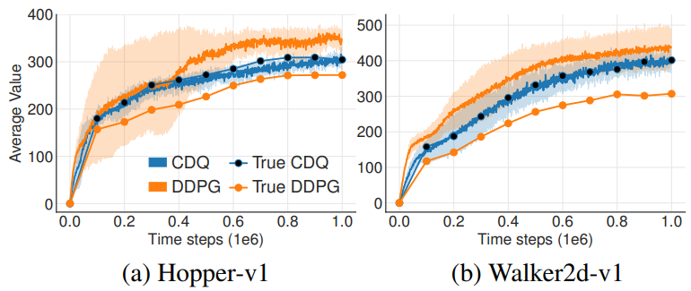

DDPG 는 추정값이 참값 위에 떠 있고(overestimation), CDQ 는 참값을 따라간다. (참고자료:
https://ropiens.tistory.com/89)

---

## 4.3.2 DQ-AC 와 DDQN-AC 비교 — 어떤 Double 이 좋은가
<!-- 슬라이드 369 -->

Double Q 아이디어를 Actor-Critic 에 붙이는 방법은 둘이다.

- **DQ-AC**(Double Q-learning style Actor-Critic) : **두 개의 분리된 $Q$** 를 사용한다.
  $Q_i(s,a) \leftarrow Q_i(s,a) + \alpha\big( r + \gamma Q_{i'}(s', \arg\max_{a'} Q_i(s',a')) - Q_i(s,a) \big)$
- **DDQN-AC**(Double DQN style Actor-Critic) : **Target $Q$** 를 사용한다.
  $Q(s,a) \leftarrow Q(s,a) + \alpha\big( r + \gamma Q_t(s', \arg\max_{a'} Q(s',a')) - Q(s,a) \big)$

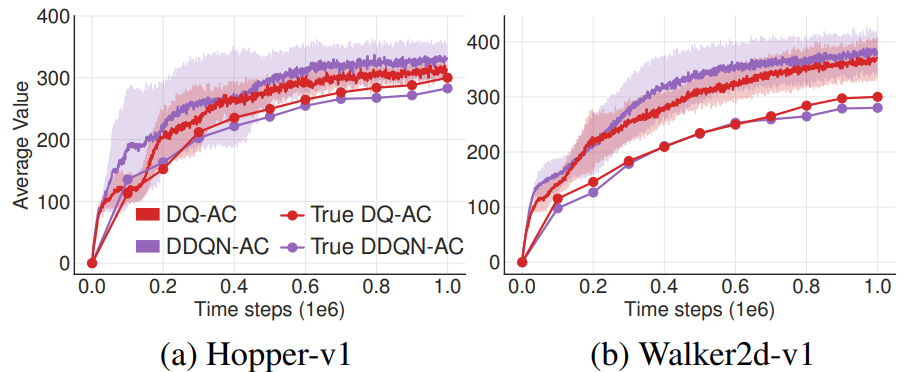

비교 실험의 결론은 **DQ style 이 Overestimation 에 더 좋다**는 것이다. DDQN-AC 는 **천천히 변화하는
policy** 에서 Target Net 과 Q Net 이 너무 유사해져서 분리의 효과가 줄어드는 것으로 보인다 — Actor-Critic
의 정책은 조금씩 움직이므로 target 을 soft update 로 따라가게 하면 두 network 가 거의 같아진다. 그래서
TD3 는 **Target Net 구조 + Double Q style** 을 함께 사용한다 — 두 개의 critic 을 두고, 각각에 target 도 둔다.

---

## 4.3.3 TD3 의 세 장치 — Clipped Double Q · Delayed policy update · Target Policy Smoothing
<!-- 슬라이드 370~371 -->

논문이 제안한 **CDQ(Clipped Double Q-learning) 구조**는 batch size, neural net 구조 변화에 강건하다.
TD3 는 DDPG 위에 세 가지를 더한 것이다.

- **DDPG** : Actor-Critic + DPG + RM(Replay Memory) + Target-Net. + Soft update **− AU noise**
  (Ornstein-Uhlenbeck 대신 Gaussian noise)
- **+ Clipped Double Q** : 두 개의 Critic Net. $Q$-value update 시 두 출력 중 **작은 값**을 사용한다 — $\min(y, y')$.
- **+ Delayed policy update** : Policy 를 $Q$-value 보다 **적은 빈도**로 update 한다(policy 변동성 감소).
- **+ Target Policy Smoothing** : Target $y$ 계산 시 action 에 noise 를 추가한다.

![TD3 Agent 전체 구조. 점선 상자 Agent 안에 Critic Network(critic1 θ1, critic2 θ2 와 각각의 target1, target2 — 두 target 출력을 비교해 Compared target y 를 만들고 TD error update 로 critic 을 갱신)와 Actor Network(actor μ 와 target behavior policy μ'; target 출력에 ε' 을 더해 ã_t 를 만들고, Q_θ1(s_t, ã_t) 로 DPG update). actor 출력 μ_t 에 random noise ε∼N(0,σ) 를 더한 a_t 가 Environment(로봇 팔)로 나가고, transition (q_t‖q_goal, a_t, q_{t+1}‖q_goal, r_t) 가 Replay Buffer(Global memory R, HER)에 쌓여 mini-batch 로 공급된다. 화살표: 실선 data flow, 이중선 parameter update.](images/s370_01.png)

그림의 Replay Buffer 에 붙은 HER(Hindsight Experience Replay)과 $q_{\text{goal}}$ 은 그림 출처(로봇 제어)
의 것이고, 이 절 실습에서는 일반 Global memory 만 쓴다.

### CDQ — Critic Q-net 에서 $Q_\phi$ 대신 분리된 $Q'_\phi$ 사용

지금까지의 갱신식을 나란히 놓으면 CDQ 가 어디에 서 있는지 보인다.

$$
\begin{aligned}
\text{Deep Q-learning} :\quad & Q(s,a) \mathrel{+}= \alpha\big( r + \gamma \max_{a'} Q(s',a') - Q(s,a) \big) \\
\text{Double Q-learning} :\quad & Q(s,a) \mathrel{+}= \alpha\big( r + \gamma Q'(s', \arg\max_{a'} Q(s',a')) - Q(s,a) \big), \quad Q' = Q'_1 \text{ or } Q'_2 \\
\text{Actor-Critic C-net} :\quad & Q(s,a) \mathrel{+}= \alpha\big( r + \gamma Q(s',a') - Q(s,a) \big) \\
\text{Double DQN} :\quad & Q(s,a) \mathrel{+}= \alpha\big( r + \gamma Q_t(s', \arg\max_{a'} Q(s',a')) - Q(s,a) \big) \\
\text{DDPG Critic Net} :\quad & Q^\mu(s,a) \mathrel{+}= \alpha\big( r + \gamma Q^{\mu_t}(s', \mu_t(s')) - Q^\mu(s,a) \big) \\
\text{Clipped DQ} :\quad & Q_{\phi_1}(s,a) \mathrel{+}= \alpha\big( r + \gamma \min_{i=1,2} Q_{\phi'_i}(s',a') - Q_{\phi_1}(s,a) \big), \quad a' \sim \mu'(s') \\
& Q_{\phi_2}(s,a) \mathrel{+}= \alpha\big( r + \gamma \min_{i=1,2} Q_{\phi'_i}(s',a') - Q_{\phi_2}(s,a) \big)
\end{aligned}
$$

Clipped DQ 의 target $r + \gamma \min_{i=1,2} Q_{\phi'_i}(s', a')$ 는 **두 target critic 출력 중 작은 값**
$\min(y_1, y_2)$ 이며, 두 main critic $Q_{\phi_1}, Q_{\phi_2}$ 가 **같은 target** 으로 학습된다. Double
Q-learning 처럼 "상대 network 로 평가" 하는 대신 "둘 중 작은 쪽" 을 취하므로 과대평가 쪽으로 튄 값이
target 에 들어가지 못한다.


---

## 4.3.4 Target Network 갱신 비율 $\tau$ 와 Delayed policy update
<!-- 슬라이드 372 -->

두 번째 불안 요인 — **Estimation variance** — 은 target network 의 갱신 비율 $\tau$ 와 얽혀 있다.

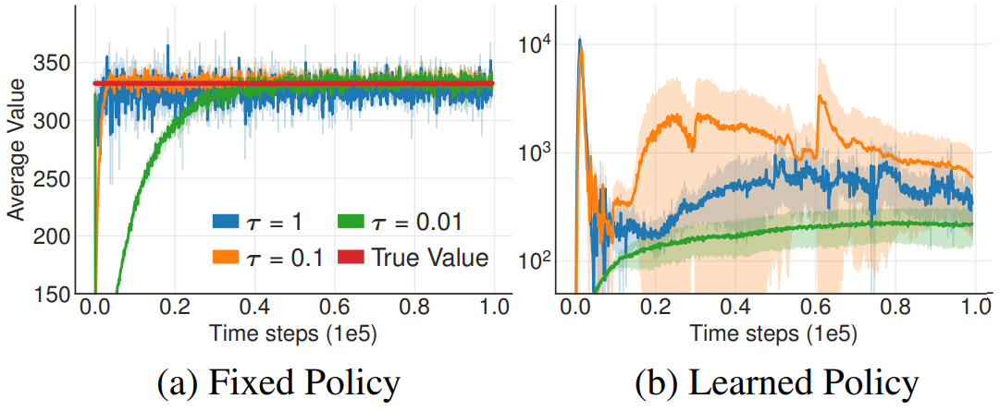

- **Fixed policy 에서 $\tau$ 의 영향** : $\tau = 1$(target Net 이 없는 것과 동일)일 때 분산이 크다. $\tau$ 를
  작게 하면 분산이 줄면서 학습 시간이 늘어나지만, fixed policy 에서는 어느 $\tau$ 든 true 값을 찾아간다.
- **Learned policy 에서 $\tau$ 의 영향** : $\tau$ 에 따라 **학습이 실패하는 경우**가 발생할 수 있다.
  Actor-Critic 간의 상호작용이 복잡한 양상을 나타내므로 $\tau$ 가 적당히 작은 것이 필요하다 —
  정책이 부실할 때 과대평가를 통해 가치 추정이 발산하게 되거나, 가치 추정 자체가 부정확하면 정책이
  부실해질 수 있다. 둘이 서로를 끌어내리는 고리다.

**Delayed policy update** 는 이 고리를 끊는 장치다. Policy 를 $Q$-value 보다 적은 빈도로 update 한다
(policy 변동성 감소). 가치함수의 오류가 큰 상태에서 정책함수를 update 하는 것이 학습의 변동성을
높이므로, **가치함수 update 를 일정 횟수 진행한 후 정책함수의 update 를 진행**한다. TD error 가 적도록
유지하고 정책의 속도를 늦추는 것이 필요하다. 실습에서는 critic 2 회 갱신마다 actor 1 회($d = 2$)다.

---

## 4.3.5 Target Policy Smoothing Regularization
<!-- 슬라이드 373 -->

세 번째 장치는 **Target $y$ 계산 시 action 에 noise 를 추가**하는 것이다(Noise Injection 기법). 행동
정책의 출력에 noise 를 더해 탐색하는 것(DDPG 의 exploration noise)과는 **다른 자리**의 noise 다.

$$
y_i = r + \gamma \min_{i=1,2} E_\epsilon\!\left[ Q_{\phi'_i}(s', a' + \epsilon') \right], \qquad
\epsilon' \sim \mathcal{N}(0, 1),\quad a' \sim \mu'(s')
$$

같은 $s'$, 비슷한 $a'$ 에서 **비슷한 $Q(s', a')$ 가 되도록 유도**하는 효과가 발생한다 — critic 이 특정
행동 근처에서 뾰족한 봉우리를 만드는 것을 억제하는 regularization 이다(DDPG, TD3 와 같은 continuous
control 에서 의미가 있다). 기댓값 $E_\epsilon[\cdot]$ 는 **One-sample MC** 로 계산한다 — noise 를 한 번
뽑아 넣을 뿐, 추가적인 기댓값 계산은 하지 않는다. 구현에서 적용한 식은

$$
y_i = r + \gamma \min_{i=1,2} Q_{\phi'_i}(s', a' + \epsilon'), \qquad
\epsilon' \sim \operatorname{clip}\big( \mathcal{N}(0, \sigma), -c, c \big)
$$

이다. noise 를 $[-c, c]$ 로 잘라서 target action 이 너무 멀리 가지 않게 한다.

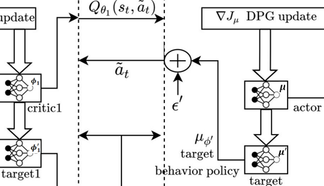

---

## 4.3.6 TD3 Algorithm
<!-- 슬라이드 374 -->

세 장치를 DDPG 알고리즘(3.6 절)에 끼워 넣으면 TD3 가 된다. DDPG 에서는 AU process 로 탐색 noise 를
만들었지만 TD3 는 Gaussian noise 를 쓴다.

> **TD3 Algorithm**
>
> Replay buffer $D$ 초기화
> Actor-Net. $\mu_\phi$, Critic-Net. $Q_{\phi_1}, Q_{\phi_2}$ 초기화
> Target-Net. Parameter copy : $Q'_{\phi_1}, Q'_{\phi_2}, \mu'_\phi \leftarrow Q_{\phi_1}, Q_{\phi_2}, \mu_\phi$
> **Repeat**($t = 1, \dots, T$) : episode 내부
> &nbsp;&nbsp; $a \leftarrow \mu_\phi(s) + \epsilon$, $\epsilon \sim \mathcal{N}(0, \sigma)$ : for exploration
> &nbsp;&nbsp; $s', r \leftarrow$ env.step($a$)
> &nbsp;&nbsp; $D \leftarrow (s, a, r, s')$
> &nbsp;&nbsp; $(s, a, r, s') \leftarrow$ random($D$, batch_size), batch_size $= N$
> &nbsp;&nbsp; $\tilde{a} \leftarrow \mu'_\phi(s') + \epsilon$, $\epsilon \sim \operatorname{clip}(\mathcal{N}(0, \tilde{\sigma}), -c, c)$ — **Target Policy Smoothing**
> &nbsp;&nbsp; $y \leftarrow r + \gamma \min_{i=1,2} Q'_{\phi_i}(s', \tilde{a})$ — **Clipped Double Q**
> &nbsp;&nbsp; Critic update : $\phi_i \leftarrow \arg\min_{\phi_i} \frac{1}{N} \sum \big( y - Q_{\phi_i}(s,a) \big)^2$
> &nbsp;&nbsp; **if** $t \bmod d$ **then** : 정책함수 학습 횟수 감소(실습에서 $d = 2$) — **Delayed policy update**
> &nbsp;&nbsp;&nbsp;&nbsp; Actor update by deterministic policy gradient :
> &nbsp;&nbsp;&nbsp;&nbsp; $\nabla_\phi J(\phi) = \frac{1}{N} \sum \nabla_\phi \mu_\phi(s)\, \nabla_a Q_{\phi_1}(s,a) \big|_{a = \mu_\phi(s)}$
> &nbsp;&nbsp;&nbsp;&nbsp; Update target networks :
> &nbsp;&nbsp;&nbsp;&nbsp; $\phi'_i \leftarrow \tau \phi_i + (1 - \tau) \phi'_i$ (critic), $\quad \mu' \leftarrow \tau \mu + (1 - \tau) \mu'$ (actor)
> **until** : $s == T$

actor 의 갱신에는 두 critic 중 **$Q_{\phi_1}$ 하나만** 쓴다. target 갱신도 actor 와 같은 주기(d 회에 한 번)로
미룬다.

---

## 4.3.7 성능과 Ablation study
<!-- 슬라이드 375~376 -->

### 성능 — MuJoCo environments

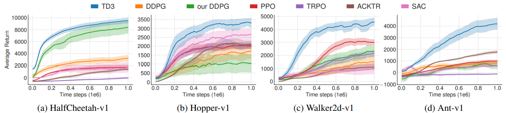

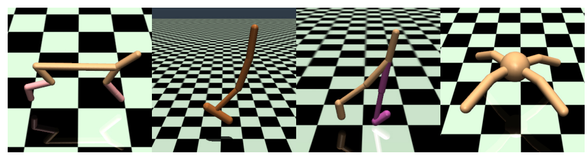

**Table 1.** Max Average Return over 10 trials of 1 million time steps. 각 task 의 최댓값이 굵게 표시되어
있고 $\pm$ 는 trials 에 걸친 표준편차 1 개다.

| Environment | TD3 | DDPG | Our DDPG | PPO | TRPO | ACKTR | SAC |
|---|---|---|---|---|---|---|---|
| HalfCheetah | **9636.95 ± 859.065** | 3305.60 | 8577.29 | 1795.43 | −15.57 | 1450.46 | 2347.19 |
| Hopper | **3564.07 ± 114.74** | 2020.46 | 1860.02 | 2164.70 | 2471.30 | 2428.39 | 2996.66 |
| Walker2d | **4682.82 ± 539.64** | 1843.85 | 3098.11 | 3317.69 | 2321.47 | 1216.70 | 1283.67 |
| Ant | **4372.44 ± 1000.33** | 1005.30 | 888.77 | 1083.20 | −75.85 | 1821.94 | 655.35 |
| Reacher | **−3.60 ± 0.56** | −6.51 | −4.01 | −6.18 | −111.43 | −4.26 | −4.44 |
| InvPendulum | **1000.00 ± 0.00** | **1000.00** | **1000.00** | **1000.00** | 985.40 | **1000.00** | **1000.00** |
| InvDoublePendulum | 9337.47 ± 14.96 | **9355.52** | 8369.95 | 8977.94 | 205.85 | 9081.92 | 8487.15 |

### Ablation study — functional blocks 을 제거해서 성능에 미치는 효과를 검증

Average return over the last 10 evaluations over 10 trials of 1 million time steps.

| Method | HCheetah | Hopper | Walker2d | Ant |
|---|---|---|---|---|
| TD3 | 9532.99 | **3304.75** | **4565.24** | **4185.06** |
| DDPG | 3162.50 | 1731.94 | 1520.90 | 816.35 |
| AHE | 8401.02 | 1061.77 | 2362.13 | 564.07 |
| TD3 − DP | 9590.65 | 2407.42 | **4695.50** | 3754.26 |
| TD3 − TPS | 8987.69 | 2392.59 | 4033.67 | **4155.24** |
| TD3 − CDQ | 9792.80 | 1837.32 | 2579.39 | 849.75 |

- **DP** : Delayed policy updates
- **TPS** : Target policy smoothing
- **CDQ** : Clipped Double Q-learning

CDQ 를 빼면(TD3 − CDQ) Hopper · Walker2d · Ant 에서 성능이 크게 떨어진다 — 세 장치 중 **CDQ 의 기여가
가장 크다.** DP 와 TPS 는 환경에 따라 빼도 비슷하거나 조금 나은 경우가 있다(HalfCheetah 는 어느 블록을
빼도 큰 차이가 없다). 이 표가 4.3.11 실습과제 3 의 설계도다.

---

## 4.3.8 실습 4.3.1 — LunarLander 학습
<!-- 슬라이드 377~388 -->

> 노트북: `code/4.3.1.TD3.ipynb`
> [](https://colab.research.google.com/github/AI-BoostCamp/ReinforcementLearning/blob/main/code/4.3.1.TD3.ipynb)
> PyTorch 구현: `code/4.3.1.pt.TD3.ipynb`
> [](https://colab.research.google.com/github/AI-BoostCamp/ReinforcementLearning/blob/main/code/4.3.1.pt.TD3.ipynb)

LunarLander 환경을 사용하여 TD3 알고리즘을 수행시켜 보자.

1. LunarLander Continuous 환경을 확인하고,
2. DDPG 알고리즘을 적용해 보자 — 3.6 절의 참고 실습 3.6.2(`code/3.6.2.DDPG_Lunar.ipynb`)가 그 코드다.
3. TD3 알고리즘을 적용하고, DDPG 와 비교해 보자.

### LunarLander Env.

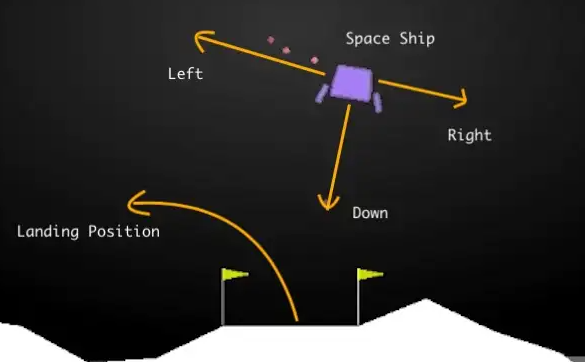

**LunarLanderContinuous-v2**(Continuous) — Continuous Action : throttle control.

- **Action space** (main, lateral) : main 0.5~1, lateral left(−1 ~ −0.5), right(0.5 ~ 1). 두 값 모두
  $[-1, 1]$ 범위의 실수이고, main 은 0.5 이상일 때만 엔진이 켜진다.
- **State space** : x, y 좌표, x, y 축 속도, 각, 각속도, 좌우 다리 접촉 — 8 차원.
- **Rewards** : landing position 에 가까운가 먼가에 따라 증가 · 감소되고, Lander 가 수평이 아니면 감소된다.
  좌우 다리가 바닥에 접지되면 +10. side engine 가동 −0.03 / frame, main engine 가동 −0.3 / frame.
  Landing +100, Crashing −100. **정답 : 200 point.** (https://www.gymlibrary.dev/environments/box2d/lunar_lander/)

```python
problem = "LunarLanderContinuous-v2"  ###
env = gym.make(problem)

num_states = env.observation_space.shape[0]      # 8
ps(env.observation_space,'Shape of State Space') #(8,)
p(env.observation_space,'env.observation_space')
print(f'state_low::{env.observation_space.low}')
print(f'state_high::{env.observation_space.high}\n')

num_actions = env.action_space.shape[0] # 2
ps(env.action_space,'Shape of Action Space') #(2,)
p(env.action_space,'env.action_space')
print(f'action_low::{env.action_space.low}')
print(f'action_high::{env.action_space.high}\n')

state = env.reset()
p(state,'state') #(8,)
```

```
[env.observation_space]: Shape:(8,)
Type: <class 'gym.spaces.box.Box'>
Values: Box(
 [-1.5 -1.5 -5.  -5.  -3.1415927 -5.  -0.  -0. ],
 [ 1.5  1.5  5.   5.   3.1415927  5.   1.   1. ], (8,), float32 )
state_low:: [-1.5 -1.5 -5.  -5.  -3.1415927 -5.  -0.  -0. ]
state_high:: [1.5 1.5 5.  5.  3.1415927 5.  1.  1. ]

[env.action_space]: Shape:(2,)
Type: <class 'gym.spaces.box.Box'>
Values: Box(-1.0, 1.0, (2,), float32)
action_low::[-1. -1.]
action_high::[1. 1.]

[state]: Shape:(8,)
Type: <class 'numpy.ndarray'>
Values: [-0.0064477  1.4049095 -0.6530905 -0.2671648  0.00747799  0.14793481  0.  0. ]
```

**`new_step_api = True`** — gym 0.25 이후 `env.step()` 의 반환값이 바뀌었다.

```python
next_state, reward, done, info = env.step(action)             # 구 API
next_state, reward, done, truncated, info = env.step(action)  # new_step_api=True
```

`gym.make(problem, new_step_api=True)` 로 만들면 `truncated` 가 하나 더 돌아온다. 실습 4.3.2, 4.3.3 은 새
API 로, 실습 4.3.1 은 구 API 로 쓰여 있다.

### Replay Buffer

3.6 절의 deque 대신 **미리 할당한 numpy 배열**에 순환 인덱스(`cnt % maxsize`)로 기록한다. `done` 대신
`not_done = 1 - done` 을 저장해 target 계산에서 곱하기만 하면 되게 했다.

```python
class RBuffer():
  def __init__(self, maxsize, statedim, naction):
    self.cnt = 0
    self.maxsize = maxsize
    self.state_memory = np.zeros((maxsize, statedim), dtype=np.float32)
    self.action_memory = np.zeros((maxsize, naction), dtype=np.float32)
    self.reward_memory = np.zeros((maxsize,), dtype=np.float32)
    self.next_state_memory = np.zeros((maxsize, statedim), dtype=np.float32)
    self.not_done_memory = np.zeros((maxsize,), dtype=bool)

  def record(self, state, action, reward, next_state, done):
    index = self.cnt % self.maxsize
    self.state_memory[index] = state
    self.action_memory[index] = action
    self.reward_memory[index] = reward
    self.next_state_memory[index] = next_state
    self.not_done_memory[index] = 1 - done
    self.cnt += 1

  def get_batch(self, batch_size):
    max_mem = min(self.cnt, self.maxsize)
    batch = np.random.choice(max_mem, batch_size, replace= False)
    states = tf.convert_to_tensor(self.state_memory[batch], dtype= tf.float32)
    actions = tf.convert_to_tensor(self.action_memory[batch], dtype= tf.float32)
    rewards = tf.convert_to_tensor(self.reward_memory[batch], dtype= tf.float32)
    next_states = tf.convert_to_tensor(self.next_state_memory[batch], dtype= tf.float32)
    not_dones = tf.convert_to_tensor(self.not_done_memory[batch], dtype= tf.float32)
    return states, actions, rewards, next_states, not_dones
```

### Actor-Network, Critic-Network

Critic 은 상태(8)와 행동(2)을 이어 붙여(10) 두 개의 은닉층을 거쳐 $Q$ 값 하나를 낸다. Actor 는 상태(8)에서
두 은닉층을 거쳐 행동(2)을 `tanh` 로 낸다 — 행동 범위 $[-1, 1]$ 과 맞다.

```python
nodes = 256 #512

def Critic():
    in_s = layers.Input(shape=(num_states,))
    in_a = layers.Input(shape=(num_actions,))
    x = layers.concatenate([in_s, in_a])
    x = layers.Dense(nodes, activation='relu',activity_regularizer=L2(0.0001))(x)
    x = layers.Dense(nodes, activation='relu',activity_regularizer=L2(0.0001))(x)
    x = layers.Dense(1, activation='linear')(x)
    return keras.Model(inputs=[in_s, in_a], outputs=x)

def Actor():
    in_s = layers.Input(shape=(num_states,))
    x = layers.Dense(nodes, activation='relu',activity_regularizer=L2(0.0001))(in_s)
    x = layers.Dense(nodes, activation='relu',activity_regularizer=L2(0.0001))(x)
    x = layers.Dense(num_actions, activation='tanh')(x)
    return keras.Model(inputs=in_s, outputs=x)

actor = Actor()
actor.summary()
critic = Critic()
critic.summary()
```

![Critic 의 plot_model. input_1 [(None, 8)] 과 input_2 [(None, 2)] 가 tf.concat(TFOpLambda) 으로 (None, 10) 이 되고, dense (None, 512) → dense_1 (None, 512) → dense_2 (None, 1).](images/s380_01.png)

![Actor 의 plot_model. input_3 [(None, 8)] → dense_3 (None, 512) → dense_4 (None, 512) → dense_5 (None, 2).](images/s380_03.png)

슬라이드의 구조도는 은닉 512 노드 · `tf.keras.Model` 서브클래스 버전(실습 4.3.3 의 형태)이다. 이때
파라미터 수는 Critic 268,801 · Actor 268,290 (모두 trainable) 이다. 노트북 4.3.1 은 256 노드에 L2
activity regularizer 를 붙인 functional API 버전이다.

### TD3 Agent (1) — Replay Buffer · Actor, Critic Networks Initialization

알고리즘의 첫 세 줄이다 — Replay buffer $D$ 초기화, Actor-Net. $\mu_\phi$ · Critic-Net. $Q_{\phi_1}, Q_{\phi_2}$
초기화, Target-Net. Parameter copy $Q'_{\phi_1}, Q'_{\phi_2}, \mu'_\phi \leftarrow Q_{\phi_1}, Q_{\phi_2}, \mu_\phi$.
critic 이 **둘**(`critic_main`, `critic_main2`)이고 target 도 둘이다. optimizer 도 critic 마다 따로 둔다.

```python
class TD3Agent():
  def __init__(self, env, n_RBuffer, batch_size=64):
    self.memory = RBuffer(n_RBuffer, num_states, num_actions)
    self.actor_main = Actor()
    self.actor_target = Actor()
    self.critic_main = Critic()
    self.critic_main2 = Critic()
    self.critic_target = Critic()
    self.critic_target2 = Critic()
    # Network Copy
    self.update_target(self.actor_target, self.actor_main, 1.0)
    self.update_target(self.critic_target, self.critic_main, 1.0)
    self.update_target(self.critic_target2, self.critic_main2, 1.0)

    # Network Optimization definition
    self.a_lr = 0.001
    self.c_lr = 0.002
    self.a_opt = tf.keras.optimizers.Adam(self.a_lr)
    self.c_opt1 = tf.keras.optimizers.Adam(self.c_lr)
    self.c_opt2 = tf.keras.optimizers.Adam(self.c_lr)

    # Action space
    self.n_actions = len(env.action_space.high) # 2
    self.min_action = env.action_space.low[0]   # -1.0
    self.max_action = env.action_space.high[0]  # 1.0
```

### TD3 Agent (2) — Variable Initialization · Soft Update · get_action()

```python
    ### Hyper Parameters ###
    self.batch_size = batch_size
    self.actor_update_steps = 2
    self.warmup = 2000 #1000  #(Iterations)
    self.gamma = 0.99
    self.tau = 0.02 #0.005
    self.expl_noise = 0.1 #0.1
    self.warmup_noise = 1.0

    self.train_step = 0 # Iterations
    self.loss_q = 0
    self.loss_a = 0
    self.losses = []
    self.a_n_rate = 0
```

`actor_update_steps = 2` 가 Delayed policy update 의 $d$ 다. `warmup` 은 처음 몇 iteration 동안 큰
noise(`warmup_noise = 1.0`)로 행동해 buffer 를 다양한 경험으로 채우는 기간이다.

**Soft Update** — $\phi'_i \leftarrow \tau \phi_i + (1 - \tau)\phi'_i$ (critic), $\mu' \leftarrow \tau\mu + (1 - \tau)\mu'$ (actor).

```python
  ## Soft Update
  @tf.function
  def update_target(self,target_model, source_model, tau):
      for target_var, source_var in zip(target_model.trainable_variables,\
                                        source_model.trainable_variables):
          target_var.assign(tau * source_var + (1 - tau) * target_var)
```

**Get Action** — `get_action()` 은 두 자리에서 불린다. main loop 에서(`get='main'`) 는 `actor_main` 의 출력에
탐색 noise 를 더한다 — warmup 중이면 $\mathcal{N}(0, 1.0)$, 이후에는 $\mathcal{N}(0, 0.1)$. train loop
에서(`get='target'`) 는 `actor_target` 의 출력에 noise 를 더하고 **$[-0.5, 0.5]$ 로 clip** 한다 — 이것이
Target Policy Smoothing 의 $\tilde{a} \leftarrow \mu'_\phi(s') + \epsilon$, $\epsilon \sim \operatorname{clip}(\mathcal{N}(0, \tilde{\sigma}), -c, c)$
이다. 마지막 줄 `a_n_rate` 는 noise 와 action 의 크기 비율(noise / action ratio)을 지수평균으로 추적해
로그에 찍는 진단값이다.

```python
  ## Get Action
  def get_action(self, state, get ='main'):
      if get == 'main' :  # get actor_main(call from maim loop)
          action = self.actor_main(state)
          if self.train_step < self.warmup : # warmup mode
              noise = tf.random.normal(shape=[self.n_actions], mean=0.0, stddev=self.warmup_noise)
          else:
              noise = tf.random.normal(shape=[self.n_actions], mean=0.0, stddev=self.expl_noise)
              noise = tf.clip_by_value(noise, -0.5, 0.5)
      else :              # get actor_target(call form train loop)
          action = self.actor_target(state)
          noise = tf.random.normal(shape=[self.n_actions], mean=0.0, stddev=self.expl_noise)
          noise = tf.clip_by_value(noise, -0.5, 0.5)
      action = tf.clip_by_value(action+noise, -1, 1)
      self.a_n_rate = self.a_n_rate * 0.9 + 0.1 * tf.reduce_mean(noise**2)/tf.reduce_mean(action**2)
      return action
```

### TD3 Agent (3) — Critic Main Network Update

알고리즘의 가운데 부분이다.

| 알고리즘 | 코드 |
|---|---|
| $(s,a,r,s') \leftarrow$ random($D$, batch_size) | `self.memory.get_batch(self.batch_size)` |
| $\tilde{a} \leftarrow \mu'_\phi(s') + \epsilon$, $\epsilon \sim \operatorname{clip}(\mathcal{N}(0,\tilde{\sigma}), -c, c)$ | `next_actions = self.get_action(next_states, get='target')` |
| $Q_{\phi'_i}(s', \tilde{a})$ | `target_q1`, `target_q2` |
| $y \leftarrow r + \gamma \min_{i=1,2} Q_{\phi'_i}(s', \tilde{a})$ | `target_q = tf.math.minimum(target_q1, target_q2)` → `rewards + gamma * target_q * not_dones` |
| $Q_{\phi_i}(s,a)$ | `critic_value`, `critic_value2` |
| $\phi_i \leftarrow \arg\min_{\phi_i} \frac{1}{N}\sum (y - Q_{\phi_i}(s,a))^2$ | `MSE(target_q, critic_value)` 두 개 → 각각의 optimizer 로 갱신 |

```python
  def train(self):
      if self.memory.cnt < self.batch_size: return
      states, actions, rewards, next_states, not_dones = self.memory.get_batch(self.batch_size)
      next_actions = self.get_action(next_states, get='target') # from actor_target
      ## CriticMain Network Update
      loss_q = self.train_step_critic(states, actions, rewards, next_states, not_dones, next_actions)
      self.loss_q = self.loss_q*0.5 + loss_q*0.5
      self.train_step += 1
```

```python
  @tf.function
  def train_step_critic(self, states, actions, rewards, next_states, not_dones, next_actions):
      with tf.GradientTape() as tape1, tf.GradientTape() as tape2:
          target_q1 = tf.squeeze(self.critic_target([next_states, next_actions]), 1)
          target_q2 = tf.squeeze(self.critic_target2([next_states, next_actions]), 1)
          target_q =  tf.math.minimum(target_q1, target_q2)
          target_q = rewards + self.gamma * target_q * not_dones
          critic_value = tf.squeeze(self.critic_main([states, actions]), 1)
          critic_value2 = tf.squeeze(self.critic_main2([states, actions]), 1)
          loss_q1 = tf.keras.losses.MSE(target_q, critic_value)
          loss_q2 = tf.keras.losses.MSE(target_q, critic_value2)
      grads1 = tape1.gradient(loss_q1, self.critic_main.trainable_variables)
      grads2 = tape2.gradient(loss_q2, self.critic_main2.trainable_variables)
      self.c_opt1.apply_gradients(zip(grads1, self.critic_main.trainable_variables))
      self.c_opt2.apply_gradients(zip(grads2, self.critic_main2.trainable_variables))
      return  loss_q1+loss_q2
```

`not_dones` 를 곱하므로 종료 전이에서는 target 이 $r$ 만 남는다. 두 critic 은 **같은 `target_q`** 로 각자
학습된다.

### TD3 Agent (4) — Actor Main Network Update · Target Network Soft Update

**if $t \bmod d$ then** — `train_step % actor_update_steps == 0` 일 때만 actor 와 세 target 을 갱신한다
(실습에서 $d = 2$).

```python
      ## ActorMain Net. Update & Actor/Critic Target Net. Update
      if self.train_step % self.actor_update_steps == 0:
          loss_a = self.train_step_actor(states)
          self.loss_a = self.loss_a*0.5 + loss_a*0.5
          ## ActorTarget update
          self.update_target(self.actor_target, self.actor_main, self.tau)
          ## CriticTarget update
          self.update_target(self.critic_target, self.critic_main, self.tau)
          self.update_target(self.critic_target2, self.critic_main2, self.tau)
      self.losses.append([self.loss_a,self.loss_q])
```

Actor update by deterministic policy gradient : $\nabla_\phi J(\phi) = \frac{1}{N}\sum \nabla_\phi \mu_\phi(s) \nabla_a Q_{\phi_1}(s,a)|_{a = \mu_\phi(s)}$.
코드에서는 $a = \mu_\phi(s)$ 가 `new_policy_actions`, $Q_{\phi_1}(s,a)$ 가 `critic_main([states, new_policy_actions])`,
$\frac{1}{N}\sum$ 이 `reduce_mean`, $\nabla_\phi J(\phi)$ 가 `tape.gradient` 다. **`critic_main` 하나만** 쓴다.
loss 에 음수를 붙여 $Q$ 가 커지는 방향으로 경사하강한다.

```python
  @tf.function
  def train_step_actor(self, states):
      with tf.GradientTape() as tape:
          new_policy_actions = self.actor_main(states)
          loss_a = -self.critic_main([states, new_policy_actions])
          loss_a = tf.math.reduce_mean(loss_a)
      grads = tape.gradient(loss_a, self.actor_main.trainable_variables)
      self.a_opt.apply_gradients(zip(grads, self.actor_main.trainable_variables))
      return loss_a
```

### Training loop

**Repeat**($t = 1, \dots, T$) : $a \leftarrow \mu_\phi(s) + \epsilon$ → $s', r \leftarrow$ env.step($a$) →
$D \leftarrow (s,a,r,s')$ → `agent.train()`(batch 추출 + 갱신) → **until** $s == T$.
`step_limit` 으로 한 에피소드의 길이를 자른다 — 이유는 다음 Training Result 에서 본다.

```python
ep_reward = []
total_avgr = []
steps = []
ep_losses = []
total_avgr_best = 0
step_limit = 600 #800 2000

def main_loop(episodes=10):
    global ep_reward, total_avgr, steps
    global total_avgr_best, step_limit

    ep_reward.clear()
    total_avgr.clear()
    steps.clear()

    for s in range(episods):
      episodic_reward = 0
      state = env.reset()
      done = False
      step_cnt = 0
      while (not done) and (step_cnt <= step_limit):
        action = agent.get_action(state.reshape(1,-1), get ='main')[0] # from actor_main
        next_state, reward, done, info = env.step(action)
#        if step_cnt == step_limit : reward_p += -100  ####
        agent.memory.record(state, action, reward, next_state, done)
        agent.train() ###
        state = next_state
        episodic_reward += reward
        step_cnt += 1
      ep_losses.append([agent.loss_a,agent.loss_q])
      ep_reward.append(episodic_reward)
      avg_reward = np.mean(ep_reward[-5:])
      total_avgr.append(avg_reward)
      steps.append(step_cnt)
      loss_a, loss_q = ma_loss()
      print(f'Epis(steps):{s:03d}({step_cnt:04d}), reward:{episodic_reward:.2f}, avg reward:{avg_reward:.2f}',end="")
      print(f', RB.cnt:{agent.memory.cnt}, Cnt_limit:{step_limit:02d}, BatchSize:{agent.batch_size}',end="")
      print(f' Loss(a,q):{loss_a:.1f}, {loss_q:.1f}, noise/action:{agent.a_n_rate:0.2f}')
```

```python
%%time
# Hyper Parameters
batch_size = 256 #64 #128 256
n_RBuffer = 20000 #5000 #10000 20000

problem = "LunarLanderContinuous-v2"  ###
env = gym.make(problem)
agent = TD3Agent(env, n_RBuffer, batch_size=batch_size)

### Hyper Parameters ###
agent.actor_update_steps = 2
agent.warmup = 2000 #1000  #(Iterations)
agent.gamma = 0.99
agent.tau = 0.02 #0.005
agent.expl_noise = 0.1 #0.1
agent.warmup_noise = 1.0

episods = 55 #100 #500
main_loop(episods)
```

```
Epis(steps):054(0600), reward:56.25, avg reward:112.84, RB.cnt:13889, Cnt_limit:600, BatchSize:256 Loss(a,q):-49.4, 46.4, noise/action:0.01
Wall time: 3min 55s
```

슬라이드의 loop 는 실습 4.3.3 과 같은 형태 — `new_step_api=True`, `avg_reward` 가 최고치를 넘을 때마다
`agent.actor_main.save(...)` 로 저장, `avg_reward > 200` 이면 중단, hyper parameter `batch_size = 64`,
`n_RBuffer = 5000`, `episods = 500`, `step_limit = 600` — 로 쓰여 있다.

### Step 단위 reward 변화

로그를 step 단위로 찍어 보면 보상이 어떻게 쌓이는지 보인다(슬라이드의 실행 로그).

```
Episodes(steps):000(80), reward:-15.23, avg reward:-12.24, RB.cnt:80, BatchSize:64
Episodes(steps):000(81), reward:-14.95, avg reward:-12.67, RB.cnt:81, BatchSize:64
Episodes(steps):000(82), reward:-15.80, avg reward:-13.12, RB.cnt:82, BatchSize:64
Episodes(steps):000(83), reward:-6.91, avg reward:-12.59, RB.cnt:83, BatchSize:64
Episodes(steps):000(84), reward:-106.91, avg reward:-21.98, RB.cnt:84, BatchSize:64
Episodes(steps):001(01), reward:-1.38, avg reward:-20.99, RB.cnt:85, BatchSize:64
Episodes(steps):001(02), reward:-2.87, avg reward:-20.18, RB.cnt:86, BatchSize:64
...
Episodes(steps):001(167), reward:-202.16, avg reward:-146.37, RB.cnt:251, BatchSize:64
Episodes(steps):001(168), reward:-302.16, avg reward:-165.51, RB.cnt:252, BatchSize:64
Episodes(steps):002(01), reward:1.17, avg reward:-153.88, RB.cnt:253, BatchSize:64
Episodes(steps):002(02), reward:2.32, avg reward:-141.40, RB.cnt:254, BatchSize:64
Episodes(steps):002(07), reward:5.99, avg reward:-66.11, RB.cnt:259, BatchSize:64
```

에피소드 0 은 84 step 에서 추락해 −100 이 더해지고(−6.91 → −106.91), 에피소드 1 은 168 step 동안 엔진
벌점이 쌓이다가 추락으로 −302 에서 끝난다. 에피소드 2 는 첫 step 부터 양의 보상 — 착륙 지점 쪽으로
움직이고 있다. Crashing −100 과 프레임마다의 엔진 벌점이 초반 학습 신호의 대부분이다.

### Training Result — step_limit 설정과 Buffer size

**Step_limit 가 없으면 buffer 소모가 커진다.** 학습이 덜 된 lander 가 착륙도 추락도 못하고 떠 있으면 한
에피소드가 수천 step 이 되어 — 노트북 기록에서 260 번째 에피소드가 11,553 step — buffer 가 그 한
에피소드로 가득 찬다. **좋은 경험이 삭제**되므로 buffer 를 키워야 하고, 실행 시간도 대폭 늘어난다
(`while (not done):` 로 190 에피소드에 43 분, `step_cnt < 800` 조건으로 492 에피소드에 46 분).

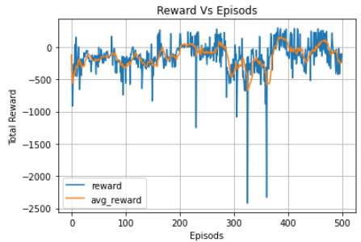

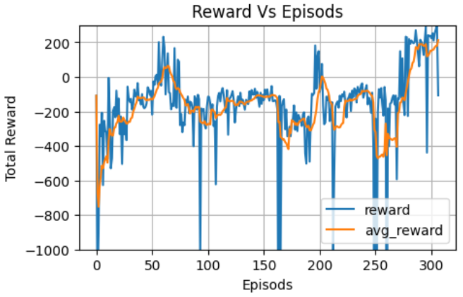

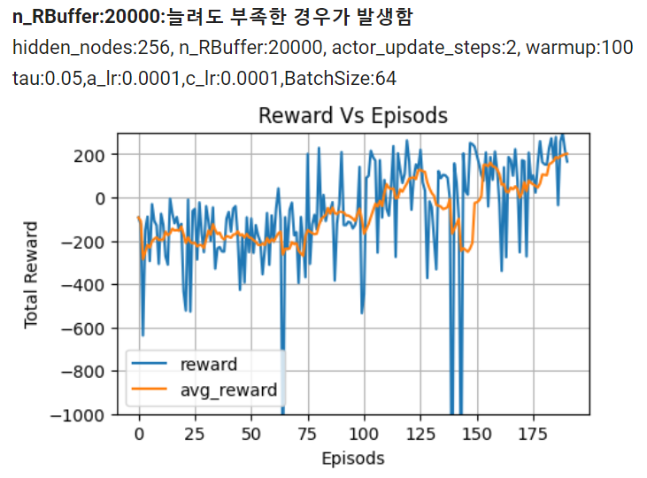

**`step_cnt < 600` 조건 적용** —

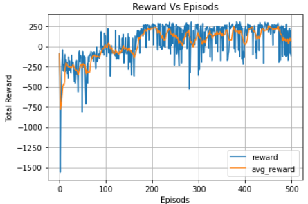

step_limit 을 두면 buffer 가 균형 있게 채워지고 200 에피소드 이후 안정적으로 250 근처를 유지한다.

### Training Result(2) — 변동성 : Target Network 의 update 비율

4.3.4 절에서 본 것이 실습에서도 나타난다. Learned policy 에서 $\tau$ 에 따라 학습이 실패하는 경우가
발생할 수 있다 — Actor-Critic 간의 상호작용이 복잡한 양상을 나타내며 $\tau$ 가 적당히 작은 것이
필요하다. 정책이 부실할 때 과대평가를 통해 가치 추정이 발산하거나, 가치 추정 자체가 부정확하면 정책이
부실해질 수 있다.

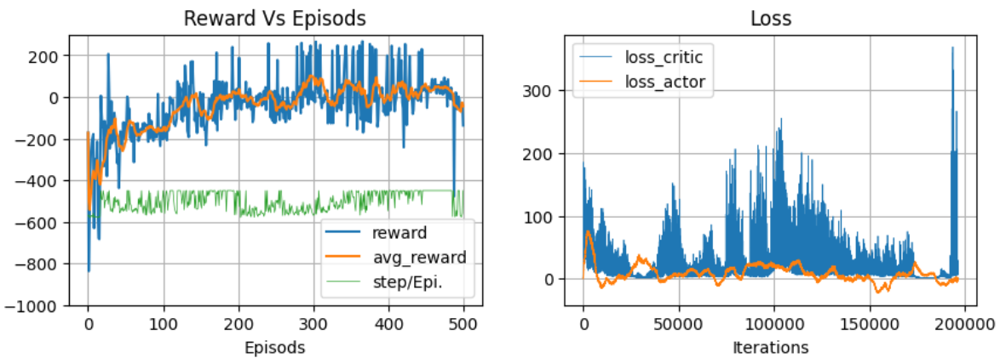

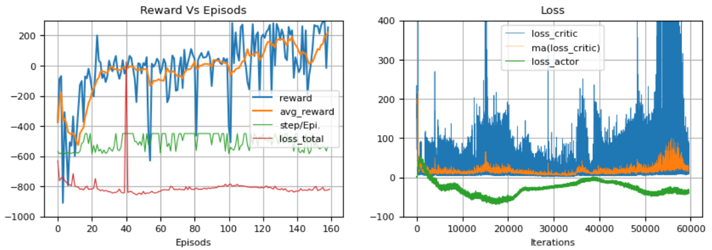

두 번째 그림에서 보상은 오르는데 critic loss 가 후반에 치솟는다 — 가치 추정이 흔들리기 시작하는
신호다. 노트북 기록으로는 $\tau = 0.005$ 는 total loss 가 감소하지 못했고("너무 작은가?"),
$\tau$ 가 커지면 critic loss 의 변동성이 증가했다.

---

## 4.3.9 실습과제 1 — Hyper parameter tuning
<!-- 슬라이드 389 -->

`n_episode = 100` 으로 고정하고 다음을 조정해 보자.

- `Learning_rate` = 0.01, 0.005, 0.001, ?
- `tau` = 0.09, 0.05, 0.03, 0.01, 0.1, 0.5, 1, ?
- `batch_size` = 32, 64, 128, 256, ?
- `n_RBuffer` = 5000, 10000, 20000, ?
- `Warmup` = 100, 200, ?

가장 좋아 보이는 모델을 **3 번 반복 학습하여 학습 변동성을 확인**해 보자(4.1.5 절).

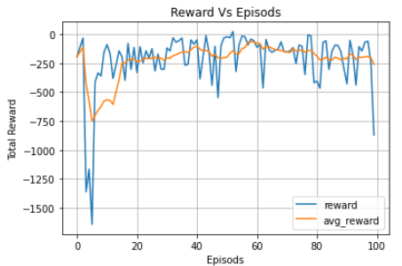

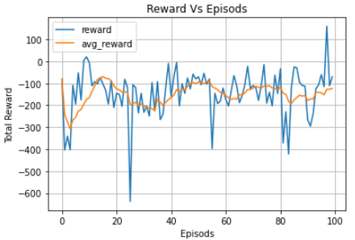

---

## 4.3.10 실습과제 2 — Shared Layer Critic Network(실습 4.3.2)
<!-- 슬라이드 390 -->

> 노트북: `code/4.3.2.TD3-shared.ipynb`
> [](https://colab.research.google.com/github/AI-BoostCamp/ReinforcementLearning/blob/main/code/4.3.2.TD3-shared.ipynb)

$Q_1, Q_2$ 두 개의 critic 각각에 target net 이 필요하다 — network 가 넷이다. **Layer sharing 으로 #P
(파라미터 수)를 감소**시켜 학습 효율 향상을 노려 보자. 문제의 복잡도에 따라 결과는 달라질 수 있다 —
**두 $Q$ 는 특성이 분리될 필요가 있다**(공유 층이 많을수록 두 $Q$ 가 닮아져 min 의 효과가 줄 수 있다).

첫 은닉층을 공유하고 그 위에서 두 갈래(`q1`, `q2`)로 나눈 하나의 모델을 만든다.

```python
def Critic(nodes=256):
    in_state = keras.Input(shape=env.observation_space.shape)#(8,)
    in_action = keras.Input(shape=env.action_space.shape)    #(2,)
    in_data = layers.concatenate([in_state, in_action],axis=1)
    x = layers.Dense(nodes, activation='relu')(in_data)
    x1 = layers.Dense(nodes, activation='relu')(x)
    x1 = layers.Dense(nodes, activation='relu')(x1)
    x1 =  layers.Dense(1, activation='linear',name='q1')(x1)

    x2 = layers.Dense(nodes, activation='relu')(x)
    x2 = layers.Dense(nodes, activation='relu')(x2)
    x2 =  layers.Dense(1, activation='linear',name='q2')(x2)
    q1_q2 = keras.Model([in_state,in_action],[x1,x2], name='Q1_Q2')
    return q1_q2
```

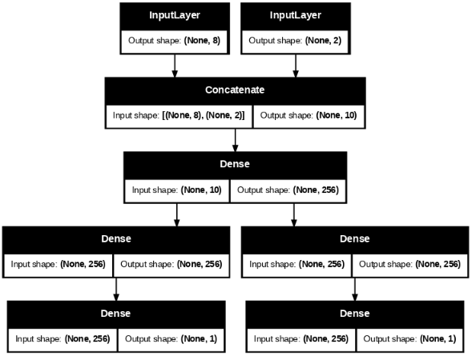

Agent 는 main · target 각각 **하나의 `q1_q2` 모델**만 가진다.

```python
class Agent():
  def __init__(self, env, buffer_capacity=100000, batch_size=64):
    # NNetworks instantiation
    self.actor_main = Actor()
    self.actor_target = Actor()
    self.q1_q2_main = Critic()
    self.q1_q2_target = Critic()
    # Parameter copy
    self.update_target(self.actor_target.weights, self.actor_main.weights, tau=1.0)
    self.update_target(self.q1_q2_target.weights, self.q1_q2_main.weights, tau=1.0)
```

critic 갱신은 GradientTape 하나로 두 출력의 MSE 를 합쳐 한 번에 한다.

```python
  @tf.function
  def train_critic(self, states, actions, rewards, next_states, not_dones, next_actions):
      with tf.GradientTape() as tape : #1, tf.GradientTape() as tape2:
          target_q1, target_q2 = self.q1_q2_target([next_states, next_actions])
          target_q = tf.math.minimum(target_q1, target_q2)
          target_q = rewards + self.gamma * target_q * not_dones
          current_q1, current_q2 = self.q1_q2_main([states, actions])
          critic_loss = tf.reduce_mean(tf.keras.losses.MSE(target_q, current_q1) + \
                        tf.keras.losses.MSE(target_q, current_q2))
      grads = tape.gradient(critic_loss, self.q1_q2_main.trainable_variables)
      self.c_opt.apply_gradients(zip(grads, self.q1_q2_main.trainable_variables))
      return critic_loss

  @tf.function
  def train_actor(self, states):
      with tf.GradientTape() as tape:
          new_policy_actions = self.actor_main(states)
          q1_value, _ = self.q1_q2_main([states, new_policy_actions])
          actor_loss = - tf.math.reduce_mean(q1_value)
      grads = tape.gradient(actor_loss, self.actor_main.trainable_variables)
      self.a_opt.apply_gradients(zip(grads, self.actor_main.trainable_variables))
      return actor_loss
```

actor 는 여전히 `q1_value` 하나만 쓴다. 노트북에는 hidden 512 · actor_update_steps 4 · $\tau$ 0.01,
hidden 256 · $\tau$ 0.05 · 학습률 1e-5 / 1e-4 등 여러 조건의 결과 그림이 기록되어 있다 — 분리된 critic
(실습 4.3.1)과 같은 조건에서 비교해 보자.

---

## 4.3.11 실습과제 3 — Ablation study(실습 4.3.3)
<!-- 슬라이드 391 -->

> 노트북: `code/4.3.3.TD3toDDPG.ipynb`
> [](https://colab.research.google.com/github/AI-BoostCamp/ReinforcementLearning/blob/main/code/4.3.3.TD3toDDPG.ipynb)

**TD3 − DP − TPS − CDQ = DDPG style model.** 4.3.7 의 ablation 표를 우리 코드로 재현한다 — 세 블록을
하나씩 빼면서 성능이 어떻게 변하는지 본다.

- **DP** : Delayed policy update — `self.actor_update_steps = 2` 를 `1` 로 바꾸면 매 critic 갱신마다
  actor 도 갱신된다(DDPG 방식).
- **TPS** : Target policy smoothing — $Q_{\phi'_i}(s', a' + \epsilon')$, $\epsilon' \sim \operatorname{clip}(\mathcal{N}(0,\sigma), -c, c)$.
  Target $y$ 계산 시 action 에 noise 를 추가하는 줄 `target_actions += tf.clip_by_value(target_noise, -0.5, 0.5)`
  을 없애면(noise = 0) 사라진다.
- **CDQ** : Clipped Double Q-learning —

  $$
  \begin{aligned}
  \text{CDQ} :\quad & y = r + \gamma \min_{i=1,2} Q_{\phi'_i}(s', a'), \quad a' \sim \mu'(s') \\
  & Q_{\phi_1}(s,a) \mathrel{+}= \alpha(y - Q_{\phi_1}(s,a)), \qquad Q_{\phi_2}(s,a) \mathrel{+}= \alpha(y - Q_{\phi_2}(s,a)) \\
  & \phi_i \leftarrow \arg\min_{\phi_i} \frac{1}{N}\sum \big( y - Q_{\phi_i}(s,a) \big)^2 \\
  \text{Single Q} :\quad & y = r + \gamma Q_{\phi'}(s', a'), \quad a' \sim \mu'(s') \\
  & Q_\phi(s,a) \mathrel{+}= \alpha(y - Q_\phi(s,a)), \qquad \phi \leftarrow \arg\min_\phi \frac{1}{N}\sum \big( y - Q_\phi(s,a) \big)^2
  \end{aligned}
  $$

  Critic Net. 1, 2 → **Single Critic Net.** 으로 바꾼다.

노트북의 `Agent` 는 세 블록을 뺀 예시다 — 주석 처리된 줄이 TD3 에서 제거된 부분이다.

```python
class Agent():
  def __init__(self, env, n_RBuffer, batch_size=64):
    self.memory = RBuffer(n_RBuffer, num_states, num_actions)
    self.actor_main = Actor()
    self.actor_target = Actor()
    self.critic_main = Critic()
    self.critic_target = Critic()
    # Network Copy
    self.update_target(self.actor_target, self.actor_main, 1.0)
    self.update_target(self.critic_target, self.critic_main, 1.0)
#    self.update_target(self.critic_target2, self.critic_main2, 1.0)

## Clipped Double Q-learning
    # self.critic_main2 = Critic()
    # self.critic_target2 = Critic()
    # self.update_target(self.critic_target2.weights, self.critic_main2.weights, 1.0)
    # self.c_opt2 = tf.keras.optimizers.Adam(self.c_lr)

    self.a_lr = 0.001
    self.c_lr = 0.0005 #0.001 #0.002
    self.a_opt = tf.keras.optimizers.Adam(self.a_lr)
    self.c_opt1 = tf.keras.optimizers.Adam(self.c_lr)

    self.n_actions = len(env.action_space.high) # 2
    self.min_action = env.action_space.low[0]
    self.max_action = env.action_space.high[0]

    self.batch_size = batch_size
    self.warmup = 100 #200 #1000
    self.gamma = 0.99
    self.tau = 0.05 #0.005
    self.trainstep = 0 # No. of Iterations
    self.expl_noise = 0.1 #0.1
    self.warmup_noise = 1.0
## Delayed policy update
    self.actor_update_steps = 1 ####2#####
```

```python
  ## Get Action
  def get_action(self, state, get ='main'):
      if get == 'main' :  # get actor_main(call from maim loop)
          action = self.actor_main(state)
          if self.train_step < self.warmup : # warmup mode
              noise = tf.random.normal(shape=[self.n_actions], mean=0.0, stddev=self.warmup_noise)
          else:
              noise = tf.random.normal(shape=[self.n_actions], mean=0.0, stddev=self.expl_noise)
      else :              # get actor_target(call form train loop)
          action = self.actor_target(state)
## Target policy smoothing
          # noise = tf.random.normal(shape=[self.n_actions], mean=0.0, stddev=self.expl_noise)
          # noise = tf.clip_by_value(noise, -0.5, 0.5)
          noise = 0.
      action = tf.clip_by_value(action+noise, -1, 1)
      self.a_n_rate = self.a_n_rate * 0.9 + 0.1 * tf.reduce_mean(noise**2)/tf.reduce_mean(action**2)
      return action
```

```python
  @tf.function
  def train_step_critic(self, states, actions, rewards, next_states, not_dones, next_actions):
      with tf.GradientTape() as tape1, tf.GradientTape() as tape2:
## Clipped Double Q-learning
#          target_q1 = tf.squeeze(self.critic_target([next_states, next_actions]), 1)
#          target_q2 = tf.squeeze(self.critic_target2([next_states, next_actions]), 1)
#          target_q =  tf.math.minimum(target_q1, target_q2)
          target_q = tf.squeeze(self.critic_target([next_states, next_actions]), 1)
          target_q = rewards + self.gamma * target_q * not_dones
          critic_value = tf.squeeze(self.critic_main([states, actions]), 1)
          loss_q1 = tf.keras.losses.MSE(target_q, critic_value)
      grads1 = tape1.gradient(loss_q1, self.critic_main.trainable_variables)
      self.c_opt1.apply_gradients(zip(grads1, self.critic_main.trainable_variables))
## Clipped Double Q-learning
#          critic_value2 = tf.squeeze(self.critic_main2([states, actions]), 1)
#          loss_q2 = tf.keras.losses.MSE(target_q, critic_value2)
#      grads2 = tape2.gradient(loss_q2, self.critic_main2.trainable_variables)
#      self.c_opt2.apply_gradients(zip(grads2, self.critic_main2.trainable_variables))
      return  loss_q1
```

과제는 이 세 블록을 **하나씩만** 빼서(TD3 − DP, TD3 − TPS, TD3 − CDQ) 같은 hyper parameter 로 학습하고,
논문의 ablation 표처럼 LunarLander 에서의 결과 표를 만드는 것이다.

---

## 4.3.12 정리 — Review
<!-- 슬라이드 392 -->
<!-- 그림 s392_01 은 4.3.3 의 s371_01 과 같은 그림이라 다시 넣지 않았다 -->

**Actor-Critic methods 의 내재적 불안 요인** — DDPG(= Actor-critic + DPG(Deterministic Policy Gradient)
+ DQN)의 불안정성을 두 방향에서 개선한다.

- **CDQ(Clipped Double Q-learning)** 기법으로 Overestimation bias 감소
- **slow-update Target network** 으로 Estimation variance 감소

**DQ-AC 선택** — DQ-AC(분리된 $Q$)와 DDQN-AC(Target $Q$)를 비교했을 때, DDQN-AC 는 천천히 변화하는
policy 에서 Target Net 과 Q Net 이 너무 유사해져서 분리 효과가 감소한다.

**TD3 = DDPG(Actor-Critic + DPG + RM + Target-Net. + Soft update + AU) − AU noise**

- **+ Clipped Double Q** : 두 개의 Critic Net. $Q$-value update 시 두 출력 중 작은 값을 사용
- **+ Delayed policy update** : Policy 를 $Q$-value 보다 적은 빈도로 update
- **+ Target Policy Smoothing** : Target $y$ 계산 시 action 에 noise 추가

다음 절에서는 방향을 바꾸어, replay buffer 없이 **여러 프로세스의 비동기 경험**으로 상관성 문제와 학습
속도를 함께 푸는 A3C 를 본다.
