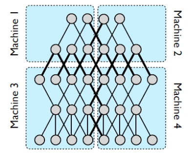
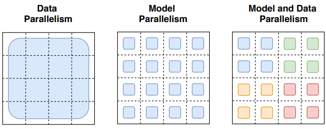
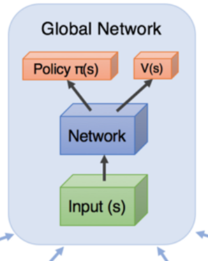
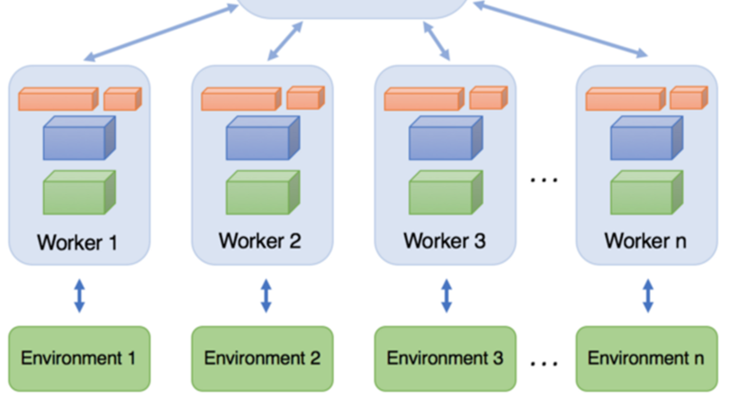
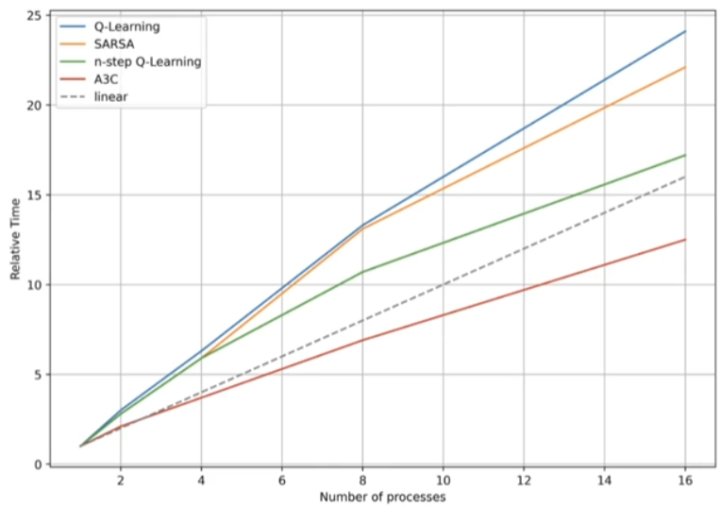
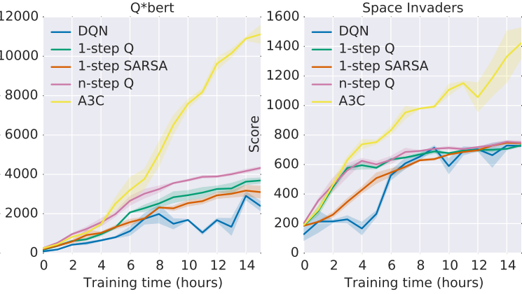
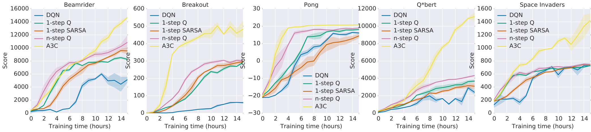
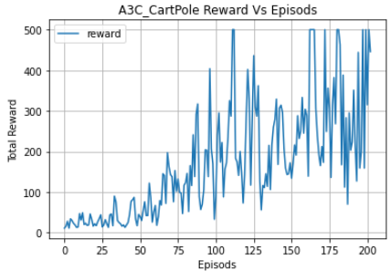
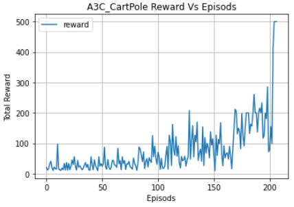

# 4.4 Asynchronous Advantage Actor-Critic(A3C)

**학습 목표**

- 분산 · 병렬 학습의 구조(작업 분할, parameter 동기화 방식, gradient 취합 방식)를 구분하고, 강화학습에서
  왜 환경 상호작용의 병렬화가 필요한지 설명할 수 있다.
- DQN(off-policy, replay buffer) · A2C(on-policy, correlation 문제) · A3C(A2C + asynchronous)의 관계를
  말하고, replay buffer 없이 sample 간 correlation 을 극복하는 비동기 방식의 원리를 설명할 수 있다.
- Asynchronous one-step Q-learning 과 A3C(n-step TD Advantage) 알고리즘을 actor-learner thread 관점에서
  쓰고, accumulate gradients · 주기적 동기화 · Entropy regularization 의 역할을 설명할 수 있다.
- Python multiprocessing(Pool · Queue · Thread)으로 A3C 를 CartPole 에 구현하고, hyper parameter 의 영향을
  실험할 수 있다.

**이 절의 구성**

- 4.4.1 Distributed training / Parallel training
- 4.4.2 A3C — Asynchronous Deep Reinforcement Learning
- 4.4.3 Synchronous Deep RL 과 Asynchronous Deep RL
- 4.4.4 학습시간 단축 — Asynchronous Deep RL 의 장점
- 4.4.5 Asynchronous one-step Q-learning Algorithm
- 4.4.6 Asynchronous Advantage Actor-Critic Algorithm(A3C)
- 4.4.7 Actor 의 Entropy regularization
- 4.4.8 A3C 성능
- 4.4.9 실습 4.4.1 — 비동기적 병렬 심층강화학습
- 4.4.10 실습과제 — Hyper parameter tuning
- 4.4.11 정리 — Review

---

## 4.4.1 Distributed training / Parallel training
<!-- 슬라이드 394 -->

병렬화의 층은 여러 겹이다 — **구조** : Distributed system > Multi-CPU > Multi-Core > Multi-Thread.
동작 방식은 세 축으로 나뉜다.

**작업 분할**

- **Model parallelism** : 모델(신경망)을 여러 장치에 나누어 올린다.
- **Data parallelism** : 같은 모델을 여러 장치에 복제하고 데이터를 나누어 처리한다.





**Parameter 동기화 방식**

- **Synchronous replication** : 분산 처리 종료 후 Gradient 의 평균으로 Parameter 를 update 한다. 빠른 수렴.
- **Asynchronous replication** : 분산 처리 별로 Gradient 계산 및 Parameter update 를 한다. 수렴성 검증이
  필요하다 — 다른 worker 가 낸 gradient 가 이미 바뀐 parameter 에 적용되기 때문이다.

**Gradient 취합 방식**

- **All-Reduce(Parameter Server)** : Server 에서 Gradient 를 취합하고 재분배한다. Worker 가 많으면 취합
  server 에 병목이 발생할 수 있다.
- **Ring-AllReduce** : GPU 를 Ring 형태로 구성하고 Gradient 전달을 통해 공유한다. 인접 Worker 로만
  전달하여 병목 현상을 제거한다("Horovod: fast and easy distributed deep learning in TensorFlow", 2018).

참고로 초대형 모델("Switch Transformers: Scaling to Trillion Parameter Models with Simple and Efficient
Sparsity", 2022)은 model 과 data parallelism 을 함께 쓴다. 이 절의 A3C 는 **Data parallelism +
Asynchronous replication + Parameter Server** 조합에 해당한다 — 여러 worker 가 각자의 환경에서
경험을 모아 gradient 를 내고, 하나의 global network 가 그것을 받아 갱신한다.

---

## 4.4.2 A3C — Asynchronous Deep Reinforcement Learning
<!-- 슬라이드 395 -->

**A3C : Asynchronous Advantage Actor-Critic** — "Asynchronous Methods for Deep Reinforcement Learning"
(2016, Google).

**Asynchronous Deep Reinforcement Learning** 은 Multi thread agent 들을 통해 async. 하게 sample 을 수집한다.

- **Replay Buffer 를 사용하지 않으면서** 샘플 간 correlation 문제를 극복하기 위해서다 — 서로 다른
  환경에서 서로 다른 시점의 경험이 섞여 들어오면 그 자체로 상관성이 깨진다.
- 분리된 환경에서 **Actor-Learner** 가 에피소드를 진행한다.
- 일정 step 단위로 sample 을 **Global Network** 에 제공하여 학습한다.
- 일정 주기로 Global Network 를 copy 한다(local ← global).





세 알고리즘을 한 줄씩 비교하면 A3C 의 자리가 보인다.

| | DQN | A2C | A3C |
|---|---|---|---|
| 성격 | Off-Policy, Value based RL | On-Policy, Policy based RL | A2C + Asynchronous method |
| 장점 | Replay Buffer 사용, correlation 극복 | 실시간으로 유연한 정책 학습 가능 | correlation 문제 해결, 학습 속도 향상 |
| 단점 | 많은 메모리 소모, 느린 학습 속도 | Sample 간 correlation 문제 | — |

DQN 은 buffer 로 correlation 을 풀었지만 메모리와 속도를 내주었고, A2C 는 on-policy 라 buffer 를 쓸 수
없어 correlation 이 남았다. A3C 는 **병렬 worker** 로 두 문제를 함께 푼다.

---

## 4.4.3 Synchronous Deep RL 과 Asynchronous Deep RL
<!-- 슬라이드 396 -->
<!-- 그림 s396_01 · s396_02 는 395 의 s395_01 · s395_02 와 같은 그림이라 다시 넣지 않았다 -->

**Synchronous Deep RL** — 한 Main process 와 여러 sub process(한 processor, 여러 processor, 여러 machine).

- Main process : sub process 의 실행 결과를 **한 시점에** 취합 및 학습한다.
- Sub process : 각각의 환경에서 실행한다.

가장 느린 sub process 가 끝나기를 모두가 기다린다.

**Asynchronous Deep RL** — 기다리지 않는다.

- **Main Process** : 각 Sub process 가 종료되면 → 그 결과를 받아서 → Global Net. 학습 후 → Sub process 에
  Net. 을 전달한다.
- **Sub Process** : Net. 과 Env. 상호작용 → Episode(또는 일정 step)가 종료되면 → 결과를 Main Process 로
  전달 → Main 으로부터 수정된(학습된) Net. 을 copy 한다.

각 sub process 는 자기 속도로 돌고, global network 는 도착하는 순서대로 갱신된다.

---

## 4.4.4 학습시간 단축 — Asynchronous Deep RL 의 장점
<!-- 슬라이드 397 -->

**어떤 구조의 심층강화학습에 적용 가능할까?** On-policy / Off-policy 모두 적용 가능하고, 가치기반 /
정책기반 / Actor-Critic 에 적용 가능하며, 연속 행동 공간 / 이산 행동 공간에 적용 가능하다. 비동기
방식은 알고리즘이 아니라 **학습을 조직하는 방법**이기 때문이다.

**학습시간의 단축은 어느 정도 가능할까?** 알고리즘에 따라 core 수에 비례성을 가지며, 대체적으로 일관된
성능 향상을 가진다. 논문의 표 — 1 thread 대비 학습 속도 향상 배수(Number of threads) :

| Method | 1 | 2 | 4 | 8 | 16 |
|---|---|---|---|---|---|
| 1-step Q | 1.0 | **3.0** | **6.3** | **13.3** | **24.1** |
| 1-step SARSA | 1.0 | **2.8** | **5.9** | **13.1** | **22.1** |
| n-step Q | 1.0 | **2.7** | **5.9** | **10.7** | **17.2** |
| A3C | 1.0 | 2.1 | 3.7 | 6.9 | 12.5 |



Q-learning 계열은 thread 수보다 **더 빠르게**(super-linear) 빨라진다 — 여러 thread 의 경험이 섞여 학습
자체가 효율적이 되기 때문이다. A3C 는 선형 이하지만 16 thread 에서 12.5 배다.

**학습과정의 stability 는?** Sub Net. 은 parameter 가 random 한 듯 동작하지만, 그렇지만 stable 한 학습이
가능하다.



**모든 계열에서 공통적인 특성이 발현된다.**

- 각 actor-learner process 는 **서로 다른 episode 를 경험**한다. Main Net. 을 공유하지만 각 프로세스는
  서로 다른 episode 를 경험하게 되므로 **Exploration 을 매우 잘 하게 된다.**
- 학습이 안정되는 경향이 있다. 학습 시간은 병렬 프로세스 수에 비례하여 감소하고, Experience Replay 를
  사용하지 않으므로 **On-policy 에 적용 가능**하다.

---

## 4.4.5 Asynchronous one-step Q-learning Algorithm
<!-- 슬라이드 398 -->

비동기 방식을 가장 단순한 알고리즘에 붙인 것이 **Asynchronous one-step Q-learning** (DQN like, RM 없음)이다.

- DQN 의 target Net. 처럼 **두 Net.**($Q_\theta$, $Q_{\theta_t}$)이 사용되고, **accumulate gradients** 로
  mini-batch 효과를 적용한다 — 매 step 갱신하는 대신 gradient 를 $I_{AsyncUpdate}$ step 모아서 한 번에 적용한다.
- 주기적으로 분포에서 $\epsilon$ 을 sampling 한 $\epsilon$-greedy policy 를 적용하여 견고성을 향상한다 —
  thread 마다 다른 $\epsilon$ 을 쓰면 탐색이 다양해진다.

> **[ Actor-learner thread ]**
>
> // Global shared $Q_\theta$, Target $Q_{\theta_t}$
> Init. : $T \leftarrow 0$, global step counter
> &nbsp;&nbsp; $\theta_t \leftarrow \theta$, sync target
> &nbsp;&nbsp; $d\theta_q \leftarrow 0$, gradients
> **Thread**
> &nbsp;&nbsp; $t \leftarrow 0$, thread step counter
> &nbsp;&nbsp; $s \leftarrow$ 현재 상태 관측
> &nbsp;&nbsp; **Repeat** : episode 내부
> &nbsp;&nbsp;&nbsp;&nbsp; $a \leftarrow Q_\theta(s,a)$ : sampled $\epsilon$-greedy policy
> &nbsp;&nbsp;&nbsp;&nbsp; $s', r \leftarrow$ env.step($a$)
> &nbsp;&nbsp;&nbsp;&nbsp; $y = r + \gamma \max_{a'} Q_{\theta_t}(s',a')$ or $r$(done)
> &nbsp;&nbsp;&nbsp;&nbsp; $d\theta_q \mathrel{+}= \dfrac{\partial (y - Q_\theta(s,a))^2}{\partial \theta_q}$, Accumulate gradients
> &nbsp;&nbsp;&nbsp;&nbsp; $s = s'$
> &nbsp;&nbsp;&nbsp;&nbsp; $T \mathrel{+}= 1$, $t \mathrel{+}= 1$
> &nbsp;&nbsp;&nbsp;&nbsp; **if** $t \bmod I_{AsyncUpdate} == 0$ or $s$ is done **then**
> &nbsp;&nbsp;&nbsp;&nbsp;&nbsp;&nbsp; $Q_\theta \leftarrow Q_\theta - d\theta_q$, Update global main net.
> &nbsp;&nbsp;&nbsp;&nbsp;&nbsp;&nbsp; $d\theta_q \leftarrow 0$
> &nbsp;&nbsp;&nbsp;&nbsp; **if** $T \bmod I_{target} == 0$ **then**
> &nbsp;&nbsp;&nbsp;&nbsp;&nbsp;&nbsp; $Q_{\theta_t} \leftarrow Q_\theta$ : Update global target net.
> &nbsp;&nbsp; **until** $T > T_{max}$, global time out

비교를 위해 3.4 절의 DQN 을 같은 형식으로 옮기면 —

> **[ DQN Algorithm ]**
>
> Replay memory $D$ 초기화
> Q-Net. $Q$ 의 $\theta$ 초기화
> Target Net $Q_t \leftarrow Q$ parameter copy
> **Episode Repeat** :
> &nbsp;&nbsp; $s \leftarrow$ 현재 상태 관측
> &nbsp;&nbsp; **Repeat**($t = 1, \dots, T$) : episode 내부
> &nbsp;&nbsp;&nbsp;&nbsp; $a \leftarrow \max_a Q(s,a)$ and $\epsilon$-greedy
> &nbsp;&nbsp;&nbsp;&nbsp; $s', r \leftarrow$ env.step($a$), 행동을 시행
> &nbsp;&nbsp;&nbsp;&nbsp; $D \leftarrow (s, a, r, s')$
> &nbsp;&nbsp;&nbsp;&nbsp; $(s,a,r,s') \leftarrow$ random($D$, batch_size)
> &nbsp;&nbsp;&nbsp;&nbsp; $y = r$(done) or $r + \gamma Q_t(s,a,r,s')$
> &nbsp;&nbsp;&nbsp;&nbsp; $\delta \leftarrow$ mse$(y - Q(s,a))$
> &nbsp;&nbsp;&nbsp;&nbsp; $\theta \leftarrow \theta - \eta \dfrac{\partial \delta}{\partial \theta}$
> &nbsp;&nbsp;&nbsp;&nbsp; $\theta^- \leftarrow \theta$, C-step 에 한 번씩
> &nbsp;&nbsp; **until** : $s == T$

DQN 의 "buffer 에서 random batch" 자리에 "thread 가 $I_{AsyncUpdate}$ step 동안 모은 gradient" 가 들어간
것이다. 두 hyper parameter 의 성격 —

- $I_{AsyncUpdate}$ : 작으면 빠른 학습, 병렬 처리 과부하. $I_{AsyncUpdate} = 5$ (1~10).
- $I_{target}$ : 크면 안정적, 작으면 늦은 학습. $I_{target} = 1000$ (500~5000).

---

## 4.4.6 Asynchronous Advantage Actor-Critic Algorithm(A3C)
<!-- 슬라이드 399 -->

같은 틀을 A2C(3.5 절)에 씌우면 **A3C**(n-step TD Advantage)다. A2C 는 on-policy 기법이므로 exploration 을
위해 **Entropy Regularization** 적용을 권유한다.

- $t_{max}$ : thread step 마다 update 하는 간격(update interval).
- **entropy regularization** = Actor $\theta$ 를 조정해서 exploration 을 부여한다 —
  $\nabla_\theta(\text{ActorLoss} + \beta H(a))$, $H(a)$ 는 action 의 엔트로피. $H(p) = -E[\log p(x)]$ 는
  확률변수의 불확실성이다. **정책도 좋게 하고, action 의 불확실성도 크게 하라** — entropy 로 action 의
  exploration 을 $\beta$ 로 조절할 수 있다.

> **[ actor-learner thread ]**
>
> // Global $\pi_\theta$, $V_\theta$, and counter $T = 0$.
> // Thread $\pi_{\theta'}$, $V_{\theta'}$
> Init. : $t \leftarrow 0$, thread step counter
> **Repeat** : Episode
> &nbsp;&nbsp; $\theta_{\pi'} \leftarrow \theta_\pi$, $\theta_{v'} \leftarrow \theta_v$, synch. thread net.
> &nbsp;&nbsp; $t_{start} = t$
> &nbsp;&nbsp; $s \leftarrow$ 현재 상태 관측
> &nbsp;&nbsp; **Repeat** : episode 내부
> &nbsp;&nbsp;&nbsp;&nbsp; $a \leftarrow \pi_{\theta'}(s)$
> &nbsp;&nbsp;&nbsp;&nbsp; $s', r, d \leftarrow$ env.step($a$)
> &nbsp;&nbsp;&nbsp;&nbsp; $T \mathrel{+}= 1$, $t \mathrel{+}= 1$
> &nbsp;&nbsp; **until** done or $t_{max}$ : update interval
> &nbsp;&nbsp; **for** $i \in \{t-1, \dots, t_{start}\}$ **do** : n-step loop
> &nbsp;&nbsp;&nbsp;&nbsp; $R_i \leftarrow r_i + \gamma R$ : n-step TD target
> &nbsp;&nbsp;&nbsp;&nbsp; $A = R - V_{\theta'}(s)$
> &nbsp;&nbsp;&nbsp;&nbsp; // Update global : Accumulate gradients
> &nbsp;&nbsp;&nbsp;&nbsp; **Actor** : $\theta_\pi \leftarrow \theta_\pi + \nabla_{\theta'} \ln \pi_{\theta'}(s)(A) + \beta H(a \sim \pi_{\theta'}(s))$
> &nbsp;&nbsp;&nbsp;&nbsp; **Critic** : $\theta_v \leftarrow \theta_v - \partial(A)^2 / \partial \theta_v$
> &nbsp;&nbsp; $\theta_{\pi'} \leftarrow \theta_\pi$, $\theta_{v'} \leftarrow \theta_v$, synch. thread net.
> **end Repeat**
> **until** $T > T_{max}$, global time out

thread 는 $t_{max}$ step(또는 에피소드 끝)까지 자기 network 로 행동하고, 모은 $t_{max}$ 개의 전이로 **n-step
TD target** $R_i$ 를 뒤에서부터 계산해 Advantage $A = R - V_{\theta'}(s)$ 를 만든다. 그 gradient 로 **global**
$\theta_\pi$, $\theta_v$ 를 갱신하고, 다시 global 을 thread 로 복사한다. $\pi_\theta$ 가 Actor, $V^\pi_\psi$ 가 Critic 이다.

비교를 위해 3.5 절의 A2C 를 옮기면 —

> **[ A2C Algorithm ]**
>
> 초기화 : $\pi_\theta(a \mid s)$, $V^\pi_\psi(s)$ parameter 초기화
> **Episode Repeat** :
> &nbsp;&nbsp; $s \leftarrow$ 현재 상태 관측
> &nbsp;&nbsp; **Repeat**($t = 1, \dots, T$) : episode 내부
> &nbsp;&nbsp;&nbsp;&nbsp; $a \leftarrow \pi_\theta(a \mid s)$ 로 결정(sampling)
> &nbsp;&nbsp;&nbsp;&nbsp; $s', r \leftarrow$ env.step($a$), 행동을 시행
> &nbsp;&nbsp;&nbsp;&nbsp; $\delta = \| r + \gamma V^\pi_\psi(s') - V^\pi_\psi(s) \|_2$, TD error, $A(\cdot)$ 계산
> &nbsp;&nbsp;&nbsp;&nbsp; $\psi \leftarrow \psi - \eta \dfrac{\partial \delta}{\partial \psi}$, critic 은 작아지도록 학습
> &nbsp;&nbsp;&nbsp;&nbsp; $\theta \leftarrow \theta + \alpha \delta \nabla_\theta \ln \pi_\theta(A_t \mid S_t)$, actor 는 커지도록 학습
> &nbsp;&nbsp;&nbsp;&nbsp; $a, s \leftarrow a', s'$
> &nbsp;&nbsp; **until** : $s == T$

A2C 는 한 step 의 TD error 로 매 step 갱신했다. A3C 는 (1) n-step 리턴, (2) $t_{max}$ step 묶음 갱신,
(3) 여러 thread, (4) entropy 항 — 네 가지가 더해졌다.

---

## 4.4.7 Actor 의 Entropy regularization
<!-- 슬라이드 400 -->

**Actor : Entropy regularization** (exploration 을 위해 적용). Actor $\theta$ 를 조정해서 exploration 을
부여한다 — 정책 개선 + action 의 불확실성 향상.

$$
\text{Total Actor loss} = \nabla_\theta\big( \text{ActorLoss} + \text{Entropy loss}(\beta H(a)) \big), \qquad \beta : 0.01 \sim 0.1
$$

- **ActorLoss** : $\nabla_{\theta'} \ln \pi_\theta(a_i \mid s_i; \theta')\,\big(R - V(s_i; \theta'_v)\big)$ — 괄호 안이 **advantage** 다.
- **Entropy loss** : $H(p) = -\sum p \log p$, $\quad H(a) = -\sum a \log a$, $a \sim \pi_\theta(s)$ — action 의
  다양성(불확실성). 정책이 한 행동에 확률을 몰아주면 $H$ 가 작아지고, 고르게 퍼지면 커진다.

Action 의 exploration 을 $\beta$ 로 조절한다. loss 를 **최소화**하므로 entropy 는 **빼서** 넣는다 — entropy
가 큰(퍼진) 정책일수록 loss 가 작아진다.

**Actor loss** — 노트북의 `compute_loss()`. `SparseCategoricalCrossentropy` 에 `sample_weight=advantage` 를
주면 $-\sum A \ln \pi(a \mid s)$ 가 된다(advantage 는 `stop_gradient` 로 상수 취급). 그 뒤에 entropy 항을 빼는
줄이 **Entropy regularization** 이다.

```python
    def compute_loss(self, actions, logits, advantages): # a_loss+Entropy_loss
        ce_loss = SparseCategoricalCrossentropy(from_logits=True)
        actions = tf.cast(actions, tf.int32)
        policy_loss = ce_loss(        #(1,) <- CE((bs,),(bs,a)
            actions, logits, sample_weight=tf.stop_gradient(advantages))
        probs = tf.nn.softmax(logits) #(bs,a)
        entropy = -tf.reduce_sum(probs*tf.math.log(probs+1e-10), axis=1)#(bs,)
        return policy_loss - self.entropy_beta * tf.reduce_mean(entropy)
```

**Actor train**

```python
    def train(self, states, actions, advantages):
        with tf.GradientTape() as tape:
            a_pred = self.model(states, training=True) #(bs,a)<-(bs,s)
            loss = self.compute_loss(actions, a_pred, advantages)
        grads = tape.gradient(loss, self.model.trainable_variables)
        self.opt.apply_gradients(zip(grads, self.model.trainable_variables))
        return loss
```

---

## 4.4.8 A3C 성능
<!-- 슬라이드 401 -->

**A3C 성능 : DQN 은 single GPU, Async. model 은 16 CPU cores.**



GPU 하나의 DQN 을 CPU 16 core 의 비동기 방법들이 시간 기준으로 앞선다 — replay buffer 와 GPU 없이도
병렬 경험만으로 이만큼 된다는 것이 논문의 요지다.

---

## 4.4.9 실습 4.4.1 — 비동기적 병렬 심층강화학습
<!-- 슬라이드 402~411 -->

> 노트북: `code/4.4.1.A3C.ipynb`
> [](https://colab.research.google.com/github/AI-BoostCamp/ReinforcementLearning/blob/main/code/4.4.1.A3C.ipynb)
> PyTorch 구현: `code/4.4.1.pt.A3C.ipynb`
> [](https://colab.research.google.com/github/AI-BoostCamp/ReinforcementLearning/blob/main/code/4.4.1.pt.A3C.ipynb)

앞부분은 Python 의 병렬 처리 도구 세 가지(Process Pool · Process Queue · Thread)를 작은 예제로 익히고,
뒷부분에서 그중 Thread 로 A3C 를 CartPole 에 구현한다. Colab 은 노트 설정에서 고용량 RAM 을 쓰면 CPU
4 개가 할당된다.

### Single Process

먼저 한 프로세스로 제곱을 계산한다 — 비교 기준이다.

```python
import multiprocessing as mp

def square(x):
  print(np.square(x))
  return

x = np.arange(64)
square(x)
```

```
[   0    1    4    9   16   25   36   49   64   81  100  121  144  169
  196  225  256  289  324  361  400  441  484  529  576  625  676  729
  784  841  900  961 1024 1089 1156 1225 1296 1369 1444 1521 1600 1681
 1764 1849 1936 2025 2116 2209 2304 2401 2500 2601 2704 2809 2916 3025
 3136 3249 3364 3481 3600 3721 3844 3969]
```

### Python Multiprocessing — Process Pool

CPU 수를 확인하고(`mp.cpu_count()` 는 hyperthreading 과 구분이 필요하다), `mp.Pool` 로 프로세스 풀을 만든 뒤
데이터를 `n_cpu` 조각으로 나누어 `pool.map(function, data)` 로 배포한다.

```python
## Check the number of CPU cores
n_cpu = mp.cpu_count() # hyperthreading과 구분 필요
print(f'No. of CPUs: {n_cpu}') # No. of CPUs: 8 or 12
```

```python
## Process에 function과 data set 배포
pool = mp.Pool(n_cpu) # Processor pool 설정
print(pool)
for i in range(n_cpu):
  pool.map(square, [x[int(i*len(x)/n_cpu): int((i+1)*len(x)/n_cpu)]])
pool.close()
```

```
[   0    1    4    9   16   25   36   49   64   81  100  121  144  169  196  225]
[ 256  289  324  361  400  441  484  529  576  625  676  729  784  841  900  961]
[1024 1089 1156 1225 1296 1369 1444 1521 1600 1681 1764 1849 1936 2025
 2116 2209]
[2304 2401 2500 2601 2704 2809 2916 3025 3136 3249 3364 3481 3600 3721
 3844 3969]
<multiprocessing.pool.Pool state=RUN pool_size=4>
```

네 프로세스가 16 개씩 맡아 계산했다.

### Python Multiprocessing — Process Queue

`mp.Process` 로 프로세스를 직접 만들고, 결과는 `mp.Queue` 로 주고받는다. `start()` 로 시작하고 `join()` 으로
끝날 때까지 기다린다.

```python
def square(i,x,queue):
  print(f"\nIn process {i}")
  queue.put(np.square(x)) #
  print(f'queue.get[{i}]:{queue.get()}\n')
```

```python
### Process Queue ###
processes = []
queue = mp.Queue()  ## process queue 생성
x = np.arange(64)
for i in range(n_cpu):
  ## Process queue에 function 할당
  proc = mp.Process(target=square,
                    args=(i,x[int(i*len(x)/n_cpu): int((i+1)*len(x)/n_cpu)],
                    queue))
  processes.append(proc)
  proc.start()      # Start process

for proc in processes:
  proc.join()       # Wait until finished.

print(f'queue:{queue}')
del queue
```

```
In process 0
queue.get[0]:[   0    1    4    9   16   25   36   49   64   81  100  121  144  169  196  225]In process 1

queue.get[1]:[256 289 324 361 400 441 484 529 576 625 676 729 784 841 900 961]
In process 2
In process 3queue.get[2]:[1024 1089 1156 1225 1296 1369 1444 1521 1600 1681 1764 1849 1936 2025
 2116 2209]

queue.get[3]:[2304 2401 2500 2601 2704 2809 2916 3025 3136 3249 3364 3481 3600 3721
 3844 3969]
queue:<multiprocessing.queues.Queue object at 0x7f8de348e040>
```

출력이 서로 끼어든다("In process 3queue.get[2]…") — 프로세스들이 **비동기로** 돌고 있다는 증거다.
`join()` 대신 `proc.terminate()` 를 부르면 프로세스를 강제로 종료할 수 있다(노트북의 "Kill the process
forcefully" 셀).

### Python Multiprocessing — Thread

A3C 구현에 쓸 형태다. `threading.Thread` 를 상속한 `Worker` 클래스에 `run()` 을 정의하면, `start()` 가
`run()` 을 새 thread 에서 실행한다.

```python
from threading import Thread

class Worker(Thread):
    def __init__(self, id, x):
        Thread.__init__(self)
        self.name = "w%i" % id
        self.x = x

    def run(self):
        print(f'In process {self.name}')
        print(f'squeare {np.square(self.x)}')
```

```python
x = np.arange(64)

num_workers = mp.cpu_count()
print("Training on {} cores".format(num_workers))

workers = []
for i in range(num_workers):
    workers.append(Worker(i,x[int(i*len(x)/n_cpu): int((i+1)*len(x)/n_cpu)]))
    workers[i].start()

for worker in workers:
    worker.join()
```

```
Training on 4 cores
In process w0
squeare [   0    1    4    9   16   25   36   49   64   81  100  121  144  169  196  225]
In process w1
squeare [256 289 324 361 400 441 484 529 576 625 676 729 784 841 900 961]
In process w2In process w3
squeare [1024 1089 1156 1225 1296 1369 1444 1521 1600 1681 1764 1849 1936 2025
 2116 2209]

squeare [2304 2401 2500 2601 2704 2809 2916 3025 3136 3249 3364 3481 3600 3721
 3844 3969]
```

### A3C, Actor Network : CartPole Env.

이제 A3C 다. 환경은 CartPole-v1(상태 4, 행동 2, 이산). hyper parameter 는 전역으로 둔다.

```python
actor_lr = 0.0005
critic_lr = 0.001
gamma = 0.99
hidden_size = 256 #128
update_interval = 32
```

**Actor** — 상태를 받아 softmax 정책을 낸다. optimizer 는 RMSprop, `entropy_beta = 0.01`. `compute_loss`
와 `train` 은 4.4.7 절에서 본 그대로다.

Actor : $A(s) = R - V(s_i; \theta'_v)$, $\quad d\theta \leftarrow d\theta + \nabla_{\theta'} \ln \pi_\theta(a_i \mid s_i; \theta') A(s) + \beta H(a)$

```python
class Actor(tf.keras.Model):
    def __init__(self, state_size, action_size):
        global actor_lr
        super(Actor, self).__init__()
        self.state_size = state_size
        self.action_size = action_size
        self.model = self.create_model()
        self.opt = tf.keras.optimizers.RMSprop(actor_lr)
        self.entropy_beta = 0.01  # 0.01~0.1

    def create_model(self):
        state_input = Input((self.state_size,))
        dense_1 = Dense(hidden_size, activation='relu')(state_input)
        dense_2 = Dense(hidden_size, activation='relu')(dense_1)
        policy = Dense(self.action_size, activation='softmax')(dense_2)
        return tf.keras.models.Model(state_input, policy)

    def compute_loss(self, actions, logits, advantages): # a_loss+Entropy_loss
        ce_loss = SparseCategoricalCrossentropy(from_logits=True)
        actions = tf.cast(actions, tf.int32)
        policy_loss = ce_loss(        #(1,) <- CE((bs,),(bs,a)
            actions, logits, sample_weight=tf.stop_gradient(advantages))
        probs = tf.nn.softmax(logits) #(bs,a)
        entropy = -tf.reduce_sum(probs*tf.math.log(probs+1e-10), axis=1)#(bs,)
        return policy_loss - self.entropy_beta * tf.reduce_mean(entropy)

    def train(self, states, actions, advantages):
        with tf.GradientTape() as tape:
            a_pred = self.model(states, training=True) #(bs,a)<-(bs,s)
            loss = self.compute_loss(actions, a_pred, advantages)
        grads = tape.gradient(loss, self.model.trainable_variables)
        self.opt.apply_gradients(zip(grads, self.model.trainable_variables))
        return loss
```

### Critic Network

Critic : $A(s) = R - V(s_i; \theta'_v)$, $\quad d\theta_v \leftarrow d\theta_v - \partial A(s)^2 / \partial \theta'_v$ — n-step TD
target 과 $V$ 의 MSE 를 줄인다. target 은 `stop_gradient` 로 상수 취급한다.

```python
class Critic(tf.keras.Model):
    def __init__(self, state_size):
        global critic_lr
        super(Critic, self).__init__()
        self.state_size = state_size
        self.model = self.create_model()
        self.opt = tf.keras.optimizers.RMSprop(critic_lr)

    def create_model(self):
        return tf.keras.Sequential([
            Input((self.state_size,)),
            Dense(hidden_size, activation='relu'),
            Dense(hidden_size, activation='relu'),
            Dense(1, activation='linear') ])

    def mse_loss(self, v_pred, td_targets):
        mse = tf.keras.losses.MeanSquaredError()
        return mse(td_targets, v_pred)

    def train(self, states, td_targets):
        with tf.GradientTape() as tape:
            v_pred = self.model(states, training=True)
            assert v_pred.shape == td_targets.shape
            loss = self.mse_loss(v_pred, tf.stop_gradient(td_targets))
        grads = tape.gradient(loss, self.model.trainable_variables)
        self.opt.apply_gradients(zip(grads, self.model.trainable_variables))
        return loss
```

### A3C Agent Training

`A3CAgent` 가 **global** actor · critic 을 가지고, CPU 수만큼 `Worker` thread 를 만들어 각자의 환경과
함께 시작시킨다. 노트북은 여기에 `threading.Lock` 을 하나 만들어 worker 들에 넘긴다 — Keras 모델을 여러
thread 가 동시에 호출하지 못하게 하는 잠금이다.

```python
from threading import Lock # Import Lock

class A3CAgent:
    def __init__(self, env_name, gamma):
        env = gym.make(env_name)
        self.env_name = env_name
        self.gamma = gamma
        self.state_size = env.observation_space.shape[0]
        self.action_size = env.action_space.n
        self.global_actor = Actor(self.state_size, self.action_size)
        self.global_critic = Critic(self.state_size)
        self.num_workers = cpu_count()
        self.lock = Lock()  # Lock 객체 생성

    def train(self):
        print("Training on {} cores".format(self.num_workers))
        self.workers = []
        for i in range(self.num_workers):
            env = gym.make(self.env_name)
            self.workers.append(Worker(
                i, env, self.gamma, self.global_actor, self.global_critic, self.lock))
        for worker in self.workers: worker.start()
        for worker in self.workers: worker.join()

    def save_model(self):
        self.global_critic.save(path+"models/DRL/a3c_value_model.keras")
        self.global_actor.save(path+"models/DRL/a3c_policy_model.keras")
```

```python
%%time
set_seed()
env_name = "CartPole-v1"
# set environment
actor_lr = 0.0005
critic_lr = 0.001
gamma = 0.99
hidden_size = 256 #128
update_interval = 64 #32

GLOBAL_EP = 0
max_episodes = 200
episode_reward = []

agent = A3CAgent(env_name, gamma)
agent.train()
#agent.save_model()
# Wall time: 18min 3s
```

### A3C Agent Worker

`Worker` 는 global network 의 참조와 **자기 local** actor · critic 을 가진다. 생성 직후 `sync_with_global()`
로 local ← global 복사한다.

```python
class Worker(Thread):
    def __init__(self, id, env, gamma, global_actor, global_critic, lock):
        Thread.__init__(self)
        self.name = "w%i" % id
        self.env = env
        self.state_size = self.env.observation_space.shape[0]
        self.action_size = self.env.action_space.n
        self.gamma = gamma
        self.global_actor = global_actor                     #
        self.global_critic = global_critic
        self.actor = Actor(self.state_size, self.action_size)# Local
        self.critic = Critic(self.state_size)
        self.sync_with_global() # sync local networks with global networks
        self.lock = lock  # 공유 Lock 참조

    def sync_with_global(self): # local <- global
        self.actor.model.set_weights(self.global_actor.model.get_weights())
        self.critic.model.set_weights(self.global_critic.model.get_weights())
```

행동은 local actor 의 확률로 sampling 하고, n-step TD target 은 마지막 상태의 $V$(`next_V`)에서 뒤로
거슬러 $R_i \leftarrow r_i + \gamma R$ 로 만든다. 에피소드가 끝났으면(`done`) bootstrap 값은 0 이다.

```python
    def get_action(self, state): #(bs,)<-(bs,s)
        with self.lock:
            state = np.reshape(state, [1, self.state_size])
            probs = self.actor.model.predict(state,verbose=0)
        return np.random.choice(self.action_size, p=probs[0])

    def n_step_td_target(self, rewards, next_V, done):
        td_targets = np.zeros_like(rewards)
        R_to_go = 0
        if not done: R_to_go = next_V
        for k in reversed(range(0, len(rewards))):
            R_to_go = rewards[k] + self.gamma * R_to_go
            td_targets[k] = R_to_go
        return td_targets

    def list_to_batch(self, _list): #list to ndarray
        return np.vstack(_list)
```

### A3C Agent Worker(2)~(4) — run()

`run()` 이 actor-learner thread 의 본체다. 알고리즘과 대응시키면 —

| 알고리즘 | 코드 |
|---|---|
| $a \leftarrow \pi_{\theta'}(s)$ | `action = self.get_action(state)` (local) |
| $s', r, d \leftarrow$ env.step($a$) | `next_state, reward, done, _, _ = self.env.step(action)` |
| until done or $t_{max}$ | `if len(states) >= update_interval or done:` |
| $R_i \leftarrow r_i + \gamma R$, $A = R - V_{\theta'}(s)$ | `td_targets = n_step_td_target(...)`, `advantages = td_targets - curr_V` |
| Update global (Actor · Critic) | `self.global_actor.train(...)`, `self.global_critic.train(...)` |
| synch. thread net. | `self.sync_with_global()` |

$\delta = \| r + \gamma V^\pi_\psi(s') - V^\pi_\psi(s) \|_2$ 가 TD error 이자 Advantage 이고, $\theta \leftarrow \theta + \alpha\delta\nabla_\theta \ln \pi_\theta(A_t \mid S_t)$ 로
actor 는 커지도록, $\psi \leftarrow \psi - \eta \frac{\partial \delta}{\partial \psi}$ 로 critic 은 작아지도록 학습한다.

```python
    def run(self):
        global GLOBAL_EP, episode_reward
        while max_episodes > GLOBAL_EP: # for episode in range(max_episodes):
            tot_reward = 0
            state, _ = self.env.reset()
            states     = []
            actions    = []
            rewards    = []
            done = False
            start_time = time.time()
            while not done:
                action = self.get_action(state) # local
                next_state, reward, done, _, _ = self.env.step(action)

                state      = np.reshape(state, [1, self.state_size])
                action     = np.reshape(action, [1, 1])
                reward     = np.reshape(reward, [1, 1])
                next_state = np.reshape(next_state, [1, self.state_size])

                states.append(state)
                actions.append(action)
                rewards.append(reward)

                state = next_state[0]
                tot_reward += reward[0][0]

                if len(states) >= update_interval or done:
                    states  = self.list_to_batch(states)
                    actions = self.list_to_batch(actions)
                    rewards = self.list_to_batch(rewards)
                    curr_V = self.critic.model.predict(states,verbose=0)    # local
                    next_V = self.critic.model.predict(next_state,verbose=0)# local

                    # advantages   = td_targets - self.critic.model.predict(next_state)
                    td_targets   = self.n_step_td_target(rewards, next_V, done)
                    advantages   = td_targets - curr_V

                    # local data로 global net. train
                    with self.lock:
                        actor_loss = self.global_actor.train(states, actions, advantages)
                        critic_loss = self.global_critic.train(states, td_targets)

                    self.sync_with_global() # local <- global
                    states     = []
                    actions    = []
                    rewards    = []
                #if done: self.sync_with_global()  # Sync after episode
            episode_reward.append(tot_reward)
            end_time = time.time()
            print(f'{self.name} | EP{GLOBAL_EP+1} EpisodeReward={tot_reward} ({end_time - start_time:.1f}/s)')
            GLOBAL_EP += 1
```

`GLOBAL_EP` 는 모든 thread 가 공유하는 전역 카운터다 — 어느 thread 가 에피소드를 끝내든 하나씩 올라가고,
`max_episodes` 에 닿으면 모든 thread 가 멈춘다. **local 로 행동하고 local 로 advantage 를 계산하되, gradient
는 global 에 적용**하는 것이 A3C 의 핵심 동선이다. 평가는 `agent.global_actor.model.predict()` 의 argmax 로
CartPole 을 돌려 영상으로 확인한다.

---

## 4.4.10 실습과제 — Hyper parameter tuning
<!-- 슬라이드 412 -->

`max_episodes = 200` 으로 고정하고 다음을 조정해 보자.

- Optimizer : Adam, RMSProp
- `actor_lr` = 0.0005
- `critic_lr` = 0.001
- `hidden_size` = 256 #128
- `update_interval` = 32






같은 200 에피소드에서 A2C 는 100 점대, A3C 는 500 점에 닿는다. 노트북에는 `hidden_size` 128 · 64 · 24 와
`update_interval` 50, worker 16 개 등 다른 조건의 결과도 기록되어 있다.

---

## 4.4.11 정리 — Review
<!-- 슬라이드 413 -->
<!-- 슬라이드 414 : 숨김 MEMO 슬라이드, 내용 없음 -->
<!-- 그림 s413_01 은 4.4.9 의 train() 코드, s413_02 · s413_03 은 s395_01 · s395_02 와 같은 그림이라 다시 넣지 않았다 -->

**A3C : A2C + Asynchronous method**

- **Asynchronous method** — Multi thread agent 들을 통해 async. 하게 sample 을 수집한다. Replay Buffer 를
  사용하지 않으면서 샘플 간 correlation 문제를 극복하기 위해, 분리된 환경에서 Actor-Learner 가 에피소드를
  진행하고, 일정 step 단위로 sample 을 Global Network 에 제공하여 학습하며, 일정 주기로 Global Network 를
  copy 한다.
- **Asynchronous Advantage Actor-Critic Algorithm** (A2C 를 off-policy 처럼, RM 없음) — DQN target Net. 처럼
  두 Net. 이 사용되고, accumulate gradients 로 mini-batch 효과를 적용한다. 주기적으로 분포에서 $\epsilon$ 을
  sampling 한 $\epsilon$-greedy policy 를 적용하면 견고성이 향상된다.
- **Exploration 을 위해 Entropy regularization 추가** — 정책 개선 + action 의 불확실성 향상.
  Total Actor loss $= \nabla_\theta(\text{ActorLoss} + \text{Entropy loss}(\beta H(a)))$.

| | DQN | A2C |
|---|---|---|
| 성격 | Off-Policy, Value based RL | On-Policy, Policy based RL |
| 장점 | Replay Buffer 사용, correlation 극복 | 실시간으로 유연한 정책 학습 가능 |
| 단점 | 많은 메모리 소모, 느린 학습 속도 | Sample 간 correlation 문제 |

다음 절의 PPO 는 같은 on-policy Actor-Critic 위에서 방향을 바꾼다 — 병렬로 속도를 얻는 대신, **정책이 한
번에 얼마나 바뀔 수 있는지를 제한**해서 안정성을 얻는다.
