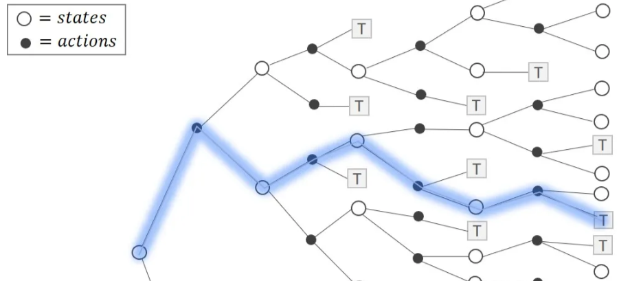
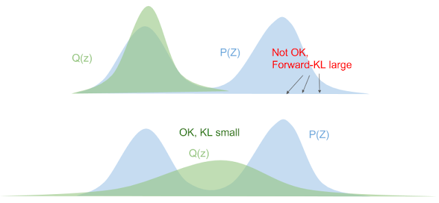
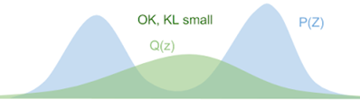
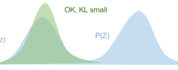
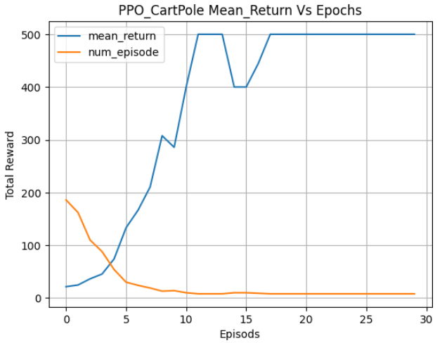
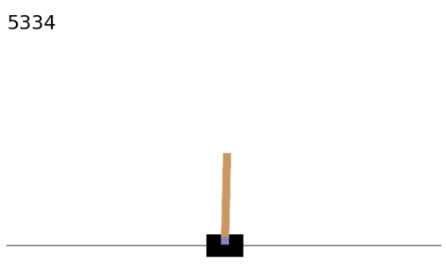
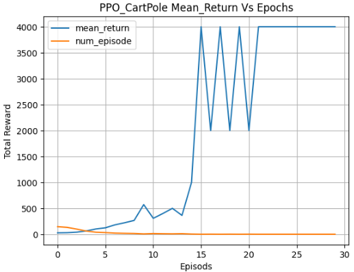

# 4.5 Proximal Policy Optimization(PPO)

**학습 목표**

- On-policy Actor-Critic 이 불안정한 근본 원인(한 번의 sample, 방문하지 않은 $(s,a)$, 비볼록 $J(\theta)$)과
  "정책을 천천히 바꾸자" 는 처방의 계보 — CPI → TRPO → PPO — 를 설명할 수 있다.
- Entropy · Cross Entropy · KL divergence 의 정의와 관계를 유도하고, Forward KL(Mean-seeking)과
  Reverse KL(Mode-seeking)이 각각 supervised learning 과 policy optimization 에서 왜 쓰이는지 말할 수 있다.
- Clipped Surrogate Loss $L^{CLIP}$ 이 $L^{CPI}$ 보다 보수적인 이유와, GAE(Generalized Advantage Estimator)
  로 advantage 를 만드는 방법을 식으로 쓸 수 있다.
- PPO 최종 목적함수 $L^{CLIP+VF+S}$ 와 PPO-Clip 알고리즘을 Keras 로 구현하고, KL 기반 early stopping 과
  hyper parameter 의 영향을 실험할 수 있다.

**이 절의 구성**

- 4.5.1 Actor-Critic 의 불안정한 학습 문제의 원인
- 4.5.2 CPI → TRPO → PPO
- 4.5.3 Entropy, Cross Entropy, KL divergence 개념 정리
- 4.5.4 KL divergence 의 성질 — Forward · Reverse · JS
- 4.5.5 최적화 목적함수로서의 $D_{KL}$ — Mean-seeking 과 Mode-seeking
- 4.5.6 PPO 목적함수(1) — Clipped Surrogate Loss $L^{CLIP}(\theta)$
- 4.5.7 좋은 $\hat{A}_t$ 만들기(2) — GAE
- 4.5.8 PPO 최종 목적함수와 PPO Algorithm
- 4.5.9 PPO Algorithm process — PPO-Clip
- 4.5.10 실습 4.5.1 — PPO 로 CartPole 학습
- 4.5.11 실습과제 — Hyper parameter tuning
- 4.5.12 정리 — Review

---

## 4.5.1 Actor-Critic 의 불안정한 학습 문제의 원인
<!-- 슬라이드 416 -->

Actor-Critic 의 학습이 불안정한 것은 **On-policy Policy Optimization 에서 1 번의 sample 만 사용하기
때문**이다. Trajectory 를 따라 학습을 진행하는데 —



- **방문하지 않은 $(s,a)$ 에 대한 $Q_\theta(s,a)$ 추산이 부정확하다.** 한 trajectory 는 tree 의 한 경로일 뿐이고,
  나머지 경로의 가치는 근사로 채워진다.
- **$Q_\theta(s,a)$ 추산이 정확하다 해도 $J(\theta)$ 이 볼록 함수가 아니다** — 잘못된 최적값을 찾을 가능성이
  높다. 한 sample 의 gradient 가 정책을 크게 밀면 그 방향이 국소 최적일 수 있다.
- **정책함수 $\pi_\theta$ 가 천천히 바뀌면 이 문제가 줄어들 수 있다**(TD3 의 delayed policy update 에서
  언급되었고, A3C 에도 적용 가능하다).

정리하면 — Actor-Critic 의 불안정한 학습 문제는 **정책함수 $\pi_\theta$ 를 천천히 바꾸어** 해결할 수 있다.
그 이론적 근거가 **Conservative Policy Iteration(CPI)** — "Approximately Optimal Approximate Reinforcement
Learning"(2002), "정책개선정리" 를 만족하는 정책최적화기법 연구 — 다.

---

## 4.5.2 CPI → TRPO → PPO
<!-- 슬라이드 417~418 -->

**PPO(Proximal Policy Optimization Algorithm)** 에 이르는 계보는 셋이다.

- **Conservative Policy Iteration(CPI, 2002)** — "정책개선정리" 를 만족하는 정책최적화기법의 근사기법.
- **Trust Region Policy Optimization(TRPO, 2015)** — CPI 의 가정 일부가 비현실적이어서 그 일부를
  완화하고, **제약조건이 있는 최적화 문제**로 변경했다(참고자료:
  https://hiddenbeginner.github.io/rl/2022/09/18/trpo.html).
- **Proximal Policy Optimization Algorithm(PPO, 2017)** — TRPO 의 제약조건은 Deep Learning 에 적용하기
  어렵다. 근사를 통해 **TRPO 의 제약조건이 없는 최적화 방법**을 제시했다. 여기에 Advantage 를 잘
  추산하는 "GAE(2016)" 기법을 적용했다.

PPO 는 **정책함수 $\pi_\theta$ 를 천천히 바꾸어 Actor-Critic 불안정성을 극복하는 개선된 알고리즘**이다.

### CPI 의 Objective function — Surrogate loss

$$
L^{CPI}(\theta) = \max_\theta \hat{E}\left[ \frac{\pi_\theta(a_t \mid s_t)}{\pi_{\theta_{old}}(a_t \mid s_t)} \hat{A}_t \right]
$$

**현재의 $\pi_\theta$ 와 이전 $\pi_{\theta_{old}}$ 의 비율에 Advantage 값을 곱한 값의 기댓값이 최대가 되도록 $\theta$ 를
수정**한다. Advantage 가 양인 행동은 비율을 키우고(더 자주), 음인 행동은 비율을 줄인다(덜 자주). 대리(surrogate)
loss 라 부르는 이유는 실제 목적 $J(\theta)$ 대신 이 식을 최적화하기 때문이다. 그런데 이 식은 **monotonous
improvement 를 보장할 수 없다** — 급격한 정책 변화를 제어하지 못하는 식이어서 급격한 변동성이 발생한다. 비율은
얼마든지 커질 수 있다.

### TRPO — CPI loss 에 제약 조건 추가

현재의 $\pi_\theta$ 분포와 이전 $\pi_{\theta_{old}}$ 분포 간 **거리가 너무 커지지 않도록** 제한하자 — Penalty
$\beta\, KL[\pi_{\theta_{old}}(\cdot \mid s_t), \pi_\theta(\cdot \mid s_t)]$ 를 추가한다.

$$
L^{TRPO}(\theta) = \max_\theta \hat{E}\left[ \frac{\pi_\theta(a_t \mid s_t)}{\pi_{\theta_{old}}(a_t \mid s_t)} \hat{A}_t
- \beta\, KL\big[ \pi_{\theta_{old}}(\cdot \mid s_t), \pi_\theta(\cdot \mid s_t) \big] \right]
$$

근데 이 조건하에서 최적화 문제를 푸는 것은 **너무 어렵다.** 최적화 과정이 느리고($\theta$ 개수의 제곱에
비례) 메모리도 많이 필요해서 구현 및 사용이 어렵다. 그래서 PPO 는 KL 항 대신 더 단순한 장치를 찾는다 —
4.5.6 절. 그 전에 KL divergence 가 무엇인지 정리한다.

---

## 4.5.3 Entropy, Cross Entropy, KL divergence 개념 정리
<!-- 슬라이드 419 -->

**Entropy** : 정보량의 기대값(평균 정보량), 무질서도, 불확실성.

- 확률이 적은 사건($p$)의 발생 정보는 정보량이 많은 것이다 → 정보량은 발생 확률과 반비례한다($1/p$).
- 독립사건의 발생 확률은 곱, 두 사건의 정보량은 합이므로 → $\log(1/p) = -\log p$ : **정보량**.
- Entropy : 모든 사건의 평균 정보량(기대값) → $\sum_i p_i \log \frac{1}{p_i} = -\sum_i p_i \log p_i = H(p)$.

$$
\text{정보량} \Rightarrow \frac{1}{p} \Rightarrow \log\frac{1}{p} \Rightarrow \sum_i p_i \log\frac{1}{p_i}
\Rightarrow -\sum_i p_i \log p_i = H(p) = \text{Entropy}
$$

**KL divergence** : 정보 손실량의 기대값.

받은 정보 $q$ 와 보낸 정보 $p$ 간 정보량의 차이(정보의 손실량)를 $\Delta_i$ 라 하면, $\Delta_i$ 의 기대값을
$D_{KL}$ 이라 한다.

$$
\Delta_i = -\log q_i + \log p_i \;\Rightarrow\;
E(\Delta_i) = \sum_i p_i \Delta_i = \underbrace{-\sum_i p_i \log q_i}_{\text{수신 entropy}} + \underbrace{\sum_i p_i \log p_i}_{-\,\text{송신 entropy}} = D_{KL}(p \,\|\, q)
$$

- $P$ 의 분포 추정 : $q$ 의 모수를 수정하면서 $D_{KL}$ 이 최소가 되게 하는 것.
- 알고 있는 $q$ 로 모르는 $p$ 를 설명한다(Variational Inference).

**Cross Entropy** : 분포 $p, q$ 의 관계를 $D_{KL}$ 로 표현 — $q$ 의 정보량을 $p$ 로 평균한 것.

- $D_{KL}$ 에서 뒷항($\sum_i p_i \log p_i$)은 $q$ 와 무관하므로 **앞 항만 최소화**시키면 된다
  ($\because D_{KL}(p \,\|\, q) = H(p,q) - H(p)$).
- 앞 항 : CrossEntropy(CE) $H(p,q) = -\sum_i p_i \log q_i$.
- 다르게 표현하면 $H(p,q) = -E_p[\log q] = -\sum_i p_i \log q_i = H(p) + D_{KL}(p \,\|\, q)$.

분류 문제에서 CE 를 loss 로 쓰는 것과 $D_{KL}$ 을 최소화하는 것이 같은 일이라는 뜻이다.

---

## 4.5.4 KL divergence 의 성질 — Forward · Reverse · JS
<!-- 슬라이드 420 -->

**KL(Kullback-Leibler) divergence** : 수신 정보량과 송신 정보량의 기대값 차. **작은 $q$ 에 예민**하다.

$$
KL(P \,\|\, Q) = \sum_z p(z) \log\frac{p(z)}{q(z)} = E_{p(z)}\left[ \log\frac{p(z)}{q(z)} \right], \qquad
KL(Q \,\|\, P) = \sum_z q(z) \log\frac{q(z)}{p(z)} = E_{q(z)}\left[ \log\frac{q(z)}{p(z)} \right]
$$

- 같으면 '0', 분포가 다르면 커진다.
- $D_{KL}(p \,\|\, q)$ : **$q$ 가 작을 때 $p$ 도 작을 것.** $p$ 가 큰 곳에서 $q$ 가 0 에 가까우면 $\log(p/q)$ 가 폭발한다.



- $D_{KL}(q \,\|\, p)$ : **$p$ 가 작을 때 $q$ 도 작을 것.** $q$ 가 큰 곳에서 $p$ 가 0 에 가까우면 커진다.


- **JS Divergence** $= \frac{1}{2}\big( D_{KL}(p \,\|\, q) + D_{KL}(q \,\|\, p) \big)$ — 두 방향을 평균해 대칭으로 만든 것이다.

---

## 4.5.5 최적화 목적함수로서의 $D_{KL}$ — Mean-seeking 과 Mode-seeking
<!-- 슬라이드 421 -->

$D_{KL}(P \,\|\, Q)$ 는 다양한 ML 에서 loss 함수로 사용된다. $D_{KL}(P \,\|\, Q) \neq D_{KL}(Q \,\|\, P)$ 이므로
**어느 쪽을 최소화하느냐에 따라 얻는 해가 다르다.** $P$ 는 Multi-modal, $Q$ 는 Uni-modal 분포라 할 때 —

**Forward KL : $D_{KL}(P \,\|\, Q_\theta)$, Mean-seeking**

$$
\begin{aligned}
\min_\theta D_{KL}(P \,\|\, Q_\theta) &= \min_\theta E_{x \sim p(x)}\left[ -\log Q_\theta(x) \right] - H(P(x)) \quad \text{(상수 제거)} \\
&= \min_\theta E_{x \sim p(x)}\left[ -\log Q_\theta(x) \right] \\
&= \max_\theta E_{x \sim p(x)}\left[ \log Q_\theta(x) \right]
\end{aligned}
$$

데이터($x \sim p$)가 있는 모든 곳에서 $Q_\theta$ 의 log 확률을 높여야 하므로, $Q$ 는 두 봉우리 **사이**에
넓게 앉는다 — **Supervised learning 에서 최적화 조건 탐색**이 이것이다(maximum likelihood).



**Reverse KL : $D_{KL}(Q_\theta \,\|\, P)$, Mode-seeking**

$$
\begin{aligned}
\min_\theta D_{KL}(Q_\theta \,\|\, P) &= \min_\theta E_{x \sim Q_\theta}\left[ -\log P(x) \right] - H(Q_\theta(x)) \\
&= \max_\theta E_{x \sim Q_\theta}\left[ \log P(x) \right] + H(Q_\theta(x))
\end{aligned}
$$

$Q_\theta$ 가 표본을 내는 곳에서 $P$ 가 커야 하므로 $Q$ 는 한 봉우리에 **집중**한다. 여기에
$H(Q_\theta(x)) \uparrow$ 항이 붙어 **분포를 넓게 하는 효과**를 낸다 — **Policy Optimization 에서 최적화 조건
탐색**이 이것이다. 정책 $Q_\theta$ 가 행동을 내고, 그 행동이 좋은 곳($P$ 가 큰 곳)에 확률을 모으되 entropy
로 너무 좁아지지 않게 한다. 4.4 절의 entropy regularization 이 왜 자연스러운지 여기서 보인다.



---

## 4.5.6 PPO 목적함수(1) — Clipped Surrogate Loss $L^{CLIP}(\theta)$
<!-- 슬라이드 422 -->

비율을 $r_t(\theta)$ 로 줄여 쓰면 세 목적함수는 —

$$
\begin{aligned}
\text{CPI} :\quad & L^{CPI}(\theta) = \max_\theta \hat{E}\left[ \frac{\pi_\theta(a_t \mid s_t)}{\pi_{\theta_{old}}(a_t \mid s_t)} \hat{A}_t \right] = \max_\theta \hat{E}\left[ r_t(\theta)\hat{A}_t \right] \\
\text{TRPO} :\quad & L^{TRPO}(\theta) = \max_\theta \hat{E}\left[ r_t(\theta)\hat{A}_t - \beta\, KL\big[ \pi_{\theta_{old}}(\cdot \mid s_t), \pi_\theta(\cdot \mid s_t) \big] \right] \\
\text{PPO} :\quad & L^{CLIP}(\theta) = \hat{E}\left[ \min\big( r_t(\theta)\hat{A}_t,\; \operatorname{clip}(r_t(\theta), 1-\epsilon, 1+\epsilon)\hat{A}_t \big) \right]
\end{aligned}
$$

- $\tilde{r}_t(\theta) = \operatorname{clip}(r_t(\theta), 1-\epsilon, 1+\epsilon)$, $\therefore 1-\epsilon \leq \tilde{r}_t(\theta) \leq 1+\epsilon$ —
  비율을 $[1-\epsilon, 1+\epsilon]$ 로 잘라 정책이 한 번에 그 이상 움직여도 이득이 없게 한다.
- $\min(r_t(\theta)\hat{A}_t, \tilde{r}_t(\theta)\hat{A}_t)$ : **작은 변화를 선택**한다. $\hat{A}_t > 0$ 이면 비율을 키우는
  쪽이 보상되지만 $1+\epsilon$ 에서 멈추고, $\hat{A}_t < 0$ 이면 비율을 줄이는 쪽이 보상되지만 $1-\epsilon$ 에서 멈춘다.
- $L^{CLIP}(\theta) \leq L^{CPI}(\theta)$, $\therefore L^{CLIP}(\theta)$ 가 $\pi_\theta$ 를 **보수적으로 update** 하게 된다.

![Linear interpolation factor(θ_old 에서 새 θ 방향으로 0 → 1 → 그 너머)에 따른 네 곡선. 파랑 Ê_t[KL_t] 는 0 에서 시작해 단조 증가, 주황 L^CPI = Ê_t[r_t A_t] 는 계속 커지고, 초록 Ê_t[clip(r_t, 1−ε, 1+ε)A_t] 는 1 근처에서 평탄해지며, 빨강 L^CLIP = Ê_t[min(r_t A_t, clip(...)A_t)] 는 1 근처에서 최댓값을 찍고 그 뒤로 떨어진다.](images/s422_01.png)

그림에서 $L^{CPI}$(주황)는 정책을 멀리 밀수록 계속 커진다 — 실제 성능과 무관하게. $L^{CLIP}$(빨강)은
$\theta_{old}$ 근처(interpolation factor 1)에서 최대가 되고 그 너머로는 오히려 감소하므로, 최적화가 스스로
멈춘다. KL 제약 없이 같은 효과를 얻는 것이 PPO 의 핵심이다.

---

## 4.5.7 좋은 $\hat{A}_t$ 만들기(2) — GAE
<!-- 슬라이드 423 -->

PPO 에서 적용할 Advantage function — **GAE(Generalized Advantage Estimator)** 기법("High-Dimensional
Continuous Control Using Generalized Advantage Estimation"). n-step TD error 를 $\lambda$ 로 가중 평균한다.

- 1-step TD-error Advantage function : $\hat{A}_t^{(1)} := \delta_t = r_t + \gamma V(s_{t+1}) - V(s_t)$
- 2-step TD-error Advantage function : $\hat{A}_t^{(2)} := \delta_t + \gamma\delta_{t+1} = \big( r_t + \gamma r_{t+1} + \gamma^2 V(s_{t+2}) \big) - V(s_t)$
- …
- $\infty$-step TD-error Advantage function : $\hat{A}_t^{(\infty)} := \sum_{l=0}^{\infty} \gamma^l \delta_{t+l} = \sum_{l=0}^{\infty} \gamma^l r_{t+l} - V(s_t)$ (MC)
- **GAE($\gamma, \lambda$)** : TD($\lambda$) Advantage function

$$
\hat{A}_t^{GAE(\gamma,\lambda)} := (1-\lambda)\big( \hat{A}_t^{(1)} + \lambda\hat{A}_t^{(2)} + \lambda^2\hat{A}_t^{(3)} + \cdots \big)
= \sum_{l=0}^{\infty} (\gamma\lambda)^l \delta_{t+l}, \qquad \delta_t = r_t + \gamma V(s_{t+1}) - V(s_t)
$$

$\lambda = 0$ 이면 1-step TD(편향 크고 분산 작음), $\lambda = 1$ 이면 MC(편향 없고 분산 큼) — 2.5 절에서 본
bias-variance 저울의 손잡이가 $\lambda$ 다.

**Truncated GAE 적용** : $\lambda = 1$, $T \ll$ episode length — 에피소드 끝까지 가지 않고 $T$ step 에서 자른다.

$$
\hat{A}_t = \hat{A}_t(\gamma, 1) := \delta_t + \gamma\delta_{t+1} + \cdots + \gamma^{T-t+1}\delta_{T-1}
= \sum_{l=t}^{T-1} \gamma^{l-t} \delta_l, \qquad \delta_t = r_t + \gamma V(s_{t+1}) - V(s_t)
$$

$T$ 번째 상태의 가치는 $V(s_T)$ 로 bootstrap 한다(마지막 $\delta_{T-1}$ 안에 들어 있다). 실습 코드는 $\lambda = 0.97$
로 GAE 를 쓴다.

---

## 4.5.8 PPO 최종 목적함수와 PPO Algorithm
<!-- 슬라이드 424 -->

**PPO 최종 목적함수**

$$
L_t^{CLIP+VF+S}(\theta) = E_t\Big[ L_t^{CLIP}(\theta) - c_1 L_t^{VF}(\theta) + c_2 S[\pi_\theta](s_t) \Big]
$$

- $L_t^{VF}(\theta)$ : **Value Function Loss** — TD 로 $V_\theta(s)$ 를 최적화하기 위한 loss. 일반적으로는
  $V_\phi(s)$ 처럼 actor, critic 을 다른 parameter 로 표시하고 분리된 optimizer 로 최적화한다. 논문 및 구현에서는
  (actor, critic 을) 하나의 optimizer 로 학습한다 — 그래서 $\theta$ 하나로 썼다. **작을수록 좋다**(빼는 항).
- $S[\pi_\theta](s_t)$ : 정책함수 $\pi_\theta$ 의 현재 상태에 대한 **action entropy**, $H(\pi_\theta(\cdot \mid s_t))$.
  Exploration 을 장려하기 위한 term 으로 작용한다. **적당히 큰 값이 좋다**(더하는 항).

**PPO Algorithm** — 각 iteration 에서 $N$ 개 actor 가 병렬로 각각 $T$ 개의 trajectory 를 수집하고, $NT$ 개의
time step 에서 surrogate Loss 로 최적화한다(mini-batch $M$, $K$ epochs).

> **[ Algorithm 1 Actor-Critic Style ]**
>
> Init. $\pi_\theta$(policy-net), $V_\phi$(value-net) parameter
> **for** iteration $= 1, 2, \dots$ **do**
> &nbsp;&nbsp; **for** actor $= 1, 2, \dots, N$ **do** : 다중 agent(actor)
> &nbsp;&nbsp;&nbsp;&nbsp; Run policy $\pi_{\theta_{old}}$ in environment for $T$ timesteps
> &nbsp;&nbsp;&nbsp;&nbsp; If the collected trajectories are batch size : break
> &nbsp;&nbsp; Compute Advantage estimates $\hat{A}_1, \dots, \hat{A}_T$ (using GAE)
> &nbsp;&nbsp; $K$ iteration :
> &nbsp;&nbsp;&nbsp;&nbsp; $\theta \leftarrow \theta + \nabla_\theta L_t^{CLIP}$
> &nbsp;&nbsp;&nbsp;&nbsp; $\phi \leftarrow \phi - \nabla_\phi L_t^{VF}$
> **end for**

A3C 와 달리 수집과 학습이 분리된다 — 먼저 $NT$ step 을 모으고, 그 batch 로 $K$ 번 갱신한다. 한 batch 를
여러 번 쓸 수 있는 이유가 바로 $L^{CLIP}$ 이다 — 비율이 clip 범위를 벗어나면 gradient 가 0 이 되어 오래된
데이터로 정책을 너무 멀리 끌고 가지 않는다.

---

## 4.5.9 PPO Algorithm process — PPO-Clip
<!-- 슬라이드 425~426 -->

**PPO Algorithm process** — $L^{CLIP}(\theta) = \hat{E}[\min(r_t(\theta)\hat{A}_t, \operatorname{clip}(r_t(\theta), 1-\epsilon, 1+\epsilon)\hat{A}_t)]$
와 $L^V(\theta)$(Value Function Loss, TD 로 $V_\theta(s)$ 를 최적화하기 위한 loss). Actor, Critic net 이 분리되면
$L^V(\theta) \to L^V(\phi)$ or $L^V(\mu)$.


논문의 알고리즘(Algorithm 1 PPO-Clip)을 옮기면 —

> **Algorithm 1 PPO-Clip**
>
> 1: Input: initial policy parameters $\theta_0$, initial value function parameters $\phi_0$
> 2: **for** $k = 0, 1, 2, \dots$ **do**
> 3: &nbsp;&nbsp; Collect set of trajectories $\mathcal{D}_k = \{\tau_i\}$ by running policy $\pi_k = \pi(\theta_k)$ in the environment.
> 4: &nbsp;&nbsp; Compute rewards-to-go $\hat{R}_t$.
> 5: &nbsp;&nbsp; Compute advantage estimates, $\hat{A}_t$ (using any method of advantage estimation) based on the current value function $V_{\phi_k}$.
> 6: &nbsp;&nbsp; Update the policy by maximizing the PPO-Clip objective:
>
> $$
> \theta_{k+1} = \arg\max_\theta \frac{1}{|\mathcal{D}_k| T} \sum_{\tau \in \mathcal{D}_k} \sum_{t=0}^{T}
> \min\left( \frac{\pi_\theta(a_t \mid s_t)}{\pi_{\theta_k}(a_t \mid s_t)} A^{\pi_{\theta_k}}(s_t, a_t),\;
> g\big(\epsilon, A^{\pi_{\theta_k}}(s_t, a_t)\big) \right),
> $$
>
> &nbsp;&nbsp;&nbsp;&nbsp; typically via stochastic gradient ascent with Adam.
> 7: &nbsp;&nbsp; Fit value function by regression on mean-squared error:
>
> $$
> \phi_{k+1} = \arg\min_\phi \frac{1}{|\mathcal{D}_k| T} \sum_{\tau \in \mathcal{D}_k} \sum_{t=0}^{T} \big( V_\phi(s_t) - \hat{R}_t \big)^2,
> $$
>
> &nbsp;&nbsp;&nbsp;&nbsp; typically via some gradient descent algorithm.
> 8: **end for**

여기서 $g(\epsilon, A) = (1+\epsilon)A$ ($A \geq 0$), $(1-\epsilon)A$ ($A < 0$) 로, clip 항을 advantage 의 부호에 따라
미리 계산한 것이다. 실습 코드의 `tf.where` 가 정확히 이 $g$ 다. 다음 실습은 이 여덟 줄을 한 줄씩 코드로 옮긴다.

---

## 4.5.10 실습 4.5.1 — PPO 로 CartPole 학습
<!-- 슬라이드 427~433 -->

> 노트북: `code/4.5.1.PPO_cartpole.ipynb`
> [](https://colab.research.google.com/github/AI-BoostCamp/ReinforcementLearning/blob/main/code/4.5.1.PPO_cartpole.ipynb)
> PyTorch 구현: `code/4.5.1.pt.PPO_cartpole.ipynb`
> [](https://colab.research.google.com/github/AI-BoostCamp/ReinforcementLearning/blob/main/code/4.5.1.pt.PPO_cartpole.ipynb)

Keras 공식 예제(https://keras.io/examples/rl/ppo_cartpole/)를 바탕으로 한다. CartPole-v1(상태 4, 행동 2).

### 1: Input — Actor Network, Critic Network

`hidden_sizes = (64, 64)`, 활성함수 `tanh`. Actor 는 행동 수만큼의 **logit** 을 내고(softmax 는 뒤에서), Critic 은
스칼라 $V(s)$ 를 낸다(`Reshape(())` 로 차원을 없앤다).

```python
hidden_sizes = (64, 64)

def Actor():
    inputs = keras.Input(shape=(state_dimensions,))
    x = layers.Dense(units=hidden_sizes[0], activation="tanh")(inputs)
    x = layers.Dense(units=hidden_sizes[1], activation="tanh")(x)
    outputs = layers.Dense(units=num_actions)(x)
    return keras.Model(inputs=inputs, outputs=outputs)

def Critic():
    inputs = keras.Input(shape=(state_dimensions,))
    x = layers.Dense(units=hidden_sizes[0], activation="tanh")(inputs)
    x = layers.Dense(units=hidden_sizes[1], activation="tanh")(x)
    x = layers.Dense(units=1)(x)
    outputs = layers.Reshape(target_shape=())(x)
    return keras.Model(inputs=inputs, outputs=outputs)
```

| Actor Network | Output Shape | Param # | | Critic Network | Output Shape | Param # |
|---|---|---|---|---|---|---|
| input_layer_4 (InputLayer) | (None, 4) | 0 | | input_layer_5 (InputLayer) | (None, 4) | 0 |
| dense_12 (Dense) | (None, 64) | 320 | | dense_15 (Dense) | (None, 64) | 320 |
| dense_13 (Dense) | (None, 64) | 4,160 | | dense_16 (Dense) | (None, 64) | 4,160 |
| dense_14 (Dense) | (None, 2) | 130 | | dense_17 (Dense) | (None, 1) | 65 |
| | | | | reshape_2 (Reshape) | (None) | 0 |
| **Total params** | | **4,610** | | **Total params** | | **4,545** |

3 장의 CartPole 실습들에 비해 아주 작은 network 다.

### 2~3: Collect set of trajectories — Epoch loop

`epochs` 만큼 반복하며, 각 epoch 에서 **`steps_per_epoch = 4000` step 의 trajectory** 를 모은다. 그동안 에피소드가
여러 번 끝나고 다시 시작된다 — 한 epoch 이 알고리즘의 $\mathcal{D}_k$ 다.

```python
buffer = Buffer(state_dimensions, steps_per_epoch)
actor = Actor()
critic = Critic()

epochs = 30

# Iterate over the number of epochs
state, _ = env.reset()
reward, done = 0, 0

mean_return = []
num_episode = []
for epoch in range(epochs): ## Epoch Loop
    sum_return = 0     # epoch당 보상의 합
    num_episodes = 0   # epoch당 수집된 episode
    episode_return = 0 # 한 episode의 보상합 = episode 길이
    for t in range(steps_per_epoch): # T=4000 trajectory
        state = state.reshape(1, -1)
        logits, action = sample_action(state) #logit, sampled action
        state_new, reward, done, _, _ = env.step(action[0].numpy())
        episode_return += reward
        value_t = critic(state)
        logprobability_t = logprobabilities(logits, action) # 선택된 행동에 대한 로그 확률
        buffer.store(state, action, reward, value_t, logprobability_t)
        state = state_new
```

행동은 actor 의 logit 에서 **sampling** 한다 — `tf.random.categorical(logits, 1)` 은 logit(= log 확률)을 받아
범주 하나를 뽑는다.

```python
# Sample action from actor
@tf.function
def sample_action(state):
    logits = actor(state) # tanh():(1,2)
    action = tf.squeeze(tf.random.categorical(logits, 1), axis=1)# 0 or 1:(1,)
    return logits, action #(1,2),(1,)
```

### logprobability_t — 선택한 행동의 log 확률

`logprobability_t` 는 sampled action 의 log prob., 즉 $\log \pi_{\theta_{old}}(a_t \mid s_t)$ 다. 나중에 비율
$r_t(\theta)$ 를 계산할 때 분모가 된다. 모든 행동의 log 확률을 `log_softmax` 로 구하고 one-hot 으로 선택한 행동의
것만 남긴다.

```python
## 선택된 행동에 대한 로그 확률
def logprobabilities(logits, a): #(bs,2),(bs,1)
    # 모든 행동에 대한 로그 확률 계산
    logprobabilities_all = tf.nn.log_softmax(logits)
    logprobability = tf.reduce_sum( # 선택한 행동의 로그 확률 추출
        tf.one_hot(a, num_actions) * logprobabilities_all, axis=1 )
    return logprobability #(bs,)
```

**Log softmax** : softmax 대신 log softmax 를 사용하는 경우 — 수치적 효과가 softmax 보다 좋으며 Gradient
optimization 을 향상시킨다. softmax 계산에 포함된 exp, divide 로 인한 underflow, overflow 문제를 방지한다.

```python
x = np.array([-2.0,-1.0,0.,1.,2.])
print(f'logit \t\t: {x}')
y = tf.nn.softmax(x)
print(f'softmax(x) \t: {y}')
y = tf.nn.log_softmax(x) # log(softmax(x))
print(f'log_softmax(x) \t: {y}')
```

```
logit           : [-2. -1.  0.  1.  2.]
softmax(x)      : [0.01165623 0.03168492 0.08612854 0.23412166 0.63640865]
log_softmax(x)  : [-4.4519144 -3.4519144 -2.4519144 -1.4519144 -0.4519144]
```

log_softmax 는 logit 에서 상수($\log\sum e^{x_i}$)를 뺀 것이라 간격이 그대로 보존된다.

### 4~5: Compute rewards-to-go $\hat{R}_t$ · advantage estimates $\hat{A}_t$

에피소드가 끝나거나(`done`), epoch 의 마지막 step 이거나, `episode_return > steps_limit` 이면 trajectory 를
마감한다. 끝난 에피소드면 bootstrap 값 `last_value = 0`, 아니면 `critic(state)` 다.

```python
        # Finish trajectory if reached to a terminal state
        if done or (t == steps_per_epoch - 1)or (episode_return > steps_limit) :
            last_value = 0 if done else critic(state.reshape(1, -1))
            buffer.finish_trajectory(last_value) # Computing Advantage values
            sum_return += episode_return
            num_episodes += 1
            state, _ = env.reset()
            episode_return = 0
```

`finish_trajectory()` 가 GAE 다 — $\delta_t = r_t + \gamma V(s_{t+1}) - V(s_t)$ 를 한 번에 벡터로 만들고,
$\hat{A}_t = \delta_t + (\gamma\lambda)\delta_{t+1} + \cdots + (\gamma\lambda)^{T-t-1}\delta_{T-1}$ 을 감가 누적합으로 계산한다.
rewards-to-go $\hat{R}_t$ 는 같은 함수에 보상을 넣어 얻는다(critic 의 target).

```python
## 감가된 누적 합 Gt
def discounted_cumulative_sums(x, discount):
    result = np.zeros_like(x, dtype=np.float64)
    running_sum = 0
    for t in reversed(range(len(x))):
        running_sum = x[t] + discount * running_sum
        result[t] = running_sum
    return result
```

```python
    def finish_trajectory(self, last_value=0):
        # Finish the trajectory by computing advantage estimates and rewards-to-go
        path_slice = slice(self.trajectory_start_index, self.pointer)
        rewards = np.append(self.reward_buffer[path_slice], last_value)
        values = np.append(self.value_buffer[path_slice], last_value)
        deltas = rewards[:-1] + self.gamma * values[1:] - values[:-1] # TD error
        self.advantage_buffer[path_slice] = discounted_cumulative_sums(deltas, self.gamma * self.lam )
        self.return_buffer[path_slice] = discounted_cumulative_sums(rewards, self.gamma )[:-1]
        self.trajectory_start_index = self.pointer
```

`Buffer.get()` 은 epoch 의 모든 데이터를 돌려주면서 advantage 를 **정규화**한다(평균 0, 표준편차 1) —
3.5 절의 Return Normalization 과 같은 안정화 장치다.

### 6: Update the policy by maximizing the PPO-Clip objective

$$
\theta_{k+1} = \arg\max_\theta \frac{1}{|\mathcal{D}_k| T} \sum_{\tau \in \mathcal{D}_k} \sum_{t=0}^{T}
\min\left( \frac{\pi_\theta(a_t \mid s_t)}{\pi_{\theta_k}(a_t \mid s_t)} A^{\pi_{\theta_k}}(s_t, a_t),\; g\big(\epsilon, A^{\pi_{\theta_k}}(s_t, a_t)\big) \right)
$$

Hyper parameter 와 optimizer — actor 와 critic 은 **분리된 Adam** 을 쓴다.

```python
# Hyperparameters of the PPO algorithm
steps_per_epoch = 4000
steps_limit = 500
epochs = 30
gamma = 0.99
lam = 0.97
clip_ratio = 0.2
policy_learning_rate = 3e-4
value_function_learning_rate = 1e-3
train_policy_iterations = 80
train_value_iterations = 80
target_kl = 0.01
```

```python
policy_optimizer = keras.optimizers.Adam(learning_rate=policy_learning_rate)
value_optimizer = keras.optimizers.Adam(learning_rate=value_function_learning_rate)
```

buffer 를 꺼내 정책을 최대 `train_policy_iterations = 80` 번 갱신한다. 매 갱신 뒤 이전 정책과의 KL 을 재서
`1.5 * target_kl` 을 넘으면 **early stopping** — TRPO 의 $\beta\, KL[\pi_{\theta_{old}}(\cdot \mid s_t), \pi_\theta(\cdot \mid s_t)]$
제약을 loss 가 아니라 **멈춤 조건**으로 쓴 것이다.

```python
    # Get values from the buffer
    (state_buffer, action_buffer, advantage_buffer, return_buffer,
     logprobability_buffer, ) = buffer.get()
    # Update the policy (and implement early stopping using KL divergence
    for _ in range(train_policy_iterations): # 80
        kl = train_policy(
            state_buffer, action_buffer, logprobability_buffer, advantage_buffer )
        if kl > 1.5 * target_kl:
            print(f'KL:{kl:0.4f}>1.5*{target_kl},Early Stopping(kl)')
            break
```

`train_policy()` 가 $L^{CLIP}$ 이다. 한 줄씩 식과 대응시키면 —

| 식 | 코드 |
|---|---|
| $r_t(\theta) = \dfrac{\pi_\theta(a_t \mid s_t)}{\pi_{\theta_{old}}(a_t \mid s_t)} = \exp\big(\log\pi_\theta(a_t \mid s_t) - \log\pi_{\theta_{old}}(a_t \mid s_t)\big)$ | `ratio = tf.exp(logprobabilities(actor(state_buffer), action_buffer) - logprobability_buffer)` |
| $g(\epsilon, \hat{A}_t)$ : If $\hat{A}_t > 0$ : $m\hat{A}_t \leftarrow 1.2\hat{A}_t$, If $\hat{A}_t < 0$ : $m\hat{A}_t \leftarrow 0.8\hat{A}_t$ | `min_advantage = tf.where(advantage_buffer > 0, (1 + clip_ratio) * advantage_buffer, (1 - clip_ratio) * advantage_buffer)` |
| $-\hat{E}[\min(r_t\hat{A}_t, \text{clipped}(\hat{A}_t))]$ | `policy_loss = -tf.reduce_mean(tf.minimum(ratio * advantage_buffer, min_advantage))` |
| $D_{KL}(\pi_{\theta_{old}} \,\|\, \pi_\theta) = \sum(\log\pi_{\theta_{old}} - \log\pi_\theta)$ — 이전 policy 와 학습된 policy 간의 KLD | `kl = tf.reduce_mean(logprobability_buffer - logprobabilities(...))` |

$D_{KL}(p \,\|\, q) = E_p[\log p - \log q]$ 이고, buffer 의 표본은 $\pi_{\theta_{old}}$ 에서 나왔으므로 표본 평균이
그 기댓값이다.

```python
# Train the policy by maxizing the PPO-Clip objective
@tf.function
def train_policy(state_buffer, action_buffer, logprobability_buffer, advantage_buffer ):
    with tf.GradientTape() as tape:
        ratio = tf.exp( # r = exp( log(pi(at|st))-log(pi_old(at|st)) )
            logprobabilities(actor(state_buffer), action_buffer)-logprobability_buffer )
        min_advantage = tf.where(
            advantage_buffer > 0,
            (1 + clip_ratio) * advantage_buffer,  # if A> 0 : mA<-1.2*A
            (1 - clip_ratio) * advantage_buffer, )# if A<=0 : mA<-0.8*A
        policy_loss = -tf.reduce_mean(
            tf.minimum(ratio * advantage_buffer, min_advantage) )
    policy_grads = tape.gradient(policy_loss, actor.trainable_variables)
    policy_optimizer.apply_gradients(zip(policy_grads, actor.trainable_variables))

    kl = tf.reduce_mean(
        logprobability_buffer - logprobabilities(actor(state_buffer), action_buffer) )
    kl = tf.reduce_sum(kl)
    return kl
```

`tf.where(cond, c1, c2)` 는 조건이 True 인 자리는 `c1`, False 인 자리는 `c2` 에서 가져온다.

### 7: Fit value function by regression on mean-squared error

$$
\phi_{k+1} = \arg\min_\phi \frac{1}{|\mathcal{D}_k| T} \sum_{\tau \in \mathcal{D}_k} \sum_{t=0}^{T} \big( V_\phi(s_t) - \hat{R}_t \big)^2
$$

```python
    # Update the value function
    for _ in range(train_value_iterations): # 80
        train_value_function(state_buffer, return_buffer)
```

```python
# Train the value function by regression on mean-squared error
@tf.function
def train_value_function(state_buffer, return_buffer):
    with tf.GradientTape() as tape:
        value_loss = tf.reduce_mean((return_buffer - critic(state_buffer)) ** 2)
    value_grads = tape.gradient(value_loss, critic.trainable_variables)
    value_optimizer.apply_gradients(zip(value_grads, critic.trainable_variables))
```

epoch 마다 평균 리턴과 에피소드 수를 기록한다. 노트북의 3 epoch 시험 실행은 다음과 같다.

```
 Epoch: 1. #Episodes:0034, Mean Return: 117.6471
 Epoch: 2. #Episodes:0028, Mean Return: 142.8571
 Epoch: 3. #Episodes:0033, Mean Return: 121.2121
Wall time: 1min 7s
```

4,000 step 안에 에피소드가 34 번 들어갔다는 것은 평균 길이가 118 이라는 뜻이다 — 에피소드 수가 줄어들수록
정책이 좋아지고 있다.

---

## 4.5.11 실습과제 — Hyper parameter tuning
<!-- 슬라이드 434 -->

`epochs = 20` 고정하고 최적 조건을 찾아 보자.

- `steps_per_epoch` = 4000
- `steps_limit` = 500
- `clip_ratio` = 0.2
- `policy_learning_rate` = 3e-4
- `value_function_learning_rate` = 1e-3
- `train_policy_iterations` = 80
- `train_value_iterations` = 80
- `target_kl` = 0.01
- `hidden_sizes` = (64, 64)





**`steps_limit = 5000` 으로 하면?** — 에피소드를 500 에서 자르지 않으면 한 에피소드가 4,000 step(epoch 전체)을
채울 수 있다.



mean_return 4,000 은 steps_per_epoch 와 같다 — 한 epoch 이 한 에피소드가 되었다는 뜻이다. 그 사이의 2,000 은
4,000 step 에 에피소드 두 개가 들어간 경우다.

---

## 4.5.12 정리 — Review
<!-- 슬라이드 435 -->
<!-- 슬라이드 436 : 숨김 MEMO 슬라이드, 내용 없음 -->

**Actor-Critic 의 불안정한 학습 문제의 원인** : 1 번의 sample 만 사용(MC, TD error).

- 정책함수 $\pi_\theta$ 가 천천히 바뀌도록 **Clipped Surrogate Loss** 를 적용한다 — $L^{CLIP}(\theta)$ 사용, $\pi_\theta$ 를
  보수적으로 update 하기.
  $L^{CLIP}(\theta) = \hat{E}\big[ \min( r_t(\theta)\hat{A}_t, \operatorname{clip}(r_t(\theta), 1-\epsilon, 1+\epsilon)\hat{A}_t ) \big]$
- Advantage function $\hat{A}_t$ : **Truncated GAE** 적용($\lambda = 1$, $T \ll$ episode length).
  $\hat{A}_t = \hat{A}_t(\gamma, 1) := \delta_t + \gamma\delta_{t+1} + \cdots + \gamma^{T-t+1}\delta_{T-1} = \sum_{l=t}^{T-1} \gamma^{l-t}\delta_l$,
  $\quad \delta_t = r_t + \gamma V(s_{t+1}) - V(s_t)$
- Sample 개수를 늘리기 위해 Trajectory 를 수집한다 — 각 iteration 에서 $N$ 개 actor 가 병렬로 각각 $T$ 개의
  trajectory 를 수집하고, $NT$ 개의 time step 에서 surrogate Loss 로 최적화한다(mini-batch $M$, $K$ epochs).

**Objective function**

$$
L_t^{CLIP+VF+S}(\theta) = E_t\Big[ L_t^{CLIP}(\theta) - c_1 L_t^{VF}(\theta) + c_2 S[\pi_\theta](s_t) \Big]
$$

- $L_t^{VF}(\theta)$ : Value Function Loss, TD 로 $V_\theta(s)$ 를 최적화하기 위한 loss
- $S[\pi_\theta](s_t)$ : 정책함수 $\pi_\theta$ 의 현재 상태에 대한 action entropy, $H(\pi_\theta(\cdot \mid s_t))$

다음 절의 SAC 는 이 entropy 항을 보너스가 아니라 **목적 함수 자체**에 넣는다 — Maximum Entropy RL 이다.
