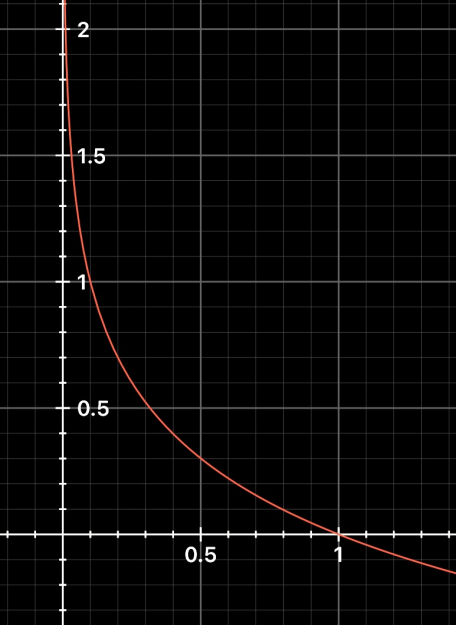
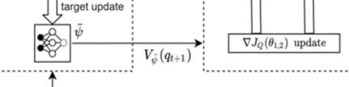
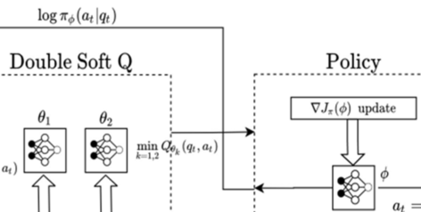
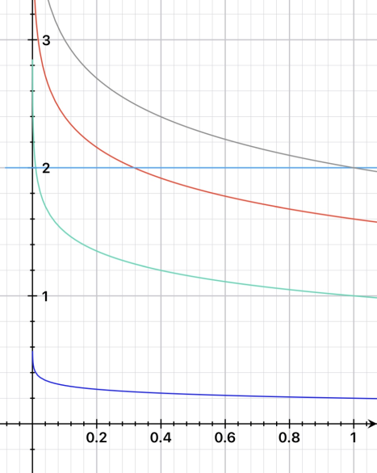
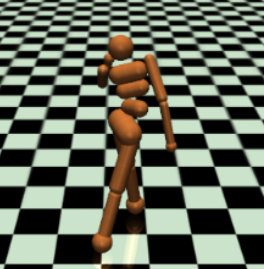
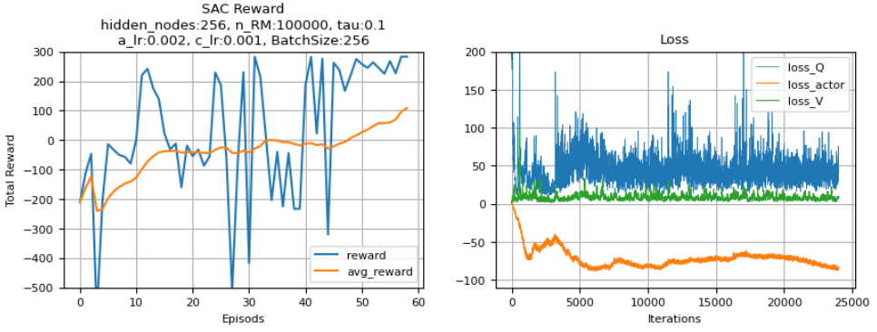
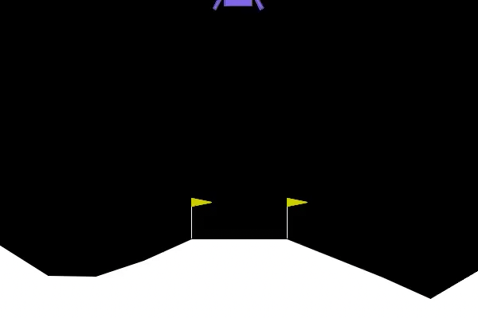

# 4.6 Soft Actor-Critic(SAC, SAC-v2)

**학습 목표**

- SAC 가 Stochastic on-policy Actor-Critic 과 Off-policy Q-learning 의 중간에 서서 두 계열의 약점(sample
  비효율, 연속 공간의 불안정)을 어떻게 피하는지 설명할 수 있다.
- Entropy-Regularized RL(MaxEnt RL)의 목적 함수와 temperature $\alpha$ 의 역할, soft state value · soft
  Q-value · soft policy iteration 의 정의를 식으로 쓸 수 있다.
- V loss · Q loss · Actor loss 를 식과 코드로 대응시키고, Squashed Gaussian policy 의 reparameterization
  trick 과 $\log\pi$ 계산 trick 을 설명할 수 있다.
- SAC(2018, V-net 포함)와 SAC-v2(2019, V-net 삭제 · temperature 자동 조정)의 차이, 그리고 TD3 와의 유사점
  · 차이점을 말할 수 있다.
- LunarLanderContinuous 에서 SAC 를 Keras 로 구현하고 TD3 와 비교할 수 있다.

**이 절의 구성**

- 4.6.1 Soft Actor-Critic — Actor-Critic(Stochastic on-policy) + Off-policy(Maximum-Entropy)
- 4.6.2 Entropy-Regularized RL — SAC 의 핵심
- 4.6.3 Entropy term 을 포함한 soft functions
- 4.6.4 Soft Policy iteration
- 4.6.5 SAC(2018)의 network 구성
- 4.6.6 Loss functions(1) — V Loss
- 4.6.7 Loss functions(2) — Critic loss(Q loss)
- 4.6.8 Policy Learning — Reparameterization trick 과 Squashed Gaussian Policy
- 4.6.9 Squashed Gaussian Policy 의 $\log\pi$ 계산 Trick · Action Sampling
- 4.6.10 Loss functions(3) — Actor loss : Soft policy Improvement
- 4.6.11 Temperature $\alpha$ Training
- 4.6.12 Actor-Critic Clipped Double Q-Net 적용 — 갱신식의 계보
- 4.6.13 SAC Algorithm(2018)
- 4.6.14 SAC-v2(2019) — V-net 삭제, TD3 와의 비교
- 4.6.15 SAC-v2 Algorithm
- 4.6.16 성능
- 4.6.17 실습 4.6.1 — SAC 로 LunarLander 학습
- 4.6.18 참고 실습 4.6.2 — SAC-v2(temperature 자동 조정)
- 4.6.19 정리 — Review

---

## 4.6.1 Soft Actor-Critic — Actor-Critic(Stochastic on-policy) + Off-policy(Maximum-Entropy)
<!-- 슬라이드 438 -->

**Soft Actor-Critic(SAC)** — "Soft Actor-Critic: Off-Policy Maximum Entropy Deep Reinforcement Learning with
a Stochastic Actor"(2018). **Actor-Critic(Stochastic on-policy) + Off-policy(Maximum-Entropy)** 를 적용한
알고리즘이다.

- Actor-Critic 모델에 **MaxEnt RL** 을 적극 적용했다.
- 연속 공간에서 **off-policy** 적용이 가능하다.
- **Sample efficient** 하며 continuous space 에서 안정적이다.
- **Stochastic policy optimization 과 DDPG-style approaches 의 중간**에 위치한다.
  - On-policy(AC) : sample inefficient(한 번 쓰고 버림).
  - Off-policy(QL) : Deep NN 구조에서 불안정, 수렴성이 떨어짐, 연속 공간에서 악화.

두 계열의 문제점을 다시 적으면 —

- **Actor-Critic 모델의 문제점** : Actor, Critic 모두 수렴이 보장되지 않고 동시에 최적화해야 한다.
  On-policy 이므로 sample 효율이 낮다.
- **DDPG 모델의 문제점** : Deterministic + Q-function 은 안정화가 쉽지 않다. 복잡한 task 에서 성능이 낮다.

→ **MaxEnt RL(Entropy-Regularized RL) + Q-function.** 확률적 정책(stochastic actor)을 유지하면서 replay
buffer 와 Q-function 을 쓰는 것이 SAC 의 자리다.

---

## 4.6.2 Entropy-Regularized RL — SAC 의 핵심
<!-- 슬라이드 439 -->

**Policy 학습 목표 : Expectation 과 Entropy 간의 균형을 최대화하도록 훈련한다.** policy 의 Entropy 를 키우는
term 을 추가한다.

- 높은 Entropy 는 더 많은 탐색을 유도하여 나중에 학습을 가속화할 수 있으며,
- 또한 정책이 초기에 나쁜 결과로 수렴되는 것을 방지하게 한다.
- exploration-exploitation trade-off 와 관련된다.

**RL 의 objective policy** : reward expectation 을 최대화하는 policy 를 찾는 것.

$$
\pi^* = \arg\max_\pi \sum_t \mathbb{E}_{(s_t, a_t) \sim \rho_\pi}\big[ r(s_t, a_t) \big]
$$

**MaxEnt RL 의 objective policy** 는 entropy term 이 추가된다.

$$
\pi^* = \arg\max_\pi \sum_t \mathbb{E}_{(s_t, a_t) \sim \rho_\pi}\big[ r(s_t, a_t) + \alpha \mathcal{H}(\pi(\cdot \mid s_t)) \big],
\qquad \mathcal{H}(P) = \mathbb{E}_{x \sim P}\big[ -\log P(x) \big]
$$

- $\alpha$ 는 기존 RL term 과 entropy term 간의 조절을 위한 **temperature parameter** 다.
- **MaxEnt RL 의 장점** : policy 의 탐험을 하면서도 동시에 보상을 최대화한다. 하나의 optimal 이 아니라
  near optimal 을 여러 개 배울 수 있어 강건하다.

Entropy 는 모든 사건의 평균 정보량(기대값)이다(4.5.3 절) — $\sum_i p_i \log\frac{1}{p_i} = -\sum_i p_i \log p_i = H(p)$.



---

## 4.6.3 Entropy term 을 포함한 soft functions
<!-- 슬라이드 440 -->

보상에 entropy 보너스를 더하면 가치 함수의 정의도 바뀐다 — "soft" 가 붙는다.

**Soft state value $V^\pi$** : Entropy term 을 포함하면, **모든 시간단계에서의** Entropy term 을 포함하게 된다.

$$
V^\pi(s) = \mathbb{E}_{\tau \sim \pi}\left[ \sum_{t=0}^{\infty} \gamma^t \Big( R(s_t, a_t, s_{t+1}) + \alpha \mathcal{H}(\pi(\cdot \mid s_t)) \Big) \,\Big|\, s_0 = s \right]
$$

**Soft Q-value $Q^\pi$** 는 **첫 번째를 제외한** 모든 시간단계에서의 entropy term 을 포함하게 된다 — 첫
행동 $a_0 = a$ 는 이미 주어졌으므로 그 행동의 불확실성은 셀 것이 없다.

$$
Q^\pi(s, a) = \mathbb{E}_{\tau \sim \pi}\left[ \sum_{t=0}^{\infty} \gamma^t R(s_t, a_t, s_{t+1}) + \alpha \sum_{t=1}^{\infty} \gamma^t \mathcal{H}(\pi(\cdot \mid s_t)) \,\Big|\, s_0 = s, a_0 = a \right]
$$

**$V^\pi$ 를 $Q^\pi$ 로 표현하면** —

$$
V^\pi(s) = \mathbb{E}_{a \sim \pi}\big[ Q^\pi(s, a) \big] + \alpha \mathcal{H}(\pi(\cdot \mid s))
$$

**$Q^\pi$ 에 대한 Bellman equation 을 $V^\pi$ 로 표현하면** —

$$
\begin{aligned}
Q^\pi(s, a) &= \mathbb{E}_{s' \sim P,\, a' \sim \pi}\Big[ R(s, a, s') + \gamma \big( Q^\pi(s', a') + \alpha \mathcal{H}(\pi(\cdot \mid s')) \big) \Big] \\
&= \mathbb{E}_{s' \sim P}\Big[ R(s, a, s') + \gamma V^\pi(s') \Big]
\end{aligned}
$$

**$V^\pi$ 가 $Q^\pi$ 학습의 target 을 제공한다.** 세 network 의 target 이 서로 맞물린다 —

- $V^\pi$ 의 target 은 $Q^\pi$ 출력 + Entropy
- $Q^\pi$ 의 target 은 $V^\pi$
- $\pi$ 의 target 은 $Q^\pi$ 출력 + Entropy

---

## 4.6.4 Soft Policy iteration
<!-- 슬라이드 441 -->

**Soft Policy iteration** : soft function 을 사용한 iteration 이다. 높은 행동가치(policy evaluation)를 선택하도록
policy 를 수정(improvement)하고, 둘을 번갈아 진행하여 Q-function 수렴, Policy 수렴에 이른다 — 2.3 절
policy iteration 의 soft 판이다.

**Soft policy evaluation** — Soft State Value 로 계산한다 : Entropy term 이 추가된 soft state value 함수로
evaluation 한다.

$$
V^\pi(s) = \mathbb{E}_{a \sim \pi(\cdot \mid s)}\big[ Q^\pi(s, a) - \log\pi(a \mid s) \big]
= \mathbb{E}_{a \sim \pi(\cdot \mid s)}\big[ Q^\pi(s, a) \big] + \mathcal{H}(\pi(\cdot \mid s))
$$

Soft Q-value 는 Bellman $\mathcal{T}$ operator 를 반복 적용하여 계산 가능하다.

$$
\mathcal{T}^\pi Q(s, a) = r(s, a) + \gamma \mathbb{E}_{s' \sim p(\cdot \mid s, a)}\big[ V(s') \big]
$$

**Soft policy Improvement** — 행동가치함수($Q$)가 클수록 더 높은 확률을 부여하도록 정책을 수정하도록
정의한다.

- 함수값에 따라 확률을 부여할 수 있는 가장 자연스러운 방법은 **지수함수**를 사용하는 것이다.
- $\exp(Q^\pi(s, a))$ 를 normalize term $Z^\pi(s)$ 로 나누어 확률화한다.
- $Z^\pi(s)$ 는 미분에서 상수가 되어 무시된다.

$$
\pi_k(\cdot \mid s) = \arg\min_\pi D_{KL}\left( \pi(\cdot \mid s) \,\Big\|\, \frac{\exp(Q^{\pi_{k-1}}(s, \cdot))}{Z^{\pi_{k-1}}(s)} \right)
$$

새 정책은 "지금 $Q$ 의 softmax 분포" 에 가장 가까운(KL 이 가장 작은) 정책이다 — 4.5.5 절의 Reverse KL
(mode-seeking + entropy) 이 바로 이 자리에 있다.

**Soft policy iteration 의 문제점 해결하기** — Continuous space 에서 수렴을 위해 evaluation 과 improvement
를 반복하는 것은 비현실적이다. → **Soft Q-function(Critic)과 Policy-function(Actor)을 NN 으로 근사하고,
Stochastic gradient descent 로 update 하자.**

---

## 4.6.5 SAC(2018)의 network 구성
<!-- 슬라이드 442 -->

"Soft Actor-Critic: Off-Policy Maximum Entropy Deep Reinforcement Learning with a Stochastic Actor"(2018)의
구성 —

- Soft Value net $V(\psi)$, Target value net $V'(\psi)$, Soft Q net $Q_i(\theta)$($i = 1, 2$), Policy net $\pi(\phi)$
- **5 개의 NN 사용, 4 개의 NN 학습**(target $V'$ 는 복사만 한다)
- TD3 에서 사용된 **clipped double-Q trick** 이 포함되어 있다(TD3 와 동시에 발표되었다).


그림의 화살표를 따라가면 4.6.3 절의 "맞물린 target" 이 보인다 — $\log\pi_\phi$ 와 $\min Q$ 가 Soft Value 로,
$V_{\bar\psi}(q_{t+1})$ 이 Double Soft Q 로, $\min Q$ 가 Policy 로 간다.

---

## 4.6.6 Loss functions(1) — V Loss
<!-- 슬라이드 443 -->

**V Loss(Soft State Value)** : entropy 까지 modeling 한다.

$V(s)$ 는

$$
V^\pi(s) = \mathbb{E}_{a \sim \pi(\cdot \mid s)}\big[ Q^\pi(s, a) - \log\pi(a \mid s) \big]
= \mathbb{E}_{a \sim \pi(\cdot \mid s)}\big[ Q^\pi(s, a) \big] + \mathcal{H}(\pi(\cdot \mid s))
$$

V-net objective function 은

$$
J_V(\psi) = \mathbb{E}_{s_t \sim \mathcal{D}}\left[ \frac{1}{2}\Big( \underbrace{V_\psi(s_t)}_{\texttt{value}} - \underbrace{\mathbb{E}_{a_t \sim \pi_\phi}\big[ Q_\theta(s_t, a_t) - \log\pi_\phi(a_t \mid s_t) \big]}_{\texttt{target\_value} = \texttt{v\_critic\_value} - \texttt{v\_log\_pi}} \Big)^2 \right]
$$

**구현** — 현재 정책에서 행동을 sampling 하고, **두 개의 Q-net 출력값 중 작은 값**을 선택해 $\log\pi$ 를 뺀
것이 target 이다.

```python
          #value loss
          value = tf.squeeze(self.value_net(states)) # v(s)
          v_actions, v_log_pi = self.sample_normal(states)
          v_actions = tf.clip_by_value(v_actions, self.min_action, self.max_action)
          v_q1 = self.critic_1((states, v_actions))
          v_q2 = self.critic_2((states, v_actions))
          v_critic_value = tf.math.minimum(tf.squeeze(v_q1), tf.squeeze(v_q2))
          target_value = v_critic_value - v_log_pi  # vt(s)= min(Q(s,a))-log(pi(a|s))
          value_loss = 0.5 * tf.keras.losses.MSE(target_value, value)
```

---

## 4.6.7 Loss functions(2) — Critic loss(Q loss)
<!-- 슬라이드 444~445 -->

**$Q^\pi$ 에 대한 bellman equation** 에서 entropy term 의 표현을 바꾸면($\mathcal{H}(p) = -\sum_i p_i \log p_i = -\mathbb{E}_p[\log p]$) —

$$
\begin{aligned}
Q^\pi(s, a) &= \mathbb{E}_{s' \sim P,\, a' \sim \pi}\Big[ R(s, a, s') + \gamma \big( Q^\pi(s', a') + \alpha \mathcal{H}(\pi(\cdot \mid s')) \big) \Big] \\
&= \mathbb{E}_{s' \sim P,\, a' \sim \pi}\Big[ R(s, a, s') + \gamma \big( Q^\pi(s', a') - \alpha \log\pi(a' \mid s') \big) \Big]
\end{aligned}
$$

$Q^\pi$ 는 RM 에서 얻은 $R(s, a, s')$ 와 다음 action $\pi(a' \mid s')$ 에서 얻은 $Q(s', a')$ 로 계산된다. 여기서
기댓값 $\mathbb{E}[\cdot]$ 는 batch size 가 적당히 크다면 **제거하고 근사로 표현 가능**하다 —

$$
Q^\pi(s, a) \approx r + \gamma\big( Q^\pi(s', \tilde{a}') - \alpha \log\pi(\tilde{a}' \mid s') \big), \qquad \tilde{a}' \sim \pi(\cdot \mid s')
$$

($\tilde{a}'$ 는 **현 policy 에서 sampling 하여 얻은 새로운 action** 이다 — buffer 에 저장된 $a'$ 가 아니다.
이것이 off-policy 로 쓸 수 있는 이유다.) 근사 값을 얻기 위해 RM($\mathcal{D}$)로부터 sample 을 얻고, TD3 처럼
clipped double Q trick 을 적용하면 **Q loss** 는

$$
L(\phi_i, \mathcal{D}) = \mathbb{E}_{(s, a, r, s', d) \sim \mathcal{D}}\left[ \Big( Q_{\phi_i}(s, a) - \underbrace{y(r, s', d)}_{\texttt{q\_hat}} \Big)^2 \right]
$$

$$
y(r, s', d) = r + \gamma(1 - d)\Big( \underbrace{\min_{j=1,2} Q_{\phi_{targ,j}}(s', \tilde{a}') - \alpha \log\pi_\theta(\tilde{a}' \mid s')}_{\texttt{Vnet} \text{ 출력 : } \texttt{next\_state\_value}} \Big), \qquad \tilde{a}' \sim \pi_\theta(\cdot \mid s')
$$

$\mathcal{D}$ 는 Replay Memory Buffer, $d$ 는 done 이다.

**Critic loss** — 두 개의 Q-net loss 기대값이므로 평균 처리한다. $\min_{j=1,2} Q_{\phi_{targ,j}}(s', \tilde{a}')$ 가
clipped double Q learning 인데, 이 값은 **V-net 학습 과정에 선반영되어 있다** — 4.6.6 절의 target 이 바로
$\min Q - \log\pi$ 이므로, 구현에서는 괄호 안 전체를 **target V-net 의 출력** `next_state_value` 로 대신한다.



**구현**

```python
          #critic loss
          next_state_value = tf.squeeze(self.target_value_net(next_states))
          q_hat = self.scale * rewards + self.gamma * next_state_value * dones
          c_q1 = self.critic_1((states, actions))
          c_q2 = self.critic_2((states, actions))
          critic_loss1 = 0.5 * tf.keras.losses.MSE(q_hat, tf.squeeze(c_q1))
          critic_loss2 = 0.5 * tf.keras.losses.MSE(q_hat, tf.squeeze(c_q2))
          Q_loss = critic_loss1 + critic_loss2
```

`dones` 는 buffer 에 `1 - done` 으로 저장된 값이라 $(1 - d)$ 역할을 한다. `self.scale`(= 2)은 reward scaling
이다 — 논문 구현이 entropy 항과 보상의 비율을 맞추기 위해 쓰는 trick 으로, $\alpha$ 를 줄이는 것과 같은 효과다.

---

## 4.6.8 Policy Learning — Reparameterization trick 과 Squashed Gaussian Policy
<!-- 슬라이드 446 -->

**Policy Learning** 의 목표는 큰 값 $V^\pi(s) = \mathbb{E}_{a \sim \pi}[Q^\pi(s, a) - \alpha \log\pi(a \mid s)]$ 를 얻는 것이다 —
Return 과 entropy 기댓값이 커져야 한다.

**actor 가 mu, sigma 를 출력 : Reparameterization trick 이 필요하다.** Stochastic function 인 $\pi$ 에 대한
gradient 계산을 위해, Deterministic node + stochastic node 로 변형하고 deterministic node 로 미분을 적용한다.


**Squashed Gaussian Policy 적용** — 일반적인

$$
\tilde{a}(s, \zeta) = \tanh(\mu(s)) + \sigma(s) \odot \zeta, \qquad \zeta \sim \mathcal{N}(0, 1)
$$

이 아닌

$$
\tilde{a}(s, \zeta) = \tanh\big( \mu(s) + \sigma(s) \odot \zeta \big), \qquad \zeta \sim \mathcal{N}(0, 1)
$$

을 적용한다. 출력을 −1 에서 1 사이의 값으로 squashing 하며, 이를 통해 정책 함수는 **행동 공간의 경계를
넘지 않도록 보장**된다 → 빠르고 안정적인 학습.

$V^\pi(s) = \mathbb{E}_{a \sim \pi}[Q^\pi(s, a) - \alpha \log\pi(a \mid s)]$ 에 Squashed Gaussian Reparameterization trick 을
적용하면

$$
V^\pi(s) = \mathbb{E}_{\zeta \sim \mathcal{N}}\Big[ Q^\pi\big(s, \tilde{a}(s, \zeta)\big) - \alpha \log\pi\big(\tilde{a}(s, \zeta) \mid s\big) \Big]
$$

이 되어 **action($a$)에 대한 기댓값에서 noise($\zeta$)에 대한 기댓값으로 수정**된다 — 기댓값 계산에서 parameter
에 의존하지 않는 식이 되었다. 그래서 $\theta$ 로 미분할 수 있다.

Policy 학습은 Min-double Q-Learning 을 사용하므로 다음 식에 따라 값이 커지는 쪽으로 최적화된다.

$$
\pi\ \text{Loss} \quad J_\pi(\theta) = \mathbb{E}_{s \sim \mathcal{D},\, \zeta \sim \mathcal{N}}\Big[ \min_{j=1,2} Q_{\phi_j}\big(s, \tilde{a}_\theta(s, \zeta)\big) - \alpha \log\pi_\theta\big(\tilde{a}_\theta(s, \zeta) \mid s\big) \Big]
$$

**Exploration vs. Exploitation** — Entropy regularization 계수 $\alpha$(temperature)가 클수록 더 많은 탐색을
하며, 신중한 조정이 필요하다. Test 시에는 sampling 을 하지 않고 mean 값을 사용한다.

---

## 4.6.9 Squashed Gaussian Policy 의 $\log\pi$ 계산 Trick · Action Sampling
<!-- 슬라이드 447 -->

Squashed Gaussian Policy 사용 시 $\log\pi$ 계산에는 trick 이 필요하다 — $\tanh$ 를 통과한 뒤의 확률밀도는
Gaussian 이 아니기 때문이다.

- Action $a = \tanh(u)$, $u \sim \mu(u \mid s)$ 를 sampling 한다. 따라서 action $a$ 는 $(-1, 1)$ 로 support 되는
  random variable 이다.
- Policy function 을 다시 정리하면(변수 변환 공식)

$$
\pi(a \mid s) = \mu(u \mid s) \left| \det\left( \frac{da}{du} \right) \right|^{-1}, \qquad |\det(\cdot)| : \text{Jacobian determinant}
$$

- Jacobian $\frac{da}{du} = \operatorname{diag}(1 - \tanh^2(u))$ 이고 diagonal 이므로 $\left| \det\left(\frac{da}{du}\right) \right| = \prod_{i=1}^{D} (1 - \tanh^2(u_i))$ 다.
- Log-likelihood 는 다음 식으로 간략화 가능하다.

$$
\log\pi(a \mid s) = \log\mu(u \mid s) - \sum_{i=1}^{D} \log\big( 1 - \tanh^2(u_i) \big), \qquad u_i : i^{th} \text{ element of } u
$$

**Action Sampling** — Actor 는 두 action 분포에 대한 모수 mu, sigma 를 출력하고, 분포에서 sampling 하여
action 을 결정하고 $\log\pi(a \mid s)$ 를 계산한다(action entropy 계산용).

```python
  @tf.function
  def sample_normal(self, state):
    mu, sigma = self.actor_main(state)
    normal = tfp.distributions.Normal(mu, sigma)
    actions  = normal.sample()     #u = mu + sigma*epsilon
    action = tf.math.tanh(actions) #a=tanh(u)
    action = tf.squeeze(action)
    log_pi = normal.log_prob(actions)
    log_pi -= tf.math.log(1 - tf.math.pow(action, 2) + 1e-6)
    log_pi = tf.reduce_sum(log_pi, axis=1)
    return action, log_pi
```

`normal.sample()` 이 $u = \mu + \sigma \cdot \epsilon$($\epsilon \sim \mathcal{N}(0, 1)$)의 reparameterization 이고, `tanh` 가
squashing, 그다음 두 줄이 위의 $\log\pi$ 식이다. `1e-6` 은 $a = \pm 1$ 에서 $\log 0$ 을 막는 수치 안정화다.

---

## 4.6.10 Loss functions(3) — Actor loss : Soft policy Improvement
<!-- 슬라이드 448 -->

**Actor loss : Soft policy Improvement** — 행동가치함수($Q$)가 클수록 더 높은 확률을 부여한다.

$$
\pi_k(\cdot \mid s) = \arg\min_\pi D_{KL}\left( \pi(\cdot \mid s) \,\Big\|\, \frac{\exp(Q^{\pi_{k-1}}(s, \cdot))}{Z^{\pi_{k-1}}(s)} \right)
\quad\Longrightarrow\quad
J_\pi(\phi) = \mathbb{E}_{s \sim \mathcal{D}}\Big[ \mathbb{E}_{a \sim \pi_\phi}\big[ \alpha \log\pi_\phi(a \mid s) - Q(s, a) \big] \Big]
$$



**구현**

- $D_{KL}$ 을 활용한 확률 수정 부분은 actor loss 계산에서 **간접적으로** 반영된다 — code 에서 $D_{KL}$ 을
  명시적으로 계산하지는 않고 비슷한 개념을 반영하여 구현한다. KL 을 전개하면 $\log\pi - Q$ 의 기댓값(상수
  $\log Z$ 제외)이 되기 때문이다.
- Actor loss : `a_log_pi` : (−)Entropy — **작아지도록**(entropy 가 커지도록); `+ a_critic_value` : **$Q$ 값이
  커지도록**.

```python
          #actor loss
          a_actions, a_log_pi = self.sample_normal(states)
          a_q1 = self.critic_1((states, a_actions))
          a_q2 = self.critic_2((states, a_actions))
          a_critic_value = tf.math.minimum(tf.squeeze(a_q1), tf.squeeze(a_q2))
          actor_loss =  a_log_pi - a_critic_value # log(pi)(=-H) - Q
          actor_loss = tf.reduce_mean(actor_loss)
```

실습 4.6.1 의 구현은 $\alpha = 1$ 로 두고(식에 $\alpha$ 가 없다) 대신 reward 를 2 배로 scaling 한다.

---

## 4.6.11 Temperature $\alpha$ Training
<!-- 슬라이드 449 -->

**SAC 는 Temperature parameter $\alpha$ 에 민감하다.** 정책 개선에 따라 entropy 가 예측할 수 없을 정도로
변화할 수 있다. → **Training 을 통해 $\alpha$ 를 결정하자.**

Max Entropy RL objective policy function

$$
\pi^* = \arg\max_\pi \sum_t \mathbb{E}_{(s_t, a_t) \sim \rho_\pi}\big[ r(s_t, a_t) + \alpha \mathcal{H}(\pi(\cdot \mid s_t)) \big], \qquad \mathcal{H}(P) = \mathbb{E}_{x \sim P}[-\log P(x)]
$$

에서 $\alpha$ objective function

$$
J(\alpha) = \mathbb{E}_{a_t \sim \pi_t}\big[ -\alpha \log\pi_t(a_t \mid s_t) - \alpha \mathcal{H}_0 \big]
$$

를 유도할 수 있고(https://lilianweng.github.io/posts/2018-04-08-policy-gradient/), sampling 한
$\tilde{a}_t \sim \pi_t(\cdot \mid s_t)$ 로 근사하면 $J(\alpha) \approx -\alpha \log\pi_t(\tilde{a}_t \mid s_t) - \alpha \mathcal{H}_0$ 다.

$$
J(\alpha) = -\alpha\big( \log\pi_t(a_t \mid s_t) + \mathcal{H}_0 \big)
$$

$J(\alpha)$ 가 최소가 되도록 $\alpha$ 를 training 한다 : $-\log\pi_t(a_t \mid s_t) = -\mathcal{H}_0$ 가 되도록.

- $-\log\pi_t(a_t \mid s_t) > -\mathcal{H}_0$ 면(정책의 entropy 가 목표보다 크면) $\alpha \to 0$ — entropy 보너스를 줄인다.
- $-\log\pi_t(a_t \mid s_t) < -\mathcal{H}_0$ 면(entropy 가 목표보다 작으면) $\alpha \uparrow$ — 탐색을 더 시킨다.

**$\mathcal{H}_0$ 설정 : $-\dim(\text{Action space})$.** Entropy 를 $\mathcal{H}_0$ 로 constraint 하게 된다. LunarLander 의 경우
$\mathcal{H}_0 = -2$ 이므로 $J(\alpha) = -\alpha(\log\pi_t(a_t \mid s_t) - 2)$ 다. Default $\alpha$ : 0.2.



---

## 4.6.12 Actor-Critic Clipped Double Q-Net 적용 — 갱신식의 계보
<!-- 슬라이드 450 -->

2.7 절부터 쌓아 온 갱신식을 한 자리에 모으면 SAC 가 어디에 서 있는지 보인다.

$$
\begin{aligned}
\text{Deep Q-learning} :\quad & Q(s,a) \mathrel{+}= \alpha\big( r + \gamma \max_{a'} Q(s',a') - Q(s,a) \big) \\
\text{Double Q-learning} :\quad & Q(s,a) \mathrel{+}= \alpha\big( r + \gamma Q'(s', \arg\max_{a'} Q(s',a')) - Q(s,a) \big), \quad Q' = Q'_1 \text{ or } Q'_2 \\
\text{Actor-Critic C-net} :\quad & Q(s,a) \mathrel{+}= \alpha\big( r + \gamma Q_\phi(s',a') - Q(s,a) \big) \\
\text{Double DQN} :\quad & Q_q(s,a) \mathrel{+}= \alpha\big( r + \gamma Q_t(s', \arg\max_{a'} Q_q(s',a')) - Q_q(s,a) \big) \\
\text{DDPG Critic Net} :\quad & Q^\mu(s,a) \mathrel{+}= \alpha\big( r + \gamma Q^\mu(s',a') - Q^\mu(s,a) \big), \quad a' \sim \mu(s') : \text{Actor} \\
\text{TD3(Clipped DQ)} :\quad & Q_{\phi_i}(s,a) \mathrel{+}= \alpha\big( r + \gamma \min_{i=1,2} Q_{\phi'_i}(s',a') - Q_{\phi_i}(s,a) \big), \quad a' \sim \mu'(s') \\
\text{SAC} :\quad & Q_{\phi_i}(s,a) \mathrel{+}= \alpha\big( y(r, s') - Q_{\phi_i}(s,a) \big) \\
& y(r, s') = r + \gamma \min_{i=1,2} Q_{\phi'_i}(s', \tilde{a}') - \alpha' \log\pi(\tilde{a}' \mid s'), \quad \tilde{a}' \sim \pi(\cdot \mid s')
\end{aligned}
$$

여기서 $\alpha'$ 는 entropy regularization coefficient 다 — 실무에선 다양한 entropy-constraint 를 적용하거나
학습으로 결정한다(4.6.11 절). TD3 의 $\min(y_1, y_2)$ 에 entropy 항이 더해지고, 다음 행동이 target actor 의
결정적 출력 + noise 가 아니라 **stochastic policy 에서 뽑은 $\tilde{a}'$** 라는 점이 다르다.

- **Critic update** : $\nabla_{\phi_i} \sum_{(s,a,r,s',d) \sim \mathcal{D}} \big( Q_{\phi_i}(s,a) - y(r, s', d) \big)^2$
- **Actor update** : $\nabla_\theta \mathbb{E}_{s \sim \mathcal{D},\, \zeta \sim \mathcal{N}}\big[ \min_{j=1,2} Q_{\phi_j}(s, \tilde{a}_\theta(s, \zeta)) - \alpha \log\pi_\theta(\tilde{a}_\theta(s, \zeta) \mid s) \big]$

---

## 4.6.13 SAC Algorithm(2018)
<!-- 슬라이드 451 -->

V-net 이 있는 2018 판 알고리즘이다(https://lilianweng.github.io/posts/2018-04-08-policy-gradient/).

> **SAC Algorithm(2018)**
>
> Replay buffer $D$ 초기화
> Actor-Net. $\pi_\theta$, Critic-Net. $Q_{\phi_1}, Q_{\phi_2}$, V-Net. $V(\psi)$, $V'(\psi)$ 초기화
> $V'(\psi) \leftarrow V(\psi)$ : Target-Net. Parameter copy
> **Repeat** : episode
> &nbsp;&nbsp; **for** each env. step **do** : episode 내부
> &nbsp;&nbsp;&nbsp;&nbsp; $a \leftarrow \pi_\theta(\cdot \mid s)$
> &nbsp;&nbsp;&nbsp;&nbsp; $s', r, d \leftarrow$ env.step($a$)
> &nbsp;&nbsp;&nbsp;&nbsp; $D \leftarrow (s, a, r, s')$
> &nbsp;&nbsp;&nbsp;&nbsp; **if** time to update **then**, do $j$ times
> &nbsp;&nbsp;&nbsp;&nbsp;&nbsp;&nbsp; $(s, a, r, s') \leftarrow$ random($D$, batch_size), batch_size $= B$
> &nbsp;&nbsp;&nbsp;&nbsp;&nbsp;&nbsp; $\tilde{a} \leftarrow \pi_\theta(\cdot \mid s)$, $\tilde{a}' \leftarrow \pi_\theta(\cdot \mid s')$, $\tilde{h} \leftarrow \log\pi_\theta(\tilde{a}' \mid s)$
> &nbsp;&nbsp;&nbsp;&nbsp;&nbsp;&nbsp; $\tilde{q} \leftarrow r + \gamma(1 - d) V'(s')$
> &nbsp;&nbsp;&nbsp;&nbsp;&nbsp;&nbsp; $\tilde{v} \leftarrow V'(s)$
> &nbsp;&nbsp;&nbsp;&nbsp;&nbsp;&nbsp; Q update : gradient descent — $\nabla_{\phi_i} \frac{1}{|B|} \sum_{(s,a,r,s',d) \in B} \big( Q_{\phi_i}(s,a) - \tilde{q} \big)^2$
> &nbsp;&nbsp;&nbsp;&nbsp;&nbsp;&nbsp; Policy update : gradient ascent — $\nabla_\theta \frac{1}{|B|} \sum_{s \in B} \big( \min_{i=1,2} Q_{\phi_i}(s, \tilde{a}') - \alpha \tilde{h} \big)$
> &nbsp;&nbsp;&nbsp;&nbsp;&nbsp;&nbsp; V update : gradient descent — $\nabla_\psi \frac{1}{|B|} \sum_{s \in B} \Big( \big( \min_{i=1,2} Q_{\phi_i}(s, \tilde{a}') - \alpha \tilde{h} \big) - \tilde{v} \Big)^2$
> &nbsp;&nbsp;&nbsp;&nbsp;&nbsp;&nbsp; Update target networks : $V'(\psi) \leftarrow V(\psi)$
> &nbsp;&nbsp;&nbsp;&nbsp; **end if**
> &nbsp;&nbsp; **end for**
> **Until** convergence

Q 의 target 은 $V'$ 로, $V$ 의 target 은 $\min Q - \alpha\log\pi$ 로, 정책은 $\min Q - \alpha\log\pi$ 가 커지는 쪽으로 — 4.6.3
절의 세 target 이 그대로 세 update 줄이다.

---

## 4.6.14 SAC-v2(2019) — V-net 삭제, TD3 와의 비교
<!-- 슬라이드 452~453 -->

**"Soft Actor-Critic Algorithms and Applications"(2019)** — 동일 저자의 개선 paper 다.

- **Soft Value net $V(\psi)$ 삭제.** Soft Q net $Q(\theta)$, Policy net $\pi(\phi)$ **두 개의 NN 학습.**
- TD3 와 유사한 구조 : **Clipped Double Q-Net** 사용.


**TD3 와 유사점**

- 두 Q-net $Q_i$ 는 **single shared target** 으로 회귀한다 — 동일한 target 값 $\min(Q'_1, Q'_2)$ 를 사용한다.
  즉 clipped double Q trick 이 사용된다. MSBE(Mean Squared Bellman Error) 최소화로 학습한다.
- Target $Q'_i$ 는 main $Q_i$ parameter 를 **polyak average** 로 update 한다.

> **Polyak Averaging** : parameter 평균 사용 — $t$ iterations 에서 얻은 parameter $\theta^1, \theta^2, \dots, \theta^t$ 에서
> 평균 $\hat\theta^t \leftarrow \frac{1}{t}\sum_i \theta^i$ 으로 update 한다. 실 적용에서는 exponential decay average 를
> 고려하여 $\hat\theta^t \leftarrow \alpha\hat\theta^{t-1} + (1 - \alpha)\hat\theta^t$ 로 update 한다 — 3.6 절부터 써 온 soft update 다.

**TD3 와 차이점**

- **Entropy term** 사용.
- **Policy Net 이 하나** — target actor 가 없다.
- **Target Policy Smoothing 사용 X** — Target $y$ 계산 시 action 에 noise 를 추가하지 않는다. TD3 는
  deterministic algorithm + Noise, SAC 는 Stochastic algorithm(noisy algorithm)이다(Actor-Critic 은 원래
  stochastic gradient 였다). 정책 자체가 확률적이므로 noise 를 따로 넣을 이유가 없다.

![[SAC] 구조. Target Q Network(Q1⁻, Q2⁻)와 Q Network(Q1, Q2) 사이에 Soft Update 화살표. Actor Network(Policy)의 π(s_{t+1}) 이 Target Q 로(빨강), π(s_t) 가 Q Network 로(파랑) 들어가고, min(Q1⁻, Q2⁻) 는 Q 학습에, min(Q1, Q2) 는 actor 학습에 쓰인다.](images/s453_01.png)

비교 대상인 [TD3] 구조는 4.3.3 절의 Critic Network · Actor Network 그림이다 — 그쪽에는 target actor $\mu'$ 와
$\epsilon'$ 가 있고, SAC 에는 없다.

---

## 4.6.15 SAC-v2 Algorithm
<!-- 슬라이드 454 -->
<!-- 그림 s454_01 은 453 의 s453_01 과 같은 그림이라 다시 넣지 않았다 -->

> **SAC-v2 Algorithm**
>
> Replay buffer $D$ 초기화, Actor-Net. $\pi_\theta$, Critic-Net. $Q_{\phi_1}, Q_{\phi_2}$ 초기화
> $Q'_{\phi_1}, Q'_{\phi_2} \leftarrow Q_{\phi_1}, Q_{\phi_2}$ : Target-Net. Parameter copy
> **Repeat** : episode
> &nbsp;&nbsp; **for** each env. step **do** : episode 내부
> &nbsp;&nbsp;&nbsp;&nbsp; $a \leftarrow \pi_\theta(\cdot \mid s)$
> &nbsp;&nbsp;&nbsp;&nbsp; $s', r, d \leftarrow$ env.step($a$)
> &nbsp;&nbsp;&nbsp;&nbsp; $D \leftarrow (s, a, r, s')$
> &nbsp;&nbsp;&nbsp;&nbsp; **if** time to update **then**, do $j$ times
> &nbsp;&nbsp;&nbsp;&nbsp;&nbsp;&nbsp; $(s, a, r, s') \leftarrow$ random($D$, batch_size), batch_size $= B$
> &nbsp;&nbsp;&nbsp;&nbsp;&nbsp;&nbsp; $\tilde{a}' \leftarrow \pi_\theta(\cdot \mid s')$
> &nbsp;&nbsp;&nbsp;&nbsp;&nbsp;&nbsp; $y \leftarrow r + \gamma(1 - d)\big( \min_{i=1,2} Q'_{\phi_i}(s', \tilde{a}') - \alpha \log\pi_\theta(\tilde{a}' \mid s') \big)$
> &nbsp;&nbsp;&nbsp;&nbsp;&nbsp;&nbsp; Q update : gradient descent — $\nabla_{\phi_i} \frac{1}{|B|} \sum_{(s,a,r,s',d) \in B} \big( Q_{\phi_i}(s,a) - y(r, s', d) \big)^2$
> &nbsp;&nbsp;&nbsp;&nbsp;&nbsp;&nbsp; Policy update : gradient ascent — $\nabla_\theta \frac{1}{|B|} \sum_{s \in B} \big( \min_{i=1,2} Q_{\phi_i}(s, \tilde{a}_\theta(s)) - \alpha \log\pi_\theta(\tilde{a}_\theta(s) \mid s) \big)$
> &nbsp;&nbsp;&nbsp;&nbsp;&nbsp;&nbsp; ($\tilde{a}_\theta(s) \sim \pi_\theta(\cdot \mid s)$ is differentiable wrt $\theta$ via Reparameterization trick.)
> &nbsp;&nbsp;&nbsp;&nbsp;&nbsp;&nbsp; Update temperature $\alpha$ : $\nabla_\alpha J(\alpha)$
> &nbsp;&nbsp;&nbsp;&nbsp;&nbsp;&nbsp; Update target networks : $\phi'_i \leftarrow \rho\phi'_i + (1 - \rho)\phi_i$, $i = 1, 2$
> &nbsp;&nbsp;&nbsp;&nbsp; **end if**
> &nbsp;&nbsp; **end for**
> **Until** convergence

V update 줄이 사라지고 "Update temperature $\alpha$" 가 들어왔다. Q 의 target 은 V-net 대신 **target Q 의 min 에
entropy 항을 직접** 더해 만든다.

---

## 4.6.16 성능
<!-- 슬라이드 455 -->
<!-- 그림 s455_03(HalfCheetah · Hopper · Walker2d · Ant 네 장면)은 4.3.7 의 s375_02 와 같은 그림이라 다시 넣지 않았다 -->

Example MuJoCo environments — HalfCheetah-v1, Hopper-v1, Walker2d-v1, Ant-v1, 그리고 새로 **Humanoid-v1** 이다.




단순한 환경에서는 TD3 와 비슷하지만, 가장 어려운 Humanoid 에서 격차가 크다 — entropy 로 유지되는 탐색이
고차원 문제에서 힘을 낸다. learned temperature(SAC-v2)가 fixed 보다 일관되게 조금 낫다.

---

## 4.6.17 실습 4.6.1 — SAC 로 LunarLander 학습
<!-- 슬라이드 456~461 -->

> 노트북: `code/4.6.1.SAC.ipynb`
> [](https://colab.research.google.com/github/AI-BoostCamp/ReinforcementLearning/blob/main/code/4.6.1.SAC.ipynb)
> PyTorch 구현: `code/4.6.1.pt.SAC.ipynb`
> [](https://colab.research.google.com/github/AI-BoostCamp/ReinforcementLearning/blob/main/code/4.6.1.pt.SAC.ipynb)

LunarLander 환경을 사용하여 SAC 알고리즘을 수행시켜 보자 — LunarLander Continuous 환경을 확인하고, SAC
알고리즘을 적용하고, **TD3(실습 4.3.1)와 비교**해 보자.

**LunarLander Env.** — LunarLanderContinuous-v2(Continuous), Continuous Action : throttle control. Action space
(main, lateral) : main 0.5~1, lateral left(−1 ~ −0.5), right(0.5 ~ 1). State space : x, y 좌표, x, y 축 속도, 각,
각속도, 좌우 다리 접촉. Rewards : landing position 에 가까운가 먼가에 따라 증가 · 감소, Lander 가 수평이
아니면 감소, 좌우 다리가 바닥에 접지되면 +10, side engine 가동 −0.03 / frame, main engine 가동 −0.3 / frame,
Landing +100, Crashing −100, **정답 200 point**(4.3.8 절과 같다).

### Actor-Network, Critic-Network, Value-Network

Actor 는 **mu 와 sigma 두 출력**을 낸다 — sigma 는 `log_sigma` 를 지수화해서 양수를 보장한다. Critic 은
$(s, a)$ 를 받아 $Q$, Value-Network 는 $s$ 를 받아 $V$ 를 낸다. 세 network 모두 첫 층 뒤에 BatchNormalization 이
있다.

```python
hidden = 256
n_actions = len(env.action_space.high)
state_shape = env.observation_space.low.shape #(8,)
action_shape = env.action_space.high.shape    #(2,)

def Actor():
   input_s = layers.Input(shape=state_shape)
   x = layers.Dense(hidden)(input_s)
   x = layers.BatchNormalization()(x)
   x = layers.Activation('relu')(x)
   x = layers.Dense(hidden, activation='relu')(x)
   mu = layers.Dense(action_shape[0], activation='linear')(x)
   log_sigma = layers.Dense(action_shape[0], activation='linear')(x)
   sigma = layers.Lambda(lambda x: tf.math.exp(x))(log_sigma)
   return keras.Model(inputs=input_s, outputs=[mu, sigma],name="actor")

def Critic():
    input_s = layers.Input(shape=state_shape)
    input_a = layers.Input(shape=action_shape)
    inputs = layers.concatenate([input_s, input_a])
    x = layers.Dense(hidden)(inputs)
    x = layers.BatchNormalization()(x)
    x = layers.Activation('relu')(x)
    x = layers.Dense(hidden, activation='relu')(x)
    x = layers.Dense(1, activation='linear')(x)
    return keras.Model(inputs=[input_s, input_a], outputs=x,name="critic")

def value_net():
    input_s = layers.Input(shape=state_shape)
    x = layers.Dense(hidden)(input_s)
    x = layers.BatchNormalization()(x)
    x = layers.Activation('relu')(x)
    x = layers.Dense(hidden, activation='relu')(x)
    x = layers.Dense(1, activation='linear')(x)
    return keras.Model(inputs=input_s, outputs=x,name="Vnet")
```

### SAC Training loop

TD3 와 거의 같은 loop 다. 다른 점은 행동을 `agent.sample_normal()` 로 **확률적으로 sampling** 한다는 것과,
buffer 가 batch 이상 차면 한 step 에 `agent.train()` 을 여러 번(노트북은 5 번) 부른다는 것이다.

```python
env= gym.make("LunarLanderContinuous-v2")
agent = Agent()

episods = 50 #300
ep_rewards = []
avg_rewards = []
losses = [[0,0,0,0,0]]

for epis in range(episods):
  ep_reward = 0
  ep_step = 0
  done = False
  state, _ = env.reset()
  while (not done) :#and (ep_step < max_steps) :
    action, _ = agent.sample_normal(state[tf.newaxis,...])
    next_state, reward, done, _, _ = env.step(action)
    agent.savexp(state, next_state, action, done, reward)
    state = next_state
    ep_reward += reward
    ep_step += 1
    if agent.memory.cnt > agent.batch_size:
      states, next_states, rewards, actions, dones = agent.memory.sample(agent.batch_size)
      losses.append(agent.train(states, next_states, rewards, actions, dones))
    if done:
      ep_rewards.append(ep_reward)
      avg_rewards.append(np.mean(ep_rewards[-10:]))
      print(f"Episodes(steps):{epis:03d}({ep_step:03d}), Rewards(average):{ep_reward:3.1f}({avg_rewards[-1]:3.1f})",end="")
      last_losses = losses[-1]
      print(f",\t Loss:: Q:{last_losses[0]:.3f}, A:{last_losses[1]:.3f}, V:{last_losses[2]:.5f}, ",end="")
      print(f"-log_pi:{last_losses[3]:.3f}, Q_target:{last_losses[4]:.3f})",end="")
      print(f",\t Buffer.cnt:{agent.memory.cnt}")
```

### SAC Agent (1) — 초기화

다섯 network(actor, critic 1 · 2, value, target value)와 네 optimizer. `Agent` 를 `keras.Model` 로 만들어 `save()`
로 통째로 저장할 수 있게 했다.

```python
batch_size = 256 #64
n_RM = 100_000
a_lr = 0.0001
c_lr = 0.0002
tau = 0.1

@keras.saving.register_keras_serializable()
class Agent(keras.Model):
  def __init__(self, n_action= len(env.action_space.high),*args,**kwargs):
    super(Agent, self).__init__(*args, **kwargs)
    global batch_size, n_RM, a_lr, c_lr
    self.actor_main = Actor()
    self.critic_1 = Critic()
    self.critic_2 = Critic()
    self.value_net = value_net()
    self.target_value_net = value_net()
    self.target_value_net.set_weights(self.value_net.get_weights())##

    self.batch_size = batch_size
    self.n_actions = len(env.action_space.high)
    self.a_opt = tf.keras.optimizers.Adam(a_lr)
    self.c_opt1 = tf.keras.optimizers.Adam(c_lr)
    self.c_opt2 = tf.keras.optimizers.Adam(c_lr)
    self.v_opt = tf.keras.optimizers.Adam(c_lr)
    self.memory = RBuffer(n_RM, env.observation_space.shape, len(env.action_space.high))
    self.trainstep = 0
    self.gamma = 0.99
    self.tau = tau
    self.min_action = env.action_space.low[0]
    self.max_action = env.action_space.high[0]
    self.scale = 2
```

### SAC Agent (2) — train()

세 loss 를 **하나의 `GradientTape(persistent=True)`** 안에서 계산하고, 각 network 의 변수에 대해 따로 gradient
를 뽑아 적용한다. 4.6.6 · 4.6.7 · 4.6.10 절의 세 코드 조각이 이 함수 안에 순서대로 들어 있다.

```python
  @tf.function
  def train(self, states, next_states, rewards, actions, dones):
      with tf.GradientTape(persistent=True) as tape:
          #value loss
          value = tf.squeeze(self.value_net(states)) # v(s)
          v_actions, v_log_pi = self.sample_normal(states)
          v_actions = tf.clip_by_value(v_actions, self.min_action, self.max_action)
          v_q1 = self.critic_1((states, v_actions))
          v_q2 = self.critic_2((states, v_actions))
          v_critic_value = tf.math.minimum(tf.squeeze(v_q1), tf.squeeze(v_q2))
          target_value = v_critic_value - v_log_pi  # vt(s)= min(Q(s,a))-log(pi(a|s))
          value_loss = 0.5 * tf.keras.losses.MSE(target_value, value)
          #actor loss
          a_actions, a_log_pi = self.sample_normal(states)
          a_q1 = self.critic_1((states, a_actions))
          a_q2 = self.critic_2((states, a_actions))
          a_critic_value = tf.math.minimum(tf.squeeze(a_q1), tf.squeeze(a_q2))
          actor_loss =  a_log_pi - a_critic_value # log(pi)(=-H) - Q
          actor_loss = tf.reduce_mean(actor_loss)
          #critic loss
          next_state_value = tf.squeeze(self.target_value_net(next_states))
          q_hat = self.scale * rewards + self.gamma * next_state_value * dones
          c_q1 = self.critic_1((states, actions))
          c_q2 = self.critic_2((states, actions))
          critic_loss1 = 0.5 * tf.keras.losses.MSE(q_hat, tf.squeeze(c_q1))
          critic_loss2 = 0.5 * tf.keras.losses.MSE(q_hat, tf.squeeze(c_q2))
          Q_loss = critic_loss1 + critic_loss2
      grads1 = tape.gradient(value_loss, self.value_net.trainable_variables)
      grads2 = tape.gradient(actor_loss, self.actor_main.trainable_variables)
      grads3 = tape.gradient(critic_loss1, self.critic_1.trainable_variables)
      grads4 = tape.gradient(critic_loss2, self.critic_2.trainable_variables)
      self.v_opt.apply_gradients(zip(grads1, self.value_net.trainable_variables))
      self.a_opt.apply_gradients(zip(grads2, self.actor_main.trainable_variables))
      self.c_opt1.apply_gradients(zip(grads3, self.critic_1.trainable_variables))
      self.c_opt2.apply_gradients(zip(grads4, self.critic_2.trainable_variables))
      self.trainstep +=1
      self.update_target(self.target_value_net, self.value_net)
      return Q_loss,actor_loss,value_loss,tf.reduce_mean(a_log_pi),tf.reduce_mean(a_critic_value)

  @tf.function
  def update_target(self, target_model, source_model):
      for target_var, source_var in zip(target_model.trainable_variables,\
                                        source_model.trainable_variables):
          target_var.assign(self.tau * source_var + (1 - self.tau) * target_var)
```

### Training Result

**Exploration 과 Exploitation 을 균형 있게 수행**하며 다양한 환경에 적용된다. 노트북에 기록된 세 실행 —

```
Episodes(steps):058(323), Rewards(average):283.3(108.4)  : Wall time: 5min 12s
Episodes(steps):149(1000), Rewards(average):128.1(100.8) : Wall time: 19min 28s
Episodes(steps):136(284), Rewards(average):267.4(158.4)  : Wall time: 25min 1s
```






같은 hyper parameter 에서도 실행마다 곡선이 다르고, 60 에피소드 안에 200 을 넘는 에피소드가 나오는 것은
TD3(실습 4.3.1)보다 빠르다 — 대신 에피소드 간 변동은 더 크다(stochastic policy 로 행동하기 때문이다).
4.1.5 절의 조언대로 여러 번 돌려 비교하자.

---

## 4.6.18 참고 실습 4.6.2 — SAC-v2(temperature 자동 조정)
<!-- 대응 슬라이드 없음. 노트북 4.6.2.SAC-v2 는 4.6.14~4.6.15 절(SAC-v2)의 구현이라 여기에 둔다 -->

> 노트북: `code/4.6.2.SAC-v2.ipynb`
> [](https://colab.research.google.com/github/AI-BoostCamp/ReinforcementLearning/blob/main/code/4.6.2.SAC-v2.ipynb)

4.6.15 절의 SAC-v2 알고리즘을 그대로 옮긴 구현이다 — V-net 이 없고, target Q 가 둘이며, **$\alpha$ 를 학습**한다.
`log_alpha` 를 변수로 두고 $\alpha = \exp(\log\alpha)$ 로 양수를 보장한다. `entropy_target` 이 $\mathcal{H}_0 = -\dim(A) = -2$ 다.

```python
    self.actor = Actor(nodes)
    self.Q1 = Critic(nodes)
    self.Q2 = Critic(nodes)
    self.target_Q1 = Critic(nodes)
    self.target_Q2 = Critic(nodes)
    self.target_Q1.set_weights(self.Q1.get_weights())
    self.target_Q2.set_weights(self.Q2.get_weights())
    self.alpha = 0  ##
    self.log_alpha = tf.Variable(tf.math.log(alpha), dtype=tf.float32) ##
    self.entropy_target = tf.constant(-self.env.action_space.shape[0],dtype=tf.float32) #-2
```

`learn()` 은 4.6.15 절의 세 update 를 한 tape 안에서 한다.

```python
  @tf.function
  def learn(self, states, actions, rewards, next_states, Ndones):
    with tf.GradientTape(persistent=True) as tape :
      next_actions, next_log_pi = self.sample_action(next_states) #(bs,2),(bs,)
      next_tQ1 = self.target_Q1([next_states, next_actions]) # Q1'(s',pi(s'))->(bs,1)
      next_tQ2 = self.target_Q2([next_states, next_actions])
      next_tQ_min = tf.minimum(next_tQ1, next_tQ2) - self.alpha * next_log_pi # min double Q + entropy
      tQ_y = rewards + Ndones * self.gamma * next_tQ_min # get y(r,s',a')
      ## training Q1,Q2 Net
      curr_Q1 = self.Q1([states, actions])                # Q1(s,a)
      curr_Q2 = self.Q2([states, actions])
      loss_Q1 = 0.5* tf.reduce_mean((tQ_y - curr_Q1)**2) # mean(y-Q1)^2
      loss_Q2 = 0.5* tf.reduce_mean((tQ_y - curr_Q2)**2) # mean(y-Q2)^2
      loss_Q = loss_Q1 + loss_Q2
      ## training actor Net
      predicted_actions, predicted_log_pi = self.sample_action(states) #(bs,2),(bs,)
      Q1_predicted = self.Q1([states, predicted_actions],)   #(bs,1) <- (bs,8)(bs,1)
      Q2_predicted = self.Q2([states, predicted_actions])
      Q_target = tf.minimum(Q1_predicted, Q2_predicted)     #(bs,1) minQ(s,a)
      actor_loss = -tf.reduce_mean(Q_target - self.alpha*predicted_log_pi)
      # training alpha
      self.alpha = tf.exp(self.log_alpha) ##
      alpha_loss = tf.reduce_mean(self.log_alpha * (-predicted_log_pi - self.entropy_target))##

      Q1_gradient = tape.gradient(loss_Q1, self.Q1.trainable_variables)
      Q2_gradient = tape.gradient(loss_Q2, self.Q2.trainable_variables)
      actor_gradient = tape.gradient(actor_loss, self.actor.trainable_variables)
      alpha_gradient = tape.gradient(alpha_loss, [self.log_alpha])  ##

      self.Q1_optimizer.apply_gradients(zip(Q1_gradient, self.Q1.trainable_variables))
      self.Q2_optimizer.apply_gradients(zip(Q2_gradient, self.Q2.trainable_variables))
      self.actor_optimizer.apply_gradients(zip(actor_gradient, self.actor.trainable_variables))
      self.alpha_optimizer.apply_gradients(zip(alpha_gradient, [self.log_alpha])) ##

      # Update Q_target Net
      self.update_target(self.target_Q1, self.Q1)
      self.update_target(self.target_Q2, self.Q2)
      return loss_Q, actor_loss, alpha_loss, tf.reduce_mean(predicted_log_pi),-tf.reduce_mean(Q_target)
```

- `tQ_y` 가 $y = r + \gamma(1 - d)(\min Q' - \alpha\log\pi)$, `actor_loss` 가 $-(\min Q - \alpha\log\pi)$ 의 평균(gradient ascent
  를 descent 로), `alpha_loss` 가 $J(\alpha) = \log\alpha \cdot (-\log\pi - \mathcal{H}_0)$ 다.
- 노트북에는 `hidden` 128 / 256, `n_RM` 20000 / 40000 / 100000, `tau` 0.001 / 0.005, `multi_update` 1 / 2,
  batch 128 / 256 등의 조건 비교와, `entropy_target` 을 에피소드가 진행되며 조금씩 0 으로 끌어올리는
  schedule 옵션이 들어 있다. 4.6.1 실습(SAC 2018)과 같은 조건에서 학습 속도와 변동성을 비교해 보자.

---

## 4.6.19 정리 — Review
<!-- 슬라이드 462 -->
<!-- 그림 s462_01 은 4.6.5 의 s442_01 과 같은 그림이라 다시 넣지 않았다 -->

**Actor-Critic(Stochastic on-policy) + Off-policy(Maximum-Entropy) 적용**

- 연속 공간에서 off-policy 적용, Sample efficient 하며 continuous space 에서 안정적이다.
- Stochastic policy optimization 과 DDPG-style approaches 의 중간에 위치한다.
  - On-policy(AC) : sample inefficient(한 번 쓰고 버림), 동시에 최적화해야 함, 수렴이 보장되지 않음.
  - Off-policy(QL) : Deep NN 구조에서 불안정, 수렴성이 떨어짐, 연속 공간에서 악화.

**Entropy-Regularized RL** : Expectation 과 Entropy 간의 균형을 최대화하도록 훈련한다.

- 높은 Entropy 는 더 많은 탐색을 유도하여 나중에 학습을 가속화할 수 있으며,
- 또한 정책이 초기에 나쁜 결과로 수렴되는 것을 방지하게 한다.
- 하나의 optimal 이 아니라 near optimal 을 여러 개 배울 수 있어 강건하다.

2 장의 Q-learning 에서 시작한 갱신식이 DQN · DDQN · DDPG · TD3 를 거쳐 SAC 의 $y = r + \gamma(\min Q' - \alpha\log\pi)$
에 이르렀다. 4 장의 여섯 알고리즘은 모두 "무엇을 target 으로 삼고, 정책을 얼마나 · 어떻게 움직이는가" 에
대한 서로 다른 답이다.
