# 부록 A. 최신 알고리즘과 연구 동향

<!-- 슬라이드 465 : Appendix 표지 -->
<!-- 슬라이드 466~468 : 숨김 공백 슬라이드, 내용 없음 -->

본문 2~4 장이 다룬 알고리즘들 이후에 나온 개선안과 연구 흐름을 짧게 훑는다. 각 항목은 슬라이드 한 장
분량의 소개이며, 자세한 내용은 인용된 논문과 링크를 따라가야 한다. 마지막 절의 분류표는 이 교재 전체를
한 장으로 되돌아보는 지도다.

**이 부록의 구성**

- A.1 GRPO(Group Relative Policy Optimization)
- A.2 Distributed Prioritized Experience Replay
- A.3 Noisy Networks for Exploration
- A.4 Rainbow DQN
- A.5 Financial Time Series Analyses — FinRL
- A.6 Benchmarks — OpenAI Spinning Up
- A.7 Research Trends(1) — Representation Learning for RL
- A.8 Research Trends(2) — Generalization in RL
- A.9 Research Trends(3) — Offline RL
- A.10 Research Trends(4) — Multi-Task RL
- A.11 Research Trends(5) — Multi-Agent RL
- A.12 Research Trends(6) — Evolution Strategies
- A.13 Deep RL 분류

---

## A.1 GRPO(Group Relative Policy Optimization)
<!-- 슬라이드 469 -->
<!-- 슬라이드 제목은 "Appendix : Dueling DQN" 이지만 본문은 GRPO 다. 본문을 따른다 -->

**GRPO(Group Relative Policy Optimization)** : PPO(4.5 절)에서 **Value model 을 제거하고, 답변에 대한 group
score 를 사용**한다. 대규모 언어 모델의 강화학습(DeepSeek-R1 계열)에서 쓰인 방법이다.

- 각 질문에 다수의 답변 → sampling → 질문들의 reward → GRPO loss → update policy model.
- 질문 $q$ 에 대해 이전 policy $\pi$ 에서 출력 그룹 $\{o_i\}_{i=1}^{G}$ 를 reject sampling 하고, 다음 목적 함수를
  최대화하여 policy 모델 $\pi$ 를 최적화한다.

$$
\mathcal{J}_{GRPO}(\theta) = \mathbb{E}_{q \sim P(Q),\, \{o_i\}_{i=1}^G \sim \pi_{\theta_{old}}(O \mid q)}
\left[ \frac{1}{G} \sum_{i=1}^{G} \left( \min\left( \frac{\pi_\theta(o_i \mid q)}{\pi_{\theta_{old}}(o_i \mid q)} A_i,\;
\operatorname{clip}\left( \frac{\pi_\theta(o_i \mid q)}{\pi_{\theta_{old}}(o_i \mid q)}, 1-\epsilon, 1+\epsilon \right) A_i \right)
- \beta\, \mathbb{D}_{KL}(\pi_\theta \,\|\, \pi_{ref}) \right) \right]
$$

$$
A_i = \frac{r_i - \operatorname{mean}(\{r_i\}_{i=1}^G)}{\operatorname{std}(\{r_i\}_{i=1}^G)}
$$

- $q$ : 질문, $o_i$ : $i$ 번째 답변, $\{o_i\}_{i=1}^G$ : sampling 된 답변.
- $r_i$ : $i$ 번째 답변($o_i$)에 대한 reward.
- $A_i$ : $r_i$ 에 대한 advantage — $r_i$ 가 group 내에서 얼마나 우수한지에 대한 normalize 값. 4.5 절의 GAE
  대신 **같은 질문에 대한 답변 그룹의 평균과 표준편차**로 advantage 를 만든다. 그래서 value model 이 필요 없다.
- $\beta\, \mathbb{D}_{KL}(\pi_\theta \,\|\, \pi_{ref})$ : **Reference model** — $D_{KL}$ 계산에서 사용하는 이전 시점의
  모델(frozen). TRPO 의 KL penalty 가 여기서는 살아 있다.

**Reward 계산의 단순화**

- Accuracy reward : 응답이 올바른지 평가하는 reward model.
- Format reward : 사고 과정을 `<think>` 와 `</think>` 태그 사이에 두도록 하는 reward model.

---

## A.2 Distributed Prioritized Experience Replay
<!-- 슬라이드 470 -->

Distributed RL 에서 **Effective 하고 Scalable 한 Architecture** 를 제안한 연구(Ape-X)다.

- **Actor** : 환경에서 trajectories 를 만들고 centralized memory 에 저장한다.
- **Learner** : centralized memory 에서 trajectories 를 sampling 하여 network 를 update 한다.
- **Prioritized Experience Replay(PER)를 Distributed RL 으로 확장**하는 방법을 제시했다 — Actor 가 local buffer 에
  저장하고(직접 centralized memory 에 저장하지 않고), sample 에 대해 priority 를 계산해서 넣어 준다(Learner 가
  참조하도록).

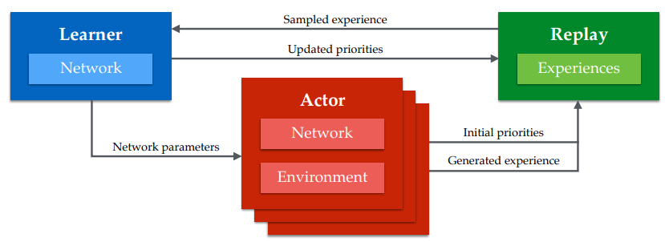

4.4 절 A3C 가 gradient 를 모았다면, 여기서는 **경험**을 모은다 — learner 하나가 GPU 로 학습하고 수백 개의 actor
가 CPU 로 경험을 만든다.

---

## A.3 Noisy Networks for Exploration
<!-- 슬라이드 471 -->

**Exploration** — 명시적인 Exploration($\epsilon$-greedy, 행동 noise)을 대신하여 **Network 의 parameter 에 noise 를
추가**한다. 여러 RL 에서 성능 향상을 가져왔다.

$$
y = wx + b \quad\longrightarrow\quad
y := \big( \mu^w + \sigma^w \odot \varepsilon^w \big)\, x + \mu^b + \sigma^b \odot \varepsilon^b
$$

가중치 $w$ 와 편향 $b$ 가 각각 평균 $\mu$ 와 학습되는 표준편차 $\sigma$ 를 가진 확률 변수가 된다. 탐색의 크기를
network 스스로 배운다.

| | Baseline Mean | Baseline Median | NoisyNet Mean | NoisyNet Median | Improvement (On median) |
|---|---|---|---|---|---|
| DQN | 319 | 83 | **379** | **123** | 48% |
| Dueling | 524 | 132 | **633** | **172** | 30% |
| A3C | 293 | 80 | **347** | **94** | 18% |

---

## A.4 Rainbow DQN
<!-- 슬라이드 472 -->

"Rainbow: Combining Improvements in Deep Reinforcement Learning"(2017) — DQN 의 Q-value overestimation 문제를
해결하기 위한 **개선 모델들을 결합**한 것이 Rainbow-DQN 이다. DDQN(4.2 절), Prioritized replay, Dueling network,
multi-step learning(A3C 의 n-step), Distributional RL, Noisy Net(A.3 절)을 하나로 합쳤다.

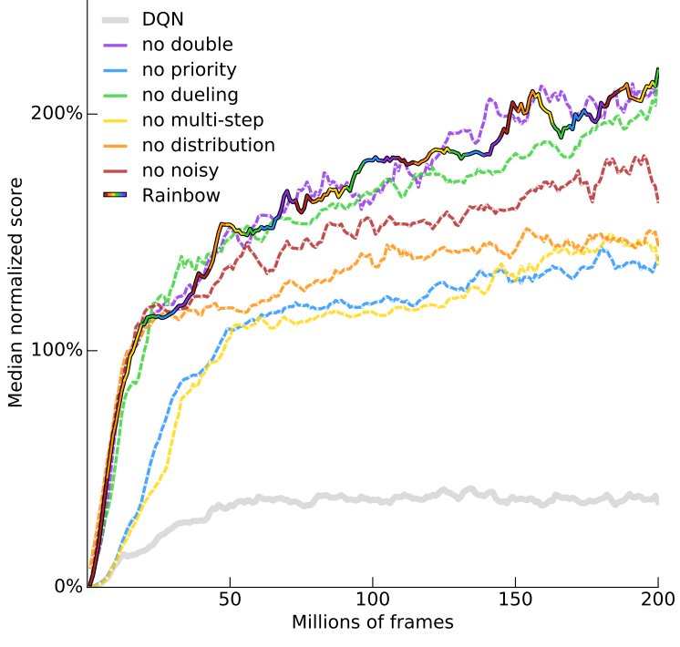

---

## A.5 Financial Time Series Analyses — FinRL
<!-- 슬라이드 473 -->
<!-- 슬라이드 제목 "시계열처리와 RNN 고급 : 관련 분야 동향" 은 다른 강의의 잔재로 보이나 원문에 있으므로 수록한다 -->

**Financial Time Series Analyses** — "FinRL: A Deep Reinforcement Learning Library for Automated Stock Trading in
Quantitative Finance"(2020.11), https://arxiv.org/pdf/2011.09607.pdf , https://github.com/AI4Finance-LLC/FinRL .

FinRL 문서의 알고리즘 비교표는 이 교재의 4 장을 금융 응용 관점에서 요약한 것과 같다.

| Algorithms | Input | Output | Type | State-action spaces support | Finance use cases support | Features and Improvements | Advantages |
|---|---|---|---|---|---|---|---|
| DQN | States | Q-value | Value based | Discrete only | Single stock trading | Target network, experience replay | Simple and easy to use |
| Double DQN | States | Q-value | Value based | Discrete only | Single stock trading | Use two identical neural network models to learn | Reduce overestimations |
| Dueling DQN | States | Q-value | Value based | Discrete only | Single stock trading | Add a specialized dueling Q head | Better differentiate actions, improves the learning |
| DDPG | State-action pair | Q-value | Actor-critic based | Continuous only | Multiple stock trading, portfolio allocation | Being deep Q-learning for continuous action spaces | Better at handling high-dimensional continuous action spaces |
| A2C | State-action pair | Q-value | Actor-critic based | Discrete and continuous | All use cases | Advantage function, parallel gradients updating | Stable, cost-effective, faster and works better with large batch sizes |
| PPO | State-action pair | Q-value | Actor-critic based | Discrete and continuous | All use cases | Clipped surrogate objective function | Improve stability, less variance, simply to implement |
| SAC | State-action pair | Q-value | Actor-critic based | Continuous only | Multiple stock trading, portfolio allocation | Entropy regularization, exploration-exploitation trade-off | Improve stability |
| TD3 | State-action pair | Q-value | Actor-critic based | Continuous only | Multiple stock trading, portfolio allocation | Clipped double Q-Learning, delayed policy update, target policy smoothing | Improve DDPG performance |
| MADDPG | State-action pair | Q-value | Actor-critic based | Continuous only | Multiple stock trading, portfolio allocation | Handle multi-agent RL problem | Improve stability and performance |

![FinRL 의 3 층 구조. 위 Applications : Benchmark Test, Single Stock Trading, Multiple Stock Trading, Portfolio Allocation, User-defined Trading Tasks. 가운데 Agents : Conventional RL Agents(Policy Iteration, Value Iteration)와 DRL Agents(DQN · Double DQN · Dueling DQN, DDPG · TD3 · MADDPG, PPO, A2C · SAC, User-designed DRL Algorithms). 아래 Financial Market Environments : Benchmark Environment, NASDAQ-100 · DJIA · S&P 500 constituents, SSE 50 · CSI 300 · HSI constituents, User-import Datasets. 가운데와 아래 사이에 Reward · State · Action 화살표.](images/s473_02.png)

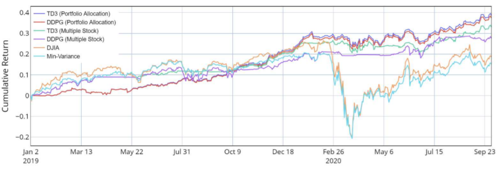

---

## A.6 Benchmarks — OpenAI Spinning Up
<!-- 슬라이드 474 -->

**OpenAI Spinning Up** (https://spinningup.openai.com/en/latest/index.html) — OpenAI 가 만든 educational
resource 다. 알고리즘 설명과 구현, 그리고 **Benchmarks** 가 함께 있다(vpg : vanilla policy gradient — 3.5 절의
REINFORCE 계열). 아래는 MuJoCo 네 환경에서 TotalEnvInteracts(0~3e6)에 따른 Performance(TensorFlow 구현).

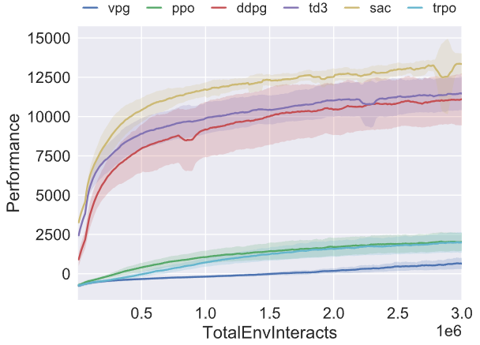

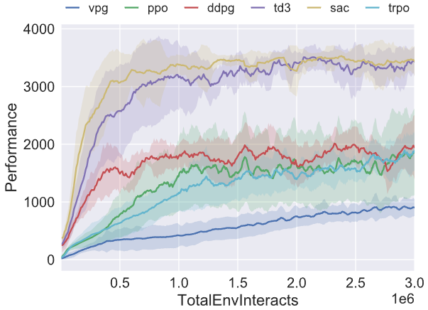

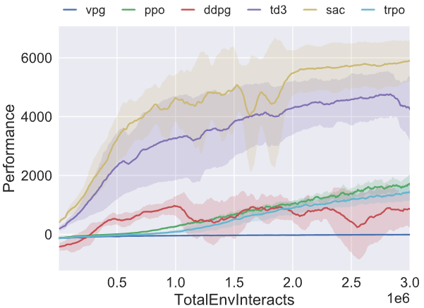

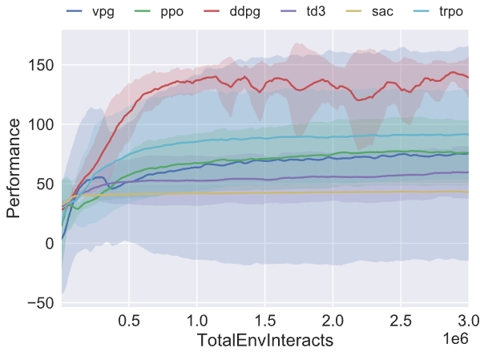

네 그림을 함께 보면 4.1 절의 교훈이 그대로다 — **환경에 따라 순위가 뒤집힌다.** Swimmer 에서는 SAC 가
꼴찌다. 하나의 환경, 한 번의 실행으로 알고리즘을 평가하면 안 된다.

---

## A.7 Research Trends(1) — Representation Learning for RL
<!-- 슬라이드 475 -->

Research Trends (http://dmqm.korea.ac.kr/activity/seminar/398)

**Representation Learning for RL** — Data 효율성 향상을 위해 Self-Supervised Learning(SSL)을 적용한다. SSL 은 RL
에서 환경의 상태에 대한 좋은 표현을 학습한다.

- "CURL: Contrastive Unsupervised Representation for RL"(2020) — SAC / Rainbow-DQN + MoCo("Momentum contrast
  for unsupervised visual representation learning", 2019).
- SPR : "Data-Efficient RL with Self-Predictive Representations"(2021) — CURL + BYOL(Non-Contrastive SSL) + SPR.
- SGI : "Pretraining Reward-Free Representations for Data-Efficient RL"(2021) — SPR + Inverse Modeling +
  Goal-Conditioned RL, 사전 학습(Two-Stage Learning).

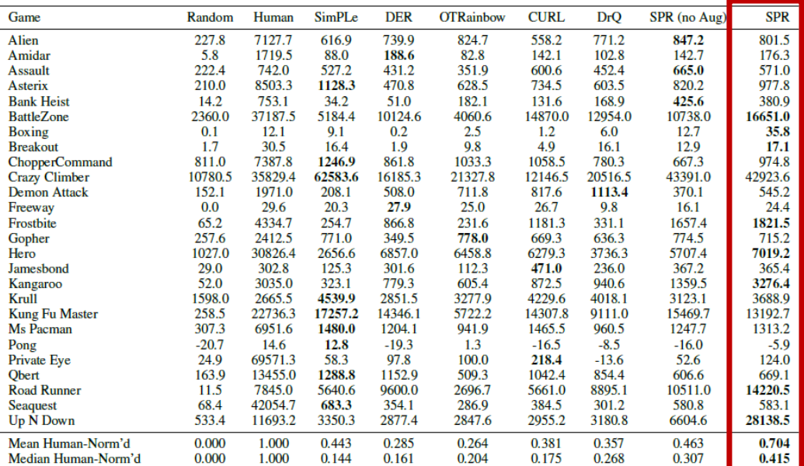

---

## A.8 Research Trends(2) — Generalization in RL
<!-- 슬라이드 476 -->

**Generalization in RL** — Data Augmentation, Representation Learning 등을 통해 data 효율성 및 일반화를 향상한다.
일반화 성능 검증을 위해 **학습 환경과 다른 환경에서 Test** 한다.

- RAD : "RL with Augmented Data"(2020) — 오직 상태 데이터에만 데이터 증강기법을 적용, 모든 RL 에 적용 가능.
- SODA : "Generalization in RL by Soft Data Augmentation"(2021) — 상태 데이터에만 데이터 증강기법을 적용하되
  정책을 직접 학습하는 것이 아닌, **표현학습과 강화학습을 분리**하여 학습한다. 표현학습 : 증강기법 적용.
  강화학습 : 비증강 data 사용 — 정책학습에 대한 악영향을 제거한다.

---

## A.9 Research Trends(3) — Offline RL
<!-- 슬라이드 477 -->

**Offline RL** — 추가적인 Data 수집 없이 기존 Data 내에서 Policy 학습의 효율을 높이자. 상호작용 환경이
부재하거나 비용이 너무 높은 경우(의료, 자율주행 로그 등)다.

- CQL : "Conservative Q-Learning for Offline RL"(2020) — Q-Value 의 과대평가를 제거하기 위해 **Lower-Bound
  Q-function 을 학습**한다. 경험하지 못한 action 에 대한 Q-value 를 제한한다(Regularization). 난이도가 높은
  환경에서 상대적으로 우수하다.

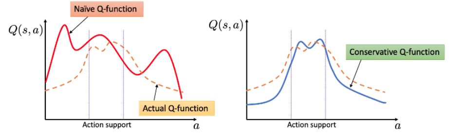

2.7 절에서 본 maximization bias 가 offline 설정에서는 치명적이 된다 — 틀린 과대평가를 환경에서 확인할 기회가
없기 때문이다. CQL 은 그것을 아래로 눌러 둔다.

---

## A.10 Research Trends(4) — Multi-Task RL
<!-- 슬라이드 478 -->

**Multi-Task RL** — Data 효율성, 학습 안전성 향상을 위해 Multi-Task 학습을 한다. 서로 다른 환경에서도 적용할 수
있는 Global 정책을 학습하도록 하며, 다른 환경의 간섭으로 불안정한 Multi Task 학습을 안정화해야 한다.

- "Distral: Robust Multitask RL"(2017) — Distilling + Transfer Learning.

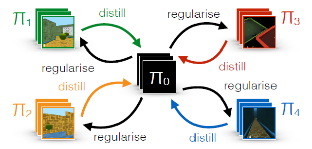

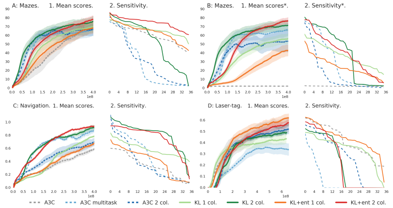

Sensitivity 는 hyperparameter 에 따른 변화다 — 4.1 절이 말한 재현성 문제를 그림으로 재는 방법이다.

---

## A.11 Research Trends(5) — Multi-Agent RL
<!-- 슬라이드 479~480 -->

**Multi-Agent RL** — 주어진 환경에서 두 개 이상의 Agent 가 협업 또는 경쟁을 통해 최적의 정책을 학습한다.
협업(Cooperation) : StarCraft 환경에서 Team 보상을 사용한다.

**"QMIX: Monotonic Value Function Factorization for Deep Multi-Agent RL"(2018)** — Agent net + Mixing Net 으로
구성된다.

- Agent net : 각각의 관측정보 $o_t^n$ 으로부터 $Q_n(\tau^n, u_t^n)$ 를 출력한다. GRU state 정보를 통해 agent 간
  정보를 공유한다.
- Mixing net : 모든 agent 의 출력 $Q_n(\tau^n, u_t^n)$ + 전체 상태 정보 $s_t$ 를 얻는다. 팀 보상 $Q_{tot}(\tau, u)$
  이 최대가 되도록 학습한다.

Combat maps : 3m, 5m, 3s_5z, 1c_3s_5z(StarCraft II 마린 · 스토커 · 질럿 · 콜로서스 조합). Dashed line 은
heuristic-based algorithm 이다.

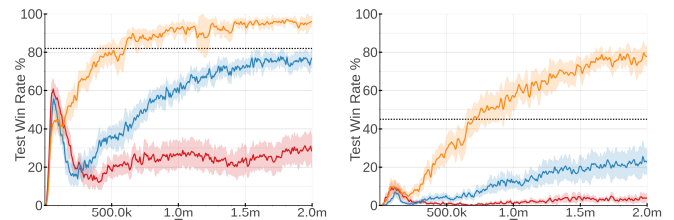

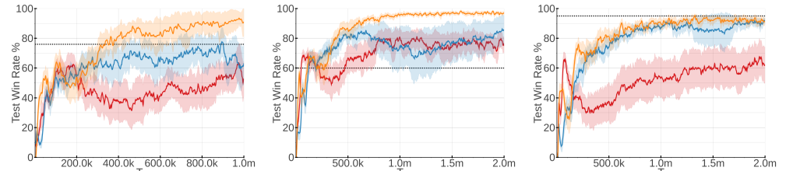

**"RODE: Learning Roles to Decompose Multi-Agent Tasks"(2021)** — Agent 별 적절한 Role 배정으로 보다 효율적인
협력과 학습을 제공한다.

- (a) **Action Representation 학습** : 다음 상태 $\tilde{o}'_i$ 와 보상 $\tilde{r}_t$ 를 예측하는 network 로 각 agent 의
  action 에 대한 특징을 학습한다(초기 50k 선행 학습). Action representation $z_{a_i}$ 를 clustering → Role(agent
  의 action 을 제한)의 개수를 결정한다.
- (b) **Role Selector** : Agent 별 Role 배정 — Agent 상태 $h_{\tau_i}$ 와 Role Representation $z_{\rho_j}$ 의 내적을 통해
  $\rho_j$ 를 결정한다.
- (c) **Action Selector** : Agent 상태 $h_{\tau_i}$ 와 관측 정보로부터 상태표현 $z_{\tau_i}$ 를 산출하고, Role 내에서
  가능한 action 별 Q-value 를 출력하여 action 을 선택한다.

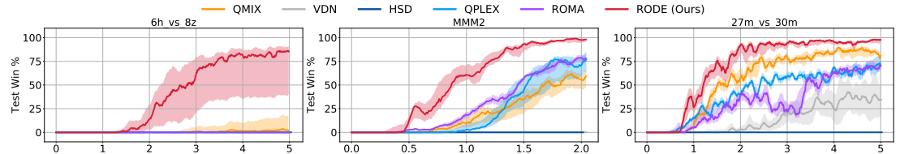

---

## A.12 Research Trends(6) — Evolution Strategies
<!-- 슬라이드 481~482 -->

**Evolution Strategies(1)** — "Evolution Strategies as a Scalable Alternative to Reinforcement Learning"(2017).
OpenAI 가 대규모 병렬화하여 강화학습에 효과적으로 적용할 수 있는 방법을 제안하면서 다시 주목받았다.

- **정책 파라미터 공간에서 직접 탐색**을 수행한다 — gradient 대신 parameter 에 noise 를 뿌려 좋은 방향을 찾는다.
  Local optimization 을 완화하고, 병렬화로 인해 학습 속도도 크게 증가한다.
- 경사 계산이 필요 없는 ES 의 특징을 활용해 **수천 개의 병렬 인스턴스**를 사용하여 빠르게 학습을 수행한다.
  경사 기반 방법보다 계산 효율성과 안정성이 높다. Atari 와 같은 환경에서도 기존 DRL 과 유사한 성능을 발휘하며,
  특히 탐색 효율성이 필요한 문제에서 우수한 성능을 낸다.

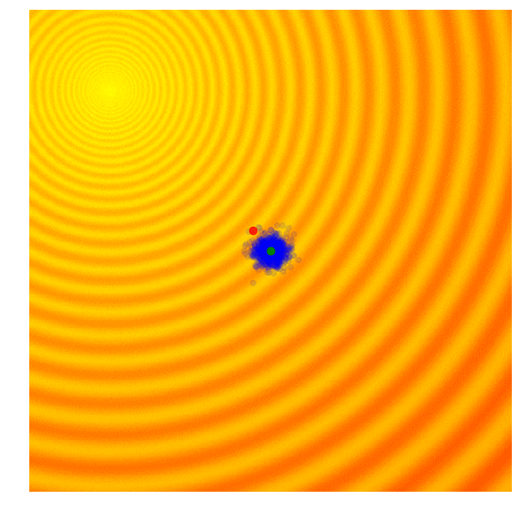

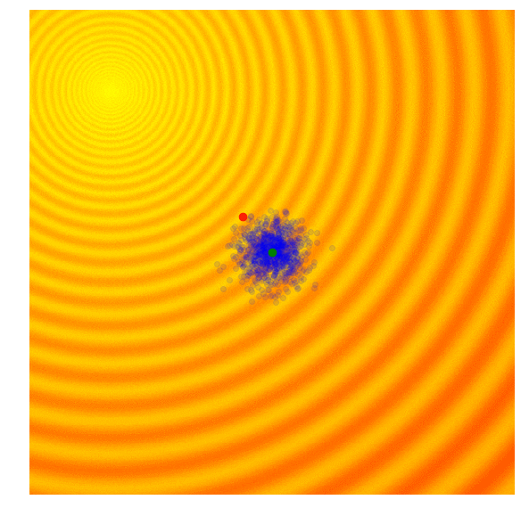

**Evolution Strategies(2)** — 그 뒤의 흐름.

- **Augmented Random Search(ARS, 2018)** — ES 의 계산 효율성을 높이기 위해 무작위 검색(Random Search)을
  사용해 정책 공간을 탐색하고 계산 자원을 절감한다.
- **Covariance Matrix Adaptation Evolution Strategy(CMA-ES)와의 융합** — 개별 솔루션의 공분산을 학습하여 탐색
  방향을 점진적으로 최적화한다. 정책의 방향성을 강화하고 학습 효율성을 높이는 연구로, 최적화 속도와 수렴성을
  개선하여 대규모 강화학습 문제에 효과적이다.
- **Meta Evolution Strategies(Meta-ES, 2019)** — 탐색과 활용 사이의 균형을 최적화하여 ES 의 효율성을 높이고
  다양한 환경에 적용할 수 있도록 설계되었다. ES 의 일반화 성능을 높이고 다양한 강화학습 문제에 효율적으로
  적용할 수 있는 방법론이다.
- **Large Scale Evolution Strategies for Diverse Domains(2020 이후)** — ES 의 대규모 병렬화 및 확장성을 이용해
  다양한 도메인(예: 물리 시뮬레이션, 로봇 제어 등)에 적용하는 연구. ES 가 특정 도메인에 국한되지 않고 다양한
  환경에 쉽게 확장할 수 있음을 보이고, 대규모 분산 컴퓨팅 환경에서 효과적인 학습 방법으로 자리 잡았다.
- **Multi-Objective Evolution Strategies(MO-ES, 2021 이후)** — ES 를 다중 목적 강화학습 문제에 적용하여 여러
  목적을 동시에 최적화하는 방식으로 확장한다. 서로 다른 목적에 대해 균형 잡힌 정책을 학습하도록 설계되어,
  여러 목적을 동시에 고려해야 하는 문제(예: 보상과 안정성)에서 뛰어난 성능을 발휘한다.

---

## A.13 Deep RL 분류
<!-- 슬라이드 483~487 -->
<!-- 슬라이드 488 : 숨김 MEMO 슬라이드, 내용 없음 -->

마지막으로 이 교재의 알고리즘들을 한 장의 지도에 놓는다.

이 교재는 왼쪽 Model-free 가지만 다뤘다 — Value Iteration 줄기(2.7 Q-Table → 3.3 Q-Network → 3.4 DQN → 4.2
Double DQN)와 Policy Iteration 줄기(3.5 Policy Gradient → A2C → 4.4 A3C → 4.5 PPO), 그리고 둘이 만나는
Actor-Critic 계열(3.6 DDPG → 4.3 TD3 → 4.6 SAC 2018 / 2019).

network 구조로 다시 나누면 —

(d)와 (e)의 차이가 3.5 절 실습과제(결합 모델 vs 분리 모델)였고, (f)와 (g)의 차이가 4.6 절 SAC-v2 와 SAC 의 차이다.
